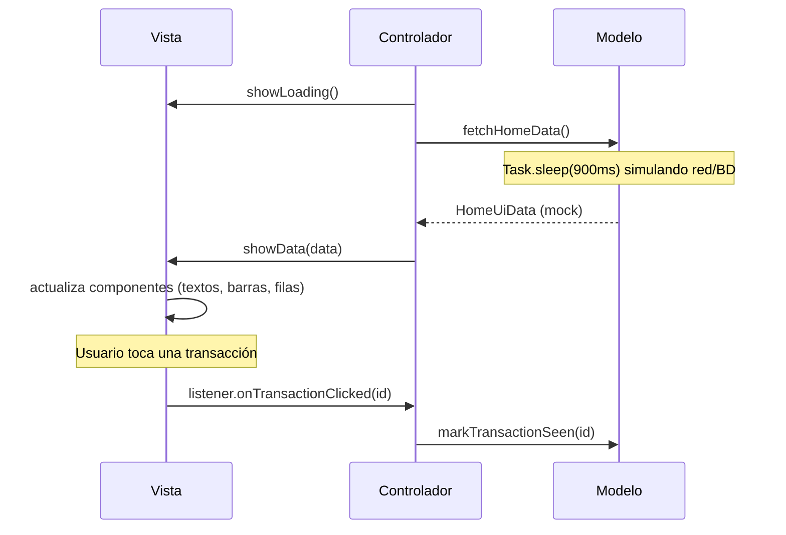

# Demo-mvc-iOS

Pantalla Home de un dashboard financiero (saludo del usuario, gráfico de actividad semanal, tarjetas de ventas/ingresos y lista de transacciones) implementada en iOS con **UIKit (vistas construidas en código)** bajo el patrón de arquitectura **MVC (Model-View-Controller)**.

## Diseño

La interfaz fue diseñada en **[Pencil](https://pencil.dev)** a partir del archivo `masterclass/design/home.pen`. La implementación replica fielmente esa referencia: paleta de colores pastel, tipografía, espaciado, tarjetas redondeadas, gráfico de barras y navegación inferior.

## Arquitectura: MVC

MVC organiza la pantalla en tres componentes independientes:

| Capa | Responsabilidad | Archivo |
|------|------------------|---------|
| **Modelo** | Datos y lógica de negocio. En esta demo simula una fuente de datos (red/base de datos) con datos mock y una latencia artificial. | `Home/HomeModel.swift` |
| **Vista** | Todo lo relacionado a UI: construye la jerarquía de vistas, actualiza los componentes y notifica eventos de usuario mediante un listener. No conoce al Modelo. | `Home/HomeView.swift` (contrato) y `Home/HomeViewImpl.swift` (implementación) |
| **Controlador** | El `UIViewController`. Implementa el listener de la Vista, recibe los eventos del usuario y llama directamente al Modelo — es el único punto que conoce tanto a la Vista como al Modelo. | `HomeViewController.swift` |

A diferencia de MVP, en MVC **no existe una capa intermedia (Presentador)**: el Controlador media directamente entre Vista y Modelo. MVC es el patrón histórico oficial de Apple en UIKit; su riesgo clásico es el "Massive View Controller" (el controller absorbe vista y lógica). Esta demo lo mitiga extrayendo la Vista a `HomeViewImpl` detrás de un protocolo, de modo que el `UIViewController` queda reducido a su rol de Controlador.

## Diagrama de secuencia

Comunicación de datos entre las tres capas al abrir la pantalla y al tocar una transacción:



## Estructura del proyecto

```
Demo-mvc-iOS/
├── AppDelegate.swift            # Arranque UIKit (sin storyboard)
├── SceneDelegate.swift          # Window → HomeViewController
├── HomeViewController.swift     # Controlador
├── Home/
│   ├── HomeModel.swift          # Modelo (datos mock)
│   ├── HomeView.swift           # Contrato de la Vista + listener
│   ├── HomeViewImpl.swift       # Implementación de la Vista
│   ├── HomeUiData.swift         # Modelos de datos de la pantalla
│   └── TransactionRowView.swift # Fila de transacción
├── Theme/
│   └── Palette.swift            # Tokens de color
└── Assets.xcassets
```

## Dependencias

| Dependencia | Uso |
|-------------|-----|
| `UIKit` | Vistas, `UIViewController`, `UITabBar`, Auto Layout |
| Swift Concurrency (`async/await`, `Task`) | Simula la carga asíncrona del Modelo |

No se usa SwiftUI ni librerías de terceros — la UI se construye completamente con UIKit en código, sin storyboards ni XIB.

## Cómo ejecutar

Abrir `Demo-mvc-iOS.xcodeproj` en Xcode y ejecutar en un simulador de iPhone, o por línea de comandos:

```bash
xcodebuild -project Demo-mvc-iOS.xcodeproj \
  -scheme Demo-mvc-iOS \
  -destination 'platform=iOS Simulator,name=iPhone 17' \
  build
```
