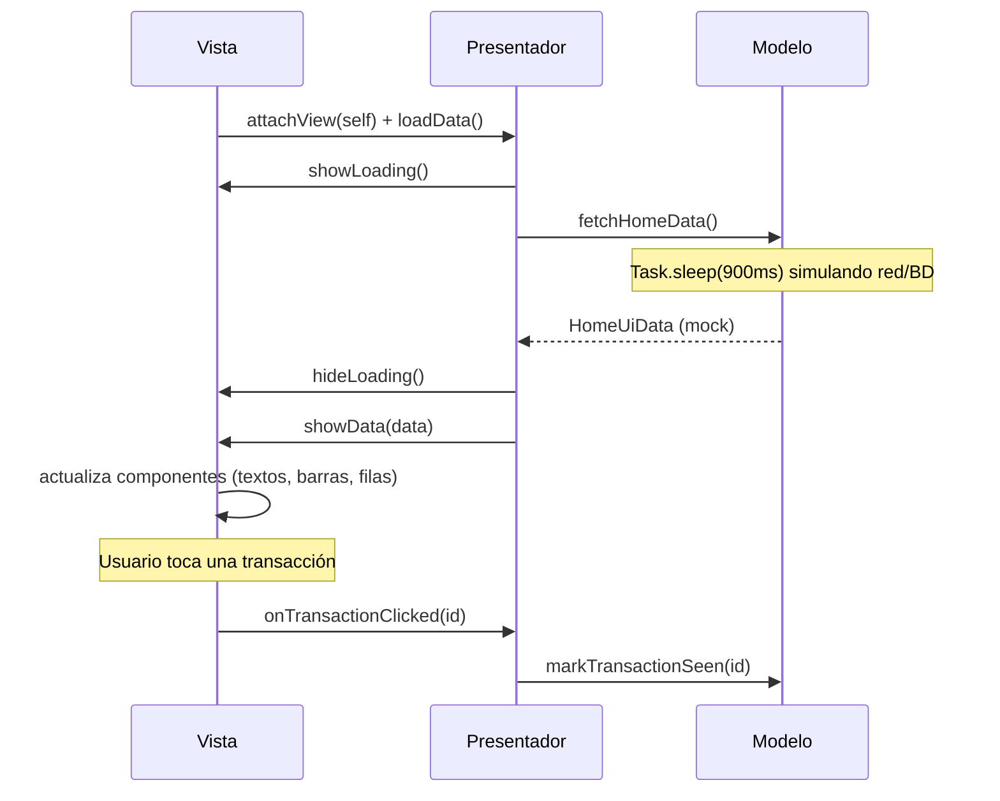

# Demo-mvp-iOS

Pantalla Home de un dashboard financiero (saludo del usuario, gráfico de actividad semanal, tarjetas de ventas/ingresos y lista de transacciones) implementada en iOS con **UIKit (vistas construidas en código)** bajo el patrón de arquitectura **MVP (Model-View-Presenter)**.

## Diseño

La interfaz fue diseñada en **[Pencil](https://pencil.dev)** a partir del archivo `masterclass/design/home.pen`. La implementación replica fielmente esa referencia: paleta de colores pastel, tipografía, espaciado, tarjetas redondeadas, gráfico de barras y navegación inferior.

## Arquitectura: MVP

MVP organiza la pantalla en tres componentes conectados por un contrato de protocolos:

| Capa | Responsabilidad | Archivo |
|------|------------------|---------|
| **Modelo** | Datos y lógica de negocio. En esta demo simula una fuente de datos (red/base de datos) con datos mock y una latencia artificial. | `Home/HomeModel.swift` |
| **Vista** | El `UIViewController` ES la Vista: implementa `HomeViewProtocol`, hace todo el trabajo de UI y no contiene lógica de negocio — cada acción del usuario y cada resultado pasa por el Presentador. | `HomeViewController.swift` (+ `Home/HomeRootView.swift` como jerarquía de vistas) |
| **Presentador** | Intermediario entre Vista y Modelo. No conoce UIKit ni referencias a componentes visuales, solo el protocolo de la Vista — eso lo hace testeable de forma unitaria con una Vista falsa. | `Home/HomePresenter.swift` |

El contrato (`Home/HomeContract.swift`) define ambos protocolos, `HomeViewProtocol` y `HomePresenterProtocol`, de modo que ninguna capa depende del tipo concreto de la otra y el Modelo nunca sabe que existen.

A diferencia de MVC, en MVP **la Vista nunca habla con el Modelo**: el Presentador concentra la lógica de presentación y decide qué mostrar. La Vista queda tan delgada que puede reemplazarse o simularse en pruebas, y el ciclo `attachView`/`detachView` desacopla al Presentador del ciclo de vida del `UIViewController`, cancelando el trabajo pendiente al desmontarse.

## Diagrama de secuencia

Comunicación de datos entre las tres capas al abrir la pantalla y al tocar una transacción:



## Estructura del proyecto

```
Demo-mvp-iOS/
├── AppDelegate.swift            # Arranque UIKit (sin storyboard)
├── SceneDelegate.swift          # Window → HomeViewController
├── HomeViewController.swift     # Vista (implementa HomeViewProtocol)
├── Home/
│   ├── HomeContract.swift       # Protocolos de Vista y Presentador
│   ├── HomePresenter.swift      # Presentador
│   ├── HomeModel.swift          # Modelo (datos mock)
│   ├── HomeRootView.swift       # Jerarquía de vistas de la pantalla
│   ├── HomeUiData.swift         # Modelos de datos de la pantalla
│   └── TransactionRowView.swift # Fila de transacción
├── Theme/
│   └── Palette.swift            # Tokens de color
└── Assets.xcassets
```

## Dependencias

| Dependencia | Uso |
|-------------|-----|
| `UIKit` | Vistas, `UIViewController`, `UITabBar`, Auto Layout |
| Swift Concurrency (`async/await`, `Task`) | Simula la carga asíncrona del Modelo |

No se usa SwiftUI ni librerías de terceros — la UI se construye completamente con UIKit en código, sin storyboards ni XIB. El Presentador se instancia manualmente (sin inyección de dependencias) para mantener el patrón MVP como protagonista; una app de producción lo inyectaría.

## Cómo ejecutar

Abrir `Demo-mvp-iOS.xcodeproj` en Xcode y ejecutar en un simulador de iPhone, o por línea de comandos:

```bash
xcodebuild -project Demo-mvp-iOS.xcodeproj \
  -scheme Demo-mvp-iOS \
  -destination 'platform=iOS Simulator,name=iPhone 17' \
  build
```
