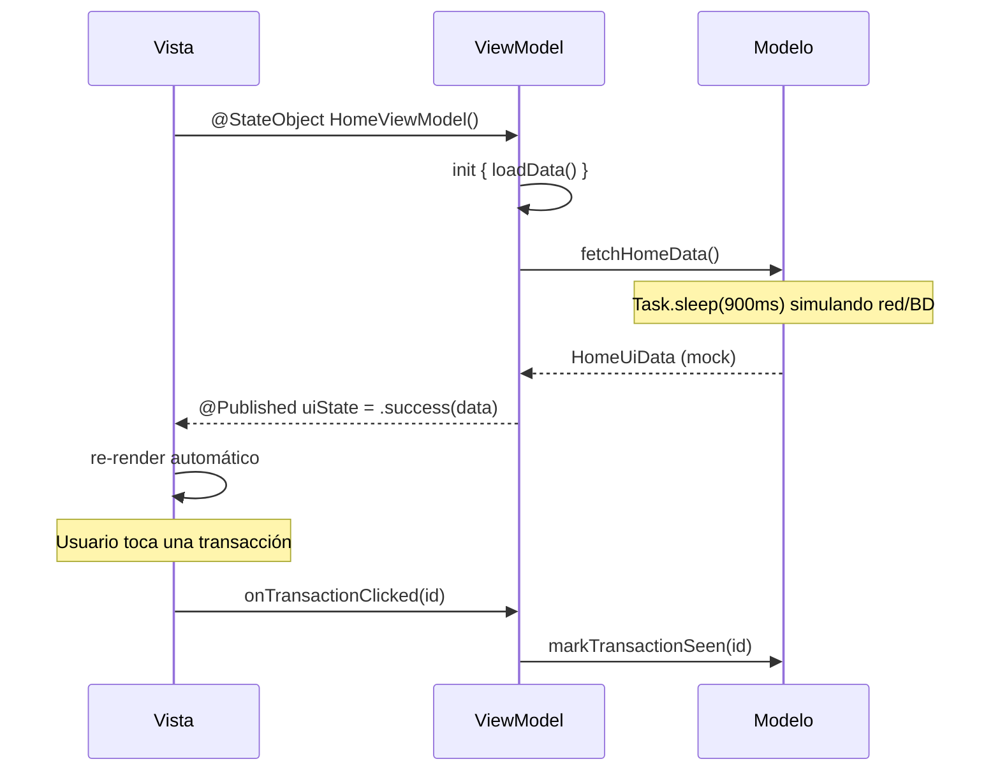

# Demo-mvvm-iOS

Pantalla Home de un dashboard financiero (saludo del usuario, gráfico de actividad semanal, tarjetas de ventas/ingresos y lista de transacciones) implementada **100% en SwiftUI** (sin UIKit ni storyboards) bajo el patrón de arquitectura **MVVM (Model-View-ViewModel)**.

## Diseño

La interfaz fue diseñada en **[Pencil](https://pencil.dev)** a partir del archivo `masterclass/design/home.pen`. La implementación replica fielmente esa referencia: paleta de colores pastel, tipografía, espaciado, tarjetas redondeadas, gráfico de barras y navegación inferior. Comparte el mismo diseño visual que las demos MVC y MVP para poder comparar arquitecturas lado a lado.

## Arquitectura: MVVM

MVVM desacopla la Vista del Modelo mediante **observación de estado** en lugar de llamadas directas: el ViewModel no tiene ninguna referencia a la Vista, y la Vista solo reacciona a los cambios de estado que expone.

| Capa | Responsabilidad | Archivo |
|------|------------------|---------|
| **Modelo** | Datos y lógica de negocio. Simula una fuente de datos (red/base de datos) con datos mock y una latencia artificial. | `Home/HomeModel.swift` |
| **Vista** | Vistas de SwiftUI. Observan el `@Published` del ViewModel y se re-renderizan en consecuencia; los eventos del usuario se envían como llamadas a funciones. | `Home/HomeScreen.swift` |
| **ViewModel** | `ObservableObject` que mantiene un `@Published var uiState` y orquesta las llamadas al Modelo. Nunca conoce ningún tipo de SwiftUI. | `Home/HomeViewModel.swift` |
| **UiState** | `enum` con los estados posibles de la pantalla (`loading`, `success`, `error`). | `Home/HomeUiState.swift` |

Patrón **Route/Screen**: `HomeRoute` es la parte "con estado" — crea el ViewModel con `@StateObject` y lee su `uiState` — mientras que `HomeScreen` es una vista pura que solo recibe datos y closures, sin conocer al ViewModel. Esto permite previsualizar (`#Preview`) y testear la UI sin necesidad de instanciar un ViewModel real.

A diferencia de MVC y MVP, en MVVM **no hay listener ni contrato hacia la Vista**: el ViewModel publica estado y ni siquiera sabe quién lo observa. El ciclo `attachView`/`detachView` de MVP desaparece — la suscripción vive en el sistema de observación de SwiftUI y el `@StateObject` sigue el ciclo de vida de la vista automáticamente.

## Diagrama de secuencia

Comunicación de datos entre las tres capas al abrir la pantalla y al tocar una transacción:



## Estructura del proyecto

```
Demo-mvvm-iOS/
├── Demo_mvvm_iOSApp.swift       # Entry point SwiftUI → HomeRoute
├── Home/
│   ├── HomeViewModel.swift      # ViewModel (ObservableObject + @Published)
│   ├── HomeUiState.swift        # Estados de la pantalla (loading/success/error)
│   ├── HomeModel.swift          # Modelo (datos mock)
│   ├── HomeScreen.swift         # HomeRoute + HomeScreen y subvistas
│   └── HomeUiData.swift         # Modelos de datos de la pantalla
├── Theme/
│   └── Palette.swift            # Tokens de color
└── Assets.xcassets
```

## Dependencias

| Dependencia | Uso |
|-------------|-----|
| `SwiftUI` | Toda la UI declarativa y el sistema de observación |
| `Combine` | `ObservableObject` y `@Published` del ViewModel |
| Swift Concurrency (`async/await`, `Task`) | Simula la carga asíncrona del Modelo |

No se usa UIKit ni librerías de terceros. El ViewModel se instancia manualmente (sin inyección de dependencias) para mantener el patrón MVVM como protagonista; una app de producción lo inyectaría.

## Cómo ejecutar

Abrir `Demo-mvvm-iOS.xcodeproj` en Xcode y ejecutar en un simulador de iPhone, o por línea de comandos:

```bash
xcodebuild -project Demo-mvvm-iOS.xcodeproj \
  -scheme Demo-mvvm-iOS \
  -destination 'platform=iOS Simulator,name=iPhone 17' \
  build
```
