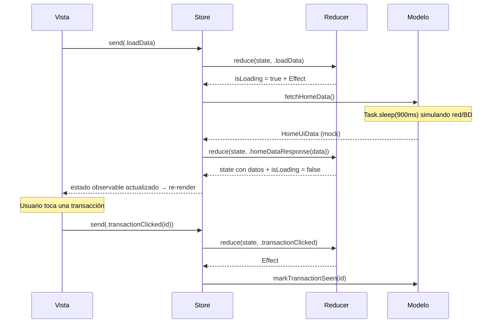

# Demo-tca-iOS

Pantalla Home de un dashboard financiero (saludo del usuario, gráfico de actividad semanal, tarjetas de ventas/ingresos y lista de transacciones) implementada **100% en SwiftUI** bajo el patrón de **flujo unidireccional** con **TCA (The Composable Architecture)** de Point-Free.

## Diseño

La interfaz fue diseñada en **[Pencil](https://pencil.dev)** a partir del archivo `masterclass/design/home.pen`. La implementación replica fielmente esa referencia: paleta de colores pastel, tipografía, espaciado, tarjetas redondeadas, gráfico de barras y navegación inferior. Comparte el mismo diseño visual que las demos MVC, MVP y MVVM para poder comparar arquitecturas lado a lado.

## Arquitectura: TCA (flujo unidireccional)

TCA lleva la idea de MVVM un paso más allá: todo el estado de la pantalla vive en un único valor inmutable, cada interacción del usuario es una **Action**, y la única forma de cambiar el estado es a través del **Reducer** — una función pura `(inout State, Action) -> Effect`. Los efectos secundarios (llamadas al Modelo) nunca mutan el estado directamente: producen nuevas Actions que vuelven a pasar por el Reducer.

| Pieza | Responsabilidad | Archivo |
|-------|------------------|---------|
| **State** | Único estado inmutable de toda la pantalla (`@ObservableState`): datos, `isLoading` y `errorMessage` en un solo lugar. | `Home/HomeFeature.swift` |
| **Action** | Enum con todo lo que puede ocurrir: intents del usuario (`loadData`, `transactionClicked`) y resultados de efectos (`homeDataResponse`, `homeDataFailed`). | `Home/HomeFeature.swift` |
| **Reducer** | `@Reducer HomeFeature`: función pura que transforma el estado según la Action y devuelve los efectos a ejecutar (`.run` / `.none`). | `Home/HomeFeature.swift` |
| **Store** | Runtime de TCA: recibe las Actions de la Vista, ejecuta el Reducer y publica el estado observable. | `Demo_tca_iOSApp.swift` |
| **Vista** | SwiftUI. Lee el estado directamente del `StoreOf<HomeFeature>` y despacha Actions con `store.send(...)`. | `Home/HomeScreen.swift` |
| **Modelo** | Datos y lógica de negocio. Simula una fuente de datos (red/base de datos) con datos mock y una latencia artificial; solo se invoca desde efectos. | `Home/HomeModel.swift` |

El ciclo es siempre el mismo y en una sola dirección:

```
Vista → Action → Reducer → State → Vista
                    ↓
                 Effect → Action → Reducer → ...
```

A diferencia de MVVM, aquí no hay métodos del ViewModel que muten estado libremente: **cada cambio de estado queda tipado como una Action** y pasa por un único punto (el Reducer), lo que hace el flujo predecible, reproducible y exhaustivamente testeable (`TestStore` permite afirmar cada mutación y cada efecto). El costo es más verbosidad para pantallas simples.

## Diagrama de secuencia

Comunicación entre las piezas al abrir la pantalla y al tocar una transacción:



## Estructura del proyecto

```
Demo-tca-iOS/
├── Demo_tca_iOSApp.swift        # Entry point SwiftUI + Store global
├── Home/
│   ├── HomeFeature.swift        # State + Action + Reducer (@Reducer)
│   ├── HomeModel.swift          # Modelo (datos mock)
│   ├── HomeScreen.swift         # Vista SwiftUI conectada al Store
│   └── HomeUiData.swift         # Modelos de datos de la pantalla
├── Theme/
│   └── Palette.swift            # Tokens de color
└── Assets.xcassets
```

## Dependencias

| Dependencia | Uso |
|-------------|-----|
| [`swift-composable-architecture`](https://github.com/pointfreeco/swift-composable-architecture) (1.x, SPM) | `@Reducer`, `@ObservableState`, `Store`, efectos `.run` |
| `SwiftUI` | Toda la UI declarativa |
| Swift Concurrency (`async/await`, `Task`) | Simula la carga asíncrona del Modelo dentro de los efectos |

El Modelo se instancia manualmente dentro del Reducer para mantener el patrón como protagonista; una app de producción lo expondría como `@Dependency` (el sistema de inyección de TCA) para poder sustituirlo en tests.

## Cómo ejecutar

Abrir `Demo-tca-iOS.xcodeproj` en Xcode (la dependencia de TCA se resuelve automáticamente vía Swift Package Manager) y ejecutar en un simulador de iPhone, o por línea de comandos:

```bash
xcodebuild -project Demo-tca-iOS.xcodeproj \
  -scheme Demo-tca-iOS \
  -destination 'platform=iOS Simulator,name=iPhone 17' \
  build
```
