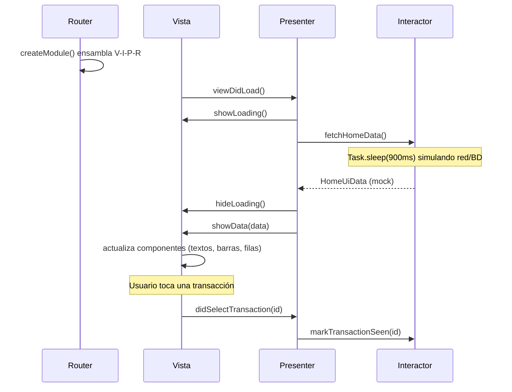

# Demo-viper-iOS

Pantalla Home de un dashboard financiero (saludo del usuario, gráfico de actividad semanal, tarjetas de ventas/ingresos y lista de transacciones) implementada en iOS con **UIKit (vistas construidas en código)** bajo el patrón de arquitectura **VIPER (View-Interactor-Presenter-Entity-Router)**.

## Diseño

La interfaz fue diseñada en **[Pencil](https://pencil.dev)** a partir del archivo `masterclass/design/home.pen`. La implementación replica fielmente esa referencia: paleta de colores pastel, tipografía, espaciado, tarjetas redondeadas, gráfico de barras y navegación inferior. Comparte el mismo diseño visual que las demos MVC, MVP, MVVM y TCA para poder comparar arquitecturas lado a lado.

## Arquitectura: VIPER

VIPER lleva la separación de responsabilidades al extremo: divide cada pantalla (módulo) en **cinco piezas** con roles únicos, conectadas por protocolos. Nació en iOS y fue el estándar de las apps enterprise de la era UIKit.

| Pieza | Responsabilidad | Archivo |
|-------|------------------|---------|
| **View** | El `UIViewController`: solo trabajo de UI. Notifica eventos al Presenter (`viewDidLoad`, `didTapRetry`, `didSelectTransaction`) y renderiza lo que este le ordena. | `Home/HomeViewController.swift` (+ `Home/HomeRootView.swift` como jerarquía de vistas) |
| **Interactor** | La lógica de negocio del módulo: obtener y persistir datos. En esta demo simula una fuente de datos (red/base de datos) con datos mock y una latencia artificial. No conoce a la View ni a UIKit. | `Home/HomeInteractor.swift` |
| **Presenter** | El coordinador del módulo: recibe eventos de la View, invoca al Interactor, decide qué mostrar y se lo comunica a la View a través de su protocolo. También le pediría navegación al Router. | `Home/HomePresenter.swift` |
| **Entity** | Los modelos de datos puros que fluyen entre las capas. | `Home/HomeEntity.swift` |
| **Router** | Ensambla el módulo (crea View, Interactor, Presenter y sus conexiones) y concentra la navegación hacia otros módulos. | `Home/HomeRouter.swift` |

El contrato (`Home/HomeContracts.swift`) define los protocolos de las cuatro piezas activas, de modo que cada una depende solo de abstracciones: todas son sustituibles y testeables de forma aislada.

La diferencia clave frente a MVP: el Presenter de MVP concentraba lógica de presentación **y** de negocio; en VIPER la lógica de negocio se muda al **Interactor**, y la creación del módulo más la navegación salen del `UIViewController` hacia el **Router**. El costo es evidente: cinco archivos y un contrato para una sola pantalla — por eso VIPER se reserva para dominios complejos donde esa separación paga.

## Diagrama de secuencia

Comunicación entre las piezas al ensamblar el módulo, abrir la pantalla y tocar una transacción:



## Estructura del proyecto

```
Demo-viper-iOS/
├── AppDelegate.swift            # Arranque UIKit (sin storyboard)
├── SceneDelegate.swift          # Window → HomeRouter.createModule()
├── Home/
│   ├── HomeContracts.swift      # Protocolos de View, Presenter, Interactor y Router
│   ├── HomeViewController.swift # View
│   ├── HomePresenter.swift      # Presenter
│   ├── HomeInteractor.swift     # Interactor (datos mock)
│   ├── HomeEntity.swift         # Entities
│   ├── HomeRouter.swift         # Router (ensamblaje del módulo)
│   ├── HomeRootView.swift       # Jerarquía de vistas de la pantalla
│   └── TransactionRowView.swift # Fila de transacción
├── Theme/
│   └── Palette.swift            # Tokens de color
└── Assets.xcassets
```

## Dependencias

| Dependencia | Uso |
|-------------|-----|
| `UIKit` | Vistas, `UIViewController`, `UITabBar`, Auto Layout |
| Swift Concurrency (`async/await`, `Task`) | Simula la carga asíncrona del Interactor |

No se usa SwiftUI ni librerías de terceros — la UI se construye completamente con UIKit en código, sin storyboards ni XIB. El Router ensambla el módulo manualmente (sin inyección de dependencias) para mantener el patrón VIPER como protagonista; una app de producción resolvería las piezas con un contenedor de dependencias.

## Cómo ejecutar

Abrir `Demo-viper-iOS.xcodeproj` en Xcode y ejecutar en un simulador de iPhone, o por línea de comandos:

```bash
xcodebuild -project Demo-viper-iOS.xcodeproj \
  -scheme Demo-viper-iOS \
  -destination 'platform=iOS Simulator,name=iPhone 17' \
  build
```
