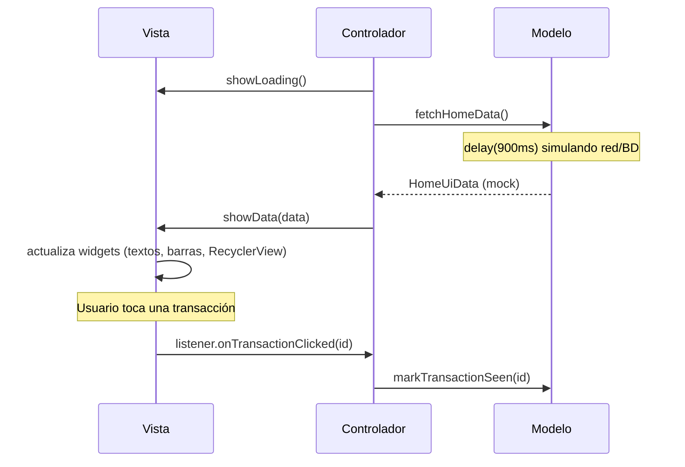

# Demo-mvc

Pantalla Home de un dashboard financiero (saludo del usuario, gráfico de actividad semanal, tarjetas de ventas/ingresos y lista de transacciones) implementada en Android con **Vistas clásicas (XML)** bajo el patrón de arquitectura **MVC (Model-View-Controller)**.

## Diseño

La interfaz fue diseñada en **[Pencil](https://pencil.dev)** a partir del archivo `masterclass/design/home.pen`. La implementación replica fielmente esa referencia: paleta de colores pastel, tipografía, espaciado, tarjetas redondeadas, gráfico de barras y navegación inferior.

## Arquitectura: MVC

MVC organiza la pantalla en tres componentes independientes:

| Capa | Responsabilidad | Archivo |
|------|------------------|---------|
| **Modelo** | Datos y lógica de negocio. En esta demo simula una fuente de datos (red/base de datos) con datos mock y una latencia artificial. | `home/HomeModel.kt` |
| **Vista** | Todo lo relacionado a UI: infla el layout, actualiza los widgets y notifica eventos de usuario mediante un listener. No conoce al Modelo. | `home/HomeView.kt` (contrato) y `home/HomeViewImpl.kt` (implementación) |
| **Controlador** | La Activity. Implementa el listener de la Vista, recibe los eventos del usuario y llama directamente al Modelo — es el único punto que conoce tanto a la Vista como al Modelo. | `MainActivity.kt` |

A diferencia de MVP, en MVC **no existe una capa intermedia (Presentador)**: el Controlador media directamente entre Vista y Modelo. Esto hace la implementación más simple, pero también más difícil de testear de forma aislada, ya que el Controlador está atado al ciclo de vida de la Activity.

## Diagrama de secuencia

Comunicación de datos entre las tres capas al abrir la pantalla y al tocar una transacción:



## Estructura del proyecto

```
app/src/main/
├── java/com/example/demo_mvc/
│   ├── MainActivity.kt          # Controlador
│   └── home/
│       ├── HomeModel.kt         # Modelo (datos mock)
│       ├── HomeView.kt          # Contrato de la Vista
│       ├── HomeViewImpl.kt      # Implementación de la Vista
│       ├── HomeUiData.kt        # Modelos de datos de la pantalla
│       └── TransactionAdapter.kt
└── res/
    ├── layout/                  # activity_home.xml, item_transaction.xml
    ├── drawable/                # fondos redondeados e íconos vectoriales
    ├── color/, menu/            # selector y menú de la barra inferior
    └── values/                  # colors.xml, strings.xml, themes.xml
```

## Dependencias

| Dependencia | Uso |
|-------------|-----|
| `androidx.appcompat:appcompat` | `AppCompatActivity` y temas compatibles |
| `com.google.android.material:material` | `BottomNavigationView` y componentes Material |
| `androidx.recyclerview:recyclerview` | Lista de transacciones |
| `org.jetbrains.kotlinx:kotlinx-coroutines-android` | Corrutinas para simular la carga asíncrona del Modelo |
| `androidx.core:core-ktx` | Extensiones Kotlin sobre el SDK de Android |

No se usa Jetpack Compose ni ViewModel/Lifecycle-ViewModel — la UI se construye completamente con Vistas (XML) y View Binding.

## Cómo ejecutar

```bash
./gradlew :app:installDebug
```
