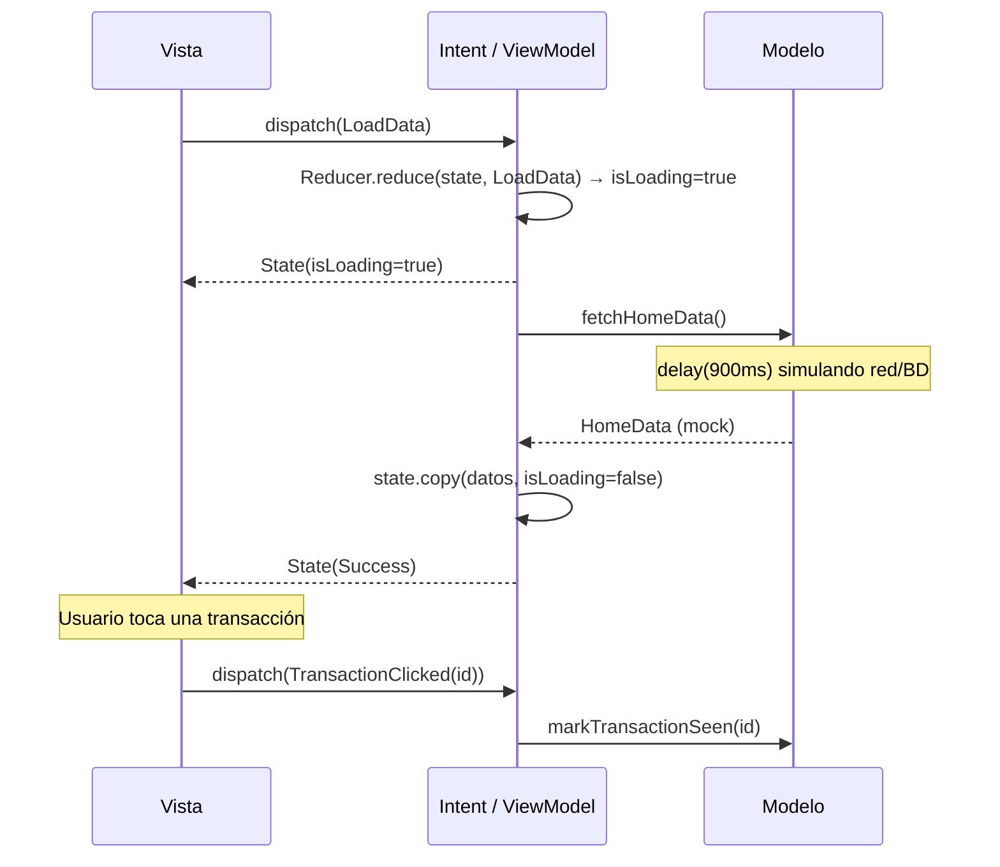

# Demo-mvi

Pantalla Home de un dashboard financiero (saludo del usuario, gráfico de actividad semanal, tarjetas de ventas/ingresos y lista de transacciones) implementada **100% en Jetpack Compose** (sin layouts XML) bajo el patrón de arquitectura **MVI (Model-View-Intent)**.

## Diseño

La interfaz fue diseñada en **[Pencil](https://pencil.dev)** a partir del archivo `masterclass/design/home.pen`. La implementación replica fielmente esa referencia: paleta de colores pastel, tipografía, espaciado, tarjetas redondeadas, gráfico de barras y navegación inferior. Comparte el mismo diseño visual que las demos MVC, MVP y MVVM para poder comparar arquitecturas lado a lado.

## Arquitectura: MVI

MVI es una evolución de MVVM con **flujo de datos unidireccional estricto**: un único estado inmutable, y cada acción del usuario modelada explícitamente como un `Intent`. La fórmula que resume el patrón:

**`Estado anterior + Intent → Nuevo estado`**

| Capa | Responsabilidad | Archivo |
|------|------------------|---------|
| **Modelo** | Datos y lógica de negocio. Simula una fuente de datos (red/base de datos) con datos mock y una latencia artificial. | `home/HomeModel.kt` |
| **Vista** | Composables de Jetpack Compose. Renderizan el `State` actual y despachan `Intent`s — nunca modifican el estado directamente. | `home/HomeScreen.kt` |
| **Intent (ViewModel + Reducer)** | El `ViewModel` recibe cada `Intent` mediante `dispatch(intent)`, lo pasa por el `Reducer` (una función **pura** `(State, Intent) -> State`) y luego ejecuta el efecto secundario correspondiente (llamar al Modelo). | `home/HomeIntent.kt`, `home/HomeReducer.kt`, `home/HomeViewModel.kt` |
| **State** | Único `data class` inmutable con todo el estado de la pantalla (datos + `isLoading` + `errorMessage`). | `home/HomeState.kt` |

El `Reducer` nunca llama al Modelo ni ejecuta corrutinas — solo transforma estado de forma síncrona y pura, lo que lo hace trivialmente testeable. Los efectos secundarios (la llamada real al Modelo) viven exclusivamente en el `ViewModel`.

## Diagrama de secuencia

Comunicación de datos entre las capas al abrir la pantalla y al tocar una transacción:



## Estructura del proyecto

```
app/src/main/java/com/example/demo_mvi/
├── MainActivity.kt              # setContent { HomeRoute() }
├── ui/theme/                    # Color.kt, Theme.kt, Type.kt
└── home/
    ├── Transaction.kt            # Modelo de una transacción
    ├── HomeData.kt                # Payload que devuelve el Modelo
    ├── HomeModel.kt                # Modelo (datos mock)
    ├── HomeState.kt                 # Estado inmutable de la pantalla
    ├── HomeIntent.kt                 # Acciones posibles del usuario
    ├── HomeReducer.kt                 # Función pura (State, Intent) -> State
    ├── HomeViewModel.kt                # dispatch(intent) + efectos secundarios
    └── HomeScreen.kt                    # HomeRoute + HomeScreen + Composables de la UI
```

No existe ni un solo archivo `.xml` de layout: toda la interfaz está construida con Composables.

## Dependencias

| Dependencia | Uso |
|-------------|-----|
| `androidx.compose:compose-bom` | BOM que fija versiones consistentes de Compose |
| `androidx.compose.material3:material3` | Componentes Material 3 (`Scaffold`, `NavigationBar`, `Button`, etc.) |
| `androidx.compose.material:material-icons-extended` | Íconos (`Sell`, `PieChart`, `Checkroom`, `LocalDrink`, `AccountBalanceWallet`, `BarChart`, etc.) |
| `androidx.lifecycle:lifecycle-viewmodel-compose` | Función `viewModel()` para obtener el ViewModel desde un Composable |
| `androidx.lifecycle:lifecycle-runtime-compose` | `collectAsStateWithLifecycle()` para observar el `StateFlow` de forma segura con el ciclo de vida |
| `androidx.lifecycle:lifecycle-viewmodel-ktx` | Clase base `ViewModel` y `viewModelScope` |
| `org.jetbrains.kotlinx:kotlinx-coroutines-android` | Corrutinas del ViewModel para llamar al Modelo de forma asíncrona |
| `androidx.activity:activity-compose` | Integración de Compose con la Activity (`setContent`, `enableEdgeToEdge`) |

## Cómo ejecutar

```bash
./gradlew :app:installDebug
```
