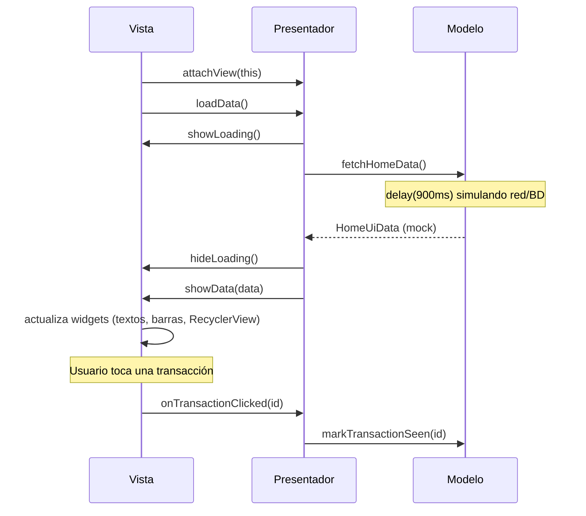

# Demo-mvp

Pantalla Home de un dashboard financiero (saludo del usuario, gráfico de actividad semanal, tarjetas de ventas/ingresos y lista de transacciones) implementada en Android con **Vistas clásicas (XML)** bajo el patrón de arquitectura **MVP (Model-View-Presenter)**.

## Diseño

La interfaz fue diseñada en **[Pencil](https://pencil.dev)** a partir del archivo `masterclass/design/home.pen`. La implementación replica fielmente esa referencia: paleta de colores pastel, tipografía, espaciado, tarjetas redondeadas, gráfico de barras y navegación inferior. Comparte el mismo diseño visual que la demo MVC para poder comparar arquitecturas lado a lado.

## Arquitectura: MVP

MVP introduce un **contrato** (`Contract`) que define, mediante interfaces, cómo se comunican la Vista y el Presentador — así ninguna de las dos clases concretas depende directamente de la otra, y el Modelo no conoce a ninguna de las dos.

| Capa | Responsabilidad | Archivo |
|------|------------------|---------|
| **Modelo** | Datos y lógica de negocio. Simula una fuente de datos (red/base de datos) con datos mock y una latencia artificial. | `home/HomeModel.kt` |
| **Vista** | Todo lo relacionado a UI: infla el layout, actualiza los widgets. **Cero lógica de negocio.** En esta demo, la propia Activity implementa el contrato de la Vista. | `MainActivity.kt` |
| **Presentador** | Mediador entre Vista y Modelo. No tiene Context de Android ni referencias a widgets — solo conoce las interfaces del contrato y al Modelo. Esto lo hace testeable con una Vista falsa, sin depender del framework de Android. | `home/HomePresenter.kt` |
| **Contrato** | Interfaces `View` y `Presenter` que definen el acuerdo entre ambas capas. | `home/HomeContract.kt` |

La diferencia clave frente a MVC: la Vista **nunca** llama al Modelo directamente — solo se comunica con el Presentador a través del contrato, y es el Presentador quien media con el Modelo.

## Diagrama de secuencia

Comunicación de datos entre las tres capas al abrir la pantalla y al tocar una transacción:



## Estructura del proyecto

```
app/src/main/
├── java/com/example/demo_mvp/
│   ├── MainActivity.kt          # Vista (implementa HomeContract.View)
│   └── home/
│       ├── HomeContract.kt      # Interfaces View y Presenter
│       ├── HomeModel.kt         # Modelo (datos mock)
│       ├── HomePresenter.kt     # Presentador
│       ├── HomeUiData.kt        # Modelos de datos de la pantalla
│       └── TransactionAdapter.kt
└── res/
    ├── layout/                  # activity_home.xml, item_transaction.xml
    ├── drawable/                # fondos redondeados e íconos vectoriales
    ├── color/, menu/            # selector y menú de la barra inferior
    └── values/                  # colors.xml, strings.xml, themes.xml
```

## Dependencias

| Dependencia | Uso |
|-------------|-----|
| `androidx.appcompat:appcompat` | `AppCompatActivity` y temas compatibles |
| `com.google.android.material:material` | `BottomNavigationView` y componentes Material |
| `androidx.recyclerview:recyclerview` | Lista de transacciones |
| `org.jetbrains.kotlinx:kotlinx-coroutines-android` | Corrutinas del Presentador para llamar al Modelo de forma asíncrona |
| `androidx.core:core-ktx` | Extensiones Kotlin sobre el SDK de Android |

No se usa Jetpack Compose ni ViewModel/Lifecycle-ViewModel — la UI se construye completamente con Vistas (XML) y View Binding.

## Cómo ejecutar

```bash
./gradlew :app:installDebug
```
