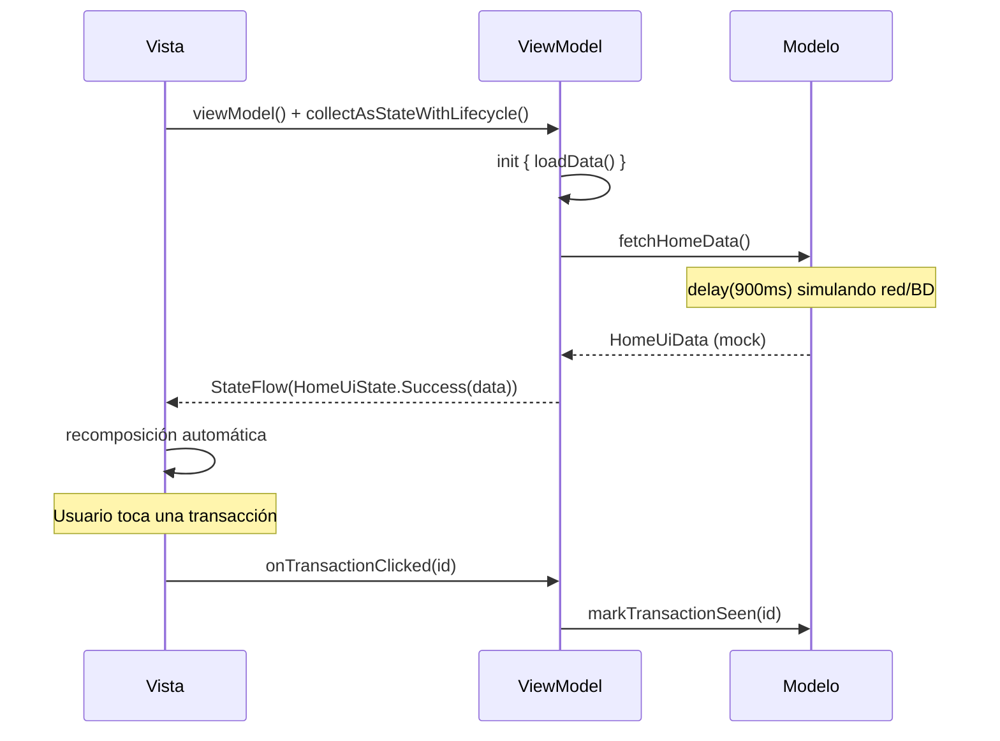

# Demo-mvvm

Pantalla Home de un dashboard financiero (saludo del usuario, gráfico de actividad semanal, tarjetas de ventas/ingresos y lista de transacciones) implementada **100% en Jetpack Compose** (sin layouts XML) bajo el patrón de arquitectura **MVVM (Model-View-ViewModel)**.

## Diseño

La interfaz fue diseñada en **[Pencil](https://pencil.dev)** a partir del archivo `masterclass/design/home.pen`. La implementación replica fielmente esa referencia: paleta de colores pastel, tipografía, espaciado, tarjetas redondeadas, gráfico de barras y navegación inferior. Comparte el mismo diseño visual que las demos MVC y MVP para poder comparar arquitecturas lado a lado.

## Arquitectura: MVVM

MVVM desacopla la Vista del Modelo mediante **observación de estado** en lugar de llamadas directas: el ViewModel no tiene ninguna referencia a la Vista, y la Vista solo reacciona a los cambios de estado que expone.

| Capa | Responsabilidad | Archivo |
|------|------------------|---------|
| **Modelo** | Datos y lógica de negocio. Simula una fuente de datos (red/base de datos) con datos mock y una latencia artificial. | `home/HomeModel.kt` |
| **Vista** | Composables de Jetpack Compose. Observan el `StateFlow` del ViewModel y renderizan la UI en consecuencia; los eventos del usuario se envían como llamadas a funciones. | `home/HomeScreen.kt` |
| **ViewModel** | Mantiene un `StateFlow<HomeUiState>`, sobrevive a cambios de configuración y orquesta las llamadas al Modelo. Nunca conoce ningún tipo de Composable. | `home/HomeViewModel.kt` |
| **UiState** | `sealed interface` con los estados posibles de la pantalla (`Loading`, `Success`, `Error`). | `home/HomeUiState.kt` |

Patrón **Route/Screen**: `HomeRoute` es la parte "con estado" — obtiene el ViewModel y colecta el `StateFlow` — mientras que `HomeScreen` es una función pura que solo recibe datos y lambdas, sin conocer al ViewModel. Esto permite previsualizar y testear la UI sin necesidad de instanciar un ViewModel real.

## Diagrama de secuencia

Comunicación de datos entre las tres capas al abrir la pantalla y al tocar una transacción:



## Estructura del proyecto

```
app/src/main/java/com/example/demo_mvvm/
├── MainActivity.kt              # setContent { HomeRoute() }
├── ui/theme/                    # Color.kt, Theme.kt, Type.kt
└── home/
    ├── HomeUiData.kt             # Modelos de datos de la pantalla
    ├── HomeUiState.kt            # Loading / Success / Error
    ├── HomeModel.kt              # Modelo (datos mock)
    ├── HomeViewModel.kt          # ViewModel (StateFlow<HomeUiState>)
    └── HomeScreen.kt             # HomeRoute + HomeScreen + Composables de la UI
```

No existe ni un solo archivo `.xml` de layout: toda la interfaz (header, gráfico de barras, tarjetas, lista de transacciones y barra de navegación inferior) está construida con Composables.

## Dependencias

| Dependencia | Uso |
|-------------|-----|
| `androidx.compose:compose-bom` | BOM que fija versiones consistentes de Compose |
| `androidx.compose.material3:material3` | Componentes Material 3 (`Scaffold`, `NavigationBar`, `Button`, etc.) |
| `androidx.compose.material:material-icons-extended` | Íconos (`Sell`, `PieChart`, `Checkroom`, `LocalDrink`, `AccountBalanceWallet`, `BarChart`, etc.) |
| `androidx.lifecycle:lifecycle-viewmodel-compose` | Función `viewModel()` para obtener el ViewModel desde un Composable |
| `androidx.lifecycle:lifecycle-runtime-compose` | `collectAsStateWithLifecycle()` para observar el `StateFlow` de forma segura con el ciclo de vida |
| `androidx.lifecycle:lifecycle-viewmodel-ktx` | Clase base `ViewModel` y `viewModelScope` |
| `org.jetbrains.kotlinx:kotlinx-coroutines-android` | Corrutinas del ViewModel para llamar al Modelo de forma asíncrona |
| `androidx.activity:activity-compose` | Integración de Compose con la Activity (`setContent`, `enableEdgeToEdge`) |

## Cómo ejecutar

```bash
./gradlew :app:installDebug
```
