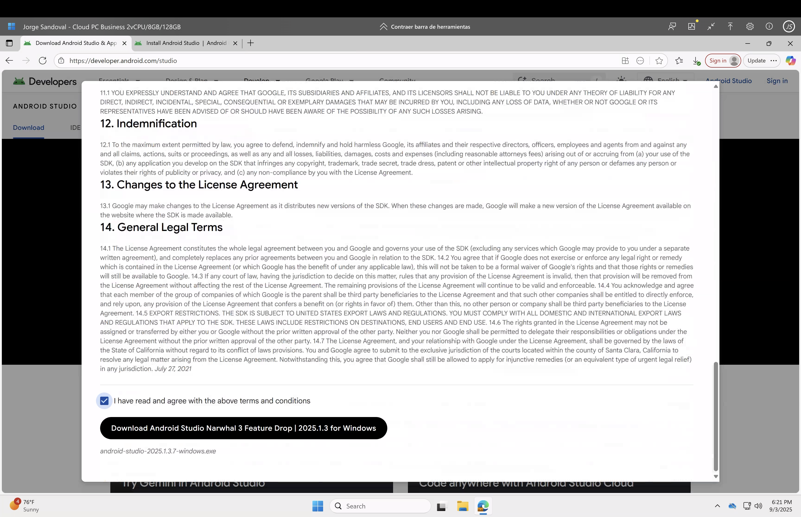
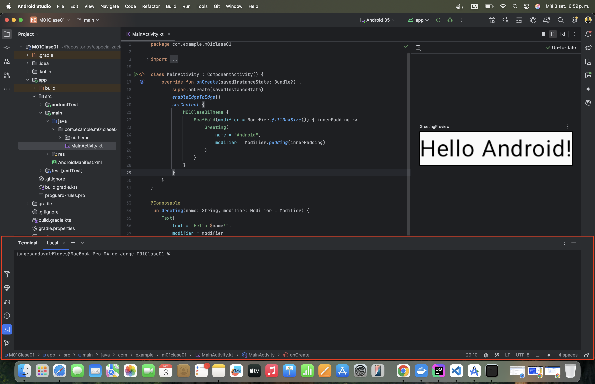

# Tutorial paso a paso: Instalación de Android Studio + Guía de la interfaz

> **Última revisión:** 3 de septiembre de 2025 · **Sistema operativo:** Windows / macOS / Linux  
> **Fuentes oficiales rápidas:** [Instalar Android Studio](https://developer.android.com/studio/install), [Conoce la UI](https://developer.android.com/studio/intro/user-interface), [Lanzamientos de Android Studio](https://developer.android.com/studio/releases), [Plataformas/API](https://developer.android.com/tools/releases/platforms)

---

## 0) Requisitos previos

- 8 GB de RAM (16 GB recomendado), 10–20 GB de espacio libre.  
- Virtualización **habilitada** en BIOS/UEFI (para el emulador).  
- Conexión a internet estable.  
- **No necesitas instalar un JDK aparte**: Android Studio incluye **JetBrains Runtime (JBR)** basado en OpenJDK. Más adelante puedes cambiar el JDK si lo requieres.


---

## 1) Descarga Android Studio (estable)

1. Ve a **Download Android Studio** y descarga el instalador para tu sistema operativo.  
   
2. Verifica que sea la **versión estable** más reciente (en 2025, la familia *Narwhal/Meerkat* y posteriores).  
   

> Referencias: Guía de instalación y notas de versión de Android Studio.  

---

## 2) Instalación por sistema operativo

### 2.1 Windows (x64/ARM)
1. Ejecuta el instalador (`.exe`) como administrador.  
2. Acepta los componentes por defecto (**Android SDK**, **Android SDK Platform**, **Android Virtual Device**).  
3. Al finalizar, deja marcada la opción **Run Android Studio**.  
4. En el **Setup Wizard**, elige **Standard** para una instalación guiada y descarga de componentes.


### 2.2 macOS (Intel/Apple Silicon)
1. Abre el `.dmg` y arrastra **Android Studio** a **Applications**.  
2. Abre la app (puede pedir permiso por ser descargada de internet).  
3. Sigue el **Setup Wizard** y confirma la instalación de componentes (incluye JBR).  


### 2.3 Linux (deb/rpm/zip)
1. Extrae o instala el paquete según tu distro.  
2. Otorga permisos de ejecución al script de inicio si usas el `.zip`:  
   ```bash
   chmod +x bin/studio.sh
   ./bin/studio.sh
   ```
3. Sigue el **Setup Wizard**.

> ``

> **Rutas típicas del SDK**  
> - **Windows:** `C:\Users\<usuario>\AppData\Local\Android\Sdk`  
> - **macOS:** `/Users/<usuario>/Library/Android/sdk`  
> - **Linux:** `/home/<usuario>/Android/Sdk`  


---

## 3) Primer arranque y componentes esenciales

Durante el **Setup Wizard**:
- Elige **Standard** (o **Custom** si ajustarás RAM del emulador).  
- Selecciona un **tema** (Light/Dark).  
- Descarga **Platform Tools** (adb), **Build Tools**, **SDK Platform** más reciente y **Android Virtual Device**.

Luego valida en **File ▸ Settings/Preferences ▸ Appearance & Behavior ▸ System Settings ▸ Android SDK**:
- **SDK Platforms:** marca la plataforma más reciente (**API level actual**).  
- **SDK Tools:** deja activado *Android SDK Platform-Tools*, *Android SDK Build-Tools*, *Android Emulator* y *Android SDK Command-line Tools*.


**Verificación rápida por terminal:**  
```bash
adb --version
sdkmanager --list | head -n 30
```

---

## 4) Emulador y aceleración por hardware

1. Abre **Device Manager** ▸ **Create device** y elige un perfil (p. ej., Pixel 8).  
2. Descarga una **System Image** (recomendada: la más reciente con Google APIs).  
3. Activa aceleración:  
   - **Windows:** **WHPX/Hyper-V** (o WSL2) según documentación.  
   - **macOS:** **Hypervisor Framework** (Apple Silicon usa este por defecto).  
   - **Linux:** KVM.
4. Ajusta **RAM/VRAM** según tu equipo.

> 
> 

---

## 5) Crea tu primer proyecto (Compose recomendado)

1. **New Project** ▸ plantilla **Empty Activity (Compose)**.  
2. Define: **Application name**, **Package name** (único), **Save location**, **Language: Kotlin**, **Minimum SDK**.  
3. Ejecuta con **Run ▶** en un dispositivo físico (USB) o tu **AVD**.

> 
> 

---

## 6) Secciones importantes de Android Studio (UI)

- **Welcome Screen:** crear/abrir proyectos, recientes, SDK Manager.  
  
- **Barra superior y Run/Debug Configurations:** iniciar, depurar, seleccionar dispositivo.  
  
- **Tool Windows clave:**  
  - **Project** (estructura de módulos).  
  - **Gradle** (tareas y sincronización).  
  - **Build** (salida de compilación, Build Analyzer).  
  - **Logcat** (logs filtrados por app, nivel, proceso).  
  - **Device Manager** (AVD).  
  - **App Inspection** (DB Inspector, Network Inspector).  
  - **Profiler** (CPU, memoria, energía).  
  - **Layout Inspector** / **Compose Layout Inspector**.  
  - **Device File Explorer**.  
  - **Version Control** (Git).  
  - **Terminal** integrado.
  

- **Editor:** autocompletado, inspecciones, refactors, *intention actions*.

> Documentación: Conoce la interfaz de Android Studio.

---

## 7) Gradle: `.gradle` vs `.gradle.kts` (Kotlin DSL)

- Puedes escribir los scripts con **Groovy** (`build.gradle`) o **Kotlin DSL** (`build.gradle.kts`).  
- **Recomendado:** Kotlin DSL por mejor autocompletado, chequeos de tipos y refactors más seguros.  
- Si migras, sigue la guía oficial y el *primer* paso suele ser renombrar archivos a `.gradle.kts` y ajustar el bloque `plugins {}`.


**Recursos:**  
- Guía “Migrate your build configuration from Groovy to Kotlin (DSL)”.  
- “Gradle build overview | Configuration DSLs”.

---

## 8) Estructura de proyecto (carpetas clave)

- **app/src/main/AndroidManifest.xml** (declaraciones de permisos, actividades, `applicationId` en Gradle).  
- **app/build.gradle(.kts)** (configuración Android, dependencias).  
- **gradle/libs.versions.toml** (opcional: Version Catalog).  
- **src/main/java|kotlin** (código), **src/main/res** (recursos), **src/androidTest** / **test** (tests).

> 

---

## 9) Niveles de API (API level) y cómo elegir `minSdk`/`targetSdk`

- **compileSdk**: usa el **API level más reciente** disponible (para acceder a las APIs nuevas).  
- **targetSdk**: también el más reciente soportado por Play en el momento (cumplimiento de comportamientos y políticas).  
- **minSdk**: decide según tu audiencia, librerías y hardware mínimo. Hoy, muchas librerías exigen **21+**; evalúa métricas de usuarios y dependencias.

### Tabla rápida (actualizada al 03-sep-2025)

| Versión Android | API level | Estado | Nota |
|---|---:|---|---|
| Android 16 | **36** | Estable (10-jun-2025) | Última plataforma estable. |
| Android 15 | **35** | Estable (15-oct-2024) | **Play**: nuevas apps y actualizaciones deben **target 35+** desde **31-ago-2025** (Wear OS/TV/Automotive: 34+). |
| Android 14 | **34** | Estable | Aún común en dispositivos. |

> 

**Referencias:** Plataforma/API oficiales y políticas de Play.  

---

## 10) `applicationId` (package de la app) debe ser **único**

- En Gradle (**defaultConfig ▸ applicationId**) defines el **identificador único** de tu app (p. ej., `com.empresa.app`).  
- Este **no puede repetirse en Play** para otra app y es **independiente** del `package` de clases del código.  
- **Consejo:** fija el `applicationId` temprano; cambiarlo luego implica migraciones (firmas, enlaces, deep links, etc.).

> 

**Referencia:** documentación de *applicationId* y herramientas de firma/empaquetado.

---

## 11) Actualizaciones del IDE y canales

- **Stable** (recomendado), **Beta**, **Canary/Preview**.  
- Actualiza desde **Help ▸ Check for Updates** o desde el panel **Updates**.  
- Revisa notas de versión por familia (*Narwhal, Meerkat, Ladybug, …*) para cambios de AGP/Gradle.

> 

---

## 12) Recursos oficiales y atajos útiles

- **Página oficial de desarrolladores:** https://developer.android.com (en español disponible).  
- **Instalar Android Studio:** guía paso a paso.  
- **Conoce la UI de Android Studio:** tour de ventanas y atajos.  
- **Command-line tools:** `adb`, `sdkmanager`, `avdmanager`, `apksigner`, etc.  
- **SDK Platforms:** notas por versión (API 36/35/34…).  
- **Política Play – Target API:** fechas y requisitos vigentes.

> 

---

## 13) Anexos

### A. Detección y cambio de JDK del IDE
- **File ▸ Settings/Preferences ▸ Build, Execution, Deployment ▸ Build Tools ▸ Gradle ▸ Gradle JDK**.  
- Puedes usar el JBR incluido o apuntar a otro JDK instalado.

> 

### B. Comandos útiles
```bash
# Listar paquetes instalados y disponibles
sdkmanager --list

# AVDs existentes
avdmanager list avd

# Instalar una plataforma y build-tools específicas
sdkmanager "platforms;android-35" "build-tools;35.0.0"
```

### C. Problemas comunes (y pistas)
- **Emulador lento o no arranca** → revisar aceleración (Hyper-V/WHPX/Hypervisor/KVM) y asignación de RAM.  
- **Gradle Sync falla** → comprobar versiones de AGP/Gradle, proxy/firewall, JDK seleccionado.  
- **No aparece un dispositivo físico** → activar *Developer options* y **USB debugging**; drivers OEM (Windows).  
- **Errores con firmas** → confirmar keystore, contraseñas y `signingConfigs`.

---

### Notas y referencias clave

- Instalación y SDK Manager: guía oficial de Android Studio.  
- UI y ventanas principales: “Get to know the Android Studio UI”.  
- Emulador y aceleración de hardware: documentación del emulador.  
- Plataformas/API y niveles: “SDK Platform release notes” (Android 16 = API 36; Android 15 = API 35; Android 14 = API 34).  
- Requisito de **target API 35+** (nuevas apps y actualizaciones a partir del **31-ago-2025**): política de Play.  
- Kotlin DSL recomendado para Gradle en Android: documentación de build de Android/Gradle.

> Puedes reemplazar esta sección por citas formales o pie de página si lo deseas.