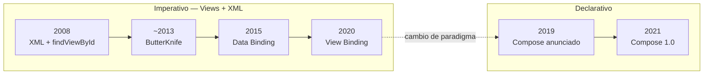
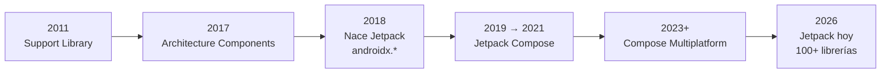
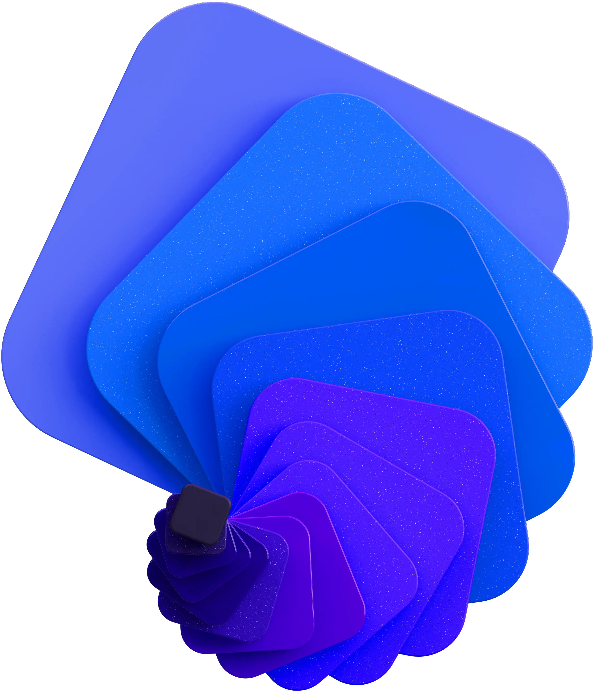
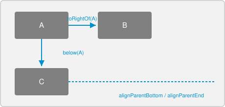
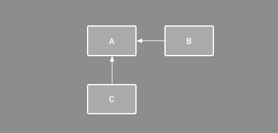
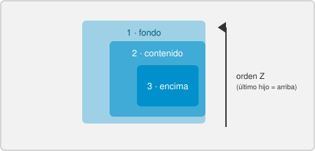
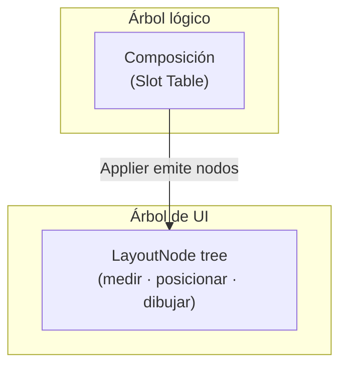
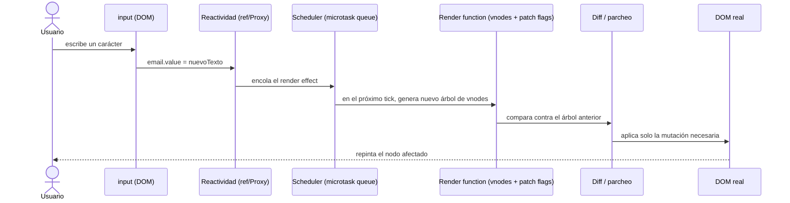
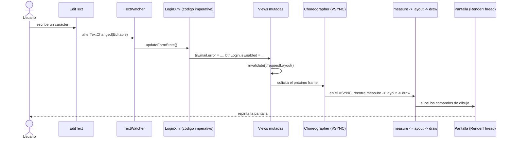
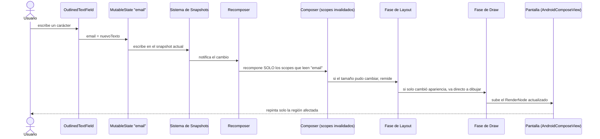

# Sesión 2 - Fundamentos de Jetpack Compose

> Curso: **Especialización en Desarrollo Móvil --- Android/Kotlin**\
> Módulo 1 · Sesión 2

---

## Objetivos de aprendizaje

Al finalizar esta sesión, el estudiante será capaz de:

1.  Explicar cómo evolucionó la declaración de UI en Android: de
    `findViewById` a **Jetpack Compose**.
2.  Ubicar a **Jetpack** en el tiempo — qué resolvió y qué es hoy.
3.  Explicar por qué Compose es **declarativo** y qué es la
    **recomposición**.
4.  Construir **jerarquías de componentes** en Compose (`Column`,
    `Row`, `Box`, slots).
5.  Describir cómo se renderiza una misma pantalla en **Vue**,
    **Android XML** y **Android Compose**.

## Contenido de la clase

1.  Evolución de la declaración de interfaces en Android.
2.  Jetpack: orígenes, historia y actualidad.
3.  Compose como UI declarativa.
4.  Jerarquía de componentes en Compose.
5.  Ejemplo integrador: login en Vue, XML y Compose — alcance y
    renderizado.

> Cada sección cierra con un bloque **Adicional**, para quien quiera
> profundizar en el mecanismo interno — no es necesario para seguir
> la clase.

---

## 1) Evolución de la declaración de interfaces en Android


Android siempre resolvió la misma pregunta — _¿cómo describo lo que
se ve en pantalla?_ — de formas distintas:

| Época     | Enfoque                      | Idea central                                                   |
| --------- | ---------------------------- | -------------------------------------------------------------- |
| 2008      | **XML + `findViewById`**     | Inflar un `.xml` y buscar cada vista por `id`, a mano.         |
| ~2013     | **ButterKnife** (no oficial) | Anotaciones que generan el `findViewById` por ti.              |
| 2015      | **Data Binding** (oficial)   | Expresiones dentro del propio XML, enlace en dos sentidos.     |
| 2020      | **View Binding** (oficial)   | Clase autogenerada y _type-safe_, sin expresiones.             |
| 2019→2021 | **Jetpack Compose**          | Ya no hay XML: la UI es una función de Kotlin (`@Composable`). |



Cada flecha dentro de "Imperativo" es una mejora incremental (menos
_boilerplate_). La flecha punteada hacia "Declarativo" no lo es: es
un salto de paradigma, de _mutar vistas_ a _describir el resultado_.

Este repositorio usa ambos mundos a propósito: los ejemplos `*Xml.kt`
(imperativos) y `*Compose.kt` (declarativos) conviven en
[ExampleAndroid](./ExampleAndroid).

### Adicional

- El `LayoutInflater` de XML construye directamente el árbol de
  `View` que existirá durante toda la pantalla: ese árbol es a la
  vez el modelo y la estructura de renderizado. Compose separa
  ambas cosas (ver sección 4).
- **ButterKnife** fue declarada obsoleta por su propio autor en
  2020, a favor de View Binding — sin _reflection_ ni _annotation
  processing_ en tiempo de ejecución.
- Google no ha deprecado las Views (siguen soportadas e
  interoperables con Compose vía `ComposeView`/`AndroidView`), pero
  declaró que el desarrollo de **nuevas** capacidades de UI está
  enfocado en Compose.

[Data Binding (2015)](https://android-developers.googleblog.com/2015/05/data-binding-library-i-o-15-technical.html) ·
[View Binding](https://developer.android.com/topic/libraries/view-binding) ·
[Interoperabilidad Views/Compose](https://developer.android.com/develop/ui/compose/migrate/interoperability-apis)

---

## 2) Jetpack: orígenes, historia y actualidad


Jetpack no nace solo para traer Compose — Compose es apenas una pieza
más, y llegó un año después. Nace para resolver un problema mucho más
viejo: la **fragmentación** de Android. Para 2017, la plataforma
llevaba casi una década en el mercado, con miles de combinaciones de
fabricante + versión de OS + tamaño de pantalla, y cada equipo
resolvía por su cuenta los mismos problemas de siempre — fugas de
memoria por el *lifecycle* de Activity/Fragment, pérdida de estado en
rotación, cómo cachear datos localmente, cómo testear código acoplado
al framework — sin ninguna guía oficial. La Support Library ya daba
compatibilidad hacia atrás, pero su versionado (atado al API level)
no dejaba evolucionar rápido ni de forma consistente. Jetpack junta
todo eso bajo un mismo paraguas: compatibilidad, arquitectura
oficial, testabilidad y, recién más adelante, un toolkit de UI.

- **2011-2017 — Support Library**: librerías para llevar funciones
  nuevas a versiones antiguas de Android, versionadas de forma
  confusa según el API level.
- **2017 — Architecture Components**: `ViewModel`, `LiveData`,
  `Room` — primera guía oficial de arquitectura, tras años de
  debate sobre MVP/MVVM y fugas de memoria por _lifecycle_.
- **2018 — nace Jetpack**: unifica todo bajo el namespace
  `androidx.*`, con **versionado independiente** por librería (ya
  no atado al API level).
- **2026 — actualidad**: Jetpack agrupa **100+ librerías** (Compose,
  Hilt, Room, WorkManager, DataStore...), incluyendo **Compose
  Multiplatform** (Android, iOS, Desktop, Web).



Cada bloque resuelve lo que dejó abierto el anterior: compatibilidad
→ arquitectura → versionado coherente → UI declarativa → UI más allá
de Android.

### Adicional

- El versionado independiente es la razón por la que hoy
  `androidx.compose.material3:material3:1.4.0` no tiene relación
  directa con el número de Android del dispositivo — cada librería
  sigue su propio ciclo `alpha → beta → rc → estable`.
- **Android KTX** (2018) son _extension functions_ de Kotlin sobre
  APIs pensadas originalmente para Java, para que Jetpack se sienta
  idiomático en Kotlin.

[Jetpack (2018)](https://android-developers.googleblog.com/2018/05/whats-new-in-android-support-library.html) ·
[Architecture Components (2017)](https://android-developers.googleblog.com/2017/11/announcing-architecture-components-10.html) ·
[Jetpack hoy](https://developer.android.com/jetpack)

---

## 3) Compose como UI declarativa


Compose no aparece en el vacío: llega en medio de una ola de toda la
industria hacia la UI declarativa — React (2013) ya la había
popularizado en la web, Flutter (2017) la llevó a mobile
multiplataforma, y SwiftUI (2019) apareció casi al mismo tiempo del
lado de Apple. Google no solo quería modernizar las Views: quería
eliminar de raíz una categoría entera de bugs (UI desincronizada del
estado real) y unificar el desarrollo Android en un solo lenguaje —
Kotlin, de punta a punta: layout, lógica y estado. Ese mismo motor
declarativo es hoy también la base de **Compose Multiplatform**, el
proyecto liderado por JetBrains (los creadores de Kotlin) que permite
reusar el mismo código Compose en Android, iOS, escritorio
(Windows/macOS/Linux) y Web — llevando la idea de "un solo Kotlin
para toda la UI" más allá de Android, algo que las Views nunca
pudieron ofrecer.




*Compose Multiplatform hoy corre en producción en Android, iOS,
Desktop (Windows/macOS/Linux) y Web (Kotlin/Wasm), compartiendo la
misma UI declarativa — [kotlinlang.org/compose-multiplatform](https://kotlinlang.org/compose-multiplatform/).*

- **Imperativo**: tú buscas la vista y **mutas** sus propiedades
  (`setText`, `isEnabled = ...`). Si olvidas actualizar una, la UI
  queda desincronizada del estado real.
- **Declarativo (Compose)**: describes la UI en función de un
  estado. Cuando el estado cambia, Compose vuelve a ejecutar las
  funciones que dependen de él — **recomposición** — sin que tú
  actualices nada a mano.
- **Analogía con Vue**: un `<script setup>` tampoco toca el DOM
  directamente; declaras un `ref`, lo usas en el `template`, y Vue
  refresca el DOM solo. Compose hace lo mismo con funciones Kotlin.

```kotlin
@Composable
fun GreetingCard(name: String, onTap: () -> Unit, modifier: Modifier = Modifier) {
    Card(modifier = modifier) {
        Column(Modifier.padding(16.dp)) {
            Text(text = "Hello $name!", style = MaterialTheme.typography.titleLarge)
            Button(onClick = onTap) { Text("Tap me") }
        }
    }
}
```

```vue
<template>
    <div class="card">
        <h2>Hello {{ name }}!</h2>
        <button @click="$emit('tap')">Tap me</button>
    </div>
</template>
<script setup lang="ts">
defineProps<{ name: string }>();
defineEmits<{ (e: "tap"): void }>();
</script>
```

### Adicional

- El estado (`mutableStateOf`) está respaldado por el **Snapshot
  State System**: cada lectura queda registrada y cada escritura
  ocurre dentro de un _snapshot_ aislado — útil con varios hilos
  (UI, _background_, `RenderThread`). Es conceptualmente similar al
  _Proxy_ reactivo de Vue 3, pero pensado para concurrencia.
- La recomposición es **inteligente**: solo se re-ejecutan los
  _scopes_ que leyeron el estado que cambió (_smart
  recomposition_). Desde el compilador 1.5.4, el **strong skipping
  mode** (activado por defecto) permite saltar composables incluso
  con parámetros "inestables" como lambdas.

[State en Compose](https://developer.android.com/develop/ui/compose/state) ·
[Strong skipping](https://developer.android.com/develop/ui/compose/performance/stability/strongskipping)

---

## 4) Jerarquía de componentes en Compose

Antes de Compose, el sistema de Views ya resolvía "cómo se ordenan
los hijos en pantalla" con varios `ViewGroup`, cada uno con su propia
lógica de posicionamiento. Los cuatro más usados:

| `LinearLayout` | `RelativeLayout` | `ConstraintLayout` (2016) | `FrameLayout` |
|---|---|---|---|
|  |  |  |  |
| Ordena a sus hijos en **una sola dirección**, uno detrás de otro (vertical u horizontal). | Cada hijo se posiciona **relativo a otro hijo o al padre** (`toRightOf`, `below`, `alignParentBottom`...). | Igual que Relative, pero con un motor de restricciones más potente (cadenas, *guidelines*, *barriers*) y jerarquía plana — el recomendado hoy para XML. | Apila a sus hijos **unos sobre otros** (eje Z); el último hijo declarado queda arriba. |

*(Diagramas de `LinearLayout` y `ConstraintLayout`: documentación
oficial de Android Developers, Apache 2.0.)*

Compose no inventa un quinto sistema: **unifica los cuatro bajo un
solo primitivo**, `Layout` — un composable que recibe a sus hijos,
los **mide** y decide **dónde colocarlos**. `Column`, `Row` y `Box`
son, en el fondo, los tres `Layout` ya resueltos por Compose para los
casos de `LinearLayout` (vertical/horizontal) y `FrameLayout`
(apilado); un layout tipo `ConstraintLayout` también existe en
Compose (`ConstraintLayout`, como librería aparte) sobre ese mismo
contrato de *medir + posicionar*.

- `Column` (vertical), `Row` (horizontal) y `Box` (apilado) son los
  contenedores base — el equivalente a `LinearLayout`/`FrameLayout`.
- Un composable puede recibir **otro composable como parámetro**
  (`content: @Composable () -> Unit`), igual que un `<slot>` en
  Vue.
- El **`Modifier`** es una cadena de decoradores que se aplica **en
  orden** — cambiar el orden cambia el resultado, como el orden de
  clases CSS en la web.

```kotlin
@Composable
fun PrimaryButton(
    onClick: () -> Unit,
    modifier: Modifier = Modifier,
    content: @Composable () -> Unit
) {
    Button(onClick = onClick, modifier = modifier.height(48.dp)) { content() }
}
```

### Adicional

Compose mantiene **dos árboles**, no uno:



- La **Composición** guarda "qué composable llamó a cuál" en la
  **Slot Table**. El **`LayoutNode`** es el árbol real que se mide
  y dibuja. El **`Applier`** es el puente entre ambos.
- Esta separación es la razón por la que el renderizado se divide
  en **fases independientes** (Composición → Layout → Draw) — clave
  para entender el diagrama de la sección 5.
- **`CompositionLocal`** propaga datos de forma implícita por la
  jerarquía (así viaja `MaterialTheme.colorScheme`) — el
  equivalente a `provide`/`inject` en Vue.

[Fases de Compose](https://developer.android.com/develop/ui/compose/phases) ·
[CompositionLocal](https://developer.android.com/develop/ui/compose/compositionlocal)

---

## 5) Ejemplo integrador: formulario de login

Implementamos la **misma pantalla** tres veces, con la **misma
validación** (email con formato válido, password ≥ 6 caracteres),
para comparar tres modelos de renderizado:

- **[ExampleVue](./ExampleVue)** → `src/components/login/LoginForm.vue`
- **[ExampleAndroid](./ExampleAndroid)** (XML) → `login/LoginXml.kt` + `layout_login.xml`
- **[ExampleAndroid](./ExampleAndroid)** (Compose) → `login/LoginCompose.kt`

### Alcance

**Incluye:** 2 campos, validación local idéntica en las 3
implementaciones, botón deshabilitado hasta que el formulario sea
válido, simulación de red (~900ms) con estado de carga.

**No incluye (a propósito):** backend real, persistencia de sesión
(se ve con DataStore en el [Módulo 3](../../modulo-03/clase-02)),
seguridad de credenciales, ni `ViewModel` — el estado vive en la
propia Activity/composable para poder comparar **quién es dueño del
estado** en cada paradigma, sin capas de por medio todavía.


#### A. Vue — [`LoginForm.vue`](./ExampleVue/src/components/login/LoginForm.vue)

```vue
<script setup lang="ts">
const email = ref("");
const emailValid = computed(() => EMAIL_PATTERN.test(email.value));
async function onSubmit() {
    if (!formValid.value) return;
    isLoading.value = true;
    await new Promise((resolve) => setTimeout(resolve, 900));
    isLoading.value = false;
}
</script>
```

#### B. Android XML (imperativo) — [`LoginXml.kt`](./ExampleAndroid/app/src/main/java/com/example/exampleandroid/login/LoginXml.kt)

```kotlin
etEmail.addTextChangedListener(object : TextWatcher {
    override fun afterTextChanged(s: Editable?) = updateFormState()
})

fun updateFormState() {
    val emailValid = EMAIL_PATTERN.matches(etEmail.text.toString())
    tilEmail.error = if (!emailValid) "Ingresa un email válido" else null
    btnLogin.isEnabled = emailValid && passwordValid
}
```

Tú escuchas el evento, validas y mutas cada vista a mano.

#### C. Android Compose (declarativo) — [`LoginCompose.kt`](./ExampleAndroid/app/src/main/java/com/example/exampleandroid/login/LoginCompose.kt)

```kotlin
var email by remember { mutableStateOf("") }
val emailValid = EMAIL_PATTERN.matches(email)

OutlinedTextField(value = email, onValueChange = { email = it }, isError = !emailValid)
Button(onClick = { /* ... */ }, enabled = emailValid && passwordValid) { Text("Iniciar sesión") }
```

Nadie llama a `setError` ni a `setEnabled`: `email` cambia y Compose
recompone solo.

### Adicional — el proceso de renderizado

¿Qué pasa, paso a paso, cuando el usuario escribe una letra en el
campo email?

#### Vue (Virtual DOM)



El compilador de Vue marca en _compile-time_ qué es dinámico (**patch
flags**), así el _diff_ en runtime ni siquiera recorre lo estático.

#### Android XML (View system)



`invalidate()` (redibuja) y `requestLayout()` (remide) no son lo
mismo — confundirlos es una causa común de _jank_ (frames perdidos).

#### Android Compose (Snapshot + recomposición)



Las tres fases (Composición → Layout → Draw) son independientes: un
estado que solo afecta al `alpha` de un `graphicsLayer` puede saltar
directo a Draw, sin recomponer ni remedir nada.

---

## Ejercicios prácticos

1.  Ejecutar `LoginXml` y `LoginCompose`, forzar un email inválido en
    ambos y describir qué se actualiza en cada caso.
2.  Agregar una tercera regla de validación (ej. password con un
    número), implementada igual en Vue, XML y Compose.
3.  Dibujar el diagrama de secuencia de qué pasa al presionar
    "Iniciar sesión" (a diferencia de escribir, `isLoading` cambia
    dos veces).

## Quiz

Repasa lo visto en esta sesión: **[forms.gle/jxbRVGgkQXyYpSeu8](https://forms.gle/jxbRVGgkQXyYpSeu8)**

## Recursos

- [Thinking in Compose](https://developer.android.com/develop/ui/compose/mental-model)
- [Compose — Phases](https://developer.android.com/develop/ui/compose/phases)
- [Jetpack](https://developer.android.com/jetpack)
- [Vue 3 — Reactivity in Depth](https://vuejs.org/guide/extras/reactivity-in-depth.html)
- [Vue 3 — Rendering Mechanism](https://vuejs.org/guide/extras/rendering-mechanism.html)
