# Sesión 3 — States y Recomposición (Jetpack Compose)

> Programa: Especialización en Desarrollo Móvil — Android/Kotlin  
> Módulo 01 · Sesión 03

---

## Objetivos de aprendizaje

Al finalizar la sesión, el estudiante será capaz de:
1. Contrastar el sistema **android.view** (imperativo, XML) con **Jetpack Compose** (declarativo).
2. Modelar UI con **state** usando `remember`, `mutableStateOf`, `State<T>` y `rememberSaveable`.
3. Controlar la **recomposición**, entendiendo qué la dispara y cómo evitar trabajo innecesario.
4. Comunicar estados entre componentes con **state hoisting** y ViewModel + Flow/StateFlow.
5. Emplear efectos de Compose: **`LaunchedEffect`**, **`SideEffect`** y **`derivedStateOf`**.

---

## Agenda de contenidos

1) View, Widgets, Layouts  
2) `remember`, `mutableStateOf`, `State<T>`  
3) Control de recomposición y ciclo de vida  
4) Comunicación de estados entre componentes  
5) Efectos: `LaunchedEffect`, `SideEffect`, `derivedStateOf`  
6) Errores comunes y checklist

---

## 1) View, Widgets, Layouts, Resources

## 1.1 Package `android.view`

El package **`android.view`** define la **jerarquía base** de la UI en Android antes de Jetpack Compose.  
Aquí viven las clases **fundamentales** para manejar gráficos, eventos táctiles, layouts y el ciclo de renderizado.

### Clase raíz: `android.view.View`
- Es la **unidad básica** de construcción en la interfaz clásica de Android.  
- Representa un **rectángulo** en la pantalla, con atributos de:
  - **Medición** (`onMeasure`).
  - **Posicionamiento** (`onLayout`).
  - **Dibujo** (`onDraw`).
  
  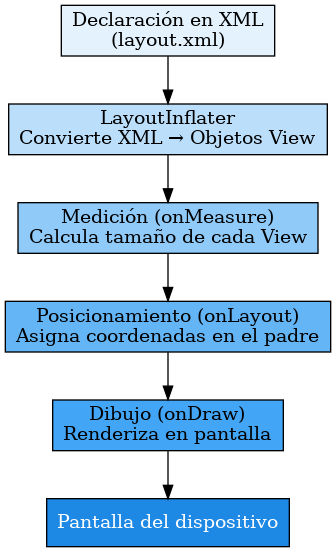
- También maneja:
  - Entrada de usuario: toques (`onTouchEvent`), foco, teclado.
  - Accesibilidad.
  - Animaciones (propiedades como `alpha`, `translationX`).

### Subclases importantes
Todas las UI clásicas se construyen **heredando directa o indirectamente de `View`**:

1. **Widgets** (controles de UI):  
   - `TextView` (y sus derivados: `EditText`, `Button`, `CheckBox`, etc.).  
   - `ImageView`.  
   - `ProgressBar`.  
   - `SeekBar`, `Switch`.  
   - Básicamente, todo lo que interactúa con el usuario.

   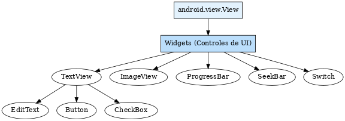

2. **Layouts** (agrupadores):  
   - `ViewGroup` (subclase abstracta de `View`).  
   - De `ViewGroup` derivan los **layouts contenedores**:  
     - `LinearLayout`
        - Horizontal
        - Vertical 
     - `RelativeLayout`
        - android:layout_above="@id/otraVista" → coloca la vista encima de la indicada.
        - android:layout_below="@id/otraVista" → coloca la vista debajo.
     - `FrameLayout`
        - su propósito es apilar vistas unas sobre otras (stack)
     - `ConstraintLayout`
        - Permitir que diseñes interfaces complejas en un solo contenedor plano, con reglas de posición y tamaño basadas en restricciones (constraints) entre vistas o con el contenedor padre.
     - `TableLayout`  
     - `GridLayout`.

    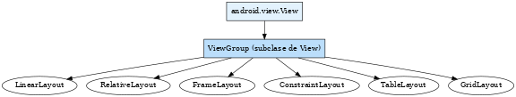

3. **Contenedores especializados**:  
   - `ScrollView` (para desplazar contenido).  
   - `RecyclerView` (de `androidx.recyclerview`, pero extiende de `ViewGroup`).  
   - `ViewPager` / `ViewPager2`.

    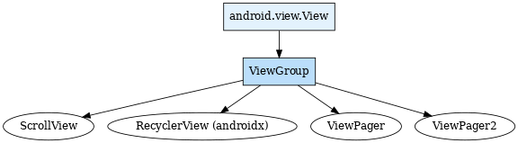

4. **Superficies de renderizado avanzado**:  
   - `SurfaceView` (render directo desde un hilo).  
   - `TextureView`.  
   - `GLSurfaceView` (gráficos OpenGL).

   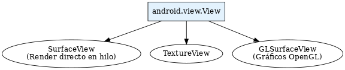

5. **Decor y ventanas**:  
   - `ViewRootImpl` (interno, conecta las vistas con el `WindowManager`).  
   - `DecorView` (la vista raíz de una Activity).

   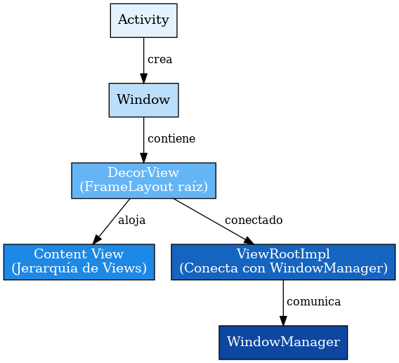


6. **Resources y nomenclatura**:

Además de las clases en `android.view`, la construcción de interfaces en Android se complementa con los **resources**:

- **`res/layout/`** → Archivos XML de vistas y layouts.  
- **`res/values/`** → Colores (`colors.xml`), strings (`strings.xml`), dimensiones (`dimens.xml`).  
- **`res/drawable/`** → Imágenes, formas vectoriales, selectores de estado.  
- **`res/mipmap/`** → Íconos de aplicación.  

### Nomenclatura recomendada
- **Layouts**: `activity_main.xml`, `fragment_login.xml`, `item_user.xml`.  
- **IDs de vistas**: prefijo según tipo (`btnLogin`, `txtName`, `imgAvatar`) (camelCase no SnakCase).  
- **Dimensiones**: usar `dp` (densidad independiente) para tamaños, `sp` (scaled pixels) para textos.  
- **Strings**: siempre en `strings.xml` para soporte de localización.

## 1.2 Jerarquía resumida

```text
android.view.View (base)
 ├── android.widget.TextView
 │    ├── EditText
 │    ├── Button
 │    ├── CheckBox
 │    └── Switch
 ├── android.widget.ImageView
 ├── android.widget.ProgressBar
 ├── android.view.ViewGroup (contenedor)
 │    ├── LinearLayout
 │    ├── RelativeLayout
 │    ├── FrameLayout
 │    ├── ConstraintLayout
 │    ├── ScrollView
 │    └── RecyclerView (androidx)
 ├── android.view.SurfaceView
 ├── android.view.TextureView
 └── android.view.GLSurfaceView
```

---

## 1.3 Relación con Compose

En Jetpack Compose:
- **No hay herencia de `View`**.  
- Cada `@Composable` **describe** UI y Compose lo traduce internamente a **nodos de composición**.  
- Aun así, Compose convive con Views mediante:
  - `AndroidView` → insertar un `View` clásico en Compose.  
  - `ComposeView` → insertar Compose en un layout XML clásico.  

Esto significa que si bien Compose reemplaza la jerarquía `View`, sigue existiendo compatibilidad para migraciones graduales.

Compose sigue utilizando el **mismo sistema de resources**, pero con funciones adaptadas al mundo declarativo:

- **Strings**: `stringResource(R.string.app_name)`  
- **Colors**: `colorResource(R.color.purple_200)` o mejor `MaterialTheme.colorScheme.primary`  
- **Dimensiones**: `dimensionResource(R.dimen.padding_small)`  
- **Drawables**: `painterResource(R.drawable.ic_launcher)`  
- **Theming**: se centraliza en `MaterialTheme` (`Typography`, `Shapes`, `ColorScheme`).

Ejemplo en **Compose**:
```kotlin
@Composable
fun Greeting(userName: String) {
    Text(
        text = stringResource(R.string.greeting, userName),
        color = colorResource(R.color.purple_200),
        fontSize = dimensionResource(R.dimen.text_large).value.sp,
        modifier = Modifier.padding(dimensionResource(R.dimen.padding_small))
    )
}
```

---

## 1.4 Tabla comparativa View vs Compose

| Concepto                    | Sistema clásico (XML + View)         | Jetpack Compose                        |
|-----------------------------|--------------------------------------|-----------------------------------------|
| Unidad base                 | `View`                              | Función `@Composable`                   |
| Contenedores                | `ViewGroup` (`LinearLayout`, etc.)  | `Row`, `Column`, `Box`, `ConstraintLayout` |
| Declaración                 | Archivos XML inflados en runtime    | Código declarativo en Kotlin            |
| Ciclo de vida de la UI      | `onCreateView`, `onDestroyView`     | `remember`, efectos (`LaunchedEffect`)  |
| Renderizado                 | Imperativo (inflar + modificar)     | Declarativo (recomposición automática)  |

---

## 1.5 Ejemplo de equivalencia

### XML clásico

```xml
<LinearLayout ... android:orientation="vertical">
    <TextView ... android:text="Hello" />
    <Button ... android:text="Tap" />
</LinearLayout>
```

### Compose

```kotlin
@Composable
fun Sample() {
    Column {
        Text("Hello")
        Button(onClick = { /* ... */ }) { Text("Tap") }
    }
}
```

---

## 2) `remember`, `mutableStateOf` y `State<T>`

**Teoría**
- `mutableStateOf(value)` crea un **estado observable**. Cuando se lee dentro de una función `@Composable` y su valor cambia, **dispara recomposición** de los lectores.
- `remember { ... }` **memoriza** un objeto durante la vida de esa composición (mientras no cambie la *key* ni se descarte el nodo).
- `rememberSaveable { ... }` igual que `remember`, pero **persiste** en configuraciones (rotación, proceso) usando `SavedStateRegistry` siempre que el tipo sea `Parcelable`/`Serializable` o haya un `Saver`.
- `State<T>` es la interfaz de solo lectura; su counterpart mutable es `MutableState<T>`.

**Cuándo usar**
- `remember`: para estado efímero de UI que no debe sobrevivir a recreaciones (ej.: toggles temporales).
- `rememberSaveable`: para estado de UI que **sí** debe sobrevivir (texto de un formulario, tab seleccionada).
- ViewModel/Flow: para estado **de pantalla** que debe sobrevivir a recreaciones y separar UI de lógica.

**Ejemplo 1 – Contador con persistencia**

```kotlin
@Composable
fun Counter() {
    // estado que sobrevive a rotación configurando un saver interno
    var count by rememberSaveable { mutableIntStateOf(0) }

    Column {
        Text("Count: $count")
        Button(onClick = { count++ }) {
            Text("Increment")
        }
    }
}
```

**Ejemplo 2 – Recordar objetos y evitar recrearlos**

```kotlin
@Composable
fun ExpensiveObjectHolder() {
    // evita crear la instancia en cada recomposición
    val cache = remember { HashMap<String, String>() }

    // ...
}
```

---

## 3) Control de recomposición y ciclo de vida

**Qué dispara recomposición**
- Lectura de `State`/`MutableState` cuyos valores cambian.

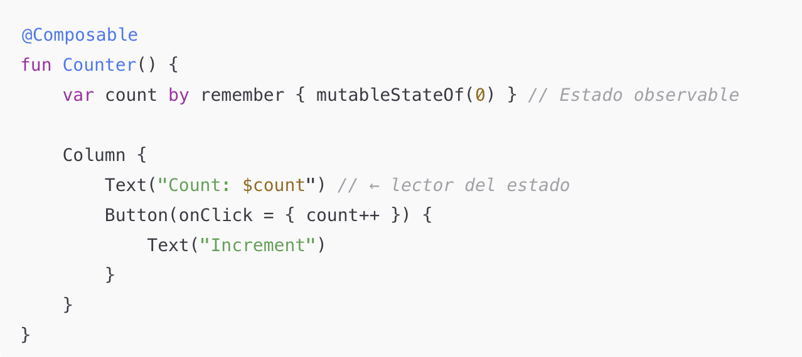
- Cambios en **parámetros** de un composable.

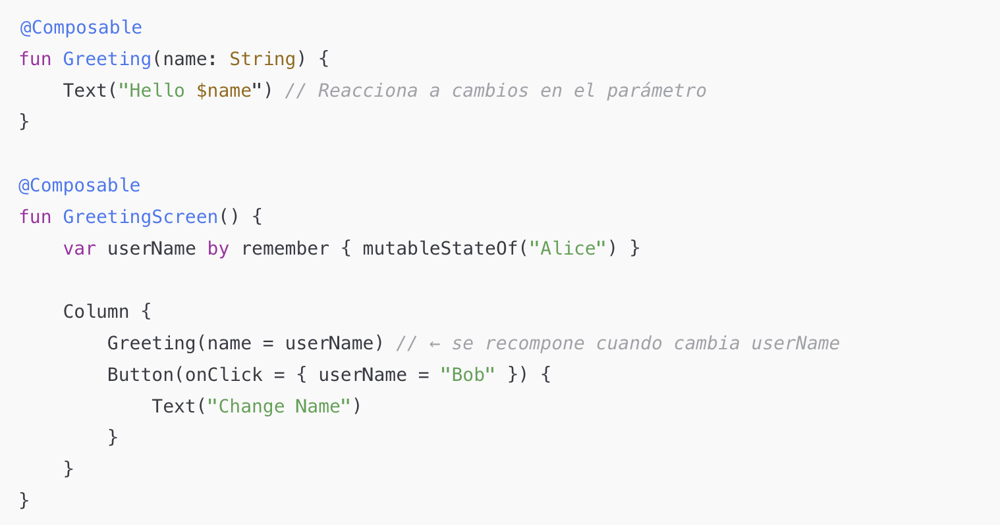
- Cambios en `CompositionLocal` leídos dentro: son contextos implícitos que se propagan en el árbol Compose (ej. tema, idioma, configuración)..

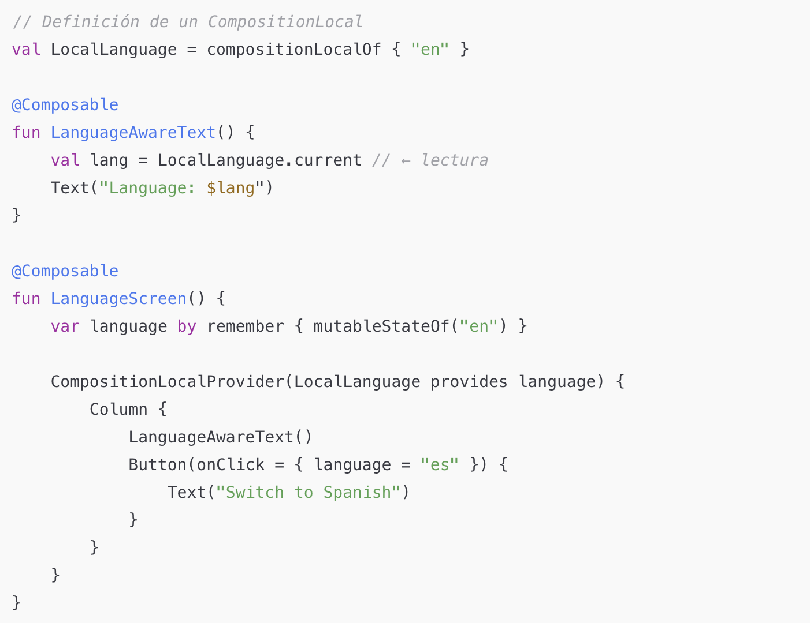
- Cambios en claves de efectos (`LaunchedEffect(key)`).

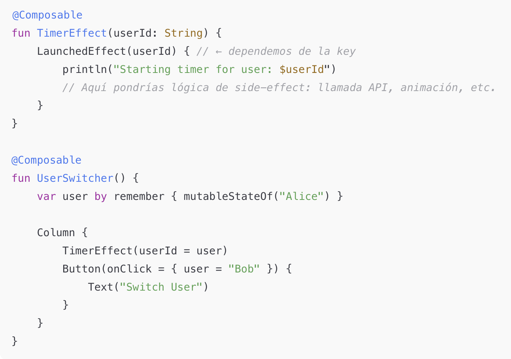

**Buenas prácticas**
- **State hoisting** (elevar estado al padre) para aislar recomposiciones.
- Mantener **parámetros estables** (data classes inmutables; `@Immutable`/`@Stable` si aplica).
- Preferir `mutableIntStateOf`, `mutableLongStateOf`, etc. para primitivos.
- Usar `derivedStateOf` para **memoizar** derivaciones costosas.
- Evitar crear objetos en cada recomposición; envolver con `remember`.

**Ejemplo – Evitar recomputación costosa**

```kotlin
@Composable
fun FilteredList(query: String, items: List<String>) {
    // recalcular solo cuando 'query' o 'items' cambien
    val filtered by remember(query, items) {
        derivedStateOf { items.filter { it.contains(query, ignoreCase = true) } }
    }

    LazyColumn {
        items(filtered.size) { i ->
            Text(filtered[i])
        }
    }
}
```

**Ciclo de vida en Compose**
- No hay `onCreateView`/`onDestroyView`; en su lugar:
  - `LaunchedEffect` para **iniciar** corrutinas ligadas a la composición.
  - `DisposableEffect` para **limpieza** (listeners, receptores).  
  - `rememberUpdatedState` para capturar callbacks/valores 
  **actualizados** dentro de corutinas/efectos.
  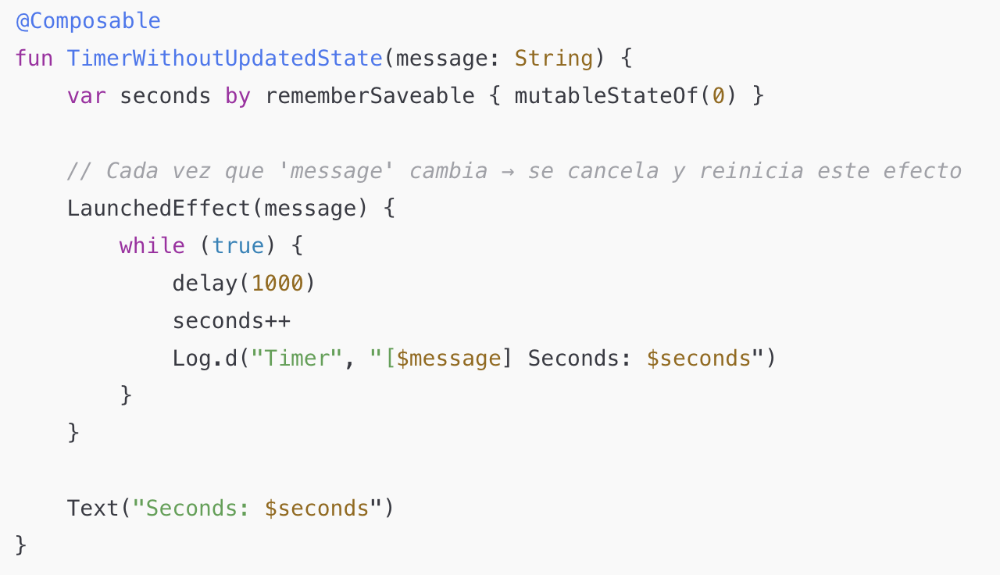
  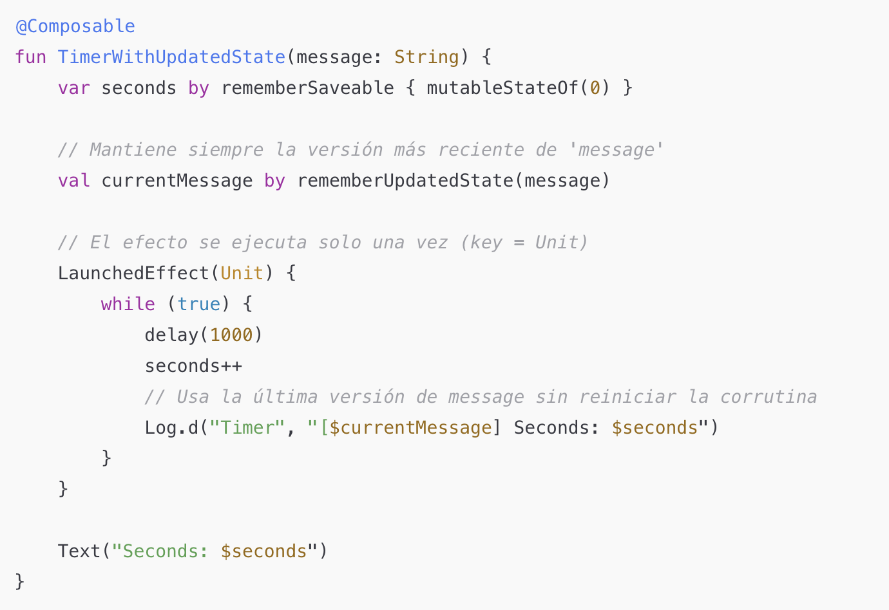

Ejemplo (limpieza con `DisposableEffect`):
```kotlin
@Composable
fun LocationListener(onLocation: (Double, Double) -> Unit) {
    // registrar y desregistrar listener con el ciclo de la composición
    DisposableEffect(Unit) {
        val listener = /* register location listener */
        onDispose {
            /* unregister location listener */
        }
    }
}
```

---

## 4) Comunicación de estados entre componentes

**Patrón: State Hoisting**
- El padre **posee** el estado.
- El hijo **recibe** el valor y un callback `onValueChange`.
- Beneficio: el hijo es **puro** (sin estado interno), fácil de testear y reutilizar.

**Ejemplo – Campo de búsqueda hoisted**

```kotlin
@Composable
fun SearchScreen() {
    // estado en el padre
    var query by rememberSaveable { mutableStateOf("") }

    Column {
        SearchField(
            value = query,
            onValueChange = { query = it }
        )
        SearchResults(query = query)
    }
}

@Composable
fun SearchField(value: String, onValueChange: (String) -> Unit) {
    // composable controlado
    TextField(
        value = value,
        onValueChange = onValueChange,
        label = { Text("Search") }
    )
}

@Composable
fun SearchResults(query: String) {
    val items = listOf("Kotlin", "Compose", "Coroutines", "Flow")
    val filtered by remember(query) {
        derivedStateOf { items.filter { it.contains(query, ignoreCase = true) } }
    }
    LazyColumn { items(filtered.size) { Text(filtered[it]) } }
}
```

**ViewModel + StateFlow (pantallas reales)**

```kotlin
// ViewModel expone StateFlow para estado de UI
data class UiState(val query: String = "", val results: List<String> = emptyList())

class SearchViewModel : ViewModel() {
    private val _state = MutableStateFlow(UiState())
    val state: StateFlow<UiState> = _state.asStateFlow()

    fun onQueryChange(newQuery: String) {
        _state.update { it.copy(query = newQuery, results = filter(newQuery)) }
    }

    private fun filter(q: String) = listOf("Kotlin","Compose","Flow").filter {
        it.contains(q, ignoreCase = true)
    }
}

@Composable
fun SearchScreen(vm: SearchViewModel = androidx.lifecycle.viewmodel.compose.viewModel()) {
    // usar collectAsStateWithLifecycle si está disponible en el proyecto
    val ui by vm.state.collectAsState()

    Column {
        SearchField(
            value = ui.query,
            onValueChange = vm::onQueryChange
        )
        LazyColumn { items(ui.results.size) { Text(ui.results[it]) } }
    }
}
```

---

## 5) Efectos: `LaunchedEffect`, `SideEffect`, `derivedStateOf`

### 5.1 `LaunchedEffect`
- Ejecuta una **corutina** cuando la clave cambia o en la **primera** composición.
- Cancelación automática si la clave cambia o el composable sale del árbol.

```kotlin
@Composable
fun UserProfileScreen(userId: String, repo: UserRepository) {
    var user by remember { mutableStateOf<User?>(null) }
    var error by remember { mutableStateOf<String?>(null) }

    // se ejecuta al montar y cada vez que cambie userId
    LaunchedEffect(userId) {
        runCatching { repo.fetchUser(userId) }
            .onSuccess { user = it }
            .onFailure { error = it.message }
    }

    when {
        error != null -> Text("Error: $error")
        user == null -> Text("Loading...")
        else -> Text("Hello, ${user!!.name}")
    }
}
```

### 5.2 `SideEffect`
- Corre **después** de que la composición se aplica (commit), en **cada recomposición**.
- Útil para sincronizar con APIs no–Compose (analytics, logs, System UI).

```kotlin
@Composable
fun AnalyticsScreen(screenName: String, analytics: Analytics) {
    // reporta después del commit; se ejecutará si cambia la recomposición
    SideEffect {
        analytics.logScreen(screenName)
    }
    Text("Screen: $screenName")
}
```

Para evitar “stale captures” dentro de efectos/corutinas, usa `rememberUpdatedState`:

```kotlin
@Composable
fun Reporter(screenName: String, analytics: Analytics) {
    val currentName by rememberUpdatedState(screenName)

    LaunchedEffect(Unit) {
        // siempre usa el valor más reciente
        analytics.logScreen(currentName)
    }
}
```

### 5.3 `derivedStateOf`
- Deriva un valor **memoizado**(recordar (cachear) un resultado ya calculado para no volver a calcularlo mientras sus entradas no cambien.) a partir de otros estados.  
- Evita cómputos caros en cada recomposición, recalculando solo cuando cambian sus dependencias.
- Tienes un valor derivado de uno o más estados, que puede ser costoso de calcular (ej: filtrado, suma, conteo, formateo).
- Ese cálculo no debería ejecutarse en cada recomposición, sino solo cuando cambien las dependencias.

```kotlin
@Composable
fun PriceSummary(items: List<Int>) {
    val total by remember(items) {
        derivedStateOf { items.sum() } // recalcula solo si 'items' cambia
    }
    Text("Total: $total")
}
```

---

## 6) Errores comunes y checklist

**Errores frecuentes**
- Crear objetos en cada recomposición sin `remember`.
- Guardar estado que debe sobrevivir rotación con `remember` en lugar de `rememberSaveable`.
- Efectos con claves incorrectas → se relanzan en bucle.
- `SideEffect` usado para trabajo pesado (use `LaunchedEffect`).
- Falta de **state hoisting** → hijos con estados internos difíciles de controlar.
- Recalcular listas/formatos en cada recomposición sin `derivedStateOf`.

**Checklist rápido**
- ¿El estado vive en el **nivel correcto** (UI efímero vs pantalla vs dominio)?
- ¿Uso `remember`/`rememberSaveable` donde corresponde?
- ¿Mis derivaciones costosas usan `derivedStateOf`?
- ¿Los efectos tienen **claves** correctas?
- ¿Los hijos reciben `value` + `onValueChange`?
- ¿Mis modelos de UI son **inmutables** y estables?

---

## Ejercicios propuestos (para casa)

1) Reescribir una pantalla XML sencilla (Text + Button + RecyclerView) en Compose con `Column` + `LazyColumn`.  
2) Implementar un buscador con `SearchField` hoisted y `derivedStateOf` para la lista filtrada.  
3) Agregar `LaunchedEffect(userId)` que cargue datos del usuario y manejar error/loader.  
4) Instrumentar `SideEffect` para reportar el nombre de pantalla.  
5) Añadir `rememberSaveable` al estado del texto para que sobreviva rotación.

---

## Recursos recomendados (internos del curso)
- Plantilla base de Compose del módulo.  
- Snippets de `State`, `derivedStateOf`, `LaunchedEffect`, `DisposableEffect`.  
- Ejemplo de ViewModel + StateFlow con `collectAsState(…)`.
