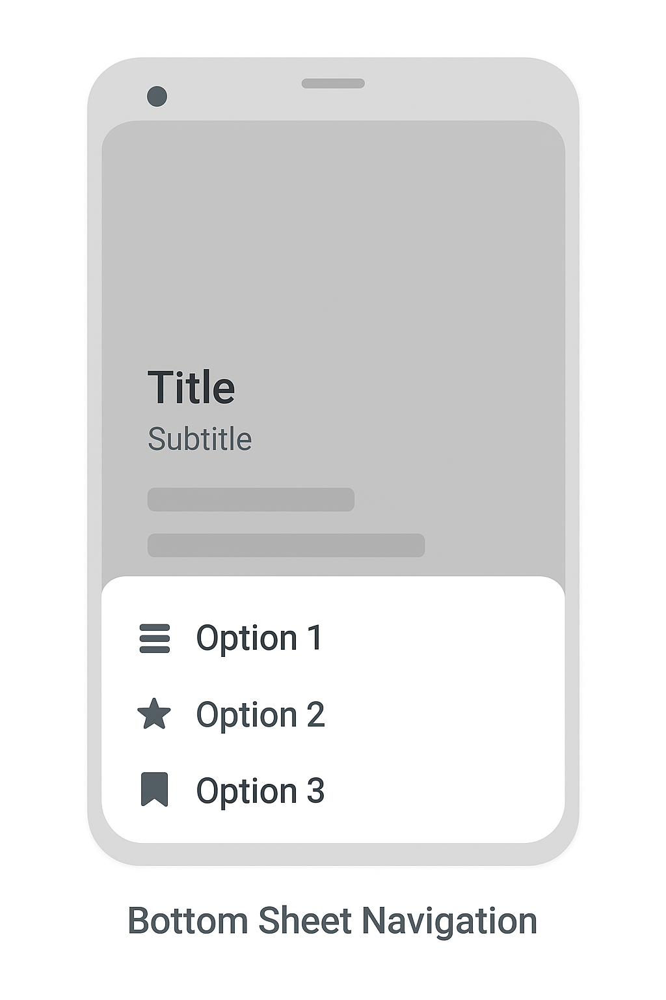
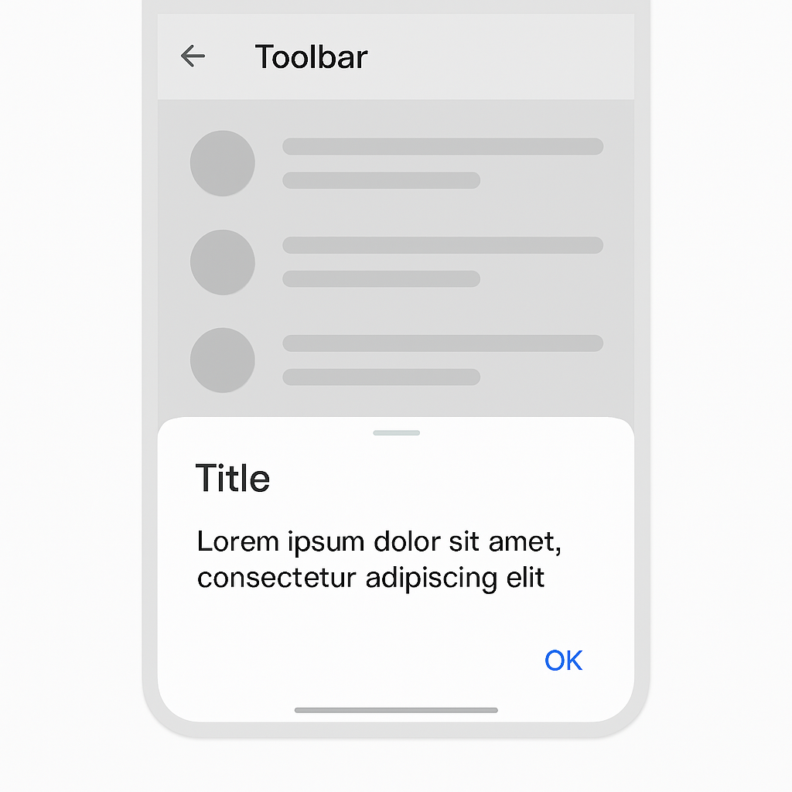

# Patrones de diseño en Android

## 1. Navegación

-   **Toolbar / AppBar**: Cabecera superior con título, acciones y
    navegación.
    
-   **BottomNavigation**: Barra inferior para moverse entre secciones
    principales.
    
-   **Drawer Navigation**: Menú lateral deslizable con accesos a
    secciones secundarias.
    
-   **Navigation Rail**: Variante de navegación vertical en pantallas
    grandes (tablets, foldables).
    
-   **BottomSheet Navigation**: Navegación o acciones emergentes desde
    la parte inferior.
    
-   **Stepper / Wizard**: Flujo paso a paso (ej. onboarding o
    formularios largos).
    

## 2. Estructura de Pantallas

-   **Single Activity + Fragments/Compose**: Toda la app en una sola
    actividad, pantallas gestionadas por navegación.
    
-   **Master-Detail (Responsive)**: Lista + detalle en tablet, solo
    lista o detalle en mobile.
    
-   **Tabs (Top Tabs / ViewPager2 + TabLayout)**: Cambio de vistas
    mediante pestañas.
    
-   **Dashboard / Grid**: Pantallas principales con accesos rápidos en
    cuadrícula o tarjetas.
    
-   **Full Screen / Immersive**: Pantallas completas (ej. video, mapas,
    juegos).
    

## 3. Componentes Interactivos

-   **Dialogs**: Confirmaciones, alertas o formularios.
    
-   **BottomSheet (Modal / Persistent)**: Contenido flotante inferior,
    fijo o modal.
    
-   **Snackbars**: Mensajes breves en la parte inferior.
    
-   **Chips**: Selección rápida o categorización.
    
-   **Cards**: Presentación de información en bloques visuales.
    
-   **FAB (Floating Action Button)**: Acción principal destacada.
    

## 4. Patrones de Lista y Contenido

-   **List / RecyclerView**: Listas simples o complejas.
-   **Sectioned List**: Listas agrupadas por categorías.
-   **Infinite Scroll / Pagination**: Carga progresiva de elementos.
-   **Swipe to Refresh**: Refrescar contenido con gesto hacia abajo.
-   **Swipe Actions**: Acciones rápidas en items (eliminar, archivar).
-   **Staggered Grid**: Tarjetas de tamaño variable (ej. Pinterest).

## 5. Arquitectura y Organización

-   **MVC (Model-View-Controller)**: Clásico, hoy poco usado en Android
    moderno.
-   **MVP (Model-View-Presenter)**: Separación entre lógica y vista, con
    presenter.
-   **MVVM (Model-View-ViewModel)**: Estándar en Android actual con
    LiveData/StateFlow.
-   **MVI (Model-View-Intent)**: Flujo unidireccional de eventos y
    estados.
-   **Clean Architecture (UseCases + Layers)**: Separación en capas de
    dominio, datos y presentación.
-   **Repository Pattern**: Abstracción de acceso a datos (DB, API,
    cache).

## 6. Carga y Estado

-   **Skeleton Screens**: Placeholder simulando contenido mientras
    carga.
-   **Shimmer Effect**: Animación que indica carga en progreso.
-   **Empty State**: Pantalla con mensaje cuando no hay datos.
-   **Error State**: Manejo visual de errores (ej. desconexión, API
    fallida).
-   **Loading Overlay / Spinner**: Indicador central de carga.

## 7. Comunicación y Eventos

-   **Observer Pattern**: LiveData, Flow, StateFlow para observar
    cambios.
-   **Event Bus / SharedFlow**: Comunicación desacoplada entre
    componentes.
-   **Unidirectional Data Flow (UDF)**: Datos fluyen en una sola
    dirección (muy usado con Compose).

## 8. Persistencia y Data

-   **DAO (Data Access Object)**: Patrón con Room/SQL para acceso a DB.
-   **Singleton**: Instancia única para servicios (ej. Retrofit, Room).
-   **Cache Pattern**: Guardar en memoria/DB para evitar llamadas
    innecesarias.
