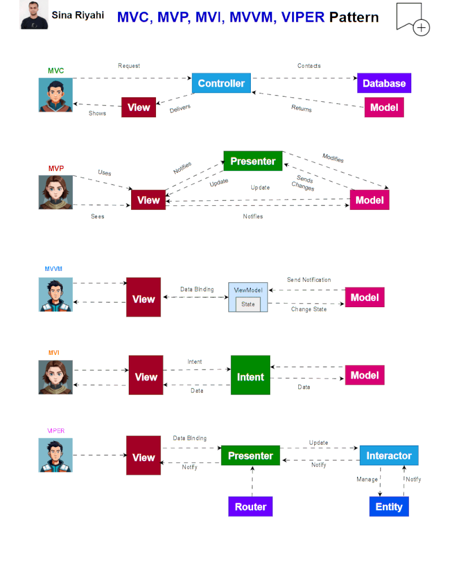

# Módulo 2 · Sesión 1 — Arquitecturas MVC, MVP, MVVM y Patrones de Diseño

> Programa: Especialización en Desarrollo Móvil — Android/Kotlin
> Módulo 02 · Sesión 01

---

## Objetivos de aprendizaje

Al finalizar esta sesión, el estudiante será capaz de:

1. Reconocer los **patrones de diseño de software (GoF)** que sostienen a MVC, MVP y MVVM.
2. Comparar **MVC, MVP y MVVM**: quién conoce a quién, cómo viaja la información y qué problema resuelve cada evolución.
3. Implementar un **ViewModel** que gestione la lógica de negocio separada de la UI.
4. Exponer y observar estados usando **StateFlow** en Jetpack Compose, y contrastarlo con **State** y **LiveData**.
5. Entender el **ciclo de vida del ViewModel**, incluyendo su límite real: la muerte de proceso y `SavedStateHandle`.
6. Ver las tres arquitecturas y los cuatro conceptos anteriores **funcionando contra el mismo endpoint real** en el proyecto `Example/`.

---

## Menú de la clase

Esta sesión está repartida en cuatro documentos que se leen en este orden. Cada uno responde una pregunta distinta y se apoya en el anterior:

| #   | Documento                                                                                       | Responde a...                                                                                          | ~Tiempo |
| --- | ----------------------------------------------------------------------------------------------- | ------------------------------------------------------------------------------------------------------ | ------- |
| 0   | Este README (§0)                                                                                | ¿Cómo se ve hoy el ecosistema Android? ¿Cómo corro el proyecto `Example`?                              | 10 min  |
| 1   | **[patrones-diseno-arquitecturas.md](./patrones-diseno-arquitecturas.md)**                      | ¿Qué patrones de diseño (creacionales, estructurales, de comportamiento) usan MVC/MVP/MVVM por debajo? | 20 min  |
| 2   | Este README (§2) + **[comparacion-arquitecturas.md](./comparacion-arquitecturas.md)**           | ¿En qué se diferencian de verdad MVC, MVP y MVVM? ¿Quién conoce a quién?                               | 25 min  |
| 3   | Este README (§3-5) + **[viewmodel-flow-state-livedata.md](./viewmodel-flow-state-livedata.md)** | ¿Cómo se implementa MVVM con `ViewModel`, `State`, `Flow` y `LiveData`?                                | 30 min  |
| 4   | Este README (§6)                                                                                | ¿Cómo se ve todo esto junto, funcionando contra un endpoint real?                                      | 20 min  |

> 💡 Los documentos 1 y 3 son **profundizaciones**: puedes leer primero este README de punta a punta (referencia rápida) y entrar a cada uno cuando quieras el detalle completo con más ejemplos.

---

## 0. Panorama de Android hoy y cómo correr `Example/`

**MVVM es el patrón recomendado por Google para apps nuevas con Compose**, y por eso es el foco de esta sesión. Dos ideas del ecosistema actual conviene tenerlas presentes desde ya:

- **MVI/UDF (Unidirectional Data Flow)** es la evolución natural de MVVM en apps grandes: en vez de exponer varios eventos/flows sueltos, el ViewModel expone **un solo `UiState` inmutable** y recibe **`UiEvent`/`Intent`** tipados desde la View. `ProductListUiState` (sección 3) ya es, sin saberlo, un `UiState` al estilo MVI — es la puerta de entrada natural a ese patrón, que se cubrirá en una clase futura. No se implementa aquí para no mezclar demasiados conceptos nuevos.
- **`collectAsStateWithLifecycle()`** (visto en el Módulo 01 · Sesión 03) es el estándar para recolectar `Flow`/`StateFlow` de un ViewModel en Compose, en vez de `collectAsState()`. El proyecto `Example/` de esta clase lo usa en las secciones 3 y 6.

**Cómo correr el proyecto:**

1. Abre `Example/` en Android Studio y espera el sync de Gradle.
2. Ejecuta la app: arranca en `MainMenuActivity`, un menú con tres botones (MVC, MVP, MVVM) que abren el **mismo listado de productos**, consumiendo `GET https://fakestoreapi.com/products` (necesitas conexión a internet; revisa el permiso `INTERNET` en `AndroidManifest.xml`).
3. Abre Logcat con el filtro `ProductRepository` para ver cada llamada de red (la agrega `LoggingProductRepository`, sección 6).

---

## 1. Fundamentos: patrones de diseño de software

MVC, MVP y MVVM **no son magia**: son combinaciones de patrones de diseño clásicos (GoF) aplicados a la separación UI/lógica/datos. Antes de comparar las tres arquitecturas conviene reconocer esas piezas sueltas:

- **Creacionales** → cómo se crean los objetos (`Singleton`, `Factory Method`, `Builder`).
- **Estructurales** → cómo se componen (`Adapter`, `Facade`, `Decorator`, `Proxy`, `Bridge`, `Composite`).
- **De comportamiento** → cómo se comunican (`Observer`, `State`, `Command`, `Mediator`, `Strategy`, `Template Method`, `Memento`).

> 📘 **Ver documento completo:** [patrones-diseno-arquitecturas.md](./patrones-diseno-arquitecturas.md) — cada patrón con su definición, un ejemplo genérico y el archivo real de `Example/` donde ya está implementado (por ejemplo: `RetrofitProvider` es un **Singleton**, `ProductMapper` es un **Adapter**, `LoggingProductRepository` es un **Decorator**).

---

## 2. De MVC a MVP a MVVM

### 2.1 MVC (Model-View-Controller)

- **Controller** → coordina el _Model_ (repositorio) y produce un **estado** para la _View_.
- **View** → observa el estado del Controller; no conoce al repositorio.
- El **Controller no conoce a la View** (no hay callbacks): es un `Facade` sobre el Modelo.

### 2.2 MVP (Model-View-Presenter)

- **Presenter** → conoce a la _View_ mediante un **contrato** (`interface View`) y le empuja resultados (`showLoading`, `showProducts`, `showError`).
- La _View_ no tiene lógica, solo renderiza lo que el Presenter le dice.
- Acoplamiento explícito **Presenter → View**, con gestión manual de `attach()`/`detach()`.

### 2.3 MVVM (Model-View-ViewModel)

- **ViewModel** → no conoce a la _View_; expone un **UI State inmutable** vía `StateFlow`.
- Usa `viewModelScope` (lifecycle-aware): no hay que cancelar nada a mano.
- Es el patrón **recomendado hoy** por Google para apps con Compose.

```
[View] ---> [ViewModel] ---> [Model]
   ^             |               |
   |             v               |
   | <------ estados ------------|
```



### 2.4 ¿Por qué las tres parecen "observar mutables"?

El **mecanismo de entrega** (Flow, callbacks) no define el patrón. Lo que lo define es **quién conoce a quién**:

| Aspecto                  | MVC                       | MVP                                  | MVVM                          |
| ------------------------ | ------------------------- | ------------------------------------ | ----------------------------- |
| ¿Quién conoce a la View? | Nadie                     | **Presenter conoce View** (contrato) | Nadie                         |
| Entrega de resultados    | Estado observado          | Callbacks (`showX(...)`)             | Estado observado              |
| Ciclo de vida            | Manual (`CoroutineScope`) | Manual (`attach/detach`)             | Automático (`viewModelScope`) |
| Fit con Compose          | Correcto, artesanal       | Correcto, con boilerplate            | **Ideal y recomendado**       |

> 📘 **Ver comparación completa:** [comparacion-arquitecturas.md](./comparacion-arquitecturas.md) — tabla ampliada, ventajas/cautelas de cada una y qué patrón de diseño usa cada capa.

> 🔗 **Revisar demo (mismo endpoint, tres arquitecturas):**
> [`ProductController.kt`](./Example/app/src/main/java/com/example/example/features/mvc/ProductController.kt) + [`ProductListScreenMVC.kt`](./Example/app/src/main/java/com/example/example/features/mvc/ProductListScreenMVC.kt) (MVC) ·
> [`ProductListContract.kt`](./Example/app/src/main/java/com/example/example/features/mvp/ProductListContract.kt) + [`ProductListPresenter.kt`](./Example/app/src/main/java/com/example/example/features/mvp/ProductListPresenter.kt) (MVP) ·
> [`ProductListViewModel.kt`](./Example/app/src/main/java/com/example/example/features/mvvm/ProductListViewModel.kt) (MVVM, ver sección 3-5)

---

## 3. Implementando MVVM: ViewModel + StateFlow

Sintaxis mínima del patrón (sin red, para ver solo la forma):

```kotlin
// ViewModel
class CounterViewModel : ViewModel() {
    private val _count = MutableStateFlow(0) // flujo interno
    val count: StateFlow<Int> = _count       // flujo expuesto (solo lectura)

    fun increment() {
        _count.value += 1
    }
}
```

```kotlin
// UI con Compose
@Composable
fun CounterScreen(viewModel: CounterViewModel = viewModel()) {
    val count by viewModel.count.collectAsStateWithLifecycle()

    Column(horizontalAlignment = Alignment.CenterHorizontally) {
        Text("Contador: $count")
        Button(onClick = { viewModel.increment() }) { Text("Incrementar") }
    }
}
```

Ahora la misma forma, pero con un **caso real**: cargar productos desde un endpoint HTTP.

```kotlin
// ProductListViewModel.kt (recortado)
class ProductListViewModel(
    private val repository: ProductRepository = LoggingProductRepository(ProductRemoteRepository())
) : ViewModel() {

    private val _ui = MutableStateFlow(ProductListUiState(loading = true))
    val ui: StateFlow<ProductListUiState> = _ui

    fun load() {
        _ui.value = ProductListUiState(loading = true)
        viewModelScope.launch {
            runCatching { repository.fetchProducts() }
                .onSuccess { _ui.value = ProductListUiState(data = it) }
                .onFailure { _ui.value = ProductListUiState(error = it.message ?: "Unknown error") }
        }
    }
}
```

`repository` es una `ProductRepository` (interfaz, sección 6), no una clase concreta: el ViewModel no sabe si los productos vienen de una API real, de una caché o de datos falsos — esa es la razón de que MVVM se lleve bien con tests (puedes inyectar un fake).

> 🔗 **Revisar demo:** [`ProductListViewModel.kt`](./Example/app/src/main/java/com/example/example/features/mvvm/ProductListViewModel.kt) · [`ProductListUiState.kt`](./Example/app/src/main/java/com/example/example/features/mvvm/ProductListUiState.kt) · [`ProductListScreenMVVM.kt`](./Example/app/src/main/java/com/example/example/features/mvvm/ProductListScreenMVVM.kt)

---

## 4. Estados reactivos en profundidad: ViewModel, State, Flow y LiveData

Cuatro piezas que se confunden fácil porque todas "notifican cambios", pero resuelven problemas distintos:

| Concepto                 | Origen            | Uso principal                                                                                       |
| ------------------------ | ----------------- | --------------------------------------------------------------------------------------------------- |
| `ViewModel`              | Jetpack Lifecycle | Contener y sobrevivir la lógica de UI a cambios de configuración                                    |
| `State`/`mutableStateOf` | Jetpack Compose   | Estado **local y efímero** de una pantalla (dispara recomposición)                                  |
| `Flow`/`StateFlow`       | Kotlin Coroutines | Flujo asíncrono de datos, expuesto por el ViewModel                                                 |
| `LiveData`               | Jetpack Lifecycle | Contenedor observable ligado al ciclo de vida (legacy, pero aún se encuentra en apps de producción) |

### LiveData vs Flow/StateFlow

| Característica       | LiveData                                         | Flow / StateFlow                              |
| -------------------- | ------------------------------------------------ | --------------------------------------------- |
| Ciclo de vida        | Integrado (lifecycle-aware)                      | Se maneja con `collectAsStateWithLifecycle()` |
| Cancelación          | Automática                                       | Manual, atada a `viewModelScope`              |
| Integración Compose  | `observeAsState()` (necesita `runtime-livedata`) | Nativa (`collectAsStateWithLifecycle`)        |
| Recomendación actual | Mantenimiento de apps legacy                     | Nuevos proyectos con Compose                  |

> 📘 **Ver documento completo:** [viewmodel-flow-state-livedata.md](./viewmodel-flow-state-livedata.md) — cada concepto con su propio ejemplo mínimo.

**Las cuatro piezas conviven en el mismo `ProductListViewModel`/`ProductListScreenMVVM`, para poder compararlas en vivo:**

```kotlin
// ProductListScreenMVVM.kt (recortado)
val ui by vm.ui.collectAsStateWithLifecycle()        // Flow -> StateFlow
val lastUpdatedAt by vm.lastUpdatedAt.observeAsState() // LiveData
var onlyInStock by remember { mutableStateOf(false) }  // State local, NO vive en el ViewModel
```

| Pieza                               | Dónde vive | Por qué                                                                                                                                |
| ----------------------------------- | ---------- | -------------------------------------------------------------------------------------------------------------------------------------- |
| `ui: StateFlow<ProductListUiState>` | ViewModel  | Es el resultado de la llamada de red: debe sobrevivir a recomposiciones y rotación.                                                    |
| `lastUpdatedAt: LiveData<Long?>`    | ViewModel  | Mismo dato de negocio, expuesto también como `LiveData` solo para comparar ambas formas de observar.                                   |
| `onlyInStock` (`State`)             | Composable | Es un filtro puramente visual; si viviera en el ViewModel, sobrecargaríamos el "modelo de UI" con algo que no es una regla de negocio. |

> 🔗 **Revisar demo:** [`ProductListViewModel.kt`](./Example/app/src/main/java/com/example/example/features/mvvm/ProductListViewModel.kt) · [`ProductListScreenMVVM.kt`](./Example/app/src/main/java/com/example/example/features/mvvm/ProductListScreenMVVM.kt)

---

## 5. Ciclo de vida del ViewModel

- Vive mientras viva la Activity/Fragment (o el `NavBackStackEntry`, si se usa Navigation).
- Se destruye cuando esa entrada se elimina definitivamente, no en cada rotación.
- **Ideal para conservar estado en cambios de configuración**, pero tiene un límite: **no sobrevive a que el sistema mate el proceso** en background por falta de memoria.

```kotlin
class SampleViewModel : ViewModel() {
    init {
        Log.d("VM", "ViewModel creado")
    }

    override fun onCleared() {
        super.onCleared()
        Log.d("VM", "ViewModel destruido")
    }
}
```

Para sobrevivir también a la muerte de proceso, el dato debe pasar por `SavedStateHandle` — es la aplicación del patrón **Memento** (ver [patrones-diseno-arquitecturas.md](./patrones-diseno-arquitecturas.md)):

```kotlin
// ProductListViewModel.kt (recortado)
val retryCount: StateFlow<Int> = savedStateHandle.getStateFlow(KEY_RETRY_COUNT, 0)

fun retry() {
    savedStateHandle[KEY_RETRY_COUNT] = (savedStateHandle.get<Int>(KEY_RETRY_COUNT) ?: 0) + 1
    load()
}
```

El botón "Reintentar" de la demo MVVM (visible cuando falla la llamada al endpoint) incrementa este contador; si Android mata el proceso y lo restaura, el contador **no se pierde** — algo que un `remember`/`rememberSaveable` a secas no garantiza.

> 🔗 **Revisar demo:** [`ProductListViewModel.kt`](./Example/app/src/main/java/com/example/example/features/mvvm/ProductListViewModel.kt) (bloque `companion object` con la `Factory` que crea el `SavedStateHandle` sin reflexión).

---

## 6. Proyecto `Example`: todo junto contra un endpoint real

Las tres arquitecturas de esta clase consumen el mismo endpoint público, sin autenticación: `GET https://fakestoreapi.com/products`. Así se puede comparar MVC vs MVP vs MVVM **con el mismo caso de uso real**, no con pseudocódigo.

### 6.1 Arquitectura de datos

```
ProductApiService (Retrofit)  →  ProductDto/RatingDto  →  ProductMapper.toDomain()  →  Product
        (remote/)                    (remote/dto/)             (Adapter)             (common/model/)
                                                                    ↓
                                            ProductRepository (interfaz, común a MVC/MVP/MVVM)
                                             ↙                                    ↘
                              ProductRemoteRepository                    FakeProductRepository
                              (real, vía RetrofitProvider)               (en memoria, offline/tests)
                                             ↘                                    ↙
                                         LoggingProductRepository (Decorator, opcional)
```

`ProductController`, `ProductListPresenter` y `ProductListViewModel` reciben un `ProductRepository` **por interfaz**, no una clase concreta — por defecto `LoggingProductRepository(ProductRemoteRepository())` (endpoint real + logging), pero en un test se les puede pasar un `FakeProductRepository()` sin tocar una sola línea de la capa de presentación (Dependency Inversion).

### 6.2 Mapa: sección → concepto → archivo → patrón

| Sección | Concepto                             | Archivo(s) en `Example/`                                                                                                                                                                                                                                                                                             | Patrón de diseño                                                            |
| ------- | ------------------------------------ | -------------------------------------------------------------------------------------------------------------------------------------------------------------------------------------------------------------------------------------------------------------------------------------------------------------------- | --------------------------------------------------------------------------- |
| §1      | Fundamentos GoF                      | Todo el proyecto                                                                                                                                                                                                                                                                                                     | ver [patrones-diseno-arquitecturas.md](./patrones-diseno-arquitecturas.md)  |
| §2      | MVC                                  | [`ProductController.kt`](./Example/app/src/main/java/com/example/example/features/mvc/ProductController.kt), [`ProductListScreenMVC.kt`](./Example/app/src/main/java/com/example/example/features/mvc/ProductListScreenMVC.kt)                                                                                       | Facade, Observer, State                                                     |
| §2      | MVP                                  | [`ProductListContract.kt`](./Example/app/src/main/java/com/example/example/features/mvp/ProductListContract.kt), [`ProductListPresenter.kt`](./Example/app/src/main/java/com/example/example/features/mvp/ProductListPresenter.kt)                                                                                   | Mediator/Proxy, Template Method                                             |
| §3-5    | MVVM + ViewModel/State/Flow/LiveData | [`ProductListViewModel.kt`](./Example/app/src/main/java/com/example/example/features/mvvm/ProductListViewModel.kt), [`ProductListScreenMVVM.kt`](./Example/app/src/main/java/com/example/example/features/mvvm/ProductListScreenMVVM.kt)                                                                             | Observer, State, Memento (`SavedStateHandle`), Command (`load()`/`retry()`) |
| §6      | Modelo / endpoint real               | [`ProductRepository.kt`](./Example/app/src/main/java/com/example/example/common/data/ProductRepository.kt), [`ProductRemoteRepository.kt`](./Example/app/src/main/java/com/example/example/common/data/ProductRemoteRepository.kt), [`remote/`](./Example/app/src/main/java/com/example/example/common/data/remote/) | Strategy/DIP, Singleton (`RetrofitProvider`), Adapter (`ProductMapper`)     |
| §6      | Logging transversal                  | [`LoggingProductRepository.kt`](./Example/app/src/main/java/com/example/example/common/data/LoggingProductRepository.kt)                                                                                                                                                                                             | Decorator                                                                   |
| §6      | Punto de entrada / menú              | [`MainMenuActivity.kt`](./Example/app/src/main/java/com/example/example/MainMenuActivity.kt)                                                                                                                                                                                                                         | —                                                                           |

### 6.3 Qué observar al ejecutar

1. Abre `MainMenuActivity` → entra a cada demo (MVC, MVP, MVVM) y compara el código, no solo la UI: son idénticas a simple vista.
2. En **MVVM**, activa "Solo en stock" (State local) y observa la hora de "Actualizado" (LiveData) mientras el `StateFlow` sigue el ciclo Loading → Success.
3. Apaga el internet del dispositivo/emulador y pulsa "Reintentar": verás el contador de reintentos (`SavedStateHandle`) subir y, en Logcat (filtro `ProductRepository`), el error real reportado por `LoggingProductRepository`.

---

## Resumen de la sesión

- MVC, MVP y MVVM son combinaciones de **patrones de diseño clásicos**, no fórmulas mágicas ([patrones-diseno-arquitecturas.md](./patrones-diseno-arquitecturas.md)).
- Lo que diferencia a las tres arquitecturas es **quién conoce a quién**, no el mecanismo de entrega de datos ([comparacion-arquitecturas.md](./comparacion-arquitecturas.md)).
- **MVVM** sigue siendo el patrón recomendado hoy: separa `Model`, `View` y `ViewModel`, y `ViewModel` expone estado con `StateFlow` (moderno) o `LiveData` (legacy) ([viewmodel-flow-state-livedata.md](./viewmodel-flow-state-livedata.md)).
- `State` es local a la UI; `StateFlow`/`LiveData` viven en el ViewModel; `SavedStateHandle` es lo único que sobrevive a la muerte de proceso.
- Todo lo anterior corre, en el proyecto `Example/`, contra un **endpoint real** (`fakestoreapi.com`), no contra datos inventados.

---

## Ejercicios propuestos

1. Agrega un cuarto botón en `MainMenuActivity` para una arquitectura **MVI** minimalista (un solo `UiState` + una función `onIntent(intent: ProductListIntent)`), reutilizando `ProductRemoteRepository`.
2. Cambia `ProductRemoteRepository` por `FakeProductRepository` en `ProductListViewModel` y comprueba que ninguna otra clase necesita cambios (Dependency Inversion en acción).
3. Agrega un segundo `Decorator` (por ejemplo `CachingProductRepository`, que devuelva la última lista exitosa si el endpoint falla) y combínalo con `LoggingProductRepository`.
4. En `ProductListScreenMVVM.kt`, agrega un segundo filtro local (`State`) por precio máximo y compáralo en el código con `onlyInStock`: ¿por qué ninguno de los dos vive en el ViewModel?
5. Escribe un test unitario de `ProductListPresenter` usando un `ProductRepository` fake que lance una excepción, y verifica que se llama a `view.showError(...)`.

---

## Quiz de repaso

📍 **[Quiz de la clase](https://forms.gle/LfBQYQVXHkwEeKwe9)** — 10 preguntas de opción múltiple para repasar los cuatro documentos de esta clase.

---

## Recursos recomendados

- [Guide to app architecture](https://developer.android.com/topic/architecture) (Android Developers).
- [State and Jetpack Compose](https://developer.android.com/develop/ui/compose/state).
- [ViewModel overview](https://developer.android.com/topic/libraries/architecture/viewmodel) y [Saved State for ViewModels](https://developer.android.com/topic/libraries/architecture/viewmodel-savedstate).
- [Fake Store API](https://fakestoreapi.com/docs) — endpoint usado en `Example/`.
- [patrones-diseno-arquitecturas.md](./patrones-diseno-arquitecturas.md), [comparacion-arquitecturas.md](./comparacion-arquitecturas.md), [viewmodel-flow-state-livedata.md](./viewmodel-flow-state-livedata.md) — documentos de esta misma clase.
