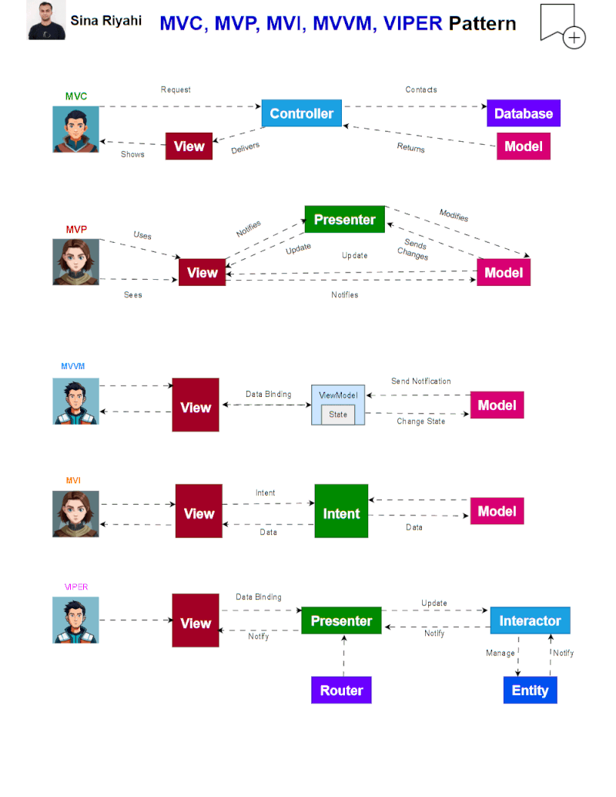

# Módulo 2: Arquitectura y Lógica de Negocio  
## Sesión 1 – MVVM con ViewModel y StateFlow

---

### Objetivos de Aprendizaje
Al finalizar esta sesión, el estudiante será capaz de:
1. Comprender los principios del patrón arquitectónico **MVVM**.  
2. Identificar las diferencias entre MVVM y otros patrones (MVC, MVP).  
3. Implementar un **ViewModel** que gestione la lógica de negocio separada de la UI.  
4. Exponer y observar estados usando **StateFlow** en Jetpack Compose.  
5. Comparar el uso de **LiveData** y **Flow** para la gestión de datos reactivos.  
6. Entender cómo se maneja el **ciclo de vida del ViewModel**.  

---

### 1. Patrón Arquitectónico MVVM

#### ¿Qué es MVVM?
- **MVVM (Model–View–ViewModel)** es un patrón que separa **datos y lógica de negocio** de la **interfaz de usuario**.  
- Es el **estándar recomendado en Android** según las guías de arquitectura de Google.  

#### Componentes de MVVM
1. **Model** → Datos y lógica de negocio (repositorios, DAOs, APIs, casos de uso).  
2. **View** → Interfaz de usuario (pantallas en Compose/XML). Muestra datos y capta interacciones.  
3. **ViewModel** → Actúa como puente, expone datos observables y procesa lógica de presentación.  

#### Flujo en MVVM
```
[View] ---> [ViewModel] ---> [Model]
   ^             |               |
   |             v               |
   | <------ estados ------------|
```

#### Beneficios
- Separación de responsabilidades.  
- Código más mantenible y testeable.  
- Reutilización de lógica.  
- Escalabilidad en proyectos grandes.  

---

### 2. Comparación con otros patrones

| Patrón | Características | Problema | Evolución |
|--------|-----------------|----------|-----------|
| **MVC** | View + Controller + Model | En Android, la Activity terminaba siendo “God Object” (demasiada lógica en la UI). | MVP |
| **MVP** | Presenter reemplaza Controller, la View se vuelve más pasiva | El Presenter crecía demasiado en apps grandes. | MVVM |
| **MVVM** | ViewModel gestiona lógica, expone estados observables | Escalable, compatible con Compose y corrutinas. | Patrón recomendado hoy |



---

### 3. Uso de ViewModel y exposición de estados con StateFlow

Ejemplo práctico:

```kotlin
// ViewModel
class CounterViewModel : ViewModel() {
    private val _count = MutableStateFlow(0) // flujo interno
    val count: StateFlow<Int> = _count       // flujo expuesto

    fun increment() {
        _count.value += 1
    }
}
```

```kotlin
// UI con Compose
@Composable
fun CounterScreen(viewModel: CounterViewModel = viewModel()) {
    val count by viewModel.count.collectAsState()

    Column(horizontalAlignment = Alignment.CenterHorizontally) {
        Text("Contador: $count")
        Button(onClick = { viewModel.increment() }) {
            Text("Incrementar")
        }
    }
}
```

---

### 4. LiveData vs Flow/StateFlow

| Característica      | LiveData                         | Flow / StateFlow                        |
|----------------------|----------------------------------|------------------------------------------|
| Ciclo de vida        | Integrado (lifecycle-aware)      | Se maneja con `collectAsState()` en Compose |
| Cancelación          | Automática                      | Manual con coroutines |
| Paradigma            | Reactivo                        | Reactivo + soporta backpressure |
| Integración Compose  | Indirecta                        | Nativa (`collectAsState`) |
| Recomendación actual | Apps legacy                     | Nuevos proyectos con Compose |

---

### 5. Ciclo de vida del ViewModel

- Vive mientras viva la Activity o el Fragment.  
- Se destruye solo cuando se elimina definitivamente.  
- Ideal para conservar estados en cambios de configuración (rotación).  

Ejemplo de logs:

```kotlin
class SampleViewModel : ViewModel() {
    init {
        Log.d("VM", "ViewModel creado")
    }

    override fun onCleared() {
        super.onCleared()
        Log.d("VM", "ViewModel destruido")
    }
}
```

En Compose:

```kotlin
val vm: SampleViewModel = viewModel()
```

---

### Resumen de la Sesión
- **MVVM** es el patrón arquitectónico recomendado en Android.  
- Separa la app en **Model**, **View** y **ViewModel**.  
- `ViewModel` expone datos mediante `StateFlow` (moderno) o `LiveData` (legacy).  
- `StateFlow` funciona de forma natural con Compose.  
- El ciclo de vida del `ViewModel` permite persistir estados y mejorar la experiencia del usuario.  
