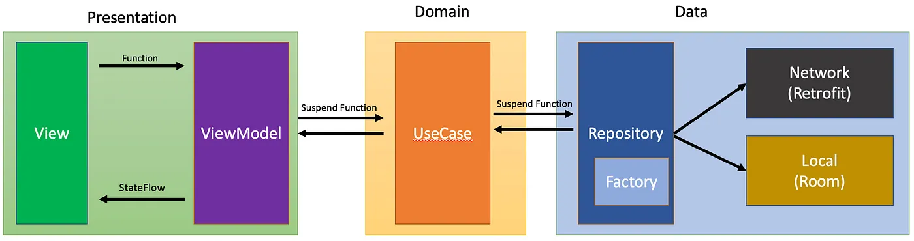

# Android App — MVVM + Clean Architecture (Compose, Hilt)

Proyecto Android (Kotlin + Jetpack Compose) con **MVVM** y **Clean Architecture**. Integra un backend **NestJS** que expone `GET /` con una lista de **viajes pendientes**.

> Paquetes base: `commons`, `core`, `features`. Capas por paquete: `data`, `domain`, `presentation`.

---

## Arquitectura

```
presentation  →  domain  ←  data
     UI           Reglas       Infraestructura (Retrofit/Room/DataStore)
```

- **Presentation**: Composables, ViewModels, estado UI, navegación.
- **Domain**: **Modelos de dominio**, **Use Cases** y **contratos de repositorio** (interfaces). Sin dependencias Android.
- **Data**: **Implementaciones** de repositorio, **data sources** (Retrofit/Room/DataStore) y **mappers** DTO/Entity ⇄ Domain.

**Paquetes**:
- `commons`: reutilizables **no de negocio** (UI, utilidades).
- `core`: piezas **transversales** de negocio/infra (p. ej., sesión, network).
- `features`: cada funcionalidad vertical (p. ej., `splash`, `travel`).

Estructura (resumen):
```
com/example/android/
├─ AppMain.kt                               // @HiltAndroidApp
├─ core/
│  ├─ data/di/NetworkModule.kt              // Retrofit/OkHttp/Hilt
│  └─ presentation/activity/MainActivity.kt // NavHost (Splash → Travel)
├─ features/
│  ├─ splash/presentation/SplashScreen.kt
│  └─ travel/
│     ├─ data/{api,dto,repository}/...
│     ├─ domain/{models,contracts,usecase}/...
│     └─ presentation/{TravelViewModel,TravelScreen}.kt
└─ commons/ ... (opcional)
```



---

## Implementación paso a paso

Proceso seguido para construir esta demo (Splash → Travel, consumiendo `GET /` del backend NestJS). Para el detalle de conceptos de Hilt, ver el [README de la clase](../README.md).

### 1. Revisar el diseño (`../design-m02-c02.pen`)

Antes de codear se revisa el mockup en Pencil: pantalla de carga (Splash) y el listado de viajes pendientes (Travel).

```
design-m02-c02.pen
        │
        ▼
Splash (spinner) · Travel (TopAppBar + TripList)
```

### 2. Crear el proyecto

Se crea el proyecto Android con Compose y se agregan las dependencias (Hilt, Retrofit, Navigation Compose) en `libs.versions.toml` / `build.gradle.kts`.

```
android-app-taxi/
 ├── app/build.gradle.kts     (Compose · Hilt · KSP · Retrofit · Navigation)
 └── gradle/libs.versions.toml
```

### 3. Implementar la UI

Se construyen `SplashScreen` y `TravelScreen` (con `TripRow`), conectadas por un `NavHost` en `MainActivity`.

```
AppRoot (NavHost)
 ├── SplashScreen  ──navigate──▶ TravelScreen
 │                                 ├── TopAppBar
 │                                 └── TripList → TripRow × N
```

### 4. Implementar la capa de red/repositorio

Retrofit (`TravelApi`) trae `TripDto`, `TravelRepositoryImpl` lo mapea a `Trip` de dominio detrás de `TravelRepository`, resuelto por Hilt (`NetworkModule` + `TravelDataModule`).

```
TravelApi → TripDto → TravelRepositoryImpl → Trip
                              │
                              ▼
                  TravelRepository (interfaz)
                              │
                    TravelBindModule (@Binds)
```

**Librerías (`gradle/libs.versions.toml` / `app/build.gradle.kts`):**

| Dependencia (`libs.*`) | Coordenada Maven | Uso |
| --- | --- | --- |
| `retrofit-core` | `com.squareup.retrofit2:retrofit:2.11.0` | Cliente HTTP declarativo; define `TravelApi`. |
| `retrofit-gson` | `com.squareup.retrofit2:converter-gson:2.11.0` | Convierte el JSON del backend a `TripDto`/`LocationDto`. |
| `okhttp-core` | `com.squareup.okhttp3:okhttp:4.12.0` | Cliente HTTP subyacente de Retrofit. |
| `okhttp-logging` | `com.squareup.okhttp3:logging-interceptor:4.12.0` | Interceptor que loguea cada request/response en Logcat. |
| `hilt-android` / `hilt-compiler` | `com.google.dagger:hilt-android(-compiler):2.58` | Genera e inyecta `NetworkModule`/`TravelDataModule` (`@Provides`/`@Binds`). |

### 5. Conectar hacia la vista con Hilt + ViewModel (MVVM)

`TravelViewModel` (`@HiltViewModel`) consulta `GetPendingTripsUseCase` y expone `TravelUiState` como `StateFlow`; `TravelScreen` lo observa con `hiltViewModel()` + `collectAsStateWithLifecycle()`.

```
TravelScreen
        │ hiltViewModel() + collectAsStateWithLifecycle()
        ▼
TravelViewModel ──usa──▶ GetPendingTripsUseCase ──usa──▶ TravelRepository
        │ StateFlow<TravelUiState>
        ▼
  TopAppBar + TripList (TripRow × N)
```

**Librerías (`gradle/libs.versions.toml` / `app/build.gradle.kts`):**

| Dependencia (`libs.*`) | Coordenada Maven | Uso |
| --- | --- | --- |
| `hilt-lifecycle-viewmodel-compose` | `androidx.hilt:hilt-lifecycle-viewmodel-compose:1.3.0` | `hiltViewModel()` para instanciar `TravelViewModel` en Compose. |
| `androidx-lifecycle-runtime-compose` | `androidx.lifecycle:lifecycle-runtime-compose:2.9.4` | `collectAsStateWithLifecycle()` para observar el `StateFlow<TravelUiState>`. |
| `androidx-lifecycle-viewmodel-ktx` | `androidx.lifecycle:lifecycle-viewmodel-ktx:2.9.4` | `viewModelScope` para lanzar `getPendingTrips()` en `TravelViewModel.load()`. |
| `androidx-navigation-compose` | `androidx.navigation:navigation-compose:2.9.7` | `NavHost` que conecta `SplashScreen` → `TravelScreen`. |

---

## Features actuales

- **Splash**: pantalla de carga 1.5s → navega a **Travel**.
- **Travel**: lista de viajes pendientes desde el backend NestJS (`GET /`).

---

## 🛠️ Stack

- **Android Gradle Plugin**: 8.13.0
- **Kotlin**: 2.3.20
- **Compose BOM**: 2026.03.00 (Material 3)
- **Navigation Compose**: 2.9.7
- **Lifecycle**: 2.9.4
- **Hilt**: 2.58 (con **KSP**)
- **KSP**: 2.3.12
- **Retrofit**: 2.11.0 + Gson
- **OkHttp**: 4.12.0
- **Coroutines**: 1.11.0
- **Java/JDK**: 17
- **Gradle Wrapper**: 8.13

> Requisitos: Android Studio **Koala+**, JDK **17**.

---

## Arranque rápido

1) **Clonar** y abrir el proyecto en Android Studio.  
2) Verifica **toolchain** y **Gradle**:
   - `gradle/wrapper/gradle-wrapper.properties` → `8.13`
   - JDK 17: *Settings → Build Tools → Gradle → Gradle JDK = 17*.
3) **Permitir BuildConfig** y setear base URL (emulador):
   ```kotlin
   // app/build.gradle.kts
   android {
       defaultConfig {
           buildConfigField("String", "API_BASE_URL", "\"http://10.0.2.2:3000/\"")
       }
       buildFeatures { compose = true; buildConfig = true }
       compileOptions { sourceCompatibility = JavaVersion.VERSION_17; targetCompatibility = JavaVersion.VERSION_17 }
   }

   kotlin {
       compilerOptions { jvmTarget.set(org.jetbrains.kotlin.gradle.dsl.JvmTarget.JVM_17) }
   }
   ```
4) **Permisos y cleartext** (HTTP):
   ```xml
   <!-- AndroidManifest.xml -->
   <uses-permission android:name="android.permission.INTERNET"/>
   <application
       android:usesCleartextTraffic="true"
       android:networkSecurityConfig="@xml/network_security_config" ... />
   ```
   ```xml
   <!-- res/xml/network_security_config.xml -->
   <network-security-config>
       <base-config cleartextTrafficPermitted="true" />
   </network-security-config>
   ```
5) **Backend NestJS** ejecutándose en el host (puerto 3000).  
   - En emulador Android, usa `http://10.0.2.2:3000/` (alias de `localhost` del host).  
   - Si usas dispositivo físico: IP LAN del host (p. ej., `http://192.168.x.x:3000/`) y `listen('0.0.0.0')` en NestJS.
6) **Run**: `app` en emulador o dispositivo.

---

## 🔌 NetworkModule (referencia)

```kotlin
// core/data/di/NetworkModule.kt
@Module
@InstallIn(SingletonComponent::class)
object NetworkModule {

    @Provides @Singleton
    fun provideLogging(): HttpLoggingInterceptor =
        HttpLoggingInterceptor().apply { level = HttpLoggingInterceptor.Level.BODY }

    @Provides @Singleton
    fun provideOkHttp(logging: HttpLoggingInterceptor): OkHttpClient =
        OkHttpClient.Builder().addInterceptor(logging).build()

    @Provides @Singleton
    fun provideRetrofit(client: OkHttpClient): Retrofit =
        Retrofit.Builder()
            .baseUrl(BuildConfig.API_BASE_URL) // debe terminar con "/"
            .client(client)
            .addConverterFactory(GsonConverterFactory.create())
            .build()
}
```

---

## MVVM + Clean: responsabilidades

- **Use Cases (domain)**: **lógica de negocio** y políticas (p. ej., “refrescar solo si hay sesión”).  
- **Repository impl (data)**: **infraestructura** (combinar Retrofit/Room/DataStore + mappers).  
- **ViewModel (presentation)**: orquesta casos de uso y expone estado UI.

Ejemplo de caso de uso + repo (Travel):
```kotlin
// domain/usecase/GetPendingTripsUseCase.kt
class GetPendingTripsUseCase @Inject constructor(
    private val repo: TravelRepository
) {
    suspend operator fun invoke() = repo.getPendingTrips()
}
```

---

## 🧭 Navegación

`MainActivity` usa `NavHost` para dirigir de **Splash** → **Travel**.  
`TravelScreen` usa `Scaffold` con `TopAppBar` y respeta `status bar`.

---

## Checklist de salud

- [ ] `BuildConfig.API_BASE_URL` apunta a `http://10.0.2.2:3000/` (emulador) y **termina con `/`**.  
- [ ] `android:usesCleartextTraffic="true"` y `network_security_config` permiten HTTP.  
- [ ] Permiso `INTERNET` declarado en Manifest.  
- [ ] JDK 17 + Gradle 8.13 + Kotlin 2.3.20 + KSP 2.3.12.  
- [ ] No mezclar `kapt` y `ksp` para el mismo processor (Hilt usa **KSP**).

---

## Troubleshooting (errores comunes)

**1) EPERM (Operation not permitted) al llamar API**  
Causa: falta permiso `INTERNET` o usar IP LAN en emulador.  
✔ Agrega `<uses-permission android:name="android.permission.INTERNET"/>` y usa `http://10.0.2.2:3000/`.

**2) CLEARTEXT not permitted**  
✔ `android:usesCleartextTraffic="true"` + `network_security_config` con `<base-config cleartextTrafficPermitted="true" />`.

**3) BuildConfig deshabilitado**  
```
defaultConfig contains custom BuildConfig fields, but the feature is disabled
```
✔ `android.buildFeatures.buildConfig = true`.

**4) KSP: getChangedFiles / IncompatibleClassChangeError**  
✔ Alinea **KSP con Kotlin**: `ksp = 2.3.12` (Kotlin `2.3.20`).  
✔ Usa **JDK 17** y **Gradle 8.13**.  
`./gradlew --stop && ./gradlew clean`.

**5) JavaPoet: ClassName.canonicalName() missing**  
✔ Fuerza JavaPoet ≥ 1.13.0 con `resolutionStrategy` o actualiza procesadores (Hilt).

---

## Sesión y acceso a datos (patrón recomendado)

- **SessionRepository (core/domain)** define contrato.  
- **SessionRepositoryImpl (core/data)** implementa con **DataStore**.  
- Repos de features (data) **leen sesión** si la necesitan para llamadas (token/userId).  
- Use cases deciden políticas de negocio (refrescar si autenticado, etc.).

---

## Inyección de dependencias en este proyecto (Hilt)

Esta app usa **Hilt (sobre Dagger)** para desacoplar UI, lógica de negocio y acceso a datos. Beneficios: **testabilidad**, **sustitución** de implementaciones (mock/fake/real), **configuración centralizada** y **scopes** alineados con el ciclo de vida Android.

### 1) Piezas clave y dónde viven

- **`@HiltAndroidApp`** → `AppMain.kt`  
  Inicializa el **contenedor raíz** de Hilt al iniciar la app.
- **`@AndroidEntryPoint`** → `MainActivity` (hosts de UI)  
  Habilita la inyección en Activities/Fragments/Services/Composables hosts.
- **Módulos de DI compartidos** → `core/data/di/*`  
  - `NetworkModule`: `OkHttpClient`, `Retrofit` (scope `@Singleton`), base URL desde `BuildConfig.API_BASE_URL`.
- **Módulos del feature** → `features/travel/data/di/*`  
  - `provideTravelApi(retrofit)` y `@Binds` `TravelRepositoryImpl` → `TravelRepository`.
- **Dominio del feature** → `features/travel/domain/*`  
  - Contratos (`TravelRepository`), modelos (`Trip`) y **Use Cases** (`GetPendingTripsUseCase`).
- **Presentación** → `features/travel/presentation/*`  
  - `@HiltViewModel` `TravelViewModel` recibe el **use case** por constructor; Compose lo obtiene con `hiltViewModel()`.

### 2) Flujo de inyección (de extremo a extremo)

```kotlin
// domain/contracts (NEGOCIO: contrato)
interface TravelRepository {
    suspend fun getPendingTrips(): List<Trip>
}

// data/repository (INFRA: implementación del contrato)
class TravelRepositoryImpl @Inject constructor(
    private val api: TravelApi
) : TravelRepository {
    override suspend fun getPendingTrips(): List<Trip> =
        api.getPendingTrips().map { dto -> Trip(
            id = dto.id,
            passengerName = dto.passengerName,
            pickupAddress = dto.pickup.address,
            dropoffAddress = dto.dropoff.address,
            requestedAtIso = dto.requestedAt
        )}
}

// data/di (Binds y Provides)
@Module @InstallIn(SingletonComponent::class)
abstract class TravelBindModule {
    @Binds @Singleton
    abstract fun bindTravelRepository(impl: TravelRepositoryImpl): TravelRepository
}

@Module @InstallIn(SingletonComponent::class)
object TravelProvideModule {
    @Provides @Singleton
    fun provideTravelApi(retrofit: Retrofit): TravelApi =
        retrofit.create(TravelApi::class.java)
}

// domain/usecase (NEGOCIO)
class GetPendingTripsUseCase @Inject constructor(
    private val repo: TravelRepository
) { suspend operator fun invoke() = repo.getPendingTrips() }

// presentation/viewmodel (UI)
@HiltViewModel
class TravelViewModel @Inject constructor(
    private val getTrips: GetPendingTripsUseCase
) : ViewModel() {
    // ...
}
```

> **Idea central**: la UI conoce **use cases**; los use cases dependen de **contratos**; la **implementación** real se resuelve en **data** vía Hilt.

### 3) Scopes y ciclo de vida

- `@Singleton` → objetos de **aplicación** (e.g., `OkHttpClient`, `Retrofit`, repositorios).  
- `@HiltViewModel` → cada ViewModel tiene su propio **scope** y se crea con sus dependencias.

### 4) Qualifiers (si necesitas múltiples implementaciones)

Si un día necesitas **dos APIs** (p. ej., pública e interna), define **qualifiers**:

```kotlin
@Qualifier @Retention(AnnotationRetention.BINARY)
annotation class PublicApi

@Qualifier @Retention(AnnotationRetention.BINARY)
annotation class InternalApi

@Module @InstallIn(SingletonComponent::class)
object MultiRetrofitModule {
    @Provides @Singleton @PublicApi
    fun providePublicRetrofit(base: OkHttpClient): Retrofit = Retrofit.Builder()
        .baseUrl(BuildConfig.API_BASE_URL)
        .client(base)
        .addConverterFactory(GsonConverterFactory.create())
        .build()

    @Provides @Singleton @InternalApi
    fun provideInternalRetrofit(base: OkHttpClient): Retrofit = Retrofit.Builder()
        .baseUrl(BuildConfig.API_BASE_URL) // cambiar si aplica
        .client(base)
        .addConverterFactory(GsonConverterFactory.create())
        .build()
}
```

Y luego:

```kotlin
class SomeService @Inject constructor(
    @PublicApi private val publicRetrofit: Retrofit
)
```

### 5) Sesión y headers (patrón recomendado)

- Define `SessionRepository` en `core/domain` y su `SessionRepositoryImpl` con **DataStore** en `core/data`.
- Inyecta un `TokenProvider`/`SessionRepository` en un **interceptor OkHttp** para añadir `Authorization`:
```kotlin
@Provides @Singleton
fun provideAuthInterceptor(sessionRepo: SessionRepository): Interceptor = Interceptor { chain ->
    val token = sessionRepo.getSessionOrNull()?.token
    val req = chain.request().newBuilder().apply {
        if (token != null) addHeader("Authorization", "Bearer $token")
    }.build()
    chain.proceed(req)
}
```
> Así, los repos no se preocupan por headers; la **infraestructura** lo resuelve.

### 6) Testing con Hilt (pistas)

- **Domain**: tests puros de use cases con **fakes** de `TravelRepository` (sin Android).  
- **UI**: `HiltAndroidRule`, `@BindValue` para inyectar fakes del repo/usecase en tests de `ViewModel`/Compose.  
- **Data**: tests instrumentados para Room/Retrofit o fakes de red.