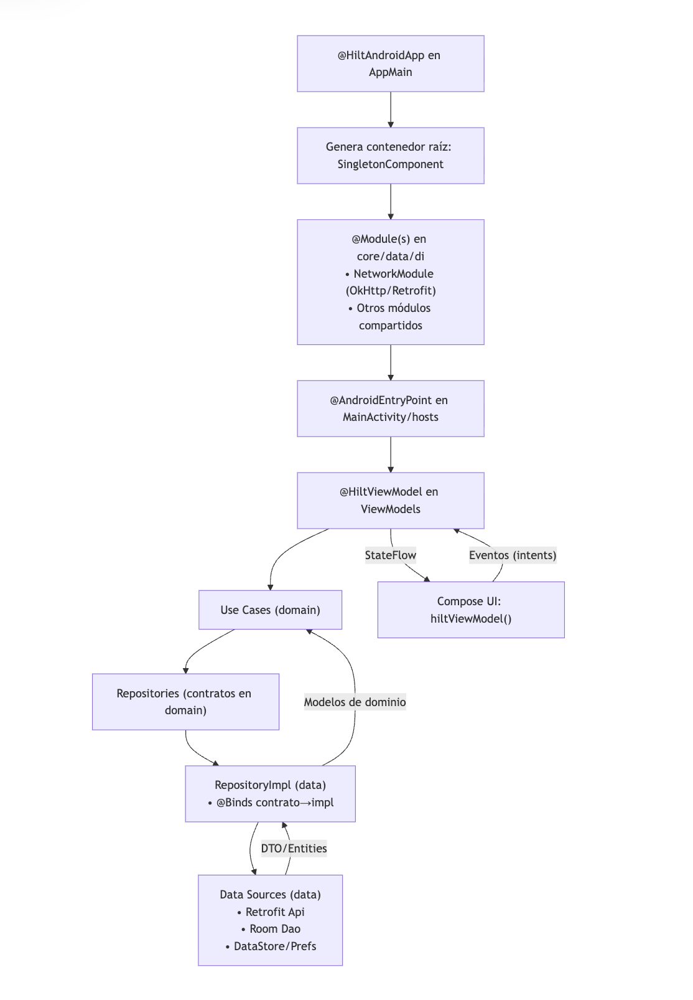
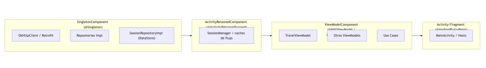
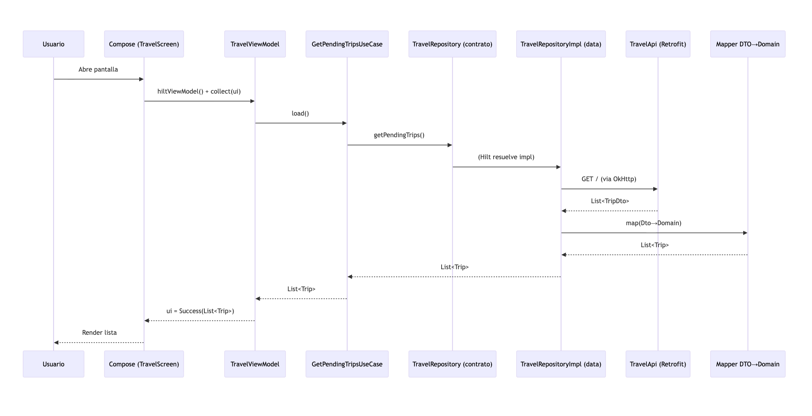
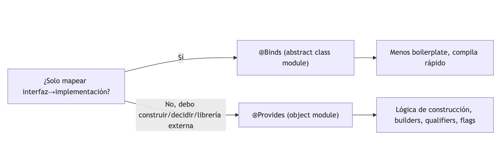
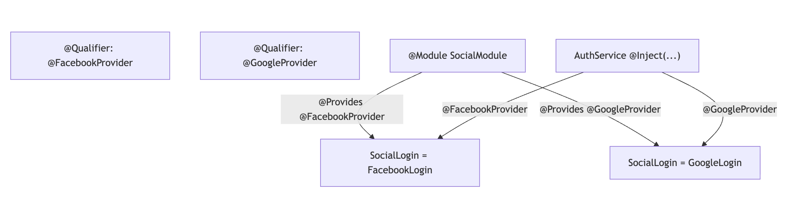
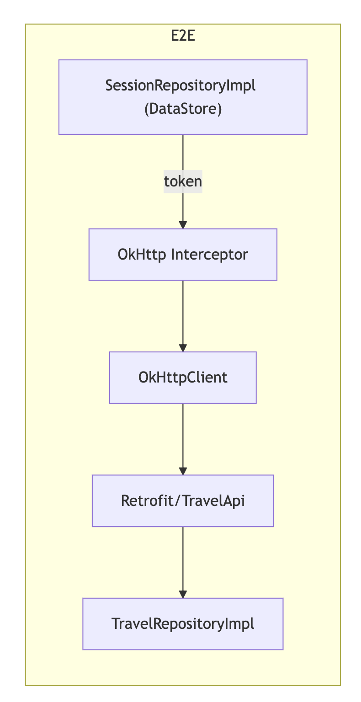

# Diagramas visuales — Hilt (Inyección de Dependencias en Android)
---

## 1) Panorama general (setup y flujo de inyección)

**Leyenda:**  
- `@HiltAndroidApp` crea el grafo raíz y habilita inyección en toda la app.  
- `@AndroidEntryPoint` habilita inyección en el host (Activity/Fragment/Service).  
- `@HiltViewModel` recibe dependencias por **constructor**.  
- **Use Cases** aplican reglas de negocio; **RepositoryImpl** orquesta infra (Retrofit/Room/DataStore) y mapea DTO ⇄ dominio.

---

## 2) Componentes y *scopes* (quién vive cuánto)

**Regla mental:** *“¿Cada cuánto reutilizo la instancia?”*  
- **App** → `@Singleton` (HTTP, DB, repos).  
- **Activity Retained** → persiste a rotaciones (escenario/flujo).  
- **ViewModel** → por ViewModel.  
- **UI** → por pantalla específica.

---

## 3) Secuencia de una pantalla (Travel)

---

## 4) `@Binds` vs `@Provides` (cuándo usar cada uno)

**Ejemplo rápido:**  
- `@Binds` → `TravelRepositoryImpl : TravelRepository`.  
- `@Provides` → construir `Retrofit`, decidir `FareCalculator` por flag, crear `OkHttp` con interceptores.

---

## 5) Qualifiers (múltiples implementaciones)

**Idea:** la UI no conoce el proveedor; cambiar implementación es cambiar el **binding**.

---

## 6) Headers de sesión en el interceptor (patrón recomendado)

**Beneficio:** los repos no se preocupan por añadir `Authorization`; la **infra** lo resuelve.

