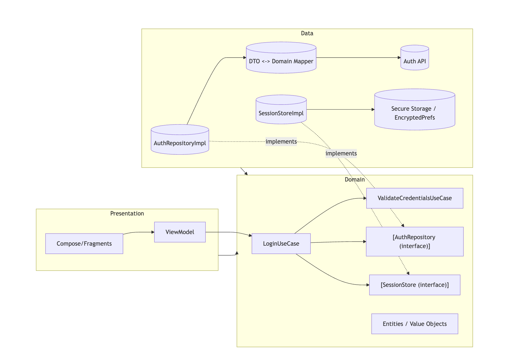
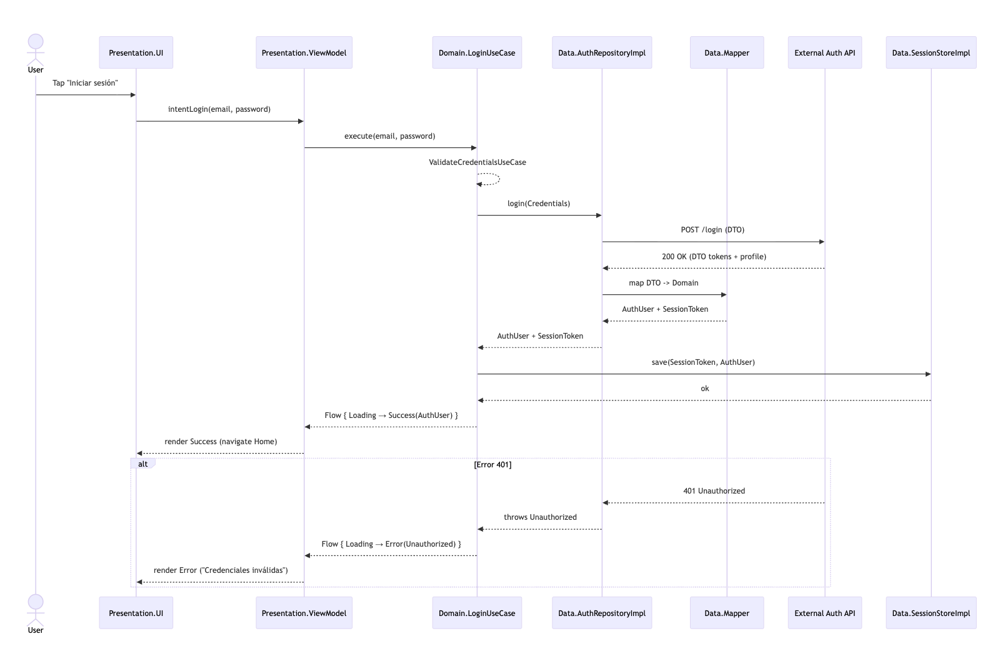

# Módulo 2 · Sesión 3

## Casos de Uso y Capa de Dominio

---

## Objetivos

1. Diseñar la capa de dominio **independiente de frameworks** bajo Clean Architecture.
2. Definir con precisión las **responsabilidades** de los UseCases.
3. Asegurar la **separación** entre lógica de negocio (dominio) y UI.
4. Implementar **Flows** en el dominio para modelar procesos asincrónicos (login).

---

## Contenido

1. Diseño de la capa de dominio
2. Definición y responsabilidades de los UseCases
3. Separación de lógica de negocio y UI
4. Uso de Flows en la capa de dominio

---

## Desarrollo de la clase

### 1) Diseño de la capa de dominio

#### Teoría (Clean)

-   **Propósito**: concentrar reglas de negocio (invariantes, validaciones, políticas).
-   **Independencia**: cero dependencias de Android/UI/HTTP/DB; solo Kotlin estándar.
-   **Elementos**:
    -   **Entidades/Value Objects**: modelo de negocio puro.
    -   **Servicios/Casos de uso**: orquestan reglas para una acción del sistema.
    -   **Contratos (Interfaces)**: p. ej., `AuthRepository`, `SessionStore`.
-   **Direcciones de dependencia**:
    -   Dominio define contratos.
    -   Data los implementa.
    -   UI consume casos de uso a través de ViewModel.
    -   Regla: **nada en dominio conoce a UI ni a Data**.

#### Ejemplo (Login)

**Entidades de dominio:**

```kotlin
data class Credentials(
    val email: String,
    val password: String
)

data class AuthUser(
    val id: String,
    val displayName: String,
    val email: String
)

data class SessionToken(
    val accessToken: String,
    val refreshToken: String? = null,
    val expiresAtEpochSeconds: Long? = null
)
```

**Errores de dominio:**

```kotlin
sealed interface AuthDomainError {
    data object InvalidEmail : AuthDomainError
    data object WeakPassword : AuthDomainError
    data object Unauthorized : AuthDomainError
    data object Unexpected : AuthDomainError
}
```

**Contratos:**

```kotlin
interface AuthRepository {
    suspend fun login(creds: Credentials): Pair<AuthUser, SessionToken>
    suspend fun logout()
}

interface SessionStore {
    suspend fun save(session: SessionToken, user: AuthUser)
    suspend fun clear()
    suspend fun current(): Pair<AuthUser, SessionToken>?
}
```

---

### 2) Definición y responsabilidades de los UseCases

#### Teoría (Clean)

-   **Un caso de uso = una acción de negocio** (única responsabilidad).
-   **I/O explícito**: parámetros de entrada y resultado claro.
-   **Agregan reglas**: validan, transforman, orquestan repositorios y stores.
-   **Testeables**: puros o con dependencias simulables (mocks/fakes).
-   **Sin detalles técnicos**: delegan a contratos, no a librerías concretas.

#### Ejemplo (Login)

**Validación de credenciales:**

```kotlin
class ValidateCredentialsUseCase {
    operator fun invoke(email: String, password: String): Result<Credentials> {
        val e = email.trim()
        if (e.isBlank() || !e.contains("@")) {
            return Result.failure(IllegalArgumentException(AuthDomainError.InvalidEmail.toString()))
        }
        if (password.length < 6) {
            return Result.failure(IllegalArgumentException(AuthDomainError.WeakPassword.toString()))
        }
        return Result.success(Credentials(email = e, password = password))
    }
}
```

**LoginUseCase con Flow:**

```kotlin
sealed class DomainResult<out T> {
    data object Loading : DomainResult<Nothing>();
    data class Success<T>(val data: T) : DomainResult<T>();
    data class Error(val cause: AuthDomainError) : DomainResult<Nothing>();
}

class LoginUseCase(
    private val authRepository: AuthRepository,
    private val sessionStore: SessionStore,
    private val validateCredentials: ValidateCredentialsUseCase
) {
    fun execute(email: String, password: String): kotlinx.coroutines.flow.Flow<DomainResult<AuthUser>> =
        kotlinx.coroutines.flow.flow {
            emit(DomainResult.Loading)

            val creds = validateCredentials(email, password).getOrElse { ex ->
                val err = if (ex.message?.contains("InvalidEmail") == true)
                    AuthDomainError.InvalidEmail else AuthDomainError.WeakPassword
                emit(DomainResult.Error(err))
                return@flow
            }

            try {
                val (user, token) = authRepository.login(creds)
                sessionStore.save(token, user)
                emit(DomainResult.Success(user))
            } catch (t: Throwable) {
                val err = if (t.message?.contains("401") == true) {
                    AuthDomainError.Unauthorized
                } else {
                    AuthDomainError.Unexpected
                }
                emit(DomainResult.Error(err))
            }
        }
}
```

**LogoutUseCase:**

```kotlin
class LogoutUseCase(
    private val authRepository: AuthRepository,
    private val sessionStore: SessionStore
) {
    suspend operator fun invoke() {
        runCatching { authRepository.logout() }
        sessionStore.clear()
    }
}
```

---

### 3) Separación de lógica de negocio y UI

#### Teoría (Clean)

-   **UI**: solo renderiza estados y emite eventos.
-   **ViewModel**: orquesta casos de uso, maneja estado de pantalla.
-   **Dominio**: resuelve reglas; nunca conoce Android/UI.

**Anti-patrones:**

-   Invocar repositorios directamente en Activities/Fragments.
-   Guardar tokens en la UI.
-   Mostrar mensajes crudos de excepciones técnicas.

#### Ejemplo (Login)

**ViewModel:**

```kotlin
class LoginViewModel(
    private val loginUseCase: LoginUseCase,
    private val logoutUseCase: LogoutUseCase
) : ViewModel() {

    private val _uiState = MutableStateFlow<DomainResult<AuthUser>>(DomainResult.Loading)
    val uiState: StateFlow<DomainResult<AuthUser>> = _uiState

    fun login(email: String, password: String) {
        viewModelScope.launch {
            loginUseCase.execute(email, password).collect { result ->
                _uiState.value = result
            }
        }
    }

    fun logout() {
        viewModelScope.launch {
            logoutUseCase()
            _uiState.value = DomainResult.Loading
        }
    }
}
```

**UI (Compose) solo reacciona:**

-   `Loading` → mostrar spinner.
-   `Success(user)` → navegar a Home.
-   `Error(err)` → mostrar mensaje legible.

---

### 4) Uso de Flows en la capa de dominio

#### Teoría (Clean)

-   **Uso**: modelar procesos con múltiples estados (`Loading`, `Success`, `Error`).
-   **Beneficios**: asincronía, composición, testabilidad.
-   **Regla**: dominio no conoce `Dispatchers.Main`.

#### Ejemplo (Login)

Ya implementado en `LoginUseCase.execute(...)`.  
Extensión para consumo más limpio:

```kotlin
fun <T> DomainResult<T>.fold(
    onLoading: () -> Unit,
    onSuccess: (T) -> Unit,
    onError: (AuthDomainError) -> Unit
) {
    when (this) {
        is DomainResult.Loading -> onLoading()
        is DomainResult.Success -> onSuccess(this.data)
        is DomainResult.Error -> onError(this.cause)
    }
}
```

---

## Conclusiones

-   La **capa de dominio** es el núcleo: entidades, reglas y contratos.
-   Los **UseCases** representan acciones específicas como `Login` o `Logout`.
-   La **UI no contiene reglas**, solo refleja estados emitidos.
-   Los **Flows** permiten manejar procesos asincrónicos de manera clara y escalable.
    
    
