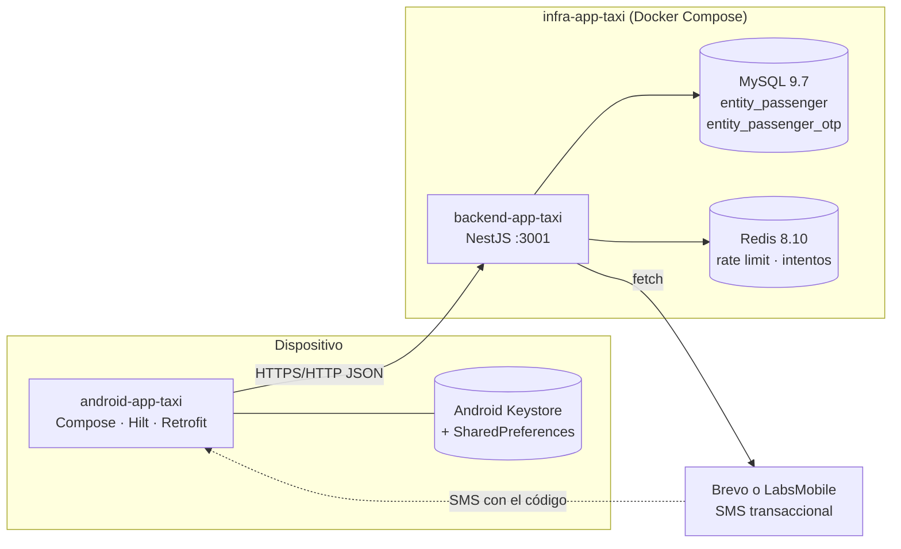
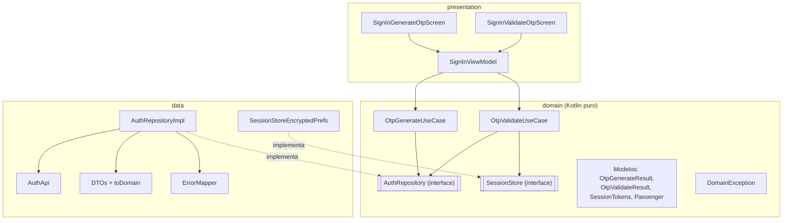
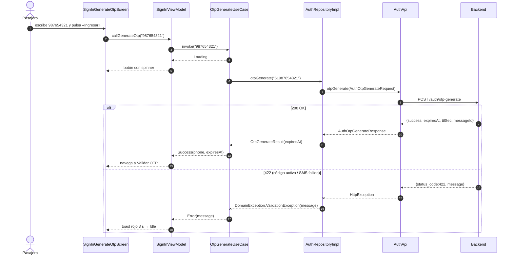
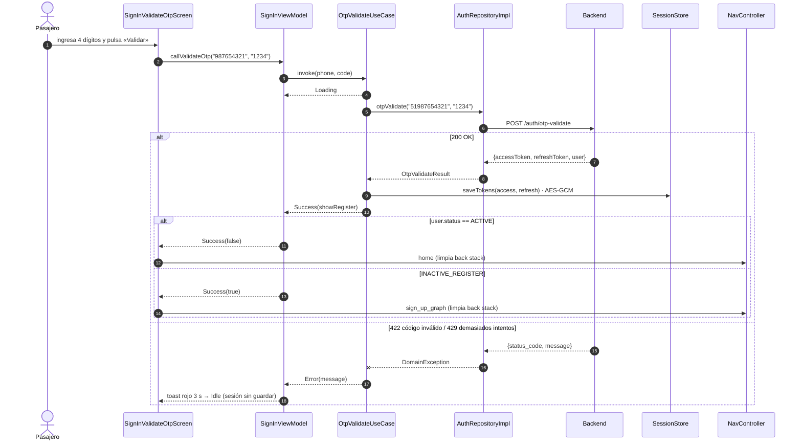
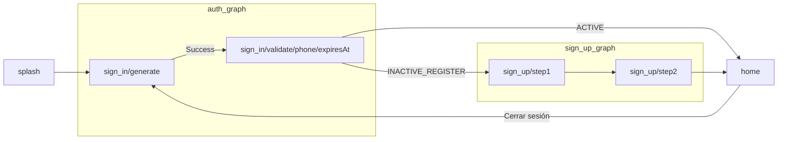

# Módulo 2 · Sesión 4

## Repositorios: inicio de sesión con OTP

---

## Objetivos

1. Implementar el **patrón Repository** en un flujo real: inicio de sesión por **OTP** (código de un solo uso por SMS).
2. Separar el **origen remoto** (API) de la **gestión local de la sesión** (tokens cifrados).
3. **Traducir errores técnicos** (HTTP, red) a **errores de dominio** dentro de la capa de datos.
4. Inyectar el repositorio con **Hilt** manteniendo el dominio sin frameworks.
5. Modelar los estados de cada pantalla (`Idle`, `Loading`, `Success`, `Error`) con **Flow** y **sealed interfaces**.

---

## Contenido

1. El patrón Repository
2. El ejemplo: proyectos, arquitectura y flujo OTP
3. Construcción paso a paso de `android-app-taxi`
4. Ejecutar el ejemplo
5. Checklist, conclusiones y práctica

---

## 1) El patrón Repository

### Qué es y por qué

-   **Intención**: ocultar **cómo** y **de dónde** se obtienen los datos detrás de una **interfaz del dominio**. Los casos de uso piden «genera una OTP para este teléfono»; no saben que existe Retrofit, un JSON ni un código HTTP 422.
-   **Ventajas**:
    -   **Desacople**: cambiar Retrofit por Ktor, o agregar una caché con Room, no toca el dominio ni la UI.
    -   **Testabilidad**: el caso de uso se prueba con un `FakeAuthRepository` en la JVM, sin red ni emulador.
    -   **Un solo lugar** para mapear DTO → dominio y excepciones técnicas → errores de dominio.

### Repository vs. otras piezas de datos

| Pieza                    | Capa   | Responsabilidad                                   | En el ejemplo                   |
| ------------------------ | ------ | ------------------------------------------------- | ------------------------------- |
| **Remote data source**   | Data   | Llamadas HTTP (una por endpoint)                  | `AuthApi` (Retrofit)            |
| **Local data source/DAO**| Data   | Persistencia (Room, DataStore, SharedPreferences) | `SessionStoreEncryptedPrefs`    |
| **DTO**                  | Data   | Forma exacta del JSON                             | `AuthOtpGenerateResponse`       |
| **Mapper**               | Data   | DTO → modelo de dominio                           | `toDomain()`                    |
| **Repository (contrato)**| Domain | Qué datos necesita el negocio                      | `AuthRepository`                |
| **Repository (impl.)**   | Data   | Compone data sources, mapea y traduce errores      | `AuthRepositoryImpl`            |
| **Caso de uso**          | Domain | Regla de negocio que usa uno o más repositorios    | `OtpValidateUseCase`            |

### Reglas que seguimos

1. **El contrato vive en el dominio** y solo usa modelos de dominio (nunca DTOs, `Response<T>` ni `HttpException`).
2. **La implementación vive en data** y es la única que conoce Retrofit/Gson.
3. **Los errores se traducen en data**: el repositorio lanza `DomainException` con un mensaje legible. La cancelación de corrutinas (`CancellationException`) **no** se traduce: se relanza.
4. **SRP**: el repositorio **no** guarda la sesión. Guardar los tokens tras validar la OTP es una **política de negocio** y la decide el caso de uso.

---

## 2) El ejemplo: proyectos, arquitectura y flujo OTP

### Proyectos de la clase

| Proyecto                                      | Qué es                                                          | Guía                                         |
| --------------------------------------------- | --------------------------------------------------------------- | -------------------------------------------- |
| [`infra-app-taxi`](./infra-app-taxi)          | MySQL 9.7, Redis 8.10 y la API con Docker Compose               | [README](./infra-app-taxi/README.md)         |
| [`backend-app-taxi`](./backend-app-taxi)      | API NestJS 12: `POST /auth/otp-generate` y `POST /auth/otp-validate` | [README](./backend-app-taxi/README.md)  |
| [`android-app-taxi`](./android-app-taxi)      | App Android (Compose + Hilt + Retrofit)                         | [README](./android-app-taxi/README.md)       |
| [`design-m02-c04.pen`](./design-m02-c04.pen)  | Diseño de pantallas, estados y launcher icon exportable (Pencil) | —                                            |

### Diagrama de despliegue



### Flujo funcional

1. **Generar**: el pasajero escribe su teléfono (9 dígitos) → `POST /auth/otp-generate {"phone":"51987654321"}` → el backend crea el pasajero si no existe (`INACTIVE_REGISTER`), guarda la OTP y envía el SMS → responde `expiresAt`.
2. **Validar**: el pasajero escribe los 4 dígitos → `POST /auth/otp-validate {"phone","code"}` → el backend responde `accessToken`, `refreshToken` y `user`.
3. La app **guarda los tokens cifrados** y navega a **Home** (`ACTIVE`) o a **Registro** (`INACTIVE_REGISTER`).

### Pantallas y estados

Diseñadas en [`design-m02-c04.pen`](./design-m02-c04.pen):

| Pantalla        | Loading                        | Success                                                  | Error                                         |
| --------------- | ------------------------------ | -------------------------------------------------------- | --------------------------------------------- |
| Generar OTP     | Botón con spinner, campo bloqueado | Navega a Validar con toast verde «Enviamos un código…» | Toast rojo con el mensaje del backend          |
| Validar OTP     | Botón «Validar» con spinner    | Navega a Home con toast verde «Sesión iniciada…»          | Toast rojo «El código OTP es inválido…»        |
| Validar (reenvío) | «Enviando un nuevo código…»  | Toast verde «Te enviamos un nuevo código»                 | Toast rojo con el mensaje del backend          |

### Diagrama de capas de la app



Las flechas de dependencia apuntan **hacia el dominio**: `data` implementa sus interfaces y `presentation` consume sus casos de uso.

### Estructura de paquetes

```
features/signin/
├─ SignInModule.kt                     // Paso 9 · Hilt
├─ data/
│  ├─ remote/AuthApi.kt                // Paso 4 · Retrofit
│  ├─ remote/dto/                      // Pasos 4 y 5 · DTOs + toDomain()
│  └─ repository/AuthRepositoryImpl.kt // Paso 7 · implementación
├─ domain/
│  ├─ model/                           // Paso 1 · modelos
│  ├─ repository/AuthRepository.kt     // Paso 2 · contrato
│  └─ usecase/                         // Paso 8 · casos de uso
└─ presentation/                       // Pasos 10–12 · ViewModel y pantallas
core/
├─ domain/{DomainException,SessionStore}.kt   // Paso 3
└─ data/{ErrorMapper,SessionStoreEncryptedPrefs,NetworkModule,SecurityModule,AuthInterceptor}.kt
```

---

## 3) Construcción paso a paso de `android-app-taxi`

> Todo el código de esta sección es el del proyecto; los comentarios de cada archivo están en el propio repositorio.

### Paso 0 · Punto de partida

Partimos del proyecto de la clase 03 (Splash, `SessionStore` cifrado, `NetworkModule`, toasts). Solo agregamos la dependencia de pruebas de corrutinas:

```toml
# gradle/libs.versions.toml
kotlinx-coroutines-test = { module = "org.jetbrains.kotlinx:kotlinx-coroutines-test", version.ref = "coroutines" }
```

```kotlin
// app/build.gradle.kts
testImplementation(libs.kotlinx.coroutines.test)
```

### Paso 1 · Modelos de dominio

Qué necesita el negocio de cada respuesta, sin detalles del JSON (`success`, `messageId` o `ttlSec` no llegan al dominio):

```kotlin
// features/signin/domain/model/OtpGenerateResult.kt
data class OtpGenerateResult(
    val expiresAt: String
)

// features/signin/domain/model/OtpValidateResult.kt
data class OtpValidateResult(
    val tokens: SessionTokens,
    val user: Passenger
)

// features/signin/domain/model/SessionTokens.kt
data class SessionTokens(
    val accessToken: String,
    val refreshToken: String
)
```

`Passenger` y `PassengerStatusEnum` viven en `commons/domain` porque los usarán otros features (registro, perfil).

### Paso 2 · El contrato del repositorio

```kotlin
// features/signin/domain/repository/AuthRepository.kt
interface AuthRepository {
    suspend fun otpGenerate(phone: String): OtpGenerateResult
    suspend fun otpValidate(phone: String, code: String): OtpValidateResult
}
```

Es el punto de **inversión de dependencias**: el dominio declara lo que necesita y la capa de datos se adapta.

### Paso 3 · Errores de dominio

El dominio no conoce `HttpException`; conoce categorías de error con un mensaje apto para el usuario:

```kotlin
// core/domain/DomainException.kt (resumen)
sealed class DomainException(
    override val message: String,
    open val code: Int? = null,
    open val causeThrowable: Throwable? = null
) : RuntimeException(message, causeThrowable) {
    data class ValidationException(...) : DomainException(...)   // 400 / 422
    data class ClientException(...) : DomainException(...)       // otros 4xx
    data class ServerException(...) : DomainException(...)       // 5xx
    data class NetworkException(...) : DomainException(...)      // sin red / timeout
    data class UnknownException(
        override val message: String = "Ocurrió un error inesperado", ...
    ) : DomainException(...)
}

fun Throwable.toDomainException(): DomainException =
    this as? DomainException ?: DomainException.UnknownException(causeThrowable = this)
```

### Paso 4 · API remota y DTOs

```kotlin
// features/signin/data/remote/AuthApi.kt
interface AuthApi {
    @POST("auth/otp-generate")
    suspend fun otpGenerate(@Body body: AuthOtpGenerateRequest): AuthOtpGenerateResponse

    @POST("auth/otp-validate")
    suspend fun otpValidate(@Body body: AuthOtpValidateRequest): AuthOtpValidateResponse
}

// DTOs: reflejan el JSON tal cual
data class AuthOtpGenerateRequest(val phone: String)
data class AuthOtpGenerateResponse(
    val success: Boolean,
    val expiresAt: String,
    val ttlSec: Int,
    val messageId: String?
)
data class AuthOtpValidateRequest(val phone: String, val code: String)
data class AuthOtpValidateResponse(
    val accessToken: String,
    val refreshToken: String,
    val user: PassengerDto
)
```

### Paso 5 · Mappers DTO → dominio

```kotlin
fun AuthOtpGenerateResponse.toDomain(): OtpGenerateResult = OtpGenerateResult(
    expiresAt = expiresAt
)

fun AuthOtpValidateResponse.toDomain(): OtpValidateResult = OtpValidateResult(
    tokens = SessionTokens(accessToken = accessToken, refreshToken = refreshToken),
    user = user.toDomain()
)
```

Si mañana el backend renombra un campo, solo cambian el DTO y su mapper.

### Paso 6 · Traducción de errores (`ErrorMapper`)

Vive en `core/data` porque **conoce Retrofit**. El backend responde **todos** sus errores con el formato `{status_code, message, errors}`: en los 4xx la app muestra el primer `errors[].message` (o `message`), y en los 5xx un texto propio. El contrato completo, caso por caso, está en [«Contrato de la API con la app»](./backend-app-taxi/README.md#contrato-de-la-api-con-la-app).

```kotlin
// core/data/ErrorMapper.kt (resumen)
object ErrorMapper {
    fun map(t: Throwable): DomainException = when (t) {
        is DomainException -> t
        is HttpException -> mapHttp(t)
        is SocketTimeoutException -> DomainException.NetworkException(MESSAGE_TIMEOUT, causeThrowable = t)
        is IOException -> DomainException.NetworkException(MESSAGE_NETWORK, causeThrowable = t)
        else -> DomainException.UnknownException(MESSAGE_UNKNOWN, causeThrowable = t)
    }

    private fun mapHttp(e: HttpException): DomainException {
        val code = e.code()
        val message = when (code) {
            in 500..599 -> MESSAGE_SERVER                        // nunca se muestra el cuerpo de un 5xx
            in 400..499 -> e.serverMessage() ?: MESSAGE_CLIENT   // errors[0].message o message
            else -> MESSAGE_UNKNOWN
        }
        return when (code) {
            400, 422 -> DomainException.ValidationException(message, code, e)
            in 400..499 -> DomainException.ClientException(message, code, e)
            in 500..599 -> DomainException.ServerException(message, code, e)
            else -> DomainException.UnknownException(message, code, e)
        }
    }
}
```

| Respuesta del backend                                             | Resultado en la app                                           |
| ----------------------------------------------------------------- | ------------------------------------------------------------- |
| `422 {"message":"Ya existe un código activo…"}`                    | `ValidationException("Ya existe un código activo…")`          |
| `400 {"errors":[{"message":"Debe tener al menos 11 caracteres."}]}` | `ValidationException("Debe tener al menos 11 caracteres.")`   |
| `429 {"message":"Superaste el número de intentos…"}`               | `ClientException("Superaste el número de intentos…")`         |
| `500 {"message":"Ocurrió un error inesperado en el servidor."}`   | `ServerException("El servidor no está disponible…")` (ignora el cuerpo) |
| Sin red                                                           | `NetworkException("No se pudo conectar con el servidor…")`    |

### Paso 7 · Implementación del repositorio

```kotlin
// features/signin/data/repository/AuthRepositoryImpl.kt
class AuthRepositoryImpl(
    private val api: AuthApi
) : AuthRepository {

    override suspend fun otpGenerate(phone: String): OtpGenerateResult = safeCall {
        api.otpGenerate(AuthOtpGenerateRequest(phone = phone)).toDomain()
    }

    override suspend fun otpValidate(phone: String, code: String): OtpValidateResult = safeCall {
        api.otpValidate(AuthOtpValidateRequest(phone = phone, code = code)).toDomain()
    }

    private inline fun <T> safeCall(block: () -> T): T = try {
        block()
    } catch (e: CancellationException) {
        throw e
    } catch (t: Throwable) {
        throw ErrorMapper.map(t)
    }
}
```

**¿Por qué relanzar `CancellationException`?** Cuando el usuario sale de la pantalla, `viewModelScope` se cancela y Retrofit lanza `CancellationException`. Si la convirtiéramos en `UnknownException`, la corrutina «cancelada» emitiría un error a una pantalla que ya no existe y rompería la cancelación cooperativa. Un `runCatching { }` aquí tendría exactamente ese defecto.

### Paso 8 · Casos de uso con Flow

Cada caso de uso emite los estados de su proceso. Los errores se capturan con el **operador `catch`** (no con `try/catch` alrededor de `emit`, ver clase 03):

```kotlin
// features/signin/domain/usecase/OtpGenerateUseCase.kt
sealed interface OtpGenerateState {
    data object Idle : OtpGenerateState
    data object Loading : OtpGenerateState
    data class Success(val phone: String, val expiresAt: String) : OtpGenerateState
    data class Error(val message: String) : OtpGenerateState
}

class OtpGenerateUseCase(
    private val repo: AuthRepository
) {
    operator fun invoke(phoneReq: String): Flow<OtpGenerateState> = flow {
        emit(OtpGenerateState.Loading)
        val result = repo.otpGenerate(phone = "$COUNTRY_CODE$phoneReq")
        emit(OtpGenerateState.Success(phone = phoneReq, expiresAt = result.expiresAt))
    }.catch { emit(OtpGenerateState.Error(it.toDomainException().message)) }
}
```

```kotlin
// features/signin/domain/usecase/OtpValidateUseCase.kt
class OtpValidateUseCase(
    private val repo: AuthRepository,
    private val session: SessionStore
) {
    operator fun invoke(phoneReq: String, code: String): Flow<OtpValidateState> = flow {
        emit(OtpValidateState.Loading)
        val result = repo.otpValidate(phone = "$COUNTRY_CODE$phoneReq", code = code)
        session.saveTokens(
            access = result.tokens.accessToken,
            refresh = result.tokens.refreshToken
        )
        val showRegister = result.user.status == PassengerStatusEnum.INACTIVE_REGISTER.value
        emit(OtpValidateState.Success(showRegister = showRegister))
    }.catch { emit(OtpValidateState.Error(it.toDomainException().message)) }
}
```

Reglas de negocio que viven aquí (y no en el repositorio ni en la UI): **anteponer el código de país `51`**, **guardar la sesión** y **decidir si el pasajero va a registro**.

**Secuencia: generar OTP**



**Secuencia: validar OTP**



### Paso 9 · Inyección con Hilt

```kotlin
// features/signin/SignInModule.kt
@Module
@InstallIn(SingletonComponent::class)
object SignInModule {

    @Provides @Singleton
    fun provideAuthApi(retrofit: Retrofit): AuthApi =
        retrofit.create(AuthApi::class.java)

    @Provides @Singleton
    fun provideAuthRepository(api: AuthApi): AuthRepository =
        AuthRepositoryImpl(api)

    @Provides @Singleton
    fun provideOtpGenerateUseCase(repo: AuthRepository): OtpGenerateUseCase =
        OtpGenerateUseCase(repo)

    @Provides @Singleton
    fun provideOtpValidateUseCase(repo: AuthRepository, sessionStore: SessionStore): OtpValidateUseCase =
        OtpValidateUseCase(repo, sessionStore)
}
```

El tipo que se provee es la **interfaz** (`AuthRepository`); nadie fuera de este módulo sabe que existe `AuthRepositoryImpl`. Los casos de uso no llevan `@Inject` para que el dominio siga libre de frameworks. `Retrofit` y `SessionStore` ya los proveen `NetworkModule` y `SecurityModule`.

### Paso 10 · ViewModel

```kotlin
// features/signin/presentation/SignInViewModel.kt
@HiltViewModel
class SignInViewModel @Inject constructor(
    private val otpGenerateUseCase: OtpGenerateUseCase,
    private val otpValidateUseCase: OtpValidateUseCase
) : ViewModel() {

    private val _generateOtpUi = MutableStateFlow<OtpGenerateState>(OtpGenerateState.Idle)
    val generateOtpUi: StateFlow<OtpGenerateState> = _generateOtpUi.asStateFlow()

    private val _validateOtpUi = MutableStateFlow<OtpValidateState>(OtpValidateState.Idle)
    val validateOtpUi: StateFlow<OtpValidateState> = _validateOtpUi.asStateFlow()

    fun callGenerateOtp(phone: String) {
        if (_generateOtpUi.value is OtpGenerateState.Loading) return
        otpGenerateUseCase(phone)
            .onEach { _generateOtpUi.value = it }
            .launchIn(viewModelScope)
    }

    fun callValidateOtp(phone: String, code: String) {
        if (_validateOtpUi.value is OtpValidateState.Loading) return
        otpValidateUseCase(phone, code)
            .onEach { _validateOtpUi.value = it }
            .launchIn(viewModelScope)
    }

    fun clearGenerateState() { _generateOtpUi.value = OtpGenerateState.Idle }
    fun clearValidateState() { _validateOtpUi.value = OtpValidateState.Idle }
}
```

-   Sin `try/catch`: el caso de uso ya garantiza que todo fallo llega como `Error`.
-   El guard `is Loading` evita **doble envío** (dos SMS) si el usuario pulsa dos veces.
-   `asStateFlow()` expone el estado de solo lectura.

### Paso 11 · Pantalla «Generar OTP»

Se divide en `…Route` (con Hilt y efectos) y `…Screen` (sin Hilt, recibe estado y callbacks). Así los `@Preview` pueden dibujar cada estado.

```kotlin
// features/signin/presentation/SignInGenerateOtpScreen.kt (Route)
@Composable
fun SignInGenerateOtpRoute(
    onGoValidate: (phone: String, expiresAt: String) -> Unit,
    modifier: Modifier = Modifier,
    vm: SignInViewModel = hiltViewModel()
) {
    val state by vm.generateOtpUi.collectAsStateWithLifecycle()
    var phone by rememberSaveable { mutableStateOf("") }

    LaunchedEffect(state) {
        when (val s = state) {
            is OtpGenerateState.Success -> {
                vm.clearGenerateState()
                onGoValidate(s.phone, s.expiresAt)
            }
            is OtpGenerateState.Error -> {
                delay(TOAST_DURATION_MS)
                vm.clearGenerateState()
            }
            else -> Unit
        }
    }

    SignInGenerateOtpScreen(
        state = state,
        phone = phone,
        onPhoneChange = { phone = it },
        onSubmit = vm::callGenerateOtp,
        modifier = modifier
    )
}
```

En `SignInGenerateOtpScreen` el estado se traduce a UI:

```kotlin
val loading = state is OtpGenerateState.Loading
val isValid = phone.length == PHONE_LENGTH
val toast = (state as? OtpGenerateState.Error)?.let { ToastMessage(ToastType.Error, it.message) }
// PhoneInputField(enabled = !loading) · PrimaryButton(enabled = isValid, loading = loading) · ToastHost(toast)
```

Volver a `Idle` después del toast es importante: si el mismo error se repite, `Error("x") == Error("x")` y sin el reinicio el `StateFlow` no emitiría de nuevo.

### Paso 12 · Pantalla «Validar OTP»

La ruta observa **los dos** estados del ViewModel: la validación y el **reenvío** (que reutiliza `callGenerateOtp`).

```kotlin
// features/signin/presentation/SignInValidateOtpScreen.kt (Route, extracto)
var expiresAt by rememberSaveable { mutableStateOf(Instant.ofEpochMilli(expiresAtUtcMillis).toString()) }
var showSentToast by rememberSaveable { mutableStateOf(true) }

LaunchedEffect(validateState) {
    when (val s = validateState) {
        is OtpValidateState.Success -> {
            vm.clearValidateState()
            if (s.showRegister) onGoSignUp() else onGoHome()
        }
        is OtpValidateState.Error -> {
            delay(TOAST_DURATION_MS)
            vm.clearValidateState()
        }
        else -> Unit
    }
}

LaunchedEffect(generateState) {
    when (val g = generateState) {
        is OtpGenerateState.Success -> {
            expiresAt = g.expiresAt           // reinicia la cuenta regresiva
            showSentToast = false
            delay(TOAST_DURATION_MS)
            vm.clearGenerateState()
        }
        is OtpGenerateState.Error -> {
            delay(TOAST_DURATION_MS)
            vm.clearGenerateState()
        }
        else -> Unit
    }
}
```

La pantalla calcula la cuenta regresiva y el toast a mostrar (el error tiene prioridad sobre el éxito):

```kotlin
val isExpired = remaining <= 0
val canValidate = code.length == OTP_LENGTH && !isExpired && !isResending

val toast = when {
    validateState is OtpValidateState.Error -> ToastMessage(ToastType.Error, validateState.message)
    generateState is OtpGenerateState.Error -> ToastMessage(ToastType.Error, generateState.message)
    generateState is OtpGenerateState.Success -> ToastMessage(ToastType.Success, "Te enviamos un nuevo código")
    showSentToast -> ToastMessage(ToastType.Success, "Enviamos un código al $formattedPhone")
    else -> null
}
```

### Paso 13 · Navegación



```kotlin
// core/presentation/activity/MainActivity.kt (extracto)
composable(Route.SignInGenerate.path) {
    SignInGenerateOtpRoute(
        onGoValidate = { phone, expiresAtIso ->
            val expiresAtUtcMillis = runCatching { Instant.parse(expiresAtIso).toEpochMilli() }
                .getOrDefault(0L)
            nav.navigate(Route.SignInValidate.build(phone, expiresAtUtcMillis))
        }
    )
}
```

Generar → Validar **conserva** el historial (el usuario puede volver a corregir el número). Validar → Home/Registro y Home → Cerrar sesión **limpian** el back stack con `navigateClearingBackStack(...)`.

### Paso 14 · Cerrar sesión

El mismo contrato `SessionStore` sirve para el caso de uso inverso:

```kotlin
// features/home/domain/usecase/SignOutUseCase.kt
class SignOutUseCase(
    private val session: SessionStore
) {
    suspend operator fun invoke() = session.clear()
}

// features/home/presentation/HomeViewModel.kt
fun logout(onDone: () -> Unit) {
    viewModelScope.launch {
        signOut()
        onDone()
    }
}
```

### Paso 15 · Pruebas del repositorio y de los casos de uso

Gracias al contrato, el caso de uso se prueba con un **fake** y el repositorio con un **`AuthApi` falso** (sin servidor):

```kotlin
// app/src/test/.../OtpValidateUseCaseTest.kt
@Test
fun `codigo invalido emite Error y no guarda la sesion`() = runTest {
    val repo = FakeAuthRepository(onValidate = { _, _ ->
        throw DomainException.ValidationException("El código OTP es inválido o ha expirado.")
    })
    val session = FakeSessionStore()

    val last = OtpValidateUseCase(repo, session)("987654321", "0000").toList().last()

    assertEquals(OtpValidateState.Error("El código OTP es inválido o ha expirado."), last)
    assertNull(session.currentAccess())
}

// app/src/test/.../AuthRepositoryImplTest.kt
@Test
fun `422 del backend se traduce a ValidationException con el mensaje del servidor`() = runTest {
    val error = generateFailing(httpError(422, """{"status_code":422,"message":"Ya existe un código activo."}"""))

    assertTrue(error is DomainException.ValidationException)
    assertEquals("Ya existe un código activo.", error.message)
}
```

```bash
./gradlew testDebugUnitTest   # 16 pruebas JVM, sin emulador
```

---

## 4) Ejecutar el ejemplo

Orden: **infra → backend → app**.

1. `infra-app-taxi`: crea la red y levanta MySQL, Redis y HTTP (ver su README). Si ya tienes el stack de la clase 03, **no lo borres**: sigue [«Actualizar un stack existente de la clase 03»](./infra-app-taxi/README.md#5-actualizar-un-stack-existente-de-la-clase-03); la migración incremental conserva tus datos.
2. Sin credenciales del proveedor SMS activo (`SMS_PROVIDER`: `brevo` o `labsmobile`), el backend **no envía SMS**: escribe el código en el log (`[DEV] OTP para +51987654321: 1234`).
   ```bash
   docker compose -f docker-compose.http.yml -p app-taxi logs -f http | grep "OTP para"
   ```
3. `android-app-taxi`: cambia `API_BASE_URL` a `http://10.0.2.2:3001/` y ejecuta en el emulador.
4. Prueba los estados:

| Acción                                                   | Estado que verás                                   |
| -------------------------------------------------------- | -------------------------------------------------- |
| Ingresar un teléfono y pulsar «Ingresar»                 | Loading → Validar OTP con toast verde               |
| Volver atrás y pedir otro código antes de 60 s           | Toast rojo «Ya existe un código activo…»            |
| Ingresar un código incorrecto                            | Toast rojo «El código OTP es inválido…»             |
| 5 códigos incorrectos seguidos                           | Toast rojo «Superaste el número de intentos…»       |
| Esperar a que termine la cuenta y pulsar «Reenviar código» | Toast verde «Te enviamos un nuevo código»          |
| Código correcto con un teléfono sembrado                 | Home + toast «Sesión iniciada correctamente»        |
| Código correcto con un teléfono nuevo                    | Registro (paso 1)                                   |
| Apagar el backend e intentar                             | Toast rojo «No se pudo conectar con el servidor…»   |

**Stack (septiembre 2026)** — la fuente de verdad es `gradle/libs.versions.toml` y `package.json`:

| Componente                          | Versión              |
| ----------------------------------- | -------------------- |
| AGP / Gradle                        | 9.3.3 / 9.7.1        |
| Kotlin / KSP                        | 2.4.20 / 2.3.12      |
| Compose BOM                         | 2026.09.00           |
| Hilt / Retrofit / OkHttp            | 2.60.1 / 3.0.0 / 5.5.0 |
| compileSdk / targetSdk / minSdk     | 37 / 37 / 29         |
| Node.js / pnpm / NestJS / TypeORM   | 24 LTS / 12.5.1 / 12 / 1.1 |
| MySQL / Redis                       | 9.7 LTS / 8.10       |

---

## 5) Checklist, conclusiones y práctica

### Checklist de calidad

-   [ ] `AuthRepository` está en `domain` y solo usa modelos de dominio.
-   [ ] Ningún archivo de `domain` importa `retrofit2`, `okhttp3`, `com.google.gson` ni `android.*`.
-   [ ] Los DTOs y sus `toDomain()` están en `data`.
-   [ ] El repositorio traduce errores con `ErrorMapper` y **relanza** `CancellationException`.
-   [ ] Guardar la sesión lo decide el caso de uso, no el repositorio.
-   [ ] Los casos de uso capturan errores con el operador `catch` del Flow.
-   [ ] El ViewModel expone `StateFlow` de solo lectura y evita dobles envíos.
-   [ ] Cada pantalla tiene `@Preview` de `Idle`, `Loading` y `Error` (y del éxito cuando se muestra en la misma pantalla).
-   [ ] Hilt provee la **interfaz** `AuthRepository`, no la implementación.

### Conclusiones

-   El **Repository** es la frontera entre las reglas de negocio y el mundo exterior (HTTP, disco).
-   Un contrato en el dominio permite **cambiar la infraestructura** y **probar sin red**.
-   Los **errores también se mapean**: la capa de datos convierte excepciones técnicas en errores de dominio con mensajes para el usuario.
-   La sesión es otra fuente de datos (local) con su propio contrato: `SessionStore`.

### Práctica propuesta

1. **Enmascarar el teléfono en el log**: en `SmsSender` (backend) enmascara el teléfono en el modo desarrollo (`+51 987 *** 321`).
2. **Caché de sesión**: agrega a `AuthRepository` un `fun session(): Flow<Boolean>` que exponga si hay token guardado y úsalo en Splash para ir directo a Home.
3. **Error tipado en la UI**: en vez de `Error(message: String)`, emite `Error(error: DomainException)` y mapea en la pantalla cada tipo a un texto de `strings.xml`. ¿Qué gana y qué pierde el ejemplo?
4. **Prueba del ViewModel**: escribe `SignInViewModelTest` con `Dispatchers.setMain(StandardTestDispatcher())` y verifica que dos llamadas seguidas a `callGenerateOtp` producen **un solo** `otpGenerate` en el `FakeAuthRepository`.

---

## Recursos recomendados

-   [Data layer](https://developer.android.com/topic/architecture/data-layer) (Android Developers).
-   [Kotlin flows on Android](https://developer.android.com/kotlin/flow) y [operador `catch`](https://kotlinlang.org/api/kotlinx.coroutines/kotlinx-coroutines-core/kotlinx.coroutines.flow/catch.html).
-   [Hilt: dependency injection](https://developer.android.com/training/dependency-injection/hilt-android).
-   [Brevo: Transactional SMS API](https://developers.brevo.com/reference/sendtransacsms) y [LabsMobile: API JSON](https://apidocs.labsmobile.com/).
