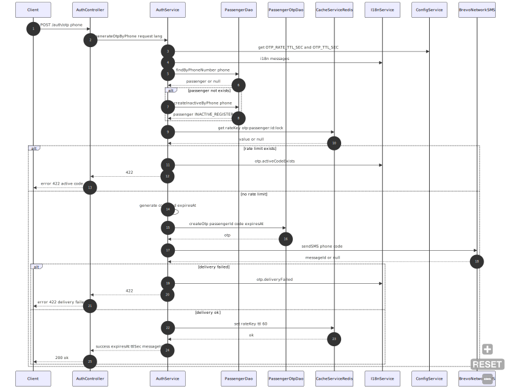
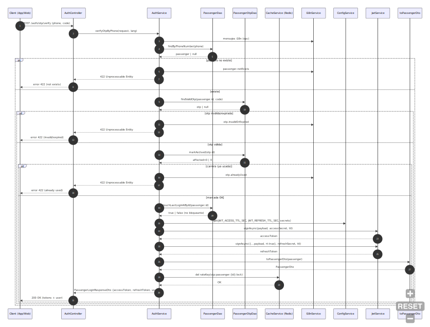

# Módulo 2 · Sesión 4 — Repositorios (OTP: generate + validate)

## Objetivos

1. Implementar el **patrón Repository** en un flujo OTP real.
2. Separar **origen remoto** (API) de la **gestión local de sesión** (tokens).
3. Inyectar dependencias con **Hilt**, manteniendo dominio sin frameworks.
4. Exponer estados de UI con **Flow** y **sealed states**.

## Contenido

1. Patrón Repository: conceptos y Clean Architecture (Android).
2. Dominio: `AuthRepository` + casos de uso OTP.
3. Data: `AuthApi`, DTOs, mapeos y `AuthRepositoryImpl`.
4. Presentación: `SignInViewModel` con `StateFlow`.
5. Inyección con Hilt para producción.
6. Lineamientos de UX/estados y checklist.

---

## 1) Teoría esencial

### Patrón Repository (qué y por qué)

-   **Intención**: ocultar detalles de acceso a datos detrás de una **interfaz del dominio**; la UI y los casos de uso no conocen Retrofit, Room ni DataStore.
-   **Ventajas**: desacople, mantenibilidad, capacidad de cambiar fuentes (red, cache, memoria) sin tocar dominio/UI.

### Repository vs DAO vs Remote Service

-   **Remote Service (Retrofit)**: cliente HTTP (llamadas a la API).
-   **DAO/Store (local)**: persistencia (DB, DataStore).
-   **Repository**: **fachada de dominio** que compone orígenes (remoto/local), aplica **mapeos** DTO→Domain y **políticas** (ej. persistir tokens fuera del repo siguiendo SRP).

### Clean Architecture en Android

-   **Domain**: modelos, **interfaces** de repositorio y **UseCases**. Sin dependencias Android/Retrofit.
-   **Data**: implementaciones concretas (Retrofit/Room/DataStore) + mapeos.
-   **Presentation**: ViewModel consume UseCases y expone estados para la UI.

**Flujo OTP (2 pasos, app de taxi)**

1. **Generate**: usuario ingresa teléfono → API envía OTP y retorna `expiresAt`.
2. **Validate**: usuario ingresa OTP → API retorna `tokens` + `user`. Guardamos **tokens** en un **SessionStore** y decidimos si mostrar **registro** según `user.status`.

**Diagrama (alto nivel)**

```
[Presentation] ──> UseCase ──> AuthRepository (interface, domain)
                                  └─ AuthRepositoryImpl (data)
                                       ├─ AuthApi (Retrofit)        [remoto]
                                       └─ SessionStore (tokens)     [local, fuera del repo]
```

---

## 2) Dominio (Domain Layer)

### Contrato del repositorio

```kotlin
// Comentarios en español
package com.example.android.features.signin.domain.repository

import com.example.android.features.signin.domain.model.SessionTokens
import com.example.android.commons.domain.model.Passenger

data class OtpGenerateResult(val expiresAt: String)

data class OtpValidateResult(
    val tokens: SessionTokens,
    val user: Passenger
)

interface AuthRepository {
    suspend fun otpGenerate(phone: String): OtpGenerateResult
    suspend fun otpValidate(phone: String, code: String): OtpValidateResult
}
```

### Casos de uso

```kotlin
// Comentarios en español
package com.example.android.features.signin.domain.usecase

import com.example.android.features.signin.domain.repository.AuthRepository
import kotlinx.coroutines.flow.Flow
import kotlinx.coroutines.flow.flow

sealed interface OtpGenerateState {
    data object Idle : OtpGenerateState
    data object Loading : OtpGenerateState
    data class Success(val phone: String, val expiresAt: String) : OtpGenerateState
    data class Error(val message: String) : OtpGenerateState
}

class OtpGenerateUseCase(
    private val repo: AuthRepository
) {
    operator fun invoke(phoneReq: String): Flow<OtpGenerateState> = flow {
        val phone = "51$phoneReq" // Normaliza con prefijo país (Perú)
        emit(OtpGenerateState.Loading)

        try {
            val result = repo.otpGenerate(phone = phone)
            emit(OtpGenerateState.Success(phone = phoneReq, expiresAt = result.expiresAt))
        } catch (t: Throwable) {
            emit(OtpGenerateState.Error(t.message ?: "No se pudo enviar el código"))
        }
    }
}
```



```kotlin
// Comentarios en español
package com.example.android.features.signin.domain.usecase

import com.example.android.commons.domain.enum.PassengerStatusEnum
import com.example.android.core.domain.SessionStore
import com.example.android.features.signin.domain.repository.AuthRepository
import kotlinx.coroutines.flow.Flow
import kotlinx.coroutines.flow.flow

sealed interface OtpValidateState {
    data object Idle : OtpValidateState
    data object Loading : OtpValidateState
    data class Success(val showRegister: Boolean) : OtpValidateState
    data class Error(val message: String) : OtpValidateState
}

class OtpValidateUseCase(
    private val repo: AuthRepository,
    private val session: SessionStore
) {
    operator fun invoke(phoneReq: String, code: String): Flow<OtpValidateState> = flow {
        val phone = "51$phoneReq" // Normaliza con prefijo país (Perú)
        emit(OtpValidateState.Loading)

        try {
            val result = repo.otpValidate(phone = phone, code = code)
            session.saveTokens(
                access = result.tokens.accessToken,
                refresh = result.tokens.refreshToken
            )
            if (result.user.status == PassengerStatusEnum.INACTIVE_REGISTER.value) {
                emit(OtpValidateState.Success(true))
            } else {
                emit(OtpValidateState.Success(false))
            }
        } catch (t: Throwable) {
            emit(OtpValidateState.Error(t.message ?: "No se pudo enviar el código"))
        }
    }
}
```



> **Nota**: `SessionTokens`, `Passenger` y `PassengerStatusEnum` se asumen ya definidos en dominio/commons. `SessionStore` pertenece a `core.domain` (ver interfaz mínima abajo).

---

## 3) Data (Data Layer)

### API remota (Retrofit)

```kotlin
// Comentarios en español
package com.example.android.features.signin.data.remote

import com.example.android.features.signin.data.remote.dto.AuthOtpGenerateRequest
import com.example.android.features.signin.data.remote.dto.AuthOtpGenerateResponse
import com.example.android.features.signin.data.remote.dto.AuthOtpValidateRequest
import com.example.android.features.signin.data.remote.dto.AuthOtpValidateResponse
import retrofit2.http.Body
import retrofit2.http.POST

interface AuthApi {
    @POST("auth/otp-generate")
    suspend fun otpGenerate(@Body body: AuthOtpGenerateRequest): AuthOtpGenerateResponse

    @POST("auth/otp-validate")
    suspend fun otpValidate(@Body body: AuthOtpValidateRequest): AuthOtpValidateResponse
}
```

### DTOs y mapeos (DTO → Domain)

```kotlin
// Comentarios en español
package com.example.android.features.signin.data.remote.dto

import com.example.android.commons.domain.model.Passenger
import com.example.android.features.signin.domain.model.SessionTokens
import com.example.android.features.signin.domain.repository.OtpGenerateResult
import com.example.android.features.signin.domain.repository.OtpValidateResult

// Requests
data class AuthOtpGenerateRequest(val phone: String)
data class AuthOtpValidateRequest(val phone: String, val code: String)

// Responses
data class AuthOtpGenerateResponse(val expiresAt: String)
data class AuthOtpValidateResponse(
    val tokens: SessionTokensDto,
    val user: PassengerDto
)

// DTOs internos
data class SessionTokensDto(
    val accessToken: String,
    val refreshToken: String,
    val tokenType: String? = "Bearer",
    val expiresInSeconds: Long? = null
)

data class PassengerDto(
    val id: String,
    val name: String,
    val phone: String,
    val status: String? = null // útil para la lógica de registro
)

// Mappers
fun AuthOtpGenerateResponse.toDomain(): OtpGenerateResult =
    OtpGenerateResult(expiresAt = expiresAt)

fun SessionTokensDto.toDomain(): SessionTokens =
    SessionTokens(
        accessToken = accessToken,
        refreshToken = refreshToken,
        tokenType = tokenType ?: "Bearer",
        expiresInSeconds = expiresInSeconds ?: 0L
    )

fun PassengerDto.toDomain(): Passenger =
    Passenger(id = id, name = name, phone = phone, status = status)

fun AuthOtpValidateResponse.toDomain(): OtpValidateResult =
    OtpValidateResult(tokens = tokens.toDomain(), user = user.toDomain())
```

### Repositorio (implementación concreta)

```kotlin
// Comentarios en español
package com.example.android.features.signin.data.repository

import com.example.android.core.domain.ErrorMapper
import com.example.android.features.signin.data.remote.AuthApi
import com.example.android.features.signin.data.remote.dto.AuthOtpGenerateRequest
import com.example.android.features.signin.data.remote.dto.AuthOtpValidateRequest
import com.example.android.features.signin.data.remote.dto.toDomain
import com.example.android.features.signin.domain.repository.AuthRepository
import com.example.android.features.signin.domain.repository.OtpGenerateResult
import com.example.android.features.signin.domain.repository.OtpValidateResult

class AuthRepositoryImpl(
    private val api: AuthApi
) : AuthRepository {

    override suspend fun otpGenerate(phone: String): OtpGenerateResult {
        return runCatching {
            api.otpGenerate(AuthOtpGenerateRequest(phone = phone)).toDomain()
        }.getOrElse { throw ErrorMapper.map(it) } // Estandariza errores
    }

    override suspend fun otpValidate(phone: String, code: String): OtpValidateResult {
        return runCatching {
            api.otpValidate(AuthOtpValidateRequest(phone = phone, code = code)).toDomain()
        }.getOrElse { throw ErrorMapper.map(it) }
    }
}
```

### SessionStore (interfaz mínima usada por el caso de uso)

```kotlin
// Comentarios en español
package com.example.android.core.domain

interface SessionStore {
    suspend fun saveTokens(access: String, refresh: String)
    suspend fun clearTokens()
}
```

---

## 4) Presentación (Presentation Layer)

### ViewModel (proporcionado)

```kotlin
package com.example.android.features.signin.presentation

import androidx.lifecycle.ViewModel
import androidx.lifecycle.viewModelScope
import com.example.android.core.domain.ErrorMapper
import com.example.android.core.presentation.toReadableMessage
import com.example.android.features.signin.domain.usecase.OtpGenerateState
import com.example.android.features.signin.domain.usecase.OtpGenerateUseCase
import com.example.android.features.signin.domain.usecase.OtpValidateState
import com.example.android.features.signin.domain.usecase.OtpValidateUseCase
import dagger.hilt.android.lifecycle.HiltViewModel
import kotlinx.coroutines.flow.MutableStateFlow
import kotlinx.coroutines.flow.StateFlow
import kotlinx.coroutines.launch
import javax.inject.Inject

@HiltViewModel
class SignInViewModel @Inject constructor(
    private val otpGenerateUseCase: OtpGenerateUseCase,
    private val otpValidateUseCase: OtpValidateUseCase
) : ViewModel() {

    private val _generateOtpUi = MutableStateFlow<OtpGenerateState>(OtpGenerateState.Idle)
    val generateOtpUi: StateFlow<OtpGenerateState> = _generateOtpUi
    fun callGenerateOtp(phone: String) {
        viewModelScope.launch {
            _generateOtpUi.value = OtpGenerateState.Loading
            try {
                otpGenerateUseCase(phone).collect {
                    _generateOtpUi.value = it
                }
            } catch (t: Throwable) {
                val mapped = ErrorMapper.map(t)
                _generateOtpUi.value = OtpGenerateState.Error(message = mapped.toReadableMessage())
            }
        }
    }

    private val _validateOtpUi = MutableStateFlow<OtpValidateState>(OtpValidateState.Idle)
    val validateOtpUi: StateFlow<OtpValidateState> = _validateOtpUi
    fun callValidateOtp(phone: String, code: String) {
        viewModelScope.launch {
            _validateOtpUi.value = OtpValidateState.Loading
            try {
                otpValidateUseCase(phone, code).collect {
                    _validateOtpUi.value = it
                }
            } catch (t: Throwable) {
                val mapped = ErrorMapper.map(t)
                _validateOtpUi.value = OtpValidateState.Error(message = mapped.toReadableMessage())
            }
        }
    }

    fun clearGenerateState() { _generateOtpUi.value = OtpGenerateState.Idle }
    fun clearValidateState() { _validateOtpUi.value = OtpValidateState.Idle }
}
```

---

## 5) Inyección con Hilt (producción)

> Se asume que `Retrofit` base ya está provisto en un módulo central (timeout, interceptores, baseUrl). Aquí se proveen `AuthApi`, repositorio y casos de uso.

```kotlin
// Comentarios en español
package com.example.android.features.signin.di

import com.example.android.core.domain.SessionStore
import com.example.android.features.signin.data.remote.AuthApi
import com.example.android.features.signin.data.repository.AuthRepositoryImpl
import com.example.android.features.signin.domain.repository.AuthRepository
import com.example.android.features.signin.domain.usecase.OtpGenerateUseCase
import com.example.android.features.signin.domain.usecase.OtpValidateUseCase
import dagger.Binds
import dagger.Module
import dagger.Provides
import dagger.hilt.InstallIn
import dagger.hilt.components.SingletonComponent
import retrofit2.Retrofit
import javax.inject.Singleton

@Module
@InstallIn(SingletonComponent::class)
object AuthNetworkModule {

    @Provides @Singleton
    fun provideAuthApi(retrofit: Retrofit): AuthApi =
        retrofit.create(AuthApi::class.java)

    @Provides @Singleton
    fun provideOtpGenerateUseCase(repo: AuthRepository): OtpGenerateUseCase =
        OtpGenerateUseCase(repo)

    @Provides @Singleton
    fun provideOtpValidateUseCase(
        repo: AuthRepository,
        sessionStore: SessionStore
    ): OtpValidateUseCase = OtpValidateUseCase(repo, sessionStore)
}

@Module
@InstallIn(SingletonComponent::class)
abstract class AuthBindModule {
    @Binds @Singleton
    abstract fun bindAuthRepository(impl: AuthRepositoryImpl): AuthRepository
}
```

---

## 6) Lineamientos de UX/Estados

-   **Generate**

    -   Mostrar `Loading` mientras se solicita OTP.
    -   Mostrar `Success(phone, expiresAt)` y arrancar countdown.
    -   Volver a `Idle` con `clearGenerateState()` al abandonar la pantalla.

-   **Validate**

    -   Mostrar `Loading` mientras valida OTP.
    -   Si `Success(showRegister = true)`: redirigir al flujo de **registro**.
    -   Si `false`: navegar al **home** autenticado.
    -   Volver a `Idle` con `clearValidateState()` al retroceder.

-   **Errores**
    -   Mapear con `ErrorMapper.map(t).toReadableMessage()` para mensajes consistentes y localizables.

---

## Checklist de calidad

-   Dominio **sin dependencias** de frameworks.
-   `AuthRepository` **no filtra** detalles de Retrofit ni DTOs.
-   Mapeos DTO→Domain centralizados (`dto.toDomain()`).
-   `SessionStore` separado del repositorio (SRP).
-   Hilt: módulos de `Api`, `Repository` y **UseCases**.
-   ViewModel usa `StateFlow` con **sealed states** para UI predecible.
