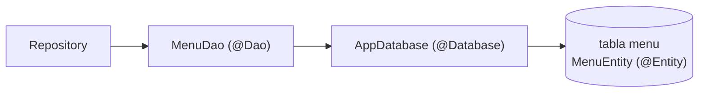
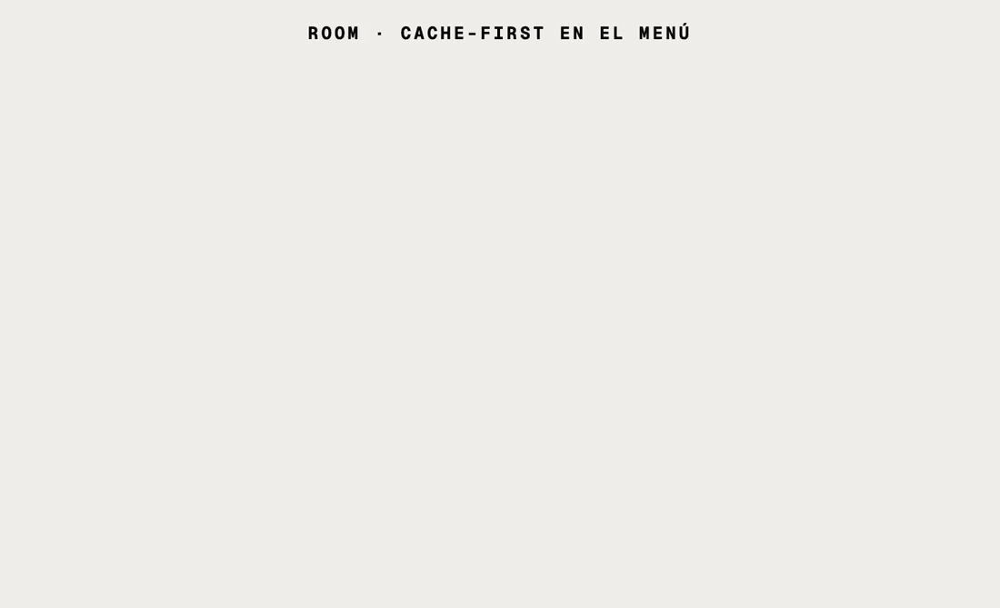

# Módulo 3 · Sesión 1

## Room: base de datos local

---

## Objetivos

1. Entender qué resuelve **Room** y cuáles son sus tres piezas: **Entity**, **DAO** y **Database**.
2. Agregar Room a un proyecto real con **KSP** y **Hilt**.
3. Leer datos como **Flow**: la pantalla se actualiza sola cuando cambia la tabla.
4. Aplicar el patrón **cache-first**: la pantalla lee de Room y la red solo escribe en Room.
5. Saber qué hacer cuando el esquema cambia (**migraciones**).

---

## Contenido

1. Qué es Room y qué necesita
2. Qué construimos: el menú del pasajero
3. Room paso a paso en `android-app-taxi`
4. Cómo quedó integrado en el proyecto de taxi
5. Ejecutar y probar
6. Checklist, conclusiones y práctica

---

## 1) Qué es Room y qué necesita

Android trae **SQLite**. Usarlo directo obliga a escribir SQL en cadenas de texto, leer cada columna con `Cursor` y controlar los hilos a mano. **Room** es una capa sobre SQLite que genera ese código por ti.

| Con SQLite directo                          | Con Room                                                  |
| ------------------------------------------- | --------------------------------------------------------- |
| SQL en `String`; los errores aparecen al ejecutar | Las consultas se validan **al compilar**             |
| `Cursor` y `ContentValues` a mano           | Convierte filas ⇄ `data class` automáticamente            |
| Hilos y callbacks manuales                  | Funciones `suspend` y `Flow`                              |
| La pantalla debe volver a consultar         | El `Flow` emite solo cuando la tabla cambia               |

Room necesita **tres piezas**:

| Pieza        | Anotación   | Qué es                                            | En esta clase  |
| ------------ | ----------- | ------------------------------------------------- | -------------- |
| **Entity**   | `@Entity`   | Una tabla. Cada propiedad es una columna          | `MenuEntity`   |
| **DAO**      | `@Dao`      | Las operaciones sobre la tabla (leer, guardar, borrar) | `MenuDao` |
| **Database** | `@Database` | La base: lista de tablas, versión y acceso a los DAOs | `AppDatabase` |



| Usa Room cuando…                                         | No hace falta cuando…                                     |
| -------------------------------------------------------- | --------------------------------------------------------- |
| Guardas **listas** o datos con estructura                | Son 2 o 3 valores sueltos (usa SharedPreferences o DataStore: clase 02) |
| Quieres mostrar datos **sin conexión** o al instante     | El dato solo vive mientras la pantalla está abierta       |
| Necesitas filtrar, ordenar o relacionar datos            | Es un secreto, como un token (va cifrado, ver módulo 2)   |

> **Versión.** El proyecto usa **Room 3** (`androidx.room3`), la versión mayor vigente. Es el sucesor de Room 2 (`androidx.room`): mismas anotaciones, pero solo Kotlin + KSP, y `room-ktx` ya no existe porque las corrutinas vienen incluidas.

---

## 2) Qué construimos: el menú del pasajero

En Home aparece un botón circular que abre el **menú**. Las opciones vienen del backend (`GET /menu/active/PASSENGER`) y se guardan en Room. La segunda vez que abres el menú aparece **al instante**, incluso sin Internet.



La idea central de la clase está en la animación:

1. La pantalla **siempre** pinta lo que hay en Room.
2. La red **no** entrega datos a la pantalla: los guarda en Room.
3. Room avisa del cambio por el `Flow` y la pantalla se actualiza sola.
4. Si la red falla, lo guardado sigue ahí.

### Proyectos de la clase

| Proyecto                                      | Qué es                                                    | Guía                                   |
| --------------------------------------------- | --------------------------------------------------------- | -------------------------------------- |
| [`infra-app-taxi`](./infra-app-taxi)          | MySQL 9.7, Redis 8.10 y la API con Docker Compose         | [README](./infra-app-taxi/README.md)   |
| [`backend-app-taxi`](./backend-app-taxi)      | API NestJS 12: OTP + `GET /menu/active/:application`      | [README](./backend-app-taxi/README.md) |
| [`android-app-taxi`](./android-app-taxi)      | App Android (Compose + Hilt + Retrofit + **Room**)        | [README](./android-app-taxi/README.md) |
| [`design-m03-c01.pen`](./design-m03-c01.pen)  | Diseño: se agrega la sección «4 · Menú (Room)» y el botón de menú en Home | —                      |

Los tres proyectos parten **tal cual** del módulo 2 · clase 04 (inicio de sesión con OTP). Esta clase solo agrega el menú.

### Pantalla y estados


| ¿Hay datos en Room? | Sincronización | Qué ve el usuario                                   |
| ------------------- | -------------- | --------------------------------------------------- |
| No                  | Cargando       | Skeleton                                            |
| Sí                  | Cargando       | La lista guardada + barra de progreso               |
| Sí                  | Terminó        | La lista actualizada                                |
| Sí                  | Falló          | La lista guardada + toast rojo                      |
| No                  | Falló          | Mensaje de error y botón «Reintentar»               |

---

## 3) Room paso a paso en `android-app-taxi`

> Todo el código de esta sección es el del proyecto.

### Paso 1 · Dependencias

Room necesita la librería, su **compilador** (genera el código con KSP) y, para exportar el esquema, su plugin de Gradle.

```toml
# gradle/libs.versions.toml
[versions]
room = "3.0.3"

[libraries]
room-runtime = { module = "androidx.room3:room3-runtime", version.ref = "room" }
room-compiler = { module = "androidx.room3:room3-compiler", version.ref = "room" }

[plugins]
room = { id = "androidx.room3", version.ref = "room" }
```

```kotlin
// build.gradle.kts (raíz)
alias(libs.plugins.room) apply false

// app/build.gradle.kts
plugins {
    alias(libs.plugins.ksp)      // ya estaba (Hilt)
    alias(libs.plugins.room)
}

room3 {
    schemaDirectory("$projectDir/schemas")   // aquí se guarda el esquema de cada versión
}

dependencies {
    implementation(libs.room.runtime)
    ksp(libs.room.compiler)
}
```

### Paso 2 · La tabla: `@Entity`

Una `data class` por tabla. `@PrimaryKey` es obligatorio.

```kotlin
// features/menu/data/local/MenuEntity.kt
@Entity(tableName = "menu")
data class MenuEntity(
    @PrimaryKey val id: String,
    val text: String,
    val icon: String,
    val deeplink: String,
    val position: Int,
    @ColumnInfo(name = "updated_at") val updatedAt: Long
)
```

Las columnas se llaman `id` y `position` (no `key` ni `order`) porque esas dos son palabras reservadas de SQL.

### Paso 3 · Las operaciones: `@Dao`

Una interfaz. Tú declaras **qué** quieres y Room escribe el **cómo**.

```kotlin
// features/menu/data/local/MenuDao.kt
@Dao
interface MenuDao {

    @Query("SELECT * FROM menu ORDER BY position ASC")
    fun observeAll(): Flow<List<MenuEntity>>

    @Upsert
    suspend fun upsertAll(items: List<MenuEntity>)

    @Query("DELETE FROM menu")
    suspend fun clear()

    @Transaction
    suspend fun replaceAll(items: List<MenuEntity>) {
        clear()
        upsertAll(items)
    }
}
```

| Declaración               | Qué significa                                                                 |
| ------------------------- | ----------------------------------------------------------------------------- |
| Devuelve `Flow` (sin `suspend`) | Lectura **observable**: emite la lista ahora y cada vez que la tabla cambie |
| `suspend fun`             | Operación de una sola vez; Room la ejecuta fuera del hilo principal            |
| `@Upsert`                 | Inserta; si la clave primaria ya existe, actualiza                             |
| `@Transaction`            | Todo o nada: nadie ve la tabla vacía entre `clear()` y `upsertAll()`          |

Si escribes mal la consulta (`SELECT * FROM menus`), el proyecto **no compila**.

### Paso 4 · La base: `@Database`

```kotlin
// core/data/AppDatabase.kt
@Database(
    entities = [MenuEntity::class],
    version = 1,
    exportSchema = true
)
abstract class AppDatabase : RoomDatabase() {
    abstract fun menuDao(): MenuDao

    companion object {
        const val NAME = "app_taxi.db"
    }
}
```

Al compilar, Room genera la implementación y guarda el esquema en `app/schemas/…/1.json`. Ese archivo **se sube a git**: es la foto de la versión 1 y Room la usará para validar migraciones.

### Paso 5 · Crear la base una sola vez (Hilt)

Abrir la base es costoso: debe existir **una** instancia para toda la app.

```kotlin
// core/data/DatabaseModule.kt
@Module
@InstallIn(SingletonComponent::class)
object DatabaseModule {

    @Provides @Singleton
    fun provideAppDatabase(@ApplicationContext ctx: Context): AppDatabase =
        Room.databaseBuilder<AppDatabase>(ctx, AppDatabase.NAME).build()

    @Provides @Singleton
    fun provideLocalCache(db: AppDatabase): LocalCache =
        LocalCache { db.clearAllTables() }
}

// features/menu/MenuModule.kt
@Provides
fun provideMenuDao(db: AppDatabase): MenuDao = db.menuDao()
```

**Con esto Room ya funciona.** Los pasos que siguen lo conectan con la arquitectura del proyecto.

### Paso 6 · El dominio no sabe que existe Room

```kotlin
// features/menu/domain/model/Menu.kt
data class Menu(val key: String, val text: String, val icon: String, val deeplink: String, val order: Int)

// features/menu/domain/repository/MenuRepository.kt
interface MenuRepository {
    fun observeMenu(): Flow<List<Menu>>
    suspend fun refreshMenu()
}
```

Dos operaciones separadas: **observar** lo guardado y **refrescar** desde el servidor.

### Paso 7 · API y mapeos

Cada capa tiene su propio modelo. El DTO se convierte en Entity para guardarse, y la Entity en modelo de dominio para mostrarse.

```kotlin
// features/menu/data/remote/MenuApi.kt
interface MenuApi {
    @GET("menu/active/PASSENGER")
    suspend fun getMenu(): List<MenuDto>
}

// JSON → tabla
fun MenuDto.toEntity(updatedAt: Long): MenuEntity = MenuEntity(
    id = key, text = text, icon = icon, deeplink = deeplink, position = order, updatedAt = updatedAt
)

// tabla → dominio
fun MenuEntity.toDomain(): Menu = Menu(
    key = id, text = text, icon = icon, deeplink = deeplink, order = position
)
```

El token viaja solo: `AuthInterceptor` (módulo 2) ya agrega `Authorization: Bearer …` a todas las peticiones.

### Paso 8 · El repositorio une red y Room

```kotlin
// features/menu/data/repository/MenuRepositoryImpl.kt
class MenuRepositoryImpl(
    private val api: MenuApi,
    private val dao: MenuDao,
    private val now: () -> Long = System::currentTimeMillis
) : MenuRepository {

    override fun observeMenu(): Flow<List<Menu>> =
        dao.observeAll().map { entities -> entities.map { it.toDomain() } }

    override suspend fun refreshMenu() = safeCall {
        val updatedAt = now()
        val remote = api.getMenu()
        dao.replaceAll(remote.map { it.toEntity(updatedAt) })
    }
}
```

`refreshMenu()` **no devuelve la lista**. Guarda en Room y termina; quien observa `observeMenu()` recibe los datos nuevos. Si `api.getMenu()` falla, `replaceAll` nunca se ejecuta y la tabla queda como estaba.

`safeCall` es el mismo bloque que la clase anterior tenía dentro de `AuthRepositoryImpl`; como ahora lo usan dos repositorios, subió a `core/data/SafeCall.kt`.

### Paso 9 · Casos de uso

```kotlin
// features/menu/domain/usecase/ObserveMenuUseCase.kt
class ObserveMenuUseCase(private val repo: MenuRepository) {
    operator fun invoke(): Flow<List<Menu>> = repo.observeMenu()
}

// features/menu/domain/usecase/RefreshMenuUseCase.kt
sealed interface RefreshMenuState {
    data object Idle : RefreshMenuState
    data object Loading : RefreshMenuState
    data object Success : RefreshMenuState
    data class Error(val message: String) : RefreshMenuState
}

class RefreshMenuUseCase(private val repo: MenuRepository) {
    operator fun invoke(): Flow<RefreshMenuState> = flow {
        emit(RefreshMenuState.Loading)
        repo.refreshMenu()
        emit(RefreshMenuState.Success)
    }.catch { emit(RefreshMenuState.Error(it.toDomainException().message)) }
}
```

`RefreshMenuState` no lleva datos: solo dice **cómo va la sincronización**.

### Paso 10 · ViewModel

```kotlin
// features/menu/presentation/MenuViewModel.kt
@HiltViewModel
class MenuViewModel @Inject constructor(
    observeMenuUseCase: ObserveMenuUseCase,
    private val refreshMenuUseCase: RefreshMenuUseCase
) : ViewModel() {

    val menu: StateFlow<List<Menu>> = observeMenuUseCase()
        .stateIn(viewModelScope, SharingStarted.WhileSubscribed(STOP_TIMEOUT_MS), emptyList())

    private val _refreshUi = MutableStateFlow<RefreshMenuState>(RefreshMenuState.Idle)
    val refreshUi: StateFlow<RefreshMenuState> = _refreshUi.asStateFlow()

    init {
        refresh()
    }

    fun refresh() {
        if (_refreshUi.value is RefreshMenuState.Loading) return
        refreshMenuUseCase()
            .onEach { _refreshUi.value = it }
            .launchIn(viewModelScope)
    }
}
```

Dos estados independientes: `menu` (lo que hay en Room) y `refreshUi` (la sincronización). `stateIn` convierte el `Flow` de Room en un `StateFlow` que Compose puede recolectar.

### Paso 11 · La pantalla combina los dos estados

```kotlin
// features/menu/presentation/MenuScreen.kt (extracto)
val refreshing = refresh is RefreshMenuState.Loading || refresh is RefreshMenuState.Idle

when {
    items.isNotEmpty() -> MenuList(items = items, onMenuClick = onMenuClick)
    refreshing -> MenuSkeleton()
    else -> MenuEmpty(message = errorMessage ?: "No hay opciones disponibles", onRetry = onRetry)
}
```

Si Room tiene datos, **se muestran siempre**, sin importar cómo vaya la red. Por eso el menú funciona sin conexión.

Como en las pantallas anteriores, `MenuRoute` obtiene el ViewModel y `MenuScreen` solo recibe estado, así cada estado tiene su `@Preview`.

### Paso 12 · Limpiar al cerrar sesión

Lo guardado pertenece a la sesión. `home` no puede depender de `menu`, así que usa un contrato de `core`:

```kotlin
// core/domain/LocalCache.kt
fun interface LocalCache {
    suspend fun clear()
}

// features/home/domain/usecase/SignOutUseCase.kt
class SignOutUseCase(
    private val session: SessionStore,
    private val localCache: LocalCache
) {
    suspend operator fun invoke() {
        session.clear()
        localCache.clear()     // db.clearAllTables()
    }
}
```

### Paso 13 · Cuando la tabla cambie: migraciones

Si agregas una columna y **no** subes `version`, la app se cierra al abrir la base. La regla:

1. Cambia la entidad.
2. Sube `version` en `@Database` (de 1 a 2).
3. Dile a Room cómo pasar de una versión a otra.

```kotlin
// Opción A: automática (cambios simples, como agregar una columna con valor por defecto)
@Database(
    entities = [MenuEntity::class],
    version = 2,
    autoMigrations = [AutoMigration(from = 1, to = 2)]
)

// Opción B: manual
val MIGRATION_1_2 = object : Migration(1, 2) {
    override suspend fun migrate(connection: SQLiteConnection) {
        connection.execSQL("ALTER TABLE menu ADD COLUMN badge TEXT")
    }
}

Room.databaseBuilder<AppDatabase>(ctx, AppDatabase.NAME)
    .addMigrations(MIGRATION_1_2)
    .build()
```

| Opción                                   | Cuándo                                                          |
| ---------------------------------------- | --------------------------------------------------------------- |
| `autoMigrations`                         | Cambios simples. Necesita los `schemas/*.json` de ambas versiones |
| `Migration` manual                       | Renombrar, dividir tablas, transformar datos                    |
| `fallbackToDestructiveMigration(true)`   | Solo si los datos son una caché que se puede volver a descargar: **borra todo** |

El proyecto sigue en la versión 1, por eso todavía no tiene migraciones.

### Paso 14 · Pruebas

| Prueba                    | Tipo          | Cómo                                                                    |
| ------------------------- | ------------- | ----------------------------------------------------------------------- |
| `MenuRepositoryImplTest`  | JVM           | `FakeMenuApi` + `FakeMenuDao` (una tabla en memoria con `MutableStateFlow`) |
| `RefreshMenuUseCaseTest`  | JVM           | `FakeMenuRepository`                                                    |
| `MenuDaoTest`             | Instrumentada | Room real con `Room.inMemoryDatabaseBuilder<AppDatabase>(context)`      |

```kotlin
// app/src/androidTest/.../features/menu/MenuDaoTest.kt
@Test
fun replaceAll_removesRowsMissingFromTheNewList() = runBlocking {
    dao.upsertAll(listOf(entity("home", 1), entity("old", 2)))

    dao.replaceAll(listOf(entity("home", 1), entity("support", 2)))

    assertEquals(listOf("home", "support"), dao.observeAll().first().map { it.id })
}
```

```bash
./gradlew testDebugUnitTest            # 29 pruebas JVM
./gradlew connectedDebugAndroidTest    # 10 instrumentadas (necesita emulador)
```

---

## 4) Cómo quedó integrado en el proyecto de taxi

Punto de partida: los tres proyectos del módulo 2 · clase 04, sin cambios.

### `android-app-taxi`

| Archivo                                                        | Estado     | Qué aporta                                                  |
| -------------------------------------------------------------- | ---------- | ----------------------------------------------------------- |
| `gradle/libs.versions.toml`, `build.gradle.kts`, `app/build.gradle.kts` | Modificado | Room 3, plugin `androidx.room3`, carpeta de esquemas |
| `app/schemas/…/AppDatabase/1.json`                             | **Nuevo**  | Esquema exportado de la versión 1                           |
| `core/data/AppDatabase.kt`, `DatabaseModule.kt`                | **Nuevo**  | La base y su instancia única                                |
| `core/data/SafeCall.kt`                                        | **Nuevo**  | `safeCall` compartido (antes privado en `AuthRepositoryImpl`) |
| `core/domain/LocalCache.kt`                                    | **Nuevo**  | Contrato para vaciar los datos locales                      |
| `features/menu/**`                                             | **Nuevo**  | Feature completa: `data/local`, `data/remote`, `domain`, `presentation`, `MenuModule` |
| `features/splash/**` (`SplashViewModel`, `HasSessionUseCase`, `SplashModule`) | **Nuevo** | Con sesión guardada, Splash va directo a Home |
| `features/home/**`                                             | Modificado | Botón de menú; `SignOutUseCase` también limpia Room         |
| `core/presentation/activity/MainActivity.kt`                   | Modificado | Ruta `menu` y decisión de Splash                            |
| `features/signin/data/repository/AuthRepositoryImpl.kt`        | Modificado | Usa el `safeCall` compartido                                |

```
features/menu/
├─ MenuModule.kt                       // Paso 5 · Hilt
├─ data/
│  ├─ local/MenuEntity.kt              // Paso 2 · @Entity
│  ├─ local/MenuDao.kt                 // Paso 3 · @Dao
│  ├─ remote/MenuApi.kt                // Paso 7 · Retrofit
│  ├─ remote/dto/MenuDto.kt            // Paso 7 · DTO + toEntity()
│  └─ repository/MenuRepositoryImpl.kt // Paso 8
├─ domain/
│  ├─ model/Menu.kt                    // Paso 6
│  ├─ repository/MenuRepository.kt     // Paso 6
│  └─ usecase/                         // Paso 9
└─ presentation/                       // Pasos 10 y 11
core/data/{AppDatabase,DatabaseModule}.kt   // Pasos 4 y 5
```

### `backend-app-taxi`

| Archivo                                             | Estado     | Qué aporta                                                       |
| --------------------------------------------------- | ---------- | ---------------------------------------------------------------- |
| `features/menu/**`                                  | **Nuevo**  | `GET /menu/active/:application` (controller, service, dao, entity, dto, mapper) |
| `core/http/guard/access-token.guard.ts`             | **Nuevo**  | Primer endpoint protegido: exige el `accessToken` del login      |
| `core/database/migrations/1760371904959-schema.ts`  | **Nuevo**  | Migración incremental: crea `entity_menu`                        |
| `core/database/seeders/menu-seed.ts`, `data/menus.json` | **Nuevo** | Cuatro opciones iniciales para `PASSENGER`                    |
| `core/i18n/{es,en}/auth.json`                       | Modificado | Mensaje `unauthorized` del 401                                   |
| `app.module.ts`, `core/cli/run-seeders.ts`          | Modificado | Registra `MenuModule` y el nuevo seeder                          |

### `infra-app-taxi`

| Archivo                   | Estado     | Qué aporta                                                  |
| ------------------------- | ---------- | ----------------------------------------------------------- |
| `docker-compose.http.yml` | Modificado | Variable opcional `MENU_CACHE_TTL_SEC` (60 s por defecto)   |

Si ya tienes el stack de la clase anterior, **no lo borres**: al levantar la API desde esta carpeta se aplica solo la migración nueva. Ver [«Actualizar un stack existente»](./infra-app-taxi/README.md#5-actualizar-un-stack-existente-de-la-clase-anterior).

### Diseño

`design-m03-c01.pen` es el diseño de la clase anterior más: el botón de menú en Home y la sección **«4 · Menú (Room)»** con sus cinco estados.

---

## 5) Ejecutar y probar

Orden: **infra → backend → app** (igual que en la clase anterior).

1. `infra-app-taxi`: levanta MySQL, Redis y la API ([README](./infra-app-taxi/README.md)). En el log verás `Menú registrado: passenger_home…`.
2. `android-app-taxi`: cambia `API_BASE_URL` a `http://10.0.2.2:3001/` y ejecuta en el emulador.
3. Prueba:

| Acción                                                          | Qué verás                                                        |
| --------------------------------------------------------------- | ---------------------------------------------------------------- |
| Iniciar sesión y pulsar el botón de menú                        | Skeleton y luego 4 opciones                                      |
| Volver y abrir el menú otra vez                                 | Las opciones al instante + barra de progreso                     |
| Apagar el backend y abrir el menú                               | Las opciones guardadas + toast rojo «No se pudo conectar…»       |
| Esperar 15 minutos con el backend arriba y abrir el menú        | Las opciones guardadas + toast «Tu sesión expiró…» (el access token venció; el refresh token se implementa en la clase 03) |
| Cerrar la app, **modo avión**, abrirla                          | Va directo a Home y el menú sigue mostrando las opciones         |
| Cambiar un `text` en `entity_menu` (MySQL), esperar 60 s y abrir el menú | El texto nuevo aparece sin tocar la app                  |
| Cerrar sesión y mirar la tabla en Database Inspector            | La tabla `menu` queda vacía (`clearAllTables()`)                 |

**Ver la base de datos:** en Android Studio, *View → Tool Windows → App Inspection → Database Inspector* → `app_taxi.db` → tabla `menu`. Activa *Live updates* y observa cómo cambia al abrir el menú.

**Versiones nuevas de la clase** (el resto no cambia respecto al módulo 2 · clase 04):

| Componente                                   | Versión |
| -------------------------------------------- | ------- |
| Room (`room3-runtime`, `room3-compiler`, plugin `androidx.room3`) | 3.0.3 |

---

## 6) Checklist, conclusiones y práctica

### Checklist

-   [ ] Las tres piezas existen: `@Entity`, `@Dao` y `@Database`.
-   [ ] El compilador de Room va con `ksp(...)`, no con `implementation(...)`.
-   [ ] La base se crea **una vez** (`@Singleton`).
-   [ ] Las lecturas que alimentan la pantalla devuelven `Flow`; las escrituras son `suspend`.
-   [ ] Reemplazar una tabla completa se hace dentro de `@Transaction`.
-   [ ] `exportSchema = true` y la carpeta `schemas/` está en git.
-   [ ] Ningún archivo de `domain` importa `androidx.room3`.
-   [ ] La pantalla lee de Room; la red solo escribe en Room.
-   [ ] Al cerrar sesión se limpian los datos locales.

### Conclusiones

-   Room son **tres piezas**: tabla (`@Entity`), operaciones (`@Dao`) y base (`@Database`).
-   Un DAO que devuelve `Flow` convierte la base de datos en una fuente **reactiva**.
-   Con **cache-first**, Room es la única fuente de la pantalla: la app responde al instante y funciona sin conexión.
-   Gracias al repositorio de la clase anterior, agregar Room no tocó el dominio de las otras features.

### Práctica propuesta

1. **Última actualización**: muestra bajo el título «Actualizado hace X min» usando `updated_at`. Agrega al DAO una consulta `SELECT MAX(updated_at) FROM menu` que devuelva `Flow<Long?>`.
2. **Sincronizar solo si hace falta**: en `RefreshMenuUseCase`, no llames a la red si la última actualización tiene menos de 5 minutos.
3. **Migración real**: agrega la columna `badge` (texto opcional) a `MenuEntity`, sube la versión a 2 con `autoMigrations` y comprueba que se generó `schemas/…/2.json`.
4. **Buscar en el menú**: agrega al DAO una consulta `SELECT * FROM menu WHERE text LIKE '%' || :query || '%'` que devuelva `Flow` y un campo de búsqueda en la pantalla.

---

## Recursos recomendados

-   [Guardar datos en una base de datos local con Room](https://developer.android.com/training/data-storage/room) (Android Developers).
-   [Notas de versión de Room 3](https://developer.android.com/jetpack/androidx/releases/room3).
-   [Migrar bases de datos de Room](https://developer.android.com/training/data-storage/room/migrating-db-versions).
-   [Depurar la base de datos con Database Inspector](https://developer.android.com/studio/inspect/database).
