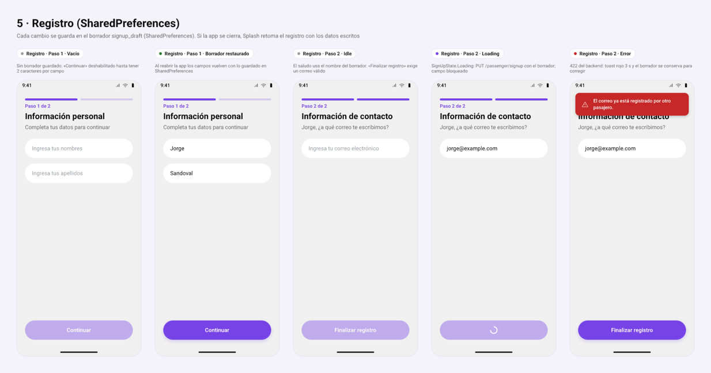

# Módulo 3 · Sesión 2

## SharedPreferences: datos pequeños que sobreviven al cierre de la app

---

## Objetivos

1. Entender qué es **SharedPreferences**, qué necesita y cuándo usarlo.
2. Leer y escribir valores correctamente (`apply()` vs `commit()`).
3. Ocultarlo detrás de un **contrato del dominio**, igual que un repositorio.
4. Guardar el avance de un **formulario de 2 pasos** y retomarlo si la app se cierra.
5. Conocer la alternativa moderna, **DataStore**, y cuándo migrar.

---

## Contenido

1. Qué es SharedPreferences y qué necesita
2. Qué construimos: el registro del pasajero
3. SharedPreferences paso a paso en `android-app-taxi`
4. La alternativa moderna: DataStore
5. Cómo quedó integrado en el proyecto de taxi
6. Ejecutar y probar
7. Checklist, conclusiones y práctica

---

## 1) Qué es SharedPreferences y qué necesita

Es un **archivo XML de pares clave–valor** dentro del almacenamiento privado de la app (`/data/data/<paquete>/shared_prefs/<nombre>.xml`). Viene con Android: **no necesita ninguna dependencia**.

| Pieza                 | Qué es                                                  | Ejemplo                                              |
| --------------------- | ------------------------------------------------------- | ---------------------------------------------------- |
| **Archivo**           | Se identifica por un nombre                             | `context.getSharedPreferences("signup_draft", MODE_PRIVATE)` |
| **Lectura**           | Directa, con valor por defecto                          | `prefs.getString("email", null)`                     |
| **Editor**            | Agrupa los cambios y los confirma                       | `prefs.edit { putString("email", value) }`           |
| **Listener** (opcional) | Avisa cuando una clave cambia                         | `registerOnSharedPreferenceChangeListener`           |

Tipos que acepta: `String`, `Int`, `Long`, `Float`, `Boolean` y `Set<String>`.

### `apply()` vs `commit()`

| Método     | Memoria        | Disco                         | Úsalo                                         |
| ---------- | -------------- | ----------------------------- | --------------------------------------------- |
| `apply()`  | Al instante    | En segundo plano              | **Casi siempre**. Se puede llamar desde el hilo principal |
| `commit()` | Al instante    | En el mismo hilo, bloqueando  | Solo si necesitas saber si se escribió, y fuera del hilo principal |

`prefs.edit { … }` (de `androidx.core:core-ktx`, que el proyecto ya tiene) usa `apply()` por defecto.

### Cuándo usarlo

| Úsalo para…                                           | No lo uses para…                                             |
| ----------------------------------------------------- | ------------------------------------------------------------ |
| Banderas y preferencias (`onboarding_done`, tema)     | Listas o datos con estructura → **Room** (clase 01)          |
| El avance de un formulario corto                      | Secretos en texto plano → cifra antes de guardar (módulo 2 · clase 03) |
| Pocos valores que se leen al iniciar                  | Datos que cambian muchas veces por segundo                   |

### Cómo ha evolucionado

| Opción                       | Estado hoy                                                              |
| ---------------------------- | ----------------------------------------------------------------------- |
| `SharedPreferences`          | Vigente y sin dependencias. Sencillo, pero sin tipos ni corrutinas      |
| `EncryptedSharedPreferences` | **Obsoleta** (`androidx.security:security-crypto`). El proyecto cifra los tokens con `javax.crypto` + Android Keystore |
| **DataStore**                | Recomendada por Google para código nuevo: corrutinas, `Flow` y escrituras seguras (sección 4) |

---

## 2) Qué construimos: el registro del pasajero

Un pasajero nuevo valida su OTP y llega al **registro**: paso 1 (nombres y apellidos) y paso 2 (correo). Cada cosa que escribe se guarda en SharedPreferences. Si cierra la app a la mitad, al volver **sigue donde estaba, con sus datos**.


1. Cada cambio del formulario se guarda en el archivo `signup_draft`.
2. La app se cierra; el archivo sigue en el disco.
3. Al abrirla, Splash ve que hay un registro pendiente y lo retoma con el borrador.
4. Al finalizar, se envía al backend y el borrador se borra.

### Proyectos de la clase

| Proyecto                                      | Qué es                                                        | Guía                                   |
| --------------------------------------------- | ------------------------------------------------------------- | -------------------------------------- |
| [`infra-app-taxi`](./infra-app-taxi)          | MySQL 9.7, Redis 8.10 y la API con Docker Compose             | [README](./infra-app-taxi/README.md)   |
| [`backend-app-taxi`](./backend-app-taxi)      | API NestJS 12: OTP, menú y **`PUT /passenger/signup`**        | [README](./backend-app-taxi/README.md) |
| [`android-app-taxi`](./android-app-taxi)      | App Android (Compose + Hilt + Retrofit + Room + **SharedPreferences**) | [README](./android-app-taxi/README.md) |
| [`design-m03-c02.pen`](./design-m03-c02.pen)  | Diseño: se agrega la sección «5 · Registro (SharedPreferences)» | —                                    |
| [`DataStore`](./DataStore)                    | Proyecto independiente de ejemplo con DataStore (sección 4)   | —                                      |

Los tres proyectos parten **tal cual** de la clase 01 (OTP + menú con Room). Esta clase solo agrega el registro.

### Pantallas y estados



| Pantalla | Estado              | Qué ve el usuario                                              |
| -------- | ------------------- | -------------------------------------------------------------- |
| Paso 1   | Borrador vacío      | Campos vacíos y «Continuar» deshabilitado                      |
| Paso 1   | Borrador restaurado | Lo que escribió antes de cerrar la app                         |
| Paso 2   | Idle                | Saludo con su nombre; «Finalizar registro» exige un correo válido |
| Paso 2   | Loading             | Spinner en el botón                                            |
| Paso 2   | Error               | Toast rojo («El correo ya está registrado…»); el borrador se conserva |
| Paso 2   | Success             | Navega a Home y el borrador se borra                           |

---

## 3) SharedPreferences paso a paso en `android-app-taxi`

> Todo el código de esta sección es el del proyecto.

### Paso 1 · Dependencias

Ninguna. SharedPreferences es parte de Android y `prefs.edit { }` viene de `core-ktx`, que ya estaba.

### Paso 2 · Qué se guarda y el contrato

Primero el dominio: qué datos tiene el borrador y qué operaciones necesita el negocio. Aquí todavía no aparece SharedPreferences.

```kotlin
// features/signup/domain/model/SignUpDraft.kt
data class SignUpDraft(
    val givenName: String = "",
    val familyName: String = "",
    val email: String = ""
)

// features/signup/domain/store/SignUpDraftStore.kt
interface SignUpDraftStore {
    suspend fun get(): SignUpDraft
    suspend fun savePersonal(givenName: String, familyName: String)
    suspend fun saveEmail(email: String)
    suspend fun clear()
}
```

Hay una función de guardado por paso: el paso 2 guarda el correo sin tocar los nombres.

### Paso 3 · La implementación con SharedPreferences

```kotlin
// features/signup/data/local/SignUpDraftStorePrefs.kt
class SignUpDraftStorePrefs(
    private val prefs: SharedPreferences
) : SignUpDraftStore {

    override suspend fun get(): SignUpDraft = withContext(Dispatchers.IO) {
        SignUpDraft(
            givenName = prefs.getString(KEY_GIVEN_NAME, null).orEmpty(),
            familyName = prefs.getString(KEY_FAMILY_NAME, null).orEmpty(),
            email = prefs.getString(KEY_EMAIL, null).orEmpty()
        )
    }

    override suspend fun savePersonal(givenName: String, familyName: String) {
        prefs.edit {
            putString(KEY_GIVEN_NAME, givenName)
            putString(KEY_FAMILY_NAME, familyName)
        }
    }

    override suspend fun saveEmail(email: String) {
        prefs.edit { putString(KEY_EMAIL, email) }
    }

    override suspend fun clear() {
        prefs.edit { clear() }
    }

    companion object {
        const val PREFS_NAME = "signup_draft"
        private const val KEY_GIVEN_NAME = "given_name"
        private const val KEY_FAMILY_NAME = "family_name"
        private const val KEY_EMAIL = "email"
    }
}
```

| Detalle                                  | Por qué                                                                    |
| ---------------------------------------- | -------------------------------------------------------------------------- |
| Las claves son constantes privadas       | Un error de tipeo en una clave no falla: simplemente devuelve el valor por defecto |
| `get()` usa `Dispatchers.IO`             | La **primera** lectura espera a que Android cargue el XML del disco         |
| Las escrituras no cambian de hilo        | `edit { }` usa `apply()`: actualiza la memoria al instante y el disco después. Así los cambios se guardan en el orden en que se escriben |
| Un `edit { }` por operación              | Varios `put…` dentro del mismo bloque se confirman juntos                   |

### Paso 4 · Un archivo por propósito (Hilt)

La app ya tenía un `SharedPreferences` (el de la sesión). Para que Hilt no los confunda, cada uno lleva un **calificador**:

```kotlin
// features/signup/SignUpModule.kt
@Qualifier
@Retention(AnnotationRetention.BINARY)
annotation class SignUpDraftPrefs

@Provides @Singleton @SignUpDraftPrefs
fun provideSignUpDraftPrefs(@ApplicationContext ctx: Context): SharedPreferences =
    ctx.getSharedPreferences(SignUpDraftStorePrefs.PREFS_NAME, Context.MODE_PRIVATE)

@Provides @Singleton
fun provideSignUpDraftStore(@SignUpDraftPrefs prefs: SharedPreferences): SignUpDraftStore =
    SignUpDraftStorePrefs(prefs)
```

Se provee la **interfaz** (`SignUpDraftStore`): nadie fuera del módulo sabe que detrás hay un XML.

**Con esto el borrador ya se guarda y se lee.** Los pasos que siguen lo conectan con el flujo de registro.

### Paso 5 · Reglas del formulario

Viven en el dominio para que la pantalla y las pruebas usen las mismas:

```kotlin
// features/signup/domain/usecase/SignUpRules.kt
fun SignUpDraft.hasValidNames(): Boolean =
    givenName.trim().length in NAME_MIN_LENGTH..NAME_MAX_LENGTH &&
        familyName.trim().length in NAME_MIN_LENGTH..NAME_MAX_LENGTH

fun SignUpDraft.hasValidEmail(): Boolean =
    email.length <= EMAIL_MAX_LENGTH && EMAIL_REGEX.matches(email.trim())
```

### Paso 6 · API y repositorio del registro

Mismo patrón que `AuthRepository` (módulo 2 · clase 04):

```kotlin
// features/signup/data/remote/SignUpApi.kt
interface SignUpApi {
    @PUT("passenger/signup")
    suspend fun signUp(@Body body: SignUpRequest): PassengerDto
}

// features/signup/data/repository/SignUpRepositoryImpl.kt
override suspend fun signUp(givenName: String, familyName: String, email: String): Passenger = safeCall {
    api.signUp(SignUpRequest(givenName = givenName, familyName = familyName, email = email)).toDomain()
}
```

El endpoint está protegido: `AuthInterceptor` envía el token guardado al validar la OTP.

### Paso 7 · El caso de uso envía lo que está guardado

```kotlin
// features/signup/domain/usecase/SignUpUseCase.kt
class SignUpUseCase(
    private val repo: SignUpRepository,
    private val draftStore: SignUpDraftStore,
    private val session: SessionStore
) {
    operator fun invoke(): Flow<SignUpState> = flow {
        emit(SignUpState.Loading)
        val draft = draftStore.get()
        repo.signUp(
            givenName = draft.givenName.trim(),
            familyName = draft.familyName.trim(),
            email = draft.email.trim()
        )
        session.setRegistrationPending(false)
        draftStore.clear()
        emit(SignUpState.Success)
    }.catch { emit(SignUpState.Error(it.toDomainException().message)) }
}
```

No recibe parámetros: **el borrador guardado es la fuente de verdad**. Si el backend responde con error, el `catch` se ejecuta antes de `clear()` y el borrador se conserva.

### Paso 8 · ViewModel: cargar una vez, guardar en cada cambio

```kotlin
// features/signup/presentation/SignUpViewModel.kt
@HiltViewModel
class SignUpViewModel @Inject constructor(
    private val getSignUpDraftUseCase: GetSignUpDraftUseCase,
    private val saveSignUpDraftUseCase: SaveSignUpDraftUseCase,
    private val signUpUseCase: SignUpUseCase
) : ViewModel() {

    var draft by mutableStateOf<SignUpDraft?>(null)
        private set

    private val _signUpUi = MutableStateFlow<SignUpState>(SignUpState.Idle)
    val signUpUi: StateFlow<SignUpState> = _signUpUi.asStateFlow()

    init {
        viewModelScope.launch { draft = getSignUpDraftUseCase() }
    }

    fun onNamesChange(givenName: String, familyName: String) {
        draft = draft?.copy(givenName = givenName, familyName = familyName)
        viewModelScope.launch { saveSignUpDraftUseCase.personal(givenName, familyName) }
    }

    fun onEmailChange(email: String) {
        draft = draft?.copy(email = email)
        viewModelScope.launch { saveSignUpDraftUseCase.email(email) }
    }

    fun callSignUp() {
        if (_signUpUi.value is SignUpState.Loading) return
        signUpUseCase()
            .onEach { _signUpUi.value = it }
            .launchIn(viewModelScope)
    }

    fun clearSignUpState() { _signUpUi.value = SignUpState.Idle }
}
```

-   `draft == null` significa «todavía cargando»: los campos aparecen bloqueados unos milisegundos.
-   El texto de un `TextField` se guarda en `mutableStateOf` (síncrono). Un `StateFlow` recolectado llega un frame tarde y puede perder teclas al escribir rápido.
-   Cada paso tiene su propia instancia del ViewModel; ambas leen el mismo archivo, por eso el paso 2 conoce el nombre escrito en el paso 1.

### Paso 9 · Las pantallas

```kotlin
// features/signup/presentation/SignUpStep1Screen.kt (extracto)
val loaded = draft != null
val current = draft ?: SignUpDraft()

TextInputField(
    value = current.givenName,
    onValueChange = { onNamesChange(it, current.familyName) },
    placeholder = "Ingresa tus nombres",
    enabled = loaded,
    maxLength = NAME_MAX_LENGTH,
    capitalization = KeyboardCapitalization.Words
)

PrimaryButton(
    text = "Continuar",
    onClick = onNext,
    enabled = loaded && current.hasValidNames()
)
```

`TextInputField` es un componente nuevo de `commons` con el mismo estilo que `PhoneInputField`. El paso 2 sigue el patrón de «Validar OTP»: `LaunchedEffect(state)` navega en `Success` y limpia el `Error` tras 3 s.

### Paso 10 · Una bandera en el archivo de la sesión

Para retomar el registro hay que recordar que **quedó pendiente**. Es un `Boolean` que se agrega al SharedPreferences que ya existía (`session_store`). A diferencia de los tokens, no se cifra: no es un secreto.

```kotlin
// core/domain/SessionStore.kt
suspend fun setRegistrationPending(pending: Boolean)
fun registrationPending(): Flow<Boolean>

// core/data/SessionStoreEncryptedPrefs.kt
override suspend fun setRegistrationPending(pending: Boolean) {
    prefs.edit { putBoolean(KEY_REGISTRATION_PENDING, pending) }
}

override fun registrationPending(): Flow<Boolean> = callbackFlow {
    trySend(prefs.getBoolean(KEY_REGISTRATION_PENDING, false))
    val listener = SharedPreferences.OnSharedPreferenceChangeListener { sp, k ->
        if (k == KEY_REGISTRATION_PENDING) trySend(sp.getBoolean(k, false))
    }
    prefs.registerOnSharedPreferenceChangeListener(listener)
    awaitClose { prefs.unregisterOnSharedPreferenceChangeListener(listener) }
}
```

SharedPreferences no tiene `Flow`: se construye con el **listener** y `callbackFlow`. `awaitClose` quita el listener cuando nadie observa.

¿Quién cambia la bandera?

| Momento                                    | Valor   | Dónde                |
| ------------------------------------------ | ------- | -------------------- |
| OTP válida y el pasajero es `INACTIVE_REGISTER` | `true`  | `OtpValidateUseCase` |
| OTP válida y el pasajero es `ACTIVE`       | `false` | `OtpValidateUseCase` |
| Registro terminado                         | `false` | `SignUpUseCase`      |
| Cerrar sesión                              | se borra | `SessionStore.clear()` |

### Paso 11 · Splash retoma el registro

```kotlin
// features/splash/domain/usecase/GetStartDestinationUseCase.kt
enum class StartDestination { SignIn, SignUp, Home }

class GetStartDestinationUseCase(
    private val session: SessionStore
) {
    suspend operator fun invoke(): StartDestination = when {
        session.accessToken().first().isNullOrBlank() -> StartDestination.SignIn
        session.registrationPending().first() -> StartDestination.SignUp
        else -> StartDestination.Home
    }
}
```

Reemplaza al `HasSessionUseCase` de la clase 01: ahora hay tres destinos posibles.

### Paso 12 · Pruebas

| Prueba                           | Tipo          | Qué verifica                                                              |
| -------------------------------- | ------------- | ------------------------------------------------------------------------- |
| `SignUpUseCaseTest`              | JVM           | Envía el borrador recortado, apaga la bandera y borra el borrador; si falla, conserva todo |
| `SignUpRulesTest`                | JVM           | Reglas de nombres y correo                                                |
| `GetStartDestinationUseCaseTest` | JVM           | Los tres destinos de Splash                                               |
| `SignUpDraftStorePrefsTest`      | Instrumentada | SharedPreferences real: guardar por pasos, leer desde otra instancia, limpiar |

En la JVM el contrato se reemplaza por un fake de 10 líneas (`FakeSignUpDraftStore`). SharedPreferences real necesita un dispositivo:

```kotlin
// app/src/androidTest/.../features/signup/SignUpDraftStorePrefsTest.kt
@Test
fun saveEmail_doesNotOverwriteTheNames() = runBlocking {
    store.savePersonal(DRAFT.givenName, DRAFT.familyName)
    store.saveEmail("otro@example.com")

    assertEquals(DRAFT.copy(email = "otro@example.com"), store.get())
}
```

```bash
./gradlew testDebugUnitTest            # 36 pruebas JVM
./gradlew connectedDebugAndroidTest    # 16 instrumentadas (necesita emulador)
```

---

## 4) La alternativa moderna: DataStore

**Preferences DataStore** guarda los mismos pares clave–valor, pensado para corrutinas.

| Aspecto               | SharedPreferences                         | Preferences DataStore                         |
| --------------------- | ----------------------------------------- | --------------------------------------------- |
| Dependencia           | Ninguna                                   | `androidx.datastore:datastore-preferences`    |
| Lectura               | Síncrona (puede bloquear la primera vez)  | `Flow`, nunca bloquea el hilo principal       |
| Escritura             | `apply()` no avisa si falló               | `suspend fun edit { }`: transaccional, lanza excepción si falla |
| Observar cambios      | Listener + `callbackFlow` (paso 10)       | Incluido: `data` es un `Flow`                 |
| Claves                | `String` sueltos                          | Tipadas: `stringPreferencesKey("email")`      |
| Migración             | —                                         | `SharedPreferencesMigration` copia el XML existente |

Como el dominio depende de `SignUpDraftStore`, cambiar de tecnología es escribir **otra implementación**; casos de uso, ViewModel y pantallas no cambian:

```kotlin
private val Context.signUpDataStore by preferencesDataStore(
    name = "signup_draft",
    produceMigrations = { context -> listOf(SharedPreferencesMigration(context, "signup_draft")) }
)

class SignUpDraftStoreDataStore(private val context: Context) : SignUpDraftStore {

    private object Keys {
        val GIVEN_NAME = stringPreferencesKey("given_name")
        val FAMILY_NAME = stringPreferencesKey("family_name")
        val EMAIL = stringPreferencesKey("email")
    }

    override suspend fun get(): SignUpDraft {
        val prefs = context.signUpDataStore.data.first()
        return SignUpDraft(
            givenName = prefs[Keys.GIVEN_NAME].orEmpty(),
            familyName = prefs[Keys.FAMILY_NAME].orEmpty(),
            email = prefs[Keys.EMAIL].orEmpty()
        )
    }

    override suspend fun savePersonal(givenName: String, familyName: String) {
        context.signUpDataStore.edit { prefs ->
            prefs[Keys.GIVEN_NAME] = givenName
            prefs[Keys.FAMILY_NAME] = familyName
        }
    }

    override suspend fun saveEmail(email: String) {
        context.signUpDataStore.edit { it[Keys.EMAIL] = email }
    }

    override suspend fun clear() {
        context.signUpDataStore.edit { it.clear() }
    }
}
```

> Este fragmento es la referencia para la práctica 1; **no** está en `android-app-taxi`. La carpeta [`DataStore`](./DataStore) tiene un proyecto pequeño e independiente (pantalla de ajustes) para verlo funcionando.

| Quédate con SharedPreferences si…                    | Pasa a DataStore si…                                  |
| ---------------------------------------------------- | ----------------------------------------------------- |
| Son pocos valores y el código ya funciona            | Es código nuevo                                       |
| Necesitas leer de forma síncrona en un punto concreto | Quieres observar los valores con `Flow`              |
| No quieres agregar dependencias                      | Necesitas saber si una escritura falló                |

---

## 5) Cómo quedó integrado en el proyecto de taxi

Punto de partida: los tres proyectos de la clase 01, sin cambios.

### `android-app-taxi`

| Archivo                                                           | Estado     | Qué aporta                                                  |
| ----------------------------------------------------------------- | ---------- | ----------------------------------------------------------- |
| `features/signup/domain/**`                                       | **Nuevo**  | `SignUpDraft`, `SignUpDraftStore`, `SignUpRepository`, reglas y casos de uso |
| `features/signup/data/local/SignUpDraftStorePrefs.kt`             | **Nuevo**  | El borrador en SharedPreferences                            |
| `features/signup/data/remote/**`, `data/repository/**`            | **Nuevo**  | `PUT passenger/signup`                                      |
| `features/signup/SignUpModule.kt`                                 | **Nuevo**  | Hilt + calificador `@SignUpDraftPrefs`                      |
| `features/signup/presentation/**`                                 | Modificado | Formularios de los dos pasos, `SignUpViewModel`, `SignUpStepHeader` |
| `commons/presentation/TextInputField.kt`                          | **Nuevo**  | Campo de texto reutilizable                                 |
| `core/domain/SessionStore.kt`, `core/data/SessionStoreEncryptedPrefs.kt` | Modificado | Bandera `registration_pending`                       |
| `features/signin/domain/usecase/OtpValidateUseCase.kt`            | Modificado | Marca el registro como pendiente                            |
| `features/splash/**`                                              | Modificado | `GetStartDestinationUseCase` con tres destinos              |
| `core/presentation/activity/MainActivity.kt`                      | Modificado | Splash puede ir al grafo de registro                        |

```
features/signup/
├─ SignUpModule.kt                          // Paso 4 · Hilt
├─ data/
│  ├─ local/SignUpDraftStorePrefs.kt        // Paso 3 · SharedPreferences
│  ├─ remote/SignUpApi.kt                   // Paso 6
│  ├─ remote/dto/SignUpRequest.kt           // Paso 6
│  └─ repository/SignUpRepositoryImpl.kt    // Paso 6
├─ domain/
│  ├─ model/SignUpDraft.kt                  // Paso 2
│  ├─ store/SignUpDraftStore.kt             // Paso 2 · contrato
│  ├─ repository/SignUpRepository.kt        // Paso 6
│  └─ usecase/                              // Pasos 5 y 7
└─ presentation/                            // Pasos 8 y 9
```

Los dos archivos de SharedPreferences de la app:

| Archivo             | Contenido                                                      | Lo escribe                     |
| ------------------- | -------------------------------------------------------------- | ------------------------------ |
| `session_store.xml` | `access_token`, `refresh_token` (cifrados), `registration_pending` | `SessionStoreEncryptedPrefs` |
| `signup_draft.xml`  | `given_name`, `family_name`, `email`                           | `SignUpDraftStorePrefs`        |

### `backend-app-taxi`

| Archivo                                                      | Estado     | Qué aporta                                                       |
| ------------------------------------------------------------ | ---------- | ---------------------------------------------------------------- |
| `features/passengers/controllers/passenger.controller.ts`    | Modificado | `PUT /passenger/signup` protegido con `AccessTokenGuard`         |
| `features/passengers/services/passenger.service.ts` (+ spec) | Modificado | Valida el correo único, guarda el perfil y activa al pasajero    |
| `features/passengers/dao/passenger.dao.ts`                   | Modificado | `findById`, `isEmailTakenByAnother`, `completeRegistration`      |
| `features/passengers/dto/passenger-signup-request.dto.ts`    | **Nuevo**  | Validación de nombres y correo                                   |
| `core/i18n/{es,en}/signup.json`                              | **Nuevo**  | Mensajes de validación y «correo ya registrado»                  |

No hay migración: las columnas `given_name`, `family_name` y `email` ya existían.

### `infra-app-taxi`

Sin cambios respecto a la clase 01. Si ya tienes ese stack, reconstruye solo la API ([«Actualizar un stack existente»](./infra-app-taxi/README.md#5-actualizar-un-stack-existente-de-la-clase-anterior)).

### Diseño

`design-m03-c02.pen` es el diseño de la clase 01 más la sección **«5 · Registro (SharedPreferences)»** con cinco estados.

---

## 6) Ejecutar y probar

Orden: **infra → backend → app**.

1. `infra-app-taxi`: levanta MySQL, Redis y la API ([README](./infra-app-taxi/README.md)).
2. `android-app-taxi`: cambia `API_BASE_URL` a `http://10.0.2.2:3001/` y ejecuta en el emulador.
3. Usa un teléfono **nuevo** (no sembrado) para llegar al registro y prueba:

| Acción                                                              | Qué verás                                                        |
| ------------------------------------------------------------------- | ---------------------------------------------------------------- |
| Validar la OTP de un teléfono nuevo                                 | Registro · Paso 1                                                |
| Escribir nombres y apellidos, **cerrar la app** desde recientes y abrirla | Vuelve al Paso 1 con los datos escritos                    |
| Pulsar «Continuar»                                                  | Paso 2 con el saludo «Jorge, ¿a qué correo te escribimos?»       |
| Usar el correo del pasajero sembrado                                | Toast rojo «El correo ya está registrado por otro pasajero.»     |
| Usar un correo nuevo                                                | Home + toast «Sesión iniciada correctamente»                     |
| Cerrar la app y abrirla                                             | Va directo a Home (ya no hay registro pendiente)                 |

**Ver los archivos:** en Android Studio, *View → Tool Windows → Device Explorer* → `/data/data/com.example.android/shared_prefs/`. O por terminal:

```bash
adb shell run-as com.example.android cat shared_prefs/signup_draft.xml
```

```xml
<map>
    <string name="given_name">Jorge</string>
    <string name="family_name">Sandoval</string>
</map>
```

---

## 7) Checklist, conclusiones y práctica

### Checklist

-   [ ] El acceso a SharedPreferences está detrás de una interfaz del dominio.
-   [ ] Las claves y el nombre del archivo son constantes.
-   [ ] Las escrituras usan `apply()` (`edit { }`), nunca `commit()` en el hilo principal.
-   [ ] Cada `SharedPreferences` inyectado tiene su calificador de Hilt.
-   [ ] Nada sensible se guarda en texto plano.
-   [ ] El borrador se borra cuando el registro termina.
-   [ ] Ningún archivo de `domain` importa `android.content.SharedPreferences`.
-   [ ] El texto de los `TextField` vive en estado síncrono.

### Conclusiones

-   SharedPreferences es un **XML clave–valor**: ideal para pocos datos simples, sin dependencias.
-   `apply()` actualiza la memoria al instante y el disco en segundo plano.
-   Detrás de un contrato, la tecnología de almacenamiento se puede cambiar (DataStore) sin tocar el resto.
-   Guardar el avance de un formulario evita que el usuario pierda lo que escribió.
-   Cada dato a su lugar: **Room** para listas (clase 01), **SharedPreferences/DataStore** para valores sueltos, **cifrado** para secretos.

### Práctica propuesta

1. **Migrar a DataStore**: agrega `datastore-preferences`, crea `SignUpDraftStoreDataStore` (sección 4) y cámbialo en `SignUpModule`. Comprueba que `SignUpUseCaseTest` pasa sin modificarse.
2. **Borrador por teléfono**: hoy el borrador no sabe de quién es. Guarda también el teléfono y descarta el borrador si inicia sesión otro número.
3. **Mostrar el nombre en Home**: guarda `givenName` al terminar el registro y úsalo en el toast de bienvenida («¡Bienvenido, Jorge!»).
4. **Prueba del ViewModel**: escribe `SignUpViewModelTest` y verifica que `onEmailChange` no pierde los nombres ya guardados.

---

## Recursos recomendados

-   [Guardar datos simples con SharedPreferences](https://developer.android.com/training/data-storage/shared-preferences) (Android Developers).
-   [DataStore](https://developer.android.com/topic/libraries/architecture/datastore).
-   [Gestión del estado de los campos de texto en Compose](https://developer.android.com/develop/ui/compose/text/user-input).
