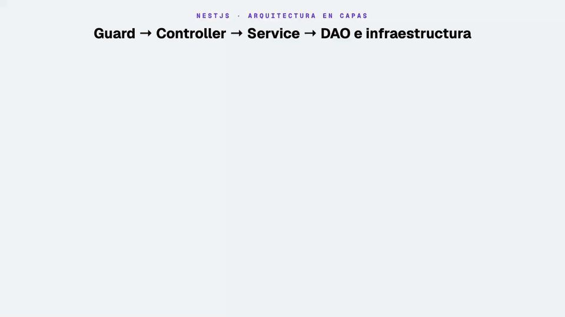
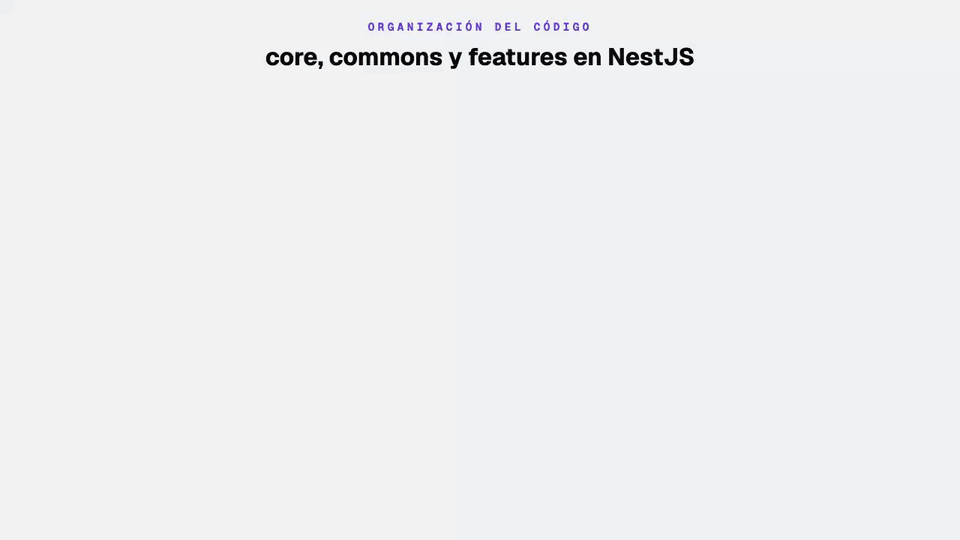
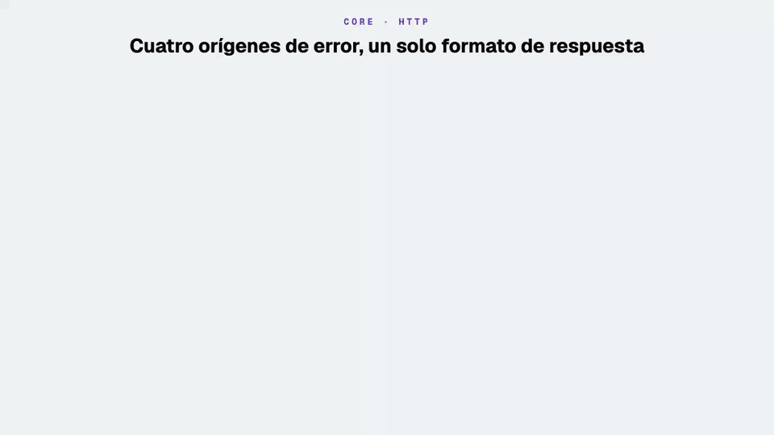
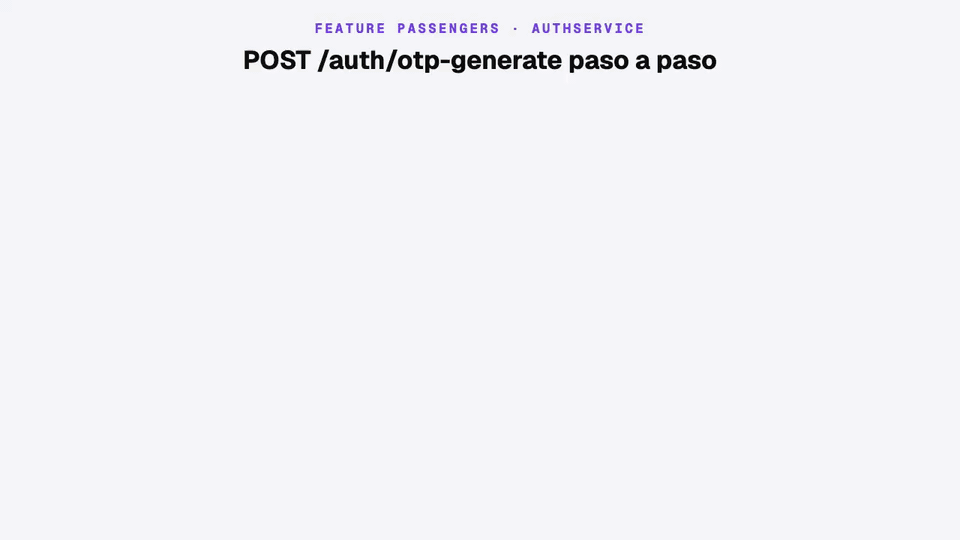
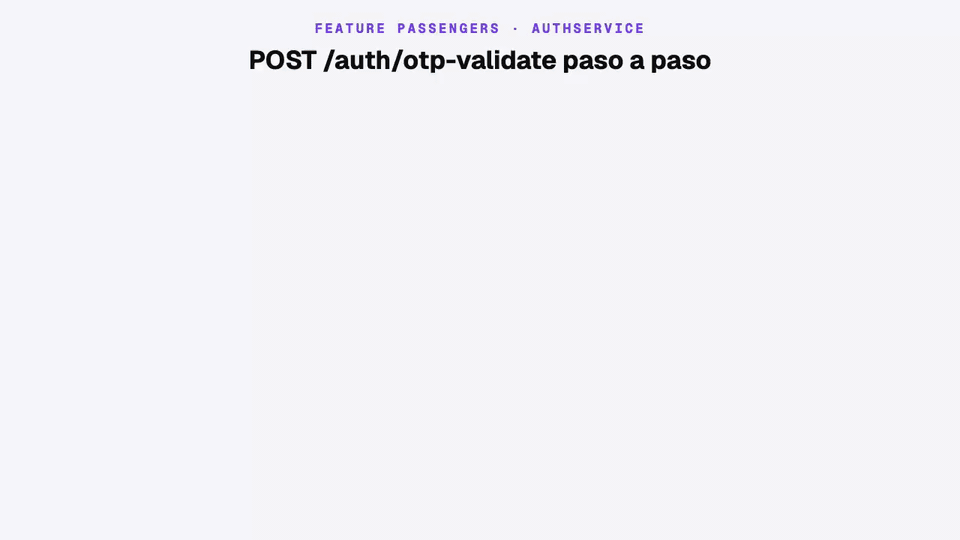
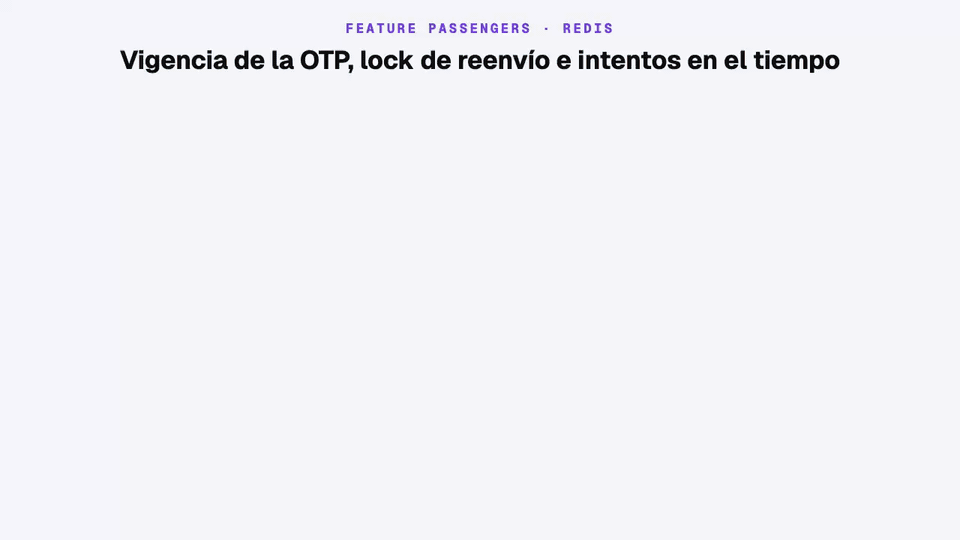

# Backend AppTaxi — API de OTP, menú y registro

API NestJS que implementa el **inicio de sesión por OTP** (código de 4 dígitos por SMS), el **menú** y el **registro** del pasajero que consume la app [`../android-app-taxi`](../android-app-taxi/README.md):

1. `POST /auth/otp-generate` → crea el pasajero si no existe, genera la OTP y la envía por SMS (Brevo o LabsMobile).
2. `POST /auth/otp-validate` → valida la OTP y devuelve `accessToken`, `refreshToken` y el perfil del pasajero.
3. `GET /menu/active/:application` → lista las opciones de menú activas. Requiere `Authorization: Bearer <accessToken>`.
4. `PUT /passenger/signup` → completa el perfil del pasajero nuevo y lo deja `ACTIVE`. Requiere `accessToken`.

---

## 1. Stack técnico y arquitectura

### Stack técnico

| Área | Tecnología | Versión | Para qué se usa |
| --- | --- | --- | --- |
| Runtime | Node.js | 24 LTS (mínimo `^22.22.3`) | Ejecución; `fetch` nativo para el SMS |
| Paquetes | pnpm | 12.5.1 (`packageManager`) | Siempre pnpm, nunca npm ni yarn |
| Framework | NestJS (`common`, `core`, `platform-express`) | 12.0 | Módulos, inyección de dependencias, HTTP |
| Lenguaje | TypeScript | 6.0 | Tipado estático |
| Validación | `class-validator` + `class-transformer` | 0.15 / 0.5 | DTOs de entrada con `ValidationPipe` |
| Base de datos | TypeORM + `@nestjs/typeorm` + `mysql2` | 1.1 / 12 / 3.24 | Entidades, DAOs y migraciones sobre MySQL 9.7 |
| Caché | `redis` (cliente) | 6.2 | Lock de reenvío e intentos de OTP en Redis 8.10 |
| Seguridad | `@nestjs/jwt` + `crypto.randomInt` | 12 / nativo | Tokens JWT y OTP con CSPRNG |
| Configuración | `@nestjs/config` + `dotenv` | 12 / 18 | Variables de `.env` vía `ConfigService` |
| Idiomas | `nestjs-i18n` | 10.8 | Mensajes ES/EN según `Accept-Language` |
| Logs | `nestjs-pino` + `pino` | 5.2 / 10 | Logs JSON con `x-request-id` |
| Documentación | `@nestjs/swagger` | 12 | OpenAPI en `/api/docs` |
| Pruebas | Jest + `ts-jest` | 30 / 29 | Pruebas unitarias con dependencias simuladas |

### Arquitectura en capas



| Capa | Piezas | Responsabilidad | No debe |
| --- | --- | --- | --- |
| **Presentación** | `AuthController`, `MenuController`, `PassengerController`, DTOs, `ValidationPipe`, `AccessTokenGuard` | HTTP, validación de entrada, autenticación, Swagger, idioma | Tener reglas de negocio |
| **Aplicación** | `AuthService`, `MenuService`, `PassengerService` | Reglas de OTP, rate limit, intentos, emisión de JWT, caché del menú, registro | Escribir SQL ni llamar APIs directamente |
| **Datos** | `PassengerDao`, `PassengerOtpDao`, `MenuDao`, entidades | Consultas TypeORM | Decidir reglas de negocio |
| **Infraestructura** | `CacheService`, `SmsSender`, `JwtService` | Redis, proveedor SMS, firma de tokens | Conocer HTTP |

Nest resuelve todas las dependencias por constructor (inyección de dependencias). Los errores de **cualquier** capa terminan en `HttpExceptionFilter`, que responde siempre con el mismo formato (ver [3.1](#31-corehttp--errores-con-un-solo-formato)).

---

## 2. Organización del código: core, commons y features



| Carpeta | Qué va aquí | Ejemplos |
| --- | --- | --- |
| **`core/`** | Infraestructura transversal que usa toda la API | Filtro de errores, base de datos, Redis, i18n, runners de migraciones |
| **`commons/`** | Utilidades sin reglas de negocio | `utils/UtilDate` |
| **`features/`** | Un módulo Nest por dominio, con todas sus capas | `passengers/` (`PassengerModule`), `menu/` (`MenuModule`) |

`AppModule` arma la infraestructura global (`ConfigModule`, `LoggerModule`, `I18nModule`, `TypeOrmModule`, `APP_FILTER`) e importa cada feature. Las features usan `core` y `commons`; **`core` nunca importa una feature**.

```
src/
├─ app.module.ts                 # Config, Pino, i18n, TypeORM, PassengerModule, MenuModule, APP_FILTER
├─ main.ts                       # ValidationPipe, filtros globales, Swagger
├─ commons/utils/UtilDate.ts
├─ core/
│  ├─ cache/cache.service.ts     # Cliente Redis (get / set con TTL / del)
│  ├─ cli/                       # run-migrations.ts, run-seeders.ts
│  ├─ database/                  # DataSource, migrations/, seeders/
│  ├─ http/                      # HttpCustomException, HttpExceptionFilter, guard/AccessTokenGuard (+ spec)
│  └─ i18n/{es,en}/              # auth.json, otp.json, passenger.json, common.json, signup.json
├─ features/passengers/
   ├─ passenger.module.ts
   ├─ controllers/               # AuthController (/auth/*), PassengerController (PUT /passenger/signup)
   ├─ services/                  # AuthService (+ spec), PassengerService (+ spec)
   ├─ dao/                       # PassengerDao, PassengerOtpDao
   ├─ entities/                  # PassengerEntity, PassengerOtpEntity
   ├─ dto/                       # Requests y responses (Swagger + class-validator)
   ├─ remote/                    # SmsSender, Brevo, LabsMobile, sms-sender.provider (+ spec)
   ├─ mapper/                    # Entity → DTO (+ spec)
   └─ enum/                      # PassengerStatus: ACTIVE, INACTIVE_REGISTER, SUSPENDED
└─ features/menu/
   ├─ menu.module.ts
   ├─ controllers/               # MenuController (GET /menu/active/:application)
   ├─ services/                  # MenuService (+ spec): Redis primero, MySQL después
   ├─ dao/ · entities/           # MenuDao, MenuEntity (entity_menu)
   ├─ dto/ · mapper/             # MenuDto, toMenuDto (+ spec)
   └─ enum/                      # MenuApplication, MenuStatus
```

---

## 3. Core

### 3.1 `core/http` — errores con un solo formato



| Archivo | Qué hace |
| --- | --- |
| `exception/http.exception.ts` | `HttpCustomException(message, status = 422)`: error de negocio con texto ya traducido |
| `filters/http-exception.filter.ts` | `@Catch()` global: formatea **toda** excepción como `{status_code, message, errors}`. Traduce los errores de validación con i18n y, ante un error no controlado, registra el stack y responde 500 genérico |
| `guard/access-token.guard.ts` | `AccessTokenGuard`: exige `Authorization: Bearer <accessToken>`, verifica firma y expiración, rechaza refresh tokens y deja el payload en `request.user` |
| `main.ts` | `ValidationPipe({whitelist, forbidNonWhitelisted, transform})` y registro de filtros |

| Origen | Código | Cuerpo |
| --- | --- | --- |
| DTO inválido (`ValidationPipe`) | 400 | `{"status_code":400,"message":"Bad Request","errors":[{"field":"general","message":"…"}]}` |
| `AccessTokenGuard` (sin token, inválido o expirado) | 401 | `{"status_code":401,"message":"Tu sesión expiró. Inicia sesión nuevamente.","errors":[]}` |
| `HttpCustomException` de un service | 422 / 429 | `{"status_code":422,"message":"Ya existe un código activo…"}` |
| Error no controlado (MySQL o Redis caídos, bug) | 500 | `{"status_code":500,"message":"Ocurrió un error inesperado en el servidor.","errors":[]}` |

Librerías: `@nestjs/common` (excepciones y filtros), `class-validator` y `class-transformer` (DTOs), `nestjs-i18n` (mensajes).

### 3.2 `core/i18n` — mensajes en español e inglés

| Archivo | Claves | Quién las usa |
| --- | --- | --- |
| `auth.json` | `activeCodeExists`, `deliveryFailed`, `invalidOrExpired`, `alreadyUsed`, `tooManyAttempts`, `passenger.notExists`, `unauthorized` | `AuthService`, `AccessTokenGuard` |
| `signup.json` | `validation.givenName`, `validation.familyName`, `validation.email`, `emailAlreadyUsed` | DTO de registro y `PassengerService` |
| `passenger.json` | `validation.*` del teléfono | DTOs |
| `otp.json` | `validation.*` del código | DTOs |
| `common.json` | `internalError` | `HttpExceptionFilter` (500) |

`I18nModule` usa `AcceptLanguageResolver` con `fallbackLanguage: "es"`. La app Android no envía `Accept-Language`, así que siempre recibe español.

### 3.3 `core/database` y `core/cli` — MySQL y migraciones


| Migración | Qué hace |
| --- | --- |
| `Schema1759303438196` | La misma de la clase 03: crea `entity_passenger` |
| `Schema1759768881969` | Incremental: agrega `INACTIVE_REGISTER` al enum `status` y crea `entity_passenger_otp` (FK con `ON DELETE CASCADE`) |
| `Schema1760371904959` | Incremental (módulo 3 · clase 01): crea `entity_menu` con índices únicos por `key` y por `(application, order)` |

Una BD nueva ejecuta las tres; una BD que viene del módulo 2 · clase 04 solo ejecuta la última y conserva sus datos. Para actualizar un stack Docker sigue [«Actualizar un stack existente de la clase anterior»](../infra-app-taxi/README.md#5-actualizar-un-stack-existente-de-la-clase-anterior).

| Archivo | Qué hace |
| --- | --- |
| `database/typeorm.config.ts` | `DataSource` de la app (sin `synchronize`) |
| `database/typeorm.migration.ts` | `DataSource` del CLI; historial en `migrations_history` |
| `database/seeders/` | `passengers.json` y `menus.json` + seeders idempotentes (omiten teléfonos y `key` existentes) |
| `cli/run-migrations.ts`, `cli/run-seeders.ts` | Runners que usa `entrypoint.sh` en Docker |

Librerías: `typeorm` 1.1, `@nestjs/typeorm` 12, `mysql2` 3.24.

### 3.4 `core/cache` — Redis

`CacheService` envuelve el cliente `redis` 6 con `get`, `set` (con TTL en segundos) y `del`. Usa `disableOfflineQueue` y `connectTimeout` de 5 s: si Redis cae, la petición falla al instante con 500 en lugar de quedar colgada. Las claves de OTP están en [5.4](#54-redis-en-el-tiempo) y la del menú en [6.1](#61-get-menuactiveapplication).

### 3.5 Configuración, logs y documentación

| Pieza | Librería | Detalle |
| --- | --- | --- |
| Variables de entorno | `@nestjs/config` | `ConfigModule.forRoot({isGlobal: true})`; se leen con `ConfigService` al usarlas |
| Logs | `nestjs-pino` | JSON con `x-request-id`; con `NODE_DEBUG=true`, `pino-pretty` (solo local) |
| Swagger | `@nestjs/swagger` | `/api/docs` (UI) y `/api/docs-json` (OpenAPI) |

---

## 4. Commons

| Archivo | Qué hace |
| --- | --- |
| `utils/UtilDate.ts` | Fecha actual en formato MySQL y timestamp |

Hoy es mínimo a propósito: algo pasa a `commons` recién cuando lo necesitan dos features y no tiene reglas de negocio. Sin librerías propias.

---

## 5. Feature `passengers` — autenticación por OTP y registro

| Capa | Archivos |
| --- | --- |
| Presentación | `controllers/auth.controller.ts`, `controllers/passenger.controller.ts`, `dto/` |
| Aplicación | `services/auth.service.ts`, `services/passenger.service.ts` |
| Datos | `dao/passenger.dao.ts`, `dao/passenger-otp.dao.ts`, `entities/`, `mapper/` |
| Infraestructura | `remote/` (SMS), `CacheService` (core), `JwtService` |
| Módulo | `passenger.module.ts`: `TypeOrmModule.forFeature`, `JwtModule`, proveedores y `smsSenderProvider` |

### 5.1 `POST /auth/otp-generate`



| Paso | Dónde | Qué hace | Si falla |
| --- | --- | --- | --- |
| 1 | Nest | `ValidationPipe`: `phone` de 11 dígitos | **400** |
| 2 | MySQL | Busca el pasajero; si no existe, lo crea con `INACTIVE_REGISTER` | — |
| 3 | Redis | ¿Existe `otp:passenger:{id}:lock`? | **422** `activeCodeExists` |
| 4 | MySQL | Genera 4 dígitos con `crypto.randomInt` y guarda la OTP con `expiresAt` | — |
| 5 | SMS | `SmsSender.sendOtp(phone, code)` | **422** `deliveryFailed` |
| 6 | Redis | Lock por `OTP_RATE_TTL_SEC` (60 s) y borra los intentos | — |
| ✓ | — | **200** `{success, expiresAt, ttlSec, messageId}` | — |

### 5.2 `POST /auth/otp-validate`



| Paso | Dónde | Qué hace | Si falla |
| --- | --- | --- | --- |
| 1 | Nest | `ValidationPipe`: `phone` de 11 dígitos y `code` de 4 a 6 | **400** |
| 2 | MySQL | Busca el pasajero | **422** `passenger.notExists` |
| 3 | Redis | ¿Intentos fallidos ≥ `OTP_MAX_ATTEMPTS`? | **429** `tooManyAttempts` |
| 4 | MySQL | OTP con ese código, `used = false` y no expirada | **422** `invalidOrExpired` y suma un intento |
| 5 | MySQL | `markAsUsed` y `touchLastLoginAt` | **422** `alreadyUsed` |
| 6 | JWT | Firma `accessToken` y `refreshToken` | — |
| 7 | Redis | Borra lock e intentos | — |
| ✓ | — | **200** `{accessToken, refreshToken, user}` | — |

Payload de los JWT: `sub` (id), `typ: "passenger"`, `phone`, `iat`, `exp` (y `rt: true` en el refresh).

### 5.3 Envío de SMS (Brevo o LabsMobile)


`AuthService` depende del contrato `SmsSender` (patrón **Strategy**). `SMS_PROVIDER` decide al arrancar qué implementación inyecta Nest.

| Pieza | Archivo (`remote/`) | Responsabilidad |
| --- | --- | --- |
| `SmsSender` (clase abstracta) | `sms-sender.ts` | Contrato y lógica común: modo desarrollo, *timeout* de 5 s, log y captura de errores |
| `BrevoSmsService` | `brevo-sms.service.ts` | API de Brevo |
| `LabsMobileSmsService` | `labsmobile-sms.service.ts` | API de LabsMobile |
| `smsSenderProvider` | `sms-sender.provider.ts` | Elige la implementación; un valor desconocido **detiene el arranque** |

| Proveedor | `brevo` (por defecto) | `labsmobile` |
| --- | --- | --- |
| Endpoint | `POST https://api.brevo.com/v3/transactionalSMS/sms` | `POST https://api.labsmobile.com/json/send` |
| Autenticación | Header `api-key: BREVO_API_KEY` | `Authorization: Basic base64(LABSMOBILE_USER:LABSMOBILE_API_KEY)` |
| Body | `{type, sender, recipient: "+51…", content, tag}` | `{message, tpoa, recipient: [{msisdn: "51…"}]}` |
| Éxito | HTTP 2xx con `messageId` | HTTP 2xx con `code: "0"` y `subid` |

| Credenciales del proveedor activo | `NODE_ENV` | Resultado |
| --- | --- | --- |
| Completas | cualquiera | Envía el SMS. Si el proveedor rechaza o vence el *timeout* → **422** `deliveryFailed` |
| Incompletas | ≠ `production` | **Modo desarrollo**: escribe `[DEV] OTP para +51987654321: 1234` en el log y responde 200 |
| Incompletas | `production` | No envía → **422** `deliveryFailed` |

Para agregar un proveedor: una clase que extienda `SmsSender`, registrada en `passenger.module.ts` y agregada a `SMS_PROVIDERS` y al `switch` de `sms-sender.provider.ts`. `AuthService` no cambia.

### 5.4 Redis en el tiempo



| Clave | Valor | TTL | Se crea | Se borra |
| --- | --- | --- | --- | --- |
| `otp:passenger:{id}:lock` | `"1"` | `OTP_RATE_TTL_SEC` (60 s) | Tras enviar el SMS | Al validar con éxito o al vencer |
| `otp:passenger:{id}:attempts` | contador | `OTP_TTL_SEC` (120 s) | Al fallar una validación | Al generar una OTP nueva o validar con éxito |

La vigencia de la OTP (`OTP_TTL_SEC`) vive en MySQL (`expires_at`), no en Redis.

### 5.5 `PUT /passenger/signup` — completar el registro

Un pasajero nuevo queda en `INACTIVE_REGISTER` después de validar su OTP. Este endpoint guarda su perfil y lo activa. Está protegido con `AccessTokenGuard` (ver [6](#6-feature-menu--opciones-de-menú-por-aplicación)).

| Paso | Dónde | Qué hace | Si falla |
| --- | --- | --- | --- |
| 1 | Guard | Valida el `accessToken`; el id del pasajero sale de `sub` (nunca del body) | **401** `auth.unauthorized` |
| 2 | Nest | `ValidationPipe`: nombres y apellidos de 2 a 60 caracteres, correo válido (se guarda en minúsculas) | **400** `signup.validation.*` |
| 3 | MySQL | Busca al pasajero del token | **401** `auth.unauthorized` |
| 4 | MySQL | ¿Otro pasajero usa ese correo? | **422** `signup.emailAlreadyUsed` |
| 5 | MySQL | Guarda `given_name`, `family_name`, `email` y `status = ACTIVE` | **422** si el índice único detecta un duplicado en paralelo |
| ✓ | — | **200** con el pasajero actualizado (`PassengerDto`) | — |

Los tokens no se reemiten: su payload (`sub`, `typ`, `phone`) no cambia con el registro.

### Contrato de la API con la app

Fuente de verdad del contrato con `../android-app-taxi`: cada respuesta indica el DTO de Retrofit que la recibe y, para los errores, la `DomainException` de la app y el texto que ve el usuario.

| Aspecto | Backend | App |
| --- | --- | --- |
| Base URL | `http://<host>:${APPLICATION_PORT}/` (3001) | `BuildConfig.API_BASE_URL`, termina en `/` (emulador: `http://10.0.2.2:3001/`) |
| Formato | JSON, `Content-Type: application/json` | Retrofit 3 + `converter-gson` |
| Teléfono | E.164 sin `+`, 11 caracteres (`51` + 9 dígitos) | El usuario escribe 9 dígitos; los casos de uso anteponen `51` |
| Código OTP | 4 dígitos (el DTO acepta 4 a 6) | `OtpCodeInput` de 4 casillas |
| Fechas | ISO-8601 en UTC | `Instant.parse(expiresAt)` |
| Idioma | `Accept-Language` (`es`/`en`), fallback `es` | No lo envía: todo llega en español |
| `Authorization` | No se requiere en `/auth`; obligatorio en `/menu` y `/passenger/signup` | `AuthInterceptor` lo agrega si hay sesión |
| Tiempos | Respuesta típica < 100 ms; SMS corta a los 5 s | OkHttp: 10 s. Si se superan → `SocketTimeoutException` |

**Respuestas exitosas**

| Endpoint | DTO en la app | Cuerpo |
| --- | --- | --- |
| `otp-generate` | `AuthOtpGenerateResponse` | `{"success":true,"expiresAt":"2026-09-28T18:47:00.255Z","ttlSec":120,"messageId":"dev-log"}` |
| `otp-validate` | `AuthOtpValidateResponse` | `{"accessToken":"…","refreshToken":"…","user":{"id","phoneNumber","givenName","familyName","email","photoUrl","status"}}` |
| `menu/active/PASSENGER` | `List<MenuDto>` | `[{"key":"passenger_home","text":"Pedir taxi","icon":"home","deeplink":"app-taxi://passenger/home","order":1}, …]` |
| `passenger/signup` | `PassengerDto` | `{"id":"…","phoneNumber":"51987654321","givenName":"Ana","familyName":"Perez","email":"ana@example.com","photoUrl":null,"status":"ACTIVE"}` |

`user.status` decide la navegación de la app: `ACTIVE` → Home, `INACTIVE_REGISTER` → registro. Los campos de nombre, `email` y `photoUrl` pueden ser `null` (pasajero nuevo).

**Errores** (todos con el formato de [3.1](#31-corehttp--errores-con-un-solo-formato)). `ErrorMapper` de la app muestra el texto del servidor en los 4xx (`errors[0].message` o `message`) y un texto propio en los 5xx:

| HTTP | Endpoint | Clave i18n / origen | `DomainException` | Texto que ve el usuario |
| --- | --- | --- | --- | --- |
| 400 | ambos | `passenger.validation.*`, `otp.validation.*` | `ValidationException` | Primer `errors[].message` |
| 400 | ambos | Campo no permitido / JSON mal formado | `ValidationException` | «property x should not exist» / «Bad Request» |
| 401 | menu, signup | `auth.unauthorized` | `ClientException` | «Tu sesión expiró. Inicia sesión nuevamente.» |
| 404 | — | Ruta inexistente | `ClientException` | «Not Found» |
| 400 | signup | `signup.validation.*` | `ValidationException` | «Tus nombres deben tener entre 2 y 60 caracteres.» · «El correo electrónico no es válido.» |
| 422 | signup | `signup.emailAlreadyUsed` | `ValidationException` | «El correo ya está registrado por otro pasajero.» |
| 422 | generate | `auth.activeCodeExists` | `ValidationException` | «Ya existe un código activo. Espera 1 minuto…» |
| 422 | generate | `auth.deliveryFailed` | `ValidationException` | «No se pudo enviar el código OTP por SMS…» |
| 422 | validate | `auth.invalidOrExpired` | `ValidationException` | «El código OTP es inválido o ha expirado.» |
| 422 | validate | `auth.alreadyUsed` | `ValidationException` | «El código OTP ya fue utilizado.» |
| 422 | validate | `auth.passenger.notExists` | `ValidationException` | «No existe un pasajero registrado con este número…» |
| 429 | validate | `auth.tooManyAttempts` | `ClientException` | «Superaste el número de intentos…» |
| 500 | ambos | `common.internalError` | `ServerException` | «El servidor no está disponible. Inténtalo más tarde» |
| — | ambos | Sin conexión | `NetworkException` | «No se pudo conectar con el servidor…» |
| — | ambos | Más de 10 s sin respuesta | `NetworkException` | «El servidor tardó demasiado en responder» |

Reglas que mantienen el contrato: todo texto de un 4xx va en i18n porque la app lo muestra tal cual; los 5xx no llevan detalles internos; y todo falla antes de 10 s (Redis y SMS cortan a los 5 s) para que la app reciba un código y no un timeout.

---

## 6. Feature `menu` — opciones de menú por aplicación

Primer endpoint **protegido** de la API: la app envía el `accessToken` que recibió en `otp-validate`.

| Capa | Archivos |
| --- | --- |
| Presentación | `controllers/menu.controller.ts`, `dto/menu.dto.ts`, `AccessTokenGuard` (core) |
| Aplicación | `services/menu.service.ts` |
| Datos | `dao/menu.dao.ts`, `entities/menu.entity.ts`, `mapper/menu.mapper.ts`, `enum/` |
| Infraestructura | `CacheService` (core), `JwtService` |
| Módulo | `menu.module.ts`: `TypeOrmModule.forFeature([MenuEntity])`, `JwtModule` y el guard |

### 6.1 `GET /menu/active/:application`

| Paso | Dónde | Qué hace | Si falla |
| --- | --- | --- | --- |
| 1 | Guard | `AccessTokenGuard`: header `Authorization: Bearer`, firma y expiración con `JWT_ACCESS_SECRET`; rechaza refresh tokens | **401** `auth.unauthorized` |
| 2 | Nest | `ParseEnumPipe`: `application` debe ser `PASSENGER`, `DRIVER` o `BACKOFFICE` | **400** |
| 3 | Redis | ¿Existe `menu:{application}:active`? Si existe, responde con eso | — |
| 4 | MySQL | `entity_menu` con `status = ACTIVE`, ordenado por `order` | — |
| 5 | Redis | Guarda la lista por `MENU_CACHE_TTL_SEC` (60 s) | — |
| ✓ | — | **200** `[{key, text, icon, deeplink, order}]` | — |

| Columna de `entity_menu` | Uso |
| --- | --- |
| `key` (único) | Identificador estable. La app lo usa como clave primaria en Room |
| `text` | Texto que se muestra |
| `icon` | Nombre lógico (`home`, `profile`, `history`, `support`). La app lo traduce a un ícono local |
| `deeplink` | Destino de la opción (`app-taxi://passenger/...`) |
| `order` (único por aplicación) | Orden ascendente |
| `application`, `status` | Filtros: solo se listan las `ACTIVE` de la aplicación pedida |

Las opciones iniciales salen de `core/database/seeders/data/menus.json` (seeder idempotente por `key`). Si editas una fila en MySQL, el cambio tarda como máximo `MENU_CACHE_TTL_SEC` en llegar a la app.

---

## 7. Ejecutar, probar y mantener

### Requisitos e instalación

| Herramienta | Versión | Notas |
| --- | --- | --- |
| Node.js | 24 LTS | Con Node 22.14 `pnpm build` falla con `ERR_REQUIRE_CYCLE_MODULE` |
| pnpm | 12.5.1 | `corepack enable` descarga la versión de `packageManager` |
| MySQL / Redis | 9.7 LTS / 8.10 | Se levantan con [`../infra-app-taxi`](../infra-app-taxi/README.md) |
| Proveedor SMS | Brevo o LabsMobile | Opcional en desarrollo |

```bash
corepack enable
pnpm install
touch .env          # ver variables abajo; .env está en .gitignore
```

`pnpm-workspace.yaml` declara `allowBuilds` (desde pnpm 11 la instalación falla con `ERR_PNPM_IGNORED_BUILDS` si una dependencia trae script de build sin declarar).

### Configuración (`.env`)

```bash
# App
APPLICATION_PORT=3001
NODE_ENV=development              # "production" desactiva el modo SMS de desarrollo
NODE_DEBUG=false                  # true = logs con pino-pretty (solo local)

# MySQL (valores de ../infra-app-taxi/.env)
DB_HOST=127.0.0.1
DB_PORT=3306
DB_USERNAME=root
DB_PASSWORD=change-me
DB_NAME=db_app_taxi
DB_POOL=10

# Redis
REDIS_HOST=127.0.0.1
REDIS_PORT=6379

# JWT
JWT_ACCESS_SECRET=change-this-access
JWT_REFRESH_SECRET=change-this-refresh
JWT_ACCESS_TTL_SEC=900            # 15 min
JWT_REFRESH_TTL_SEC=2592000       # 30 días

# OTP (opcionales; valores por defecto)
OTP_TTL_SEC=120
OTP_RATE_TTL_SEC=60
OTP_MAX_ATTEMPTS=5

# Menú (opcional)
MENU_CACHE_TTL_SEC=60             # segundos en Redis

# SMS: "brevo" (por defecto) o "labsmobile"
SMS_PROVIDER=brevo
BREVO_API_KEY=                    # vacío = modo desarrollo
BREVO_TEXT_SMS="Tu código de App Taxi es:"
BREVO_SENDER=AppTaxi
LABSMOBILE_USER=
LABSMOBILE_API_KEY=
LABSMOBILE_TEXT_SMS="Tu código de App Taxi es:"
LABSMOBILE_SENDER=AppTaxi
```

### Ejecución, migraciones y pruebas

```bash
pnpm migration:run                 # aplicar migraciones pendientes
pnpm migration:revert              # revertir la última
pnpm migration:generate src/core/database/migrations/<nombre>   # sin "--"
pnpm exec ts-node -r tsconfig-paths/register src/core/cli/run-seeders.ts

pnpm start:dev                     # desarrollo · Swagger en /api/docs
pnpm build && pnpm start:prod

pnpm test                          # 34 pruebas: AuthService (8), PassengerService (4), proveedores SMS (11), MenuService (4), AccessTokenGuard (4), mappers (3)
pnpm lint                          # ESLint con --fix
```

- NestJS 12 se publica solo como ESM: el script `test` corre Jest con `--experimental-vm-modules`, y `jest.moduleNameMapper` resuelve los imports `src/...`.

### Docker

`Dockerfile` multi-stage sobre `node:24-alpine` con pnpm 12.5.1. `entrypoint.sh` espera a MySQL, migra, siembra y arranca `node dist/main.js` (ver [3.3](#33-coredatabase-y-corecli--mysql-y-migraciones)). Para levantar o actualizar el stack sigue [`../infra-app-taxi/README.md`](../infra-app-taxi/README.md). Con `NODE_DEBUG=true` la imagen no arranca (`pino-pretty` es dependencia de desarrollo).

### Seguridad

| Control | Estado |
| --- | --- |
| Generación de la OTP | `crypto.randomInt` (CSPRNG) |
| Fuerza bruta | Máximo `OTP_MAX_ATTEMPTS` fallos → **429** |
| Reenvío abusivo de SMS | Lock por pasajero en Redis (`OTP_RATE_TTL_SEC`) |
| Reutilización del código | `markAsUsed` + `findValidOtp` filtra `used = false` y `expires_at > NOW()` |
| Almacenamiento de la OTP | En claro en `entity_passenger_otp.code`. **Pendiente**: guardar un hash (p. ej. HMAC-SHA256) |
| Enumeración de teléfonos | `otp-generate` responde igual exista o no el pasajero |
| Rutas protegidas | `AccessTokenGuard` en `/menu` y `/passenger/signup`; el id del pasajero se toma del token, no del body. Un refresh token no sirve como access token |
| JWT | Secretos fuertes; payload sin datos sensibles. El access token dura 15 min; el endpoint de refresh (`POST /auth/refresh`) se construye en la clase 03 de este módulo. **Pendiente**: rotación y revocación de refresh tokens |
| Secretos | `.env` fuera de git; credenciales SMS nunca en el repositorio ni en el log |

### Troubleshooting

| Síntoma | Causa / solución |
| --- | --- |
| `ERR_REQUIRE_CYCLE_MODULE` en `pnpm build` | Node demasiado antiguo: usa Node 24 LTS |
| `Must use import to load ES Module` en Jest | Jest sin `--experimental-vm-modules`: usa `pnpm test` |
| `Cannot find module 'src/…'` en Jest | Falta `moduleNameMapper` (`^src/(.*)$`) en `package.json` |
| `Redis Client Error … ECONNREFUSED` | Redis no está arriba o `REDIS_HOST`/`REDIS_PORT` no coinciden |
| **500** «Ocurrió un error inesperado…» | MySQL o Redis caídos, o un bug: el stack está en el log |
| **422** `deliveryFailed` | El proveedor rechazó el envío (log `Brevo respondió …` / `LabsMobile respondió …`) o producción sin credenciales |
| No arranca: `SMS_PROVIDER inválido` | Solo acepta `brevo` o `labsmobile` |
| No llega el SMS en local | Sin credenciales no se envía: busca `[DEV] OTP para` en el log |
| **401** «Tu sesión expiró…» en `/menu` | Falta el header `Authorization`, el access token venció (15 min) o se envió el refresh token: inicia sesión otra vez (la renovación automática llega en la clase 03) |
| El menú no refleja un cambio hecho en MySQL | Caché de Redis: espera `MENU_CACHE_TTL_SEC` o borra la clave `menu:PASSENGER:active` |
| **422** `activeCodeExists` / **429** `tooManyAttempts` | Lock de 60 s activo / 5 intentos fallidos: pide un código nuevo |
| i18n muestra la clave (`otp.validation.pattern`) | Falta el archivo o la clave en `core/i18n/<lang>/` |
| La app muestra «Not Found» | `API_BASE_URL` apunta a otro servicio o le falta la `/` final |

---

## Licencia

Uso académico / educativo.
