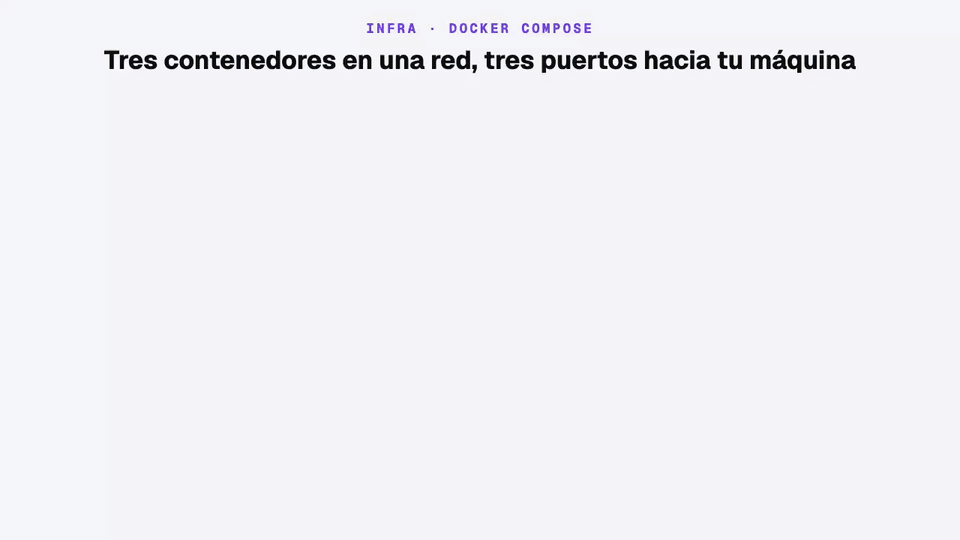
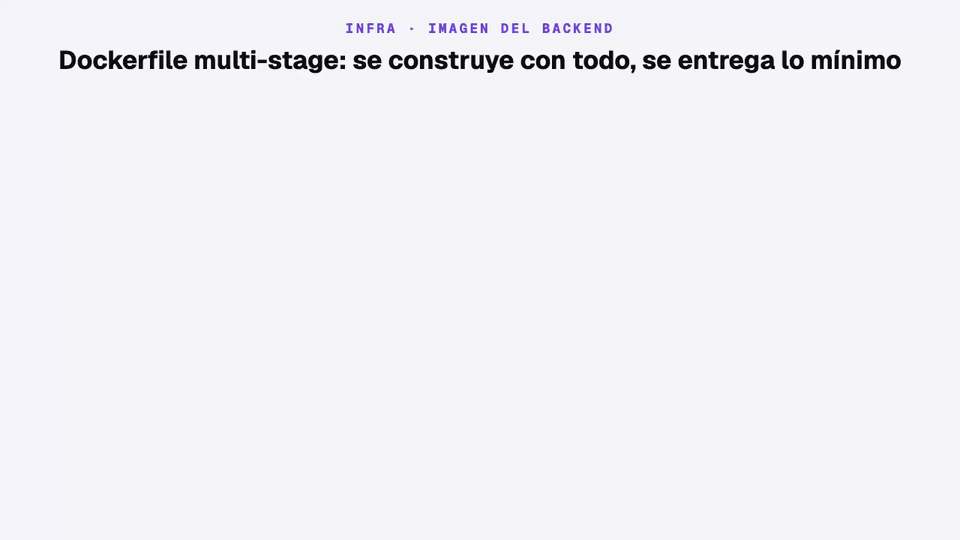
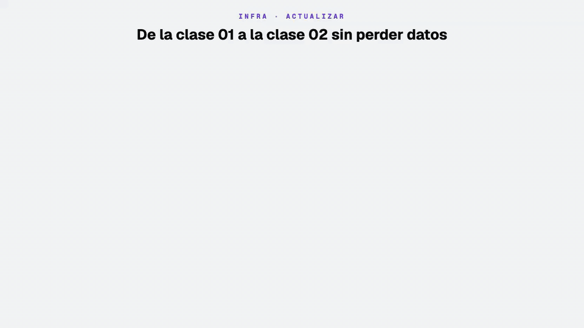

# Infra App Taxi — MySQL, Redis y API con Docker Compose

Levanta en tu máquina todo lo que necesita la app [`../android-app-taxi`](../android-app-taxi/README.md) para iniciar sesión, cargar el menú y completar el registro: la **API** de [`../backend-app-taxi`](../backend-app-taxi/README.md), su base de datos **MySQL** y **Redis**. Cada servicio tiene su propio archivo Compose y todos comparten una red y un `.env`.

---

## 1. Qué se levanta y cómo se conecta



| Servicio      | Contenedor       | Imagen                                           | Puerto en tu máquina → contenedor | Datos                        | Para qué                                              |
| ------------- | ---------------- | ------------------------------------------------ | --------------------------------- | ---------------------------- | ----------------------------------------------------- |
| API           | `http-app-taxi`  | `${BACKEND_IMAGE}:${BACKEND_TAG}` (se construye) | `3001 → 3001`                     | —                            | Endpoints `/auth/*`, `/menu/active/:application` y `/passenger/signup` |
| Base de datos | `mysql-app-taxi` | `mysql:9.7`                                      | `3306 → 3306`                     | volumen `mysql_volume`       | Pasajeros, códigos OTP y opciones de menú             |
| Caché         | `redis-app-taxi` | `redis:8.10-alpine`                              | `6379 → 6379`                     | volumen `redis_volume` (AOF) | Lock de reenvío, intentos de OTP y caché del menú     |

| Conexión            | Cómo funciona                                                                                                                        |
| ------------------- | ------------------------------------------------------------------------------------------------------------------------------------ |
| App Android → API   | Por el puerto publicado 3001. En el emulador, `10.0.2.2` es el `localhost` de tu máquina: `http://10.0.2.2:3001/`                    |
| API → MySQL / Redis | Dentro de la red `network-app-taxi`, **por nombre de contenedor** (`mysql-app-taxi:3306`, `redis-app-taxi:6379`), no por `localhost` |
| API → proveedor SMS | Sale a Internet por HTTPS (Brevo o LabsMobile)                                                                                       |
| Tú → MySQL / Redis  | Por los puertos 3306 y 6379, con un cliente MySQL o `redis-cli`. La API no los usa                                                   |
| Datos               | Viven en volúmenes: sobreviven a `docker compose down` y a recrear los contenedores                                                  |

---

## 2. Archivos y variables

```
infra-app-taxi/
├── docker-compose.mysql.yml   # MySQL 9.7 + healthcheck + volumen
├── docker-compose.redis.yml   # Redis 8.10 con appendonly (AOF) + volumen
├── docker-compose.http.yml    # API: construye ../backend-app-taxi y le pasa las variables
├── .env                       # Variables locales (no se versiona)
└── README.md
```


Compose reemplaza cada `${VARIABLE}` con el `.env` **de esta carpeta** antes de crear el contenedor. Por eso los comandos se ejecutan siempre desde aquí. La API recibe las variables con el nombre que espera NestJS: `HTTP_JWT_ACCESS_SECRET` del `.env` llega como `JWT_ACCESS_SECRET`, y `MYSQL_CONTAINER_NAME` llega como `DB_HOST`.

```env
PROJECT_NAME="app-taxi"
NETWORK="network-app-taxi"
TZ="America/Lima"

# MySQL
MYSQL_CONTAINER_NAME="mysql-app-taxi"
MYSQL_ROOT_PASSWORD="root"
MYSQL_DATABASE="db_app_taxi"
MYSQL_VOLUME="mysql_volume"

# Redis
REDIS_CONTAINER_NAME="redis-app-taxi"
REDIS_PORT="6379"
REDIS_VOLUME="redis_volume"

# API
BACKEND_IMAGE="http-app-taxi"
BACKEND_TAG="0.0.1"
HTTP_CONTAINER_NAME="http-app-taxi"
HTTP_DOCKER_PLATFORM="linux/amd64"
HTTP_NODE_ENV="development"
HTTP_NODE_DEBUG="false"
HTTP_DB_POOL="10"
HTTP_APPLICATION_PORT="3001"
HTTP_JWT_ACCESS_TTL_SEC="900"
HTTP_JWT_REFRESH_TTL_SEC="2592000"
HTTP_JWT_ACCESS_SECRET="cambia-esto"
HTTP_JWT_REFRESH_SECRET="cambia-esto-tambien"

# OTP (opcionales; valores por defecto)
HTTP_OTP_TTL_SEC="120"
HTTP_OTP_RATE_TTL_SEC="60"
HTTP_OTP_MAX_ATTEMPTS="5"

# Menú (opcional): segundos que la API guarda el menú en Redis
HTTP_MENU_CACHE_TTL_SEC="60"

# SMS: "brevo" (por defecto) o "labsmobile". Sin credenciales = el código se escribe en el log
HTTP_SMS_PROVIDER="brevo"
HTTP_BREVO_API_KEY=""
HTTP_BREVO_TEXT_SMS="Tu código de App Taxi es:"
HTTP_BREVO_SENDER="AppTaxi"
HTTP_LABSMOBILE_USER=""
HTTP_LABSMOBILE_API_KEY=""
HTTP_LABSMOBILE_TEXT_SMS="Tu código de App Taxi es:"
HTTP_LABSMOBILE_SENDER="AppTaxi"
```

| Variable                            | La usa         | Qué hace                                                                                                      |
| ----------------------------------- | -------------- | ------------------------------------------------------------------------------------------------------------- |
| `NETWORK`                           | los 3 archivos | Nombre de la red externa (debe existir antes de levantar)                                                     |
| `MYSQL_*`                           | mysql, http    | Nombre del contenedor, contraseña de `root`, base de datos y volumen                                          |
| `REDIS_*`                           | redis, http    | Nombre del contenedor, puerto publicado y volumen                                                             |
| `BACKEND_IMAGE`, `BACKEND_TAG`      | http           | Nombre y tag de la imagen que se construye y ejecuta                                                          |
| `HTTP_DOCKER_PLATFORM`              | http           | `linux/amd64` (funciona en Apple Silicon por emulación) o `linux/arm64` (nativo, más rápido en Apple Silicon) |
| `HTTP_JWT_*`                        | http           | Secretos y duración de los tokens                                                                             |
| `HTTP_OTP_*`                        | http           | Vigencia del código, espera entre envíos e intentos permitidos (120 / 60 / 5 si faltan)                       |
| `HTTP_MENU_CACHE_TTL_SEC`           | http           | Tiempo de vida de la caché del menú en Redis (60 s si falta)                                                  |
| `HTTP_SMS_PROVIDER`                 | http           | `brevo` o `labsmobile`; otro valor detiene el arranque de la API                                              |
| `HTTP_BREVO_*`, `HTTP_LABSMOBILE_*` | http           | Credenciales del proveedor activo. Sin ellas y fuera de `production`, el código OTP se escribe en el log      |
| `HTTP_NODE_DEBUG`                   | http           | Déjala en `"false"`: con `"true"` la imagen no arranca (`pino-pretty` no está en la imagen final)             |

> El `.env` tiene credenciales: no se sube a git. Si `HTTP_*_API_KEY` tiene una clave real, pedir una OTP **envía un SMS de verdad**.

---

## 3. Imagen de la API



`docker-compose.http.yml` construye la imagen con el `Dockerfile` de `../backend-app-taxi`:

| Etapa        | Qué hace                                                                                          | Pasa a la imagen final |
| ------------ | ------------------------------------------------------------------------------------------------- | ---------------------- |
| 1 · `base`   | `node:24-alpine` + pnpm 12.5.1 con corepack                                                       | —                      |
| 2 · `deps`   | `pnpm install --frozen-lockfile` con dependencias de desarrollo                                   | —                      |
| 3 · `build`  | `nest build`: compila TypeScript a `dist/`                                                        | `dist/`                |
| 4 · `pruned` | `pnpm prune --prod`: deja solo dependencias de producción                                         | `node_modules/`        |
| 5 · `runner` | Imagen limpia con `dist/`, `node_modules/`, `entrypoint.sh` y `netcat`; corre como usuario `node` | Es la imagen final     |

La imagen final no lleva TypeScript, el código fuente ni dependencias de desarrollo.

---

## 4. Levantar el stack


**Requisitos:** Docker Engine 24 o superior y Docker Compose v2 (`docker compose`). En Windows y macOS vienen con [Docker Desktop](https://www.docker.com/products/docker-desktop/); en Linux instala `docker-ce` y `docker-compose-plugin` desde el [repositorio oficial](https://docs.docker.com/engine/install/). Comprueba con `docker --version` y `docker compose version`.

Ejecuta todo **desde esta carpeta**:

```bash
# 0) Una sola vez: la red que comparten los tres archivos
docker network create network-app-taxi

# 1) MySQL: espera a que el healthcheck marque "healthy"
docker compose -f docker-compose.mysql.yml -p app-taxi up -d
docker compose -f docker-compose.mysql.yml -p app-taxi ps

# 2) Redis
docker compose -f docker-compose.redis.yml -p app-taxi up -d

# 3) API: construye la imagen y arranca
docker compose -f docker-compose.http.yml -p app-taxi up -d --build
docker compose -f docker-compose.http.yml -p app-taxi logs -f http
```

Al arrancar, el `entrypoint.sh` de la API espera a MySQL (`nc -z`), aplica las migraciones, carga los seeders y recién entonces levanta Nest. En el log verás `Migrations OK`, `Seeders OK` y `Nest application successfully started`.

Los tres archivos comparten el proyecto `-p app-taxi`, así que Compose avisa `Found orphan containers` al levantar el segundo y el tercero. Es normal: **no** uses `--remove-orphans`, porque borraría los otros servicios.

**Probar:**

```bash
# Documentación de la API
open http://localhost:3001/api/docs

# Pedir un código (si el teléfono no existe se crea como pasajero nuevo)
curl -s -X POST http://localhost:3001/auth/otp-generate \
  -H 'content-type: application/json' -d '{"phone":"51987654321"}'

# Sin credenciales de SMS, el código aparece en el log
docker compose -f docker-compose.http.yml -p app-taxi logs http | grep "OTP para"

# Validar el código
curl -s -X POST http://localhost:3001/auth/otp-validate \
  -H 'content-type: application/json' -d '{"phone":"51987654321","code":"<codigo>"}'

# Menú (requiere el accessToken que devuelve otp-validate)
curl -s http://localhost:3001/menu/active/PASSENGER -H "Authorization: Bearer <accessToken>"

# Completar el registro de un pasajero nuevo
curl -s -X PUT http://localhost:3001/passenger/signup \
  -H 'content-type: application/json' -H "Authorization: Bearer <accessToken>" \
  -d '{"givenName":"Ana","familyName":"Perez","email":"ana@example.com"}'
```

**Apagar** (los volúmenes se conservan):

```bash
docker compose -f docker-compose.http.yml -p app-taxi down
docker compose -f docker-compose.redis.yml -p app-taxi down
docker compose -f docker-compose.mysql.yml -p app-taxi down
```

---

## 5. Actualizar un stack existente de la clase anterior



Si ya levantaste la infra del módulo 3 · clase 01, **no borres nada**. Todas las clases usan el mismo proyecto (`-p app-taxi`), los mismos nombres de contenedor, los mismos volúmenes y la misma red. Al ejecutar Compose desde **esta** carpeta, cada contenedor se recrea con la definición de esta clase y monta los mismos datos.

```bash
cd native-android/modulo-03/clase-02/infra-app-taxi

docker compose -f docker-compose.mysql.yml -p app-taxi up -d
docker compose -f docker-compose.mysql.yml -p app-taxi ps      # espera "healthy"
docker compose -f docker-compose.redis.yml -p app-taxi up -d
docker compose -f docker-compose.http.yml -p app-taxi build
docker compose -f docker-compose.http.yml -p app-taxi up -d
docker logs -f http-app-taxi
```

| Estado de la base de datos        | Migraciones que se aplican al arrancar la API                               |
| --------------------------------- | --------------------------------------------------------------------------- |
| Viene del módulo 3 · clase 01     | Ninguna (`Executed: 0`): el registro usa columnas que ya existían            |
| Viene del módulo 2 · clase 04     | Solo la de `entity_menu` (`Executed: 1`); pasajeros y OTP se conservan       |
| Nueva o reiniciada                | Las tres (`Executed: 3`)                                                    |

- `build` usa `BACKEND_IMAGE:BACKEND_TAG`. Con el mismo tag de la clase anterior, la imagen anterior se reemplaza; para conservar ambas, cambia `BACKEND_TAG` antes de construir.
- **Volver a la clase 01:** no hay nada que revertir en la base de datos; levanta el stack desde `../../clase-01/infra-app-taxi` con `up -d --build`.

**Comprobar sin enviar SMS reales:**

```bash
curl -s -o /dev/null -w '%{http_code}\n' http://localhost:3001/api/docs      # 200
curl -s -X POST http://localhost:3001/auth/otp-validate \
  -H 'content-type: application/json' -d '{"phone":"51900000001","code":"1234"}'
# {"status_code":422,"message":"No existe un pasajero registrado con este número de teléfono."}
curl -s http://localhost:3001/menu/active/PASSENGER
# {"status_code":401,"message":"Tu sesión expiró. Inicia sesión nuevamente.","errors":[]}
docker exec -it mysql-app-taxi mysql -uroot -p db_app_taxi \
  -e "SELECT name FROM migrations_history; SHOW TABLES;"
```
