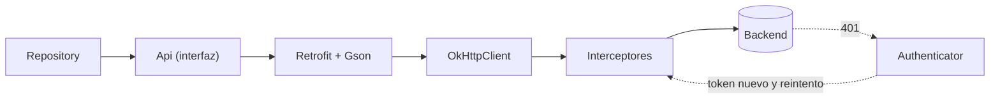
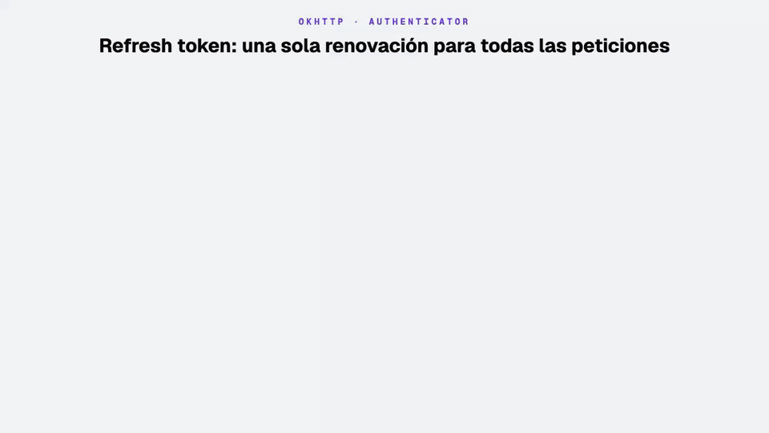
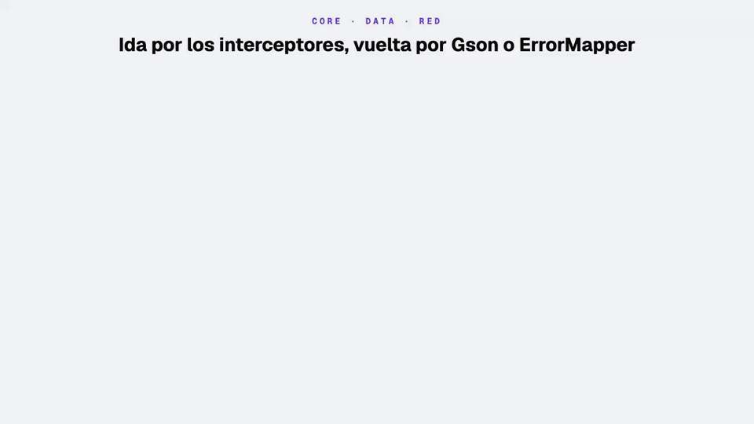
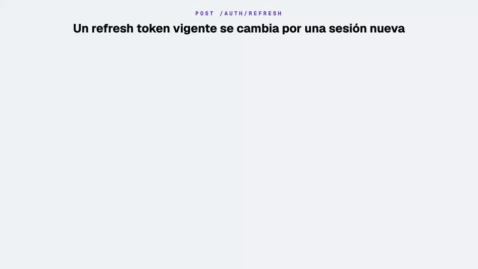
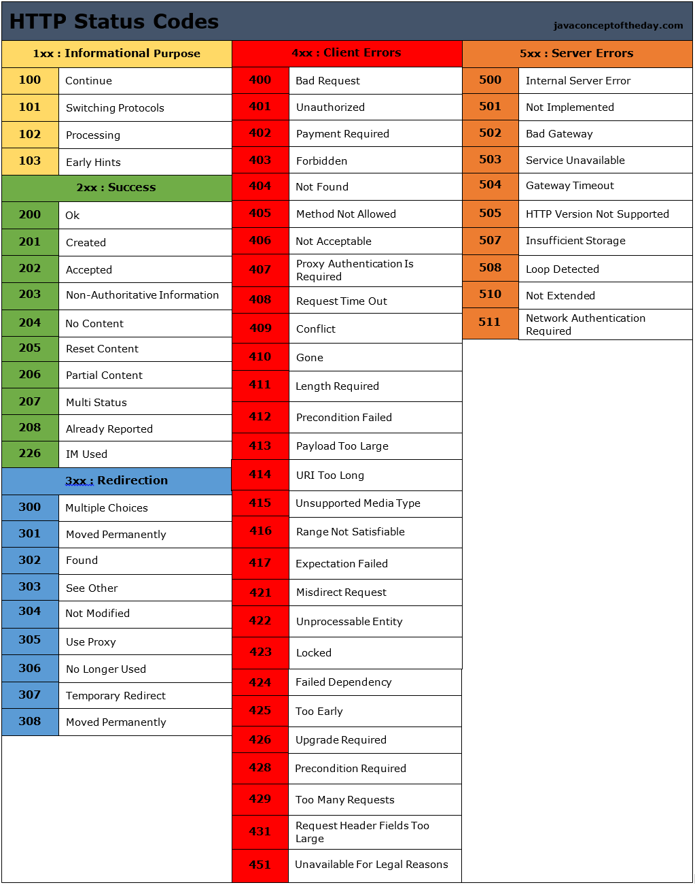

# Módulo 3 · Sesión 3

## Retrofit y manejo de errores: una sesión que se renueva sola

---

## Objetivos

1. Entender qué hace **Retrofit**, qué hace **OkHttp** y cómo se reparten el trabajo.
2. Configurar el cliente HTTP: **timeouts**, **interceptores** (headers, token, log) y dos clientes con propósitos distintos.
3. Renovar la sesión con **refresh token** usando el `Authenticator` de OkHttp, sin que el usuario lo note.
4. Evitar renovaciones duplicadas (**single-flight**) y bucles de reintento.
5. Traducir **todos** los errores de red a errores de dominio con un `ErrorMapper`.

---

## Contenido

1. Qué es Retrofit y qué necesita
2. Qué construimos: la sesión con refresh token
3. Paso a paso en `android-app-taxi`
4. Patrones contra fallas
5. Cómo quedó integrado en el proyecto de taxi
6. Ejecutar y probar
7. Checklist, conclusiones y práctica

---

## 1) Qué es Retrofit y qué necesita

Antes, cada llamada HTTP en Android se escribía a mano con `HttpURLConnection`: abrir la conexión, escribir el JSON, leer el `InputStream`, convertirlo y cerrar todo. **Retrofit** (Square) convierte eso en una **interfaz de Kotlin**: tú declaras el endpoint y Retrofit genera la implementación.

Retrofit no trabaja solo. Son varias piezas, cada una con un trabajo:

| Pieza             | Librería         | Qué hace                                                       | En el proyecto                              |
| ----------------- | ---------------- | -------------------------------------------------------------- | ------------------------------------------- |
| **Retrofit**      | `retrofit`       | Convierte una interfaz (`@GET`, `@POST`) en llamadas HTTP      | `AuthApi`, `MenuApi`, `SignUpApi`, `RefreshApi` |
| **Converter**     | `converter-gson` | JSON ⇄ `data class`                                            | `GsonConverterFactory`                      |
| **OkHttp**        | `okhttp`         | El transporte real: conexiones, timeouts, reintentos           | `OkHttpClient`                              |
| **Interceptor**   | `okhttp`         | Código que ve **cada** petición y respuesta, y puede cambiarlas | `HeadersInterceptor`, `AuthInterceptor`, logging |
| **Authenticator** | `okhttp`         | Código que se ejecuta **solo ante un 401** para conseguir credenciales nuevas | `TokenAuthenticator`         |



| Regla                                                        | Por qué                                                         |
| ------------------------------------------------------------ | --------------------------------------------------------------- |
| Retrofit **describe** la API; OkHttp **la ejecuta**          | Timeouts, headers, tokens y logs se configuran en OkHttp        |
| Lo que aplica a **todas** las peticiones va en un interceptor | No se repite en cada endpoint                                   |
| El refresh va en el **`Authenticator`**, no en un interceptor | OkHttp lo llama solo cuando hace falta y repite la petición por ti |

### Alternativas

| Criterio        | Retrofit + OkHttp           | Ktor Client                  | Volley              |
| --------------- | --------------------------- | ---------------------------- | ------------------- |
| Estilo          | Interfaz declarativa        | DSL en código                | Colas de peticiones |
| Corrutinas      | Sí (`suspend`)              | Sí                           | No                  |
| Multiplataforma | Solo JVM/Android            | Sí (Kotlin Multiplatform)    | Solo Android        |
| Úsalo cuando…   | App Android nativa          | Compartes código con iOS     | Código heredado     |

---

## 2) Qué construimos: la sesión con refresh token

Hasta la clase anterior, el access token duraba 15 minutos y después el menú respondía «Tu sesión expiró». Ahora la app **renueva la sesión sola**: cuando el backend responde 401, pide tokens nuevos con el refresh token y repite la petición.



1. El access token venció: varias peticiones reciben 401.
2. Solo **una** pide tokens nuevos; las demás esperan.
3. Los tokens nuevos se guardan.
4. Todas se repiten con el token nuevo: el usuario no nota nada.
5. Si el refresh token tampoco sirve, la sesión expira y la app vuelve al inicio de sesión.

| Token             | Duración | Para qué sirve                                 | Dónde viaja                          |
| ----------------- | -------- | ---------------------------------------------- | ------------------------------------ |
| **Access token**  | 15 min   | Probar quién eres en cada petición             | Header `Authorization: Bearer …`     |
| **Refresh token** | 30 días  | Pedir un access token nuevo sin otra OTP       | Solo en el body de `POST /auth/refresh` |

Uno corto y uno largo: si alguien roba el access token, le sirve pocos minutos; el refresh token casi nunca sale del dispositivo.

### Proyectos de la clase

| Proyecto                                      | Qué es                                                             | Guía                                   |
| --------------------------------------------- | ------------------------------------------------------------------ | -------------------------------------- |
| [`infra-app-taxi`](./infra-app-taxi)          | MySQL 9.7, Redis 8.10 y la API con Docker Compose                  | [README](./infra-app-taxi/README.md)   |
| [`backend-app-taxi`](./backend-app-taxi)      | API NestJS 12: OTP, menú, registro y **`POST /auth/refresh`**      | [README](./backend-app-taxi/README.md) |
| [`android-app-taxi`](./android-app-taxi)      | App Android: se agrega la capa de red completa (interceptores + `Authenticator`) | [README](./android-app-taxi/README.md) |
| [`design-m03-c03.pen`](./design-m03-c03.pen)  | Diseño del proyecto: se agrega la sección «6 · Sesión (refresh token)» | —                                  |

Los tres proyectos parten **tal cual** de la clase 02. Esta clase solo agrega la renovación de sesión y completa el manejo de errores.

### Pantallas y estados


| Situación                                  | Qué ve el usuario                                                    |
| ------------------------------------------ | -------------------------------------------------------------------- |
| Access token vencido, refresh token vigente | Nada distinto: la pantalla sigue cargando un instante y muestra los datos |
| Refresh token rechazado                    | Vuelve a «Generar OTP» con un toast rojo «Tu sesión expiró. Inicia sesión nuevamente» |
| Sin red durante la renovación              | El error de red de siempre; la sesión **no** se pierde               |

---

## 3) Paso a paso en `android-app-taxi`

> Todo el código de esta sección es el del proyecto.

### Paso 0 · Lo que ya teníamos

Retrofit llegó al proyecto en el módulo 2. Esta clase completa la capa de red:

| Ya estaba (módulo 2)                               | Se agrega en esta clase                                   |
| -------------------------------------------------- | --------------------------------------------------------- |
| Interfaces Retrofit (`AuthApi`, `MenuApi`, …)      | `RefreshApi`                                              |
| Un `OkHttpClient` con valores por defecto          | Timeouts explícitos y **dos clientes**                    |
| `AuthInterceptor` (agrega el token a todo)         | No envía el token a las rutas públicas                    |
| Logging siempre en `BODY`                          | Logging solo en `debug` y sin mostrar `Authorization`     |
| —                                                  | `HeadersInterceptor`                                      |
| —                                                  | `TokenAuthenticator` + `TokenRefresher`                   |
| `ErrorMapper` (4xx, 5xx, red)                      | 401 tipado y JSON inválido                                |

### Paso 1 · Dependencias

Retrofit y OkHttp ya estaban. Solo se suma el servidor falso para las pruebas:

```toml
# gradle/libs.versions.toml
okhttp-mockwebserver = { module = "com.squareup.okhttp3:mockwebserver3", version.ref = "okhttp" }
```

```kotlin
// app/build.gradle.kts
testImplementation(libs.okhttp.mockwebserver)
```

### Paso 2 · Declarar el endpoint

Un endpoint es una función `suspend` en una interfaz. El body y la respuesta son `data class`.

```kotlin
// core/data/RefreshApi.kt
interface RefreshApi {
    @POST("auth/refresh")
    suspend fun refresh(@Body body: RefreshRequest): RefreshResponse
}

// core/data/dto/
data class RefreshRequest(val refreshToken: String)
data class RefreshResponse(val accessToken: String, val refreshToken: String)
```

| Anotación                   | Para qué                                   |
| --------------------------- | ------------------------------------------ |
| `@GET`, `@POST`, `@PUT`, `@DELETE` | Método y ruta (relativa a la URL base) |
| `@Body`                     | Objeto que Gson convierte a JSON           |
| `@Path("id")`               | Reemplaza `{id}` en la ruta                |
| `@Query("page")`            | Agrega `?page=…`                           |
| `@Header("X")`              | Un header solo para esa llamada            |

El backend también devuelve `user`; `RefreshResponse` no lo declara y Gson simplemente lo ignora.

### Paso 3 · Interceptores: lo que viaja en todas las peticiones



Un interceptor recibe la petición, puede modificarla y la deja seguir con `chain.proceed(...)`.

```kotlin
// core/data/HeadersInterceptor.kt
class HeadersInterceptor(
    private val appVersion: String,
    private val newRequestId: () -> String = { UUID.randomUUID().toString() }
) : Interceptor {
    override fun intercept(chain: Interceptor.Chain): Response {
        val request = chain.request().newBuilder()
            .header(HEADER_ACCEPT, "application/json")
            .header(HEADER_ACCEPT_LANGUAGE, LANGUAGE)
            .header(HEADER_USER_AGENT, "AppTaxi-Android/$appVersion")
            .header(HEADER_REQUEST_ID, newRequestId())
            .build()
        return chain.proceed(request)
    }
}
```

| Header            | Valor                    | Para qué                                                        |
| ----------------- | ------------------------ | --------------------------------------------------------------- |
| `Accept-Language` | `es`                     | El backend responde sus mensajes en ese idioma                  |
| `User-Agent`      | `AppTaxi-Android/1.0`    | Saber qué versión de la app hizo la llamada                     |
| `X-Request-Id`    | UUID por petición        | El backend lo usa como id de traza: buscas una petición en sus logs |

```kotlin
// core/data/AuthInterceptor.kt
class AuthInterceptor(
    private val session: SessionStore
) : Interceptor {
    override fun intercept(chain: Interceptor.Chain): Response {
        val original = chain.request()
        if (original.isPublicAuthEndpoint()) return chain.proceed(original)

        val token = runBlocking { session.accessToken().first() }
        val request = if (!token.isNullOrBlank()) {
            original.newBuilder()
                .header(HEADER_AUTHORIZATION, "$BEARER_PREFIX$token")
                .build()
        } else original
        return chain.proceed(request)
    }
}
```

Las rutas `/auth/*` (pedir OTP, validarla, refrescar) son públicas: no reciben el token.

`runBlocking` aquí es correcto: OkHttp ejecuta los interceptores en **sus propios hilos**, nunca en el principal.

### Paso 4 · Dos clientes: público y autenticado

El refresh no puede usar el cliente que tiene el `Authenticator`: si el refresh respondiera 401, se llamaría a sí mismo. Por eso hay dos clientes.

```kotlin
// core/data/NetworkModule.kt
@Provides @Singleton
fun provideLogging(): HttpLoggingInterceptor =
    HttpLoggingInterceptor().apply {
        level = if (BuildConfig.DEBUG) HttpLoggingInterceptor.Level.BODY else HttpLoggingInterceptor.Level.NONE
        redactHeader(HEADER_AUTHORIZATION)
    }

@Provides @Singleton @PublicClient
fun providePublicOkHttp(
    headers: HeadersInterceptor,
    logging: HttpLoggingInterceptor
): OkHttpClient = OkHttpClient.Builder()
    .connectTimeout(TIMEOUT_SECONDS, TimeUnit.SECONDS)
    .readTimeout(TIMEOUT_SECONDS, TimeUnit.SECONDS)
    .writeTimeout(TIMEOUT_SECONDS, TimeUnit.SECONDS)
    .addInterceptor(headers)
    .addInterceptor(logging)
    .build()

@Provides @Singleton
fun provideOkHttp(
    @PublicClient publicClient: OkHttpClient,
    auth: AuthInterceptor,
    authenticator: TokenAuthenticator
): OkHttpClient = publicClient.newBuilder()
    .addInterceptor(auth)
    .authenticator(authenticator)
    .build()
```

| Cliente                        | Tiene                                        | Lo usa                              |
| ------------------------------ | -------------------------------------------- | ----------------------------------- |
| **Público** (`@PublicClient`)  | Timeouts, headers, logging                   | `RefreshApi`                        |
| **Autenticado** (por defecto)  | Lo anterior + `AuthInterceptor` + `Authenticator` | `AuthApi`, `MenuApi`, `SignUpApi` |

-   `newBuilder()` crea el segundo cliente **compartiendo** conexiones e hilos con el primero: no se duplica nada.
-   `@PublicClient` es un calificador de Hilt, igual que `@SignUpDraftPrefs` en la clase anterior.
-   Los tres timeouts quedan en 10 s: el backend está pensado para responder (o fallar) antes de eso.
-   En `release` no se registra nada. En `debug` el token tampoco aparece: `AuthInterceptor` lo agrega después del logging y, por si el orden cambia, `redactHeader` lo oculta.

### Paso 5 · El backend: `POST /auth/refresh`



```http
POST /auth/refresh
{"refreshToken":"eyJ…"}

200 {"accessToken":"…","refreshToken":"…","user":{…}}
401 {"status_code":401,"message":"Tu sesión ya no es válida. Inicia sesión nuevamente.","errors":[]}
```

Verifica la firma con el secreto de refresh, que el token sea de refresco (`rt: true`) y que el pasajero exista. Devuelve un par **nuevo**. El detalle está en el [README del backend](./backend-app-taxi/README.md#56-post-authrefresh--renovar-la-sesión).

### Paso 6 · `TokenRefresher`: una sola renovación

Si tres pantallas piden datos a la vez con el token vencido, llegan tres 401. Sin control, la app pediría tres veces tokens nuevos.

```kotlin
// core/data/TokenRefresher.kt
sealed interface RefreshResult {
    data class Refreshed(val accessToken: String) : RefreshResult
    data object Rejected : RefreshResult
}

class TokenRefresher(
    private val session: SessionStore,
    private val api: RefreshApi
) {
    private val mutex = Mutex()

    suspend fun refresh(staleAccessToken: String?): RefreshResult = mutex.withLock {
        val current = session.accessToken().first()
        if (!current.isNullOrBlank() && current != staleAccessToken) {
            return@withLock RefreshResult.Refreshed(current)
        }

        val refreshToken = session.refreshToken().first()
        if (refreshToken.isNullOrBlank()) return@withLock RefreshResult.Rejected

        val tokens = try {
            api.refresh(RefreshRequest(refreshToken))
        } catch (e: HttpException) {
            if (e.code() in CLIENT_ERRORS) return@withLock RefreshResult.Rejected
            throw IOException("Refresh failed with HTTP ${e.code()}", e)
        }

        session.saveTokens(access = tokens.accessToken, refresh = tokens.refreshToken)
        RefreshResult.Refreshed(tokens.accessToken)
    }
}
```

| Línea                                   | Qué resuelve                                                                 |
| --------------------------------------- | ---------------------------------------------------------------------------- |
| `mutex.withLock { }`                    | Solo una corrutina a la vez entra a renovar                                  |
| `current != staleAccessToken`           | «Mientras esperaba, otro ya renovó»: usa ese token y **no** llama al backend |
| `Rejected` en 4xx                       | El backend dijo que el refresh token no sirve: la sesión terminó             |
| `throw IOException` en 5xx              | El servidor falló, no el token: la sesión se conserva y se puede reintentar  |

### Paso 7 · `TokenAuthenticator`: qué hacer ante un 401

OkHttp llama a `authenticate()` cuando una respuesta es 401. Si devuelves una petición, la ejecuta; si devuelves `null`, se rinde y entrega el 401.

```kotlin
// core/data/TokenAuthenticator.kt
class TokenAuthenticator(
    private val refresher: TokenRefresher,
    private val expiration: SessionExpiration
) : Authenticator {

    override fun authenticate(route: Route?, response: Response): Request? {
        val request = response.request
        if (request.isPublicAuthEndpoint()) return null
        if (response.priorResponse != null) return null

        val staleAccessToken = request.header(HEADER_AUTHORIZATION)?.removePrefix(BEARER_PREFIX)

        return when (val result = runBlocking { refresher.refresh(staleAccessToken) }) {
            is RefreshResult.Refreshed -> request.newBuilder()
                .header(HEADER_AUTHORIZATION, "$BEARER_PREFIX${result.accessToken}")
                .build()

            RefreshResult.Rejected -> {
                runBlocking { expiration.expire() }
                null
            }
        }
    }
}
```

| Guardia                              | Evita                                                        |
| ------------------------------------ | ------------------------------------------------------------ |
| `isPublicAuthEndpoint()`             | Renovar por un 401 de las rutas de login                     |
| `response.priorResponse != null`     | Un bucle: si el reintento también da 401, no se insiste      |

### Paso 8 · Cuando la sesión expira de verdad

La capa de datos no navega. Solo **avisa** con un contrato del dominio:

```kotlin
// core/domain/SessionExpiration.kt
interface SessionExpiration {
    val events: Flow<Unit>
    suspend fun expire()
}

// core/data/SessionExpirationImpl.kt
override suspend fun expire() {
    val hadSession = !session.accessToken().first().isNullOrBlank()
    session.clear()
    localCache.clear()
    if (hadSession) _events.tryEmit(Unit)
}
```

Y la Activity, que es dueña de la navegación, reacciona:

```kotlin
// core/presentation/activity/MainActivity.kt (AppRoot)
LaunchedEffect(Unit) {
    vm.sessionExpired.collectLatest {
        nav.navigateClearingBackStack(Route.AuthGraph.path)
        sessionExpired = true
        delay(SESSION_EXPIRED_TOAST_MS)
        sessionExpired = false
    }
}
```

Funciona desde cualquier pantalla, porque está encima del `NavHost`.

### Paso 9 · Errores: todo termina en una `DomainException`



Una llamada puede fallar de muchas formas. El repositorio las convierte todas con `safeCall { }` y `ErrorMapper`, de modo que el resto de la app solo conoce `DomainException`.

```kotlin
// core/data/ErrorMapper.kt (extracto)
fun map(t: Throwable): DomainException = when (t) {
    is DomainException -> t
    is HttpException -> mapHttp(t)
    is JsonParseException, is MalformedJsonException ->
        DomainException.ServerException(MESSAGE_PARSE, causeThrowable = t)
    is SocketTimeoutException -> DomainException.NetworkException(MESSAGE_TIMEOUT, causeThrowable = t)
    is IOException -> DomainException.NetworkException(MESSAGE_NETWORK, causeThrowable = t)
    else -> DomainException.UnknownException(MESSAGE_UNKNOWN, causeThrowable = t)
}
```

| Qué pasó                                   | Excepción técnica                     | `DomainException`        | Mensaje                                            |
| ------------------------------------------ | ------------------------------------- | ------------------------ | -------------------------------------------------- |
| Datos inválidos                            | `HttpException` 400 / 422             | `ValidationException`    | El del backend                                     |
| Sesión inválida (tras intentar el refresh) | `HttpException` 401                   | `UnauthorizedException`  | El del backend o «Tu sesión expiró…»               |
| Otro rechazo (403, 404, 429)               | `HttpException` 4xx                   | `ClientException`        | El del backend                                     |
| El servidor falló                          | `HttpException` 5xx                   | `ServerException`        | «El servidor no está disponible…» (nunca el cuerpo) |
| La respuesta no es el JSON esperado        | `JsonParseException`, `MalformedJsonException` | `ServerException` | «No pudimos leer la respuesta del servidor»        |
| Tardó demasiado                            | `SocketTimeoutException`              | `NetworkException`       | «El servidor tardó demasiado en responder»         |
| Sin conexión                               | `IOException`                         | `NetworkException`       | «No se pudo conectar con el servidor…»             |
| El usuario salió de la pantalla            | `CancellationException`               | — (se relanza)           | Nunca llega a la UI                                |

Las filas nuevas de esta clase son la del 401 y la del JSON inválido. El orden del `when` importa: `MalformedJsonException` hereda de `IOException`, así que debe evaluarse antes.

### Paso 10 · Conectar todo con Hilt

```kotlin
// core/data/SecurityModule.kt
@Provides @Singleton
fun provideSessionExpiration(session: SessionStore, localCache: LocalCache): SessionExpiration =
    SessionExpirationImpl(session, localCache)

@Provides @Singleton
fun provideTokenRefresher(session: SessionStore, api: RefreshApi): TokenRefresher =
    TokenRefresher(session, api)

@Provides @Singleton
fun provideTokenAuthenticator(
    refresher: TokenRefresher,
    expiration: SessionExpiration
): TokenAuthenticator = TokenAuthenticator(refresher, expiration)

// core/data/NetworkModule.kt
@Provides @Singleton
fun provideRefreshApi(@PublicClient retrofit: Retrofit): RefreshApi =
    retrofit.create(RefreshApi::class.java)
```

Ningún repositorio, caso de uso ni pantalla cambió: siguen pidiendo sus datos igual. La renovación ocurre debajo, en OkHttp.

### Paso 11 · Probar la red sin backend: MockWebServer

`MockWebServer` levanta un servidor HTTP real en la JVM. Le dices qué responder y luego revisas qué recibió.

```kotlin
// app/src/test/.../core/data/TokenAuthenticatorTest.kt
@Test
fun `con el access token vencido renueva la sesion y repite la peticion`() = runBlocking {
    server.enqueue(json(401, UNAUTHORIZED_JSON))
    server.enqueue(json(200, TOKENS_JSON))
    server.enqueue(json(200, "[]"))

    val menu = stack.api.menu()

    assertTrue(menu.isEmpty())
    val first = server.takeRequest()
    val refresh = server.takeRequest()
    val retry = server.takeRequest()
    assertEquals("Bearer old-access", first.headers["Authorization"])
    assertEquals("/auth/refresh", refresh.url.encodedPath)
    assertNull(refresh.headers["Authorization"])
    assertEquals("Bearer new-access", retry.headers["Authorization"])
    assertEquals("new-access", session.currentAccess())
}
```

| Prueba                   | Qué verifica                                                                      |
| ------------------------ | --------------------------------------------------------------------------------- |
| `TokenAuthenticatorTest` | Renovar y reintentar; 4 peticiones simultáneas → **1** refresh; refresh rechazado expira la sesión; un 5xx la conserva; sin segundo reintento |
| `InterceptorsTest`       | Token solo en rutas protegidas; headers de idioma, versión e id de petición       |
| `ErrorMapperTest`        | 401, JSON inválido y timeout                                                      |

```bash
./gradlew testDebugUnitTest            # 49 pruebas JVM
./gradlew connectedDebugAndroidTest    # 22 instrumentadas (necesita emulador)
```

---

## 4) Patrones contra fallas

| Patrón                       | Qué evita                                              | En el proyecto                                              |
| ---------------------------- | ------------------------------------------------------ | ----------------------------------------------------------- |
| **Single-flight**            | Varias renovaciones a la vez                           | `Mutex` en `TokenRefresher`                                 |
| **Límite de reintentos**     | Bucles infinitos de 401                                | `priorResponse != null` en `TokenAuthenticator`             |
| **Cliente limpio**           | Que el refresh se autentique a sí mismo                | `@PublicClient`                                             |
| **Timeouts explícitos**      | Pantallas colgadas                                     | 10 s de conexión, lectura y escritura                       |
| **Distinguir 4xx de 5xx**    | Cerrar la sesión por una caída del servidor            | `Rejected` vs `IOException`                                 |
| **Offline-first**            | Pantallas vacías sin red                               | Room (clase 01)                                             |
| **Id de traza**              | No poder seguir una petición en los logs               | `X-Request-Id`                                              |
| **Backoff exponencial**      | Saturar a un servidor que ya responde 429 o 503        | Pendiente (práctica 1)                                      |
| **Idempotencia**             | Duplicar una operación al reintentar un `POST`         | Pendiente: se verá con las operaciones de viaje             |

---

## 5) Cómo quedó integrado en el proyecto de taxi

Punto de partida: los tres proyectos de la clase 02, sin cambios.

### `android-app-taxi`

| Archivo                                                         | Estado     | Qué aporta                                                  |
| --------------------------------------------------------------- | ---------- | ----------------------------------------------------------- |
| `core/data/HeadersInterceptor.kt`                               | **Nuevo**  | Idioma, versión e id de traza en todas las peticiones       |
| `core/data/RefreshApi.kt`, `core/data/dto/Refresh*.kt`          | **Nuevo**  | `POST auth/refresh`                                         |
| `core/data/TokenRefresher.kt`                                   | **Nuevo**  | Renovación única con `Mutex`                                |
| `core/data/TokenAuthenticator.kt`                               | **Nuevo**  | Reacción de OkHttp ante un 401                              |
| `core/domain/SessionExpiration.kt`, `core/data/SessionExpirationImpl.kt` | **Nuevo** | Aviso de sesión expirada                           |
| `core/presentation/activity/MainViewModel.kt`                   | **Nuevo**  | Lleva ese aviso a la Activity                               |
| `core/data/NetworkModule.kt`                                    | Modificado | Timeouts, dos clientes, logging solo en `debug`             |
| `core/data/AuthInterceptor.kt`                                  | Modificado | No envía el token a `/auth/*`                               |
| `core/data/SecurityModule.kt`                                   | Modificado | Provee refresher, authenticator y expiración                |
| `core/data/ErrorMapper.kt`, `core/domain/DomainException.kt`    | Modificado | `UnauthorizedException` y JSON inválido                     |
| `core/presentation/activity/MainActivity.kt`                    | Modificado | Navega al login y muestra el toast cuando la sesión expira  |
| `app/src/test/.../core/data/*`                                  | **Nuevo**  | Pruebas con MockWebServer                                   |

```
core/
├─ data/
│  ├─ NetworkModule.kt            // Paso 4 · dos clientes
│  ├─ HeadersInterceptor.kt       // Paso 3
│  ├─ AuthInterceptor.kt          // Paso 3
│  ├─ RefreshApi.kt · dto/        // Paso 2
│  ├─ TokenRefresher.kt           // Paso 6
│  ├─ TokenAuthenticator.kt       // Paso 7
│  ├─ SessionExpirationImpl.kt    // Paso 8
│  ├─ ErrorMapper.kt              // Paso 9
│  └─ SecurityModule.kt           // Paso 10
├─ domain/SessionExpiration.kt    // Paso 8 · contrato
└─ presentation/activity/         // Paso 8 · MainActivity + MainViewModel
```

Todo vive en `core`: ninguna feature se enteró del cambio.

### `backend-app-taxi`

| Archivo                                                           | Estado     | Qué aporta                                              |
| ----------------------------------------------------------------- | ---------- | ------------------------------------------------------- |
| `features/passengers/controllers/auth.controller.ts`              | Modificado | `POST /auth/refresh`                                    |
| `features/passengers/services/auth.service.ts` (+ spec)           | Modificado | `refreshTokens()` y `issueSession()` compartido con el login |
| `features/passengers/dto/passenger-refresh-token-request.dto.ts`  | **Nuevo**  | Validación del body                                     |
| `core/i18n/{es,en}/auth.json`                                     | Modificado | `invalidRefreshToken`, `refreshTokenRequired`           |

No hay migración: los tokens son JWT firmados, no se guardan en tablas.

### `infra-app-taxi`

Sin cambios en los archivos Compose. Si ya tienes el stack de la clase 02, reconstruye solo la API ([«Actualizar un stack existente»](./infra-app-taxi/README.md#5-actualizar-un-stack-existente-de-la-clase-anterior)).

### Diseño

`design-m03-c03.pen` contiene el diseño completo del proyecto (inicio de sesión, Splash y Home, menú, registro e ícono) más la sección **«6 · Sesión (refresh token)»** con tres estados: renovando, renovada y expirada.

---

## 6) Ejecutar y probar

Orden: **infra → backend → app**.

Para no esperar 15 minutos, acorta el access token en `infra-app-taxi/.env` y recrea la API:

```env
HTTP_JWT_ACCESS_TTL_SEC="20"
```

```bash
docker compose -f docker-compose.http.yml -p app-taxi up -d --build
```

| Acción                                                                  | Qué verás                                                          |
| ----------------------------------------------------------------------- | ------------------------------------------------------------------ |
| Iniciar sesión y abrir el menú                                          | Las 4 opciones                                                     |
| Esperar 25 s, volver y abrir el menú otra vez                           | Las opciones, sin ningún error                                     |
| Mirar Logcat (filtro `okhttp`)                                          | Un `POST …/auth/refresh` → 200 entre el `GET …/menu` y su respuesta 200 (el 401 intermedio no se registra) |
| Mirar el log del backend                                                | `GET /menu` 401 → `POST /auth/refresh` 200 → `GET /menu` 200       |
| Comparar los `x-request-id` en el log del backend                       | Las dos llamadas al menú comparten el mismo id                     |
| Cambiar `HTTP_JWT_REFRESH_SECRET` en el `.env`, recrear la API y abrir el menú | La app vuelve a «Generar OTP» con el toast «Tu sesión expiró…» |
| Apagar la API y abrir el menú                                           | Toast «No se pudo conectar…»; al encenderla, la sesión sigue viva  |

```bash
docker compose -f docker-compose.http.yml -p app-taxi logs -f http | grep -E "refresh|menu"
```

Al terminar, devuelve `HTTP_JWT_ACCESS_TTL_SEC` a `"900"`.

---

## 7) Checklist, conclusiones y práctica

### Checklist

-   [ ] Los endpoints son funciones `suspend` en interfaces; ningún repositorio arma URLs a mano.
-   [ ] Timeouts explícitos en el cliente.
-   [ ] Lo común a todas las peticiones está en interceptores.
-   [ ] El token no se envía a las rutas públicas.
-   [ ] El refresh usa un cliente **sin** `Authenticator`.
-   [ ] Una sola renovación a la vez (`Mutex`) y un solo reintento por petición.
-   [ ] Un 5xx en el refresh **no** cierra la sesión; un 4xx sí.
-   [ ] El log de red está apagado en `release` y nunca muestra `Authorization`.
-   [ ] Ningún `HttpException` ni `IOException` sale de la capa de datos.
-   [ ] La capa de datos avisa que la sesión expiró; la Activity decide a dónde navegar.

### Conclusiones

-   **Retrofit describe, OkHttp ejecuta.** Casi toda la configuración de red vive en OkHttp.
-   Los **interceptores** resuelven lo transversal una sola vez; el **`Authenticator`** resuelve el 401.
-   Con access token corto y refresh token largo, la sesión es **segura y cómoda** a la vez.
-   El refresh es un problema de **concurrencia**: sin `Mutex` se duplica; sin límite, entra en bucle.
-   Un `ErrorMapper` único hace que la UI muestre mensajes claros sin conocer HTTP.

### Práctica propuesta

1. **Backoff**: crea un `RetryInterceptor` que reintente hasta 2 veces las respuestas 503, esperando 1 s y luego 2 s. Pruébalo con MockWebServer.
2. **Refresh anticipado**: lee el campo `exp` del access token y renueva la sesión si faltan menos de 30 s, antes de recibir el 401.
3. **Revocar al cerrar sesión**: agrega `POST /auth/logout` al backend que guarde el refresh token en Redis como revocado, y haz que `/auth/refresh` lo rechace.
4. **Prueba de expiración**: escribe una prueba de `SessionExpirationImpl` que verifique que no emite el evento si no había sesión.

---

## Recursos recomendados

-   [Retrofit](https://github.com/square/retrofit) y [OkHttp](https://github.com/square/okhttp).
-   [OkHttp: interceptores](https://github.com/square/okhttp/blob/master/docs/features/interceptors.md) y [recetas (incluye autenticación)](https://github.com/square/okhttp/blob/master/docs/recipes.md).
-   [MockWebServer](https://github.com/square/okhttp/tree/master/mockwebserver).
-   [Capa de datos](https://developer.android.com/topic/architecture/data-layer) (Android Developers).
