# Android App Taxi — OTP, menú, registro y sesión con refresh token

App Android (Kotlin + Jetpack Compose) que implementa el **inicio de sesión por OTP** contra el backend NestJS de [`../backend-app-taxi`](../backend-app-taxi/README.md): el pasajero ingresa su teléfono, recibe un código de 4 dígitos por SMS, lo valida y entra a **Home** (pasajero activo) o al **registro** (pasajero nuevo). Desde Home se abre un **menú** que se guarda en una base de datos local con **Room** y sigue visible sin conexión. El **registro** de 2 pasos guarda su avance en **SharedPreferences** y se retoma si la app se cierra. La capa de red (Retrofit + OkHttp) **renueva la sesión sola** con el refresh token cuando el access token vence.

---

## 1. Stack técnico, arquitectura y paradigma Clean

### Stack técnico

| Área | Tecnología | Versión | Para qué se usa |
| --- | --- | --- | --- |
| Build | Android Gradle Plugin (Kotlin integrado) | 9.3.3 | Compilación; AGP 9 ya no requiere el plugin `kotlin-android` |
| Build | Gradle Wrapper | 9.7.1 | — |
| Lenguaje | Kotlin / KSP | 2.4.20 / 2.3.12 | KSP genera el código de Hilt y de Room |
| UI | Jetpack Compose (BOM) + Material 3 | 2026.09.00 | Pantallas declarativas |
| UI | `material-icons-core` | (BOM) | Íconos de los toasts y del menú |
| UI | Activity Compose / Core KTX | 1.13.0 / 1.19.0 | `setContent`, *edge-to-edge*, extensiones |
| Estado | Lifecycle (`viewmodel-ktx`, `runtime-compose`) | 2.11.0 | `ViewModel`, `collectAsStateWithLifecycle()` |
| Navegación | Navigation Compose | 2.10.1 | `NavHost`, grafos anidados |
| DI | Hilt + `hilt-lifecycle-viewmodel-compose` | 2.60.1 / 1.4.0 | Inyección y `hiltViewModel()` |
| Red | Retrofit + `converter-gson` | 3.0.0 | Cliente HTTP declarativo y JSON |
| Red | OkHttp + `logging-interceptor` (`mockwebserver3` en pruebas) | 5.5.0 | Transporte, interceptores, `Authenticator`, log |
| Asincronía | Kotlin Coroutines + Flow (`-test` en pruebas) | 1.11.0 | Casos de uso como `Flow<State>` |
| Persistencia | Room 3 (`room3-runtime`, `room3-compiler`, plugin `androidx.room3`) | 3.0.3 | Caché local del menú (SQLite) |
| Persistencia | `SharedPreferences` | plataforma | Borrador del registro y sesión |
| Persistencia | Preferences DataStore (`datastore-preferences`) | 1.2.1 | Implementación alternativa de la sesión (`SessionStoreDataStore`) |
| Seguridad | `javax.crypto` + Android Keystore | plataforma | Tokens cifrados con AES-256-GCM |
| SDK | compileSdk / targetSdk / minSdk | 37 / 37 / 29 | — |
| JDK | Java | 17 | — |

**Requisitos:** Android Studio 2026.1 o superior (soporta AGP 9.3), JDK 17, SDK Platform 37 y un dispositivo o emulador API 29+.

### Arquitectura: MVVM

| Pieza | Responsabilidad | En este proyecto |
| --- | --- | --- |
| **View** (Composable) | Dibuja el estado y emite eventos. No decide nada | `SignInGenerateOtpScreen`, `HomeScreen`, `MenuScreen` |
| **ViewModel** | Recibe eventos, ejecuta casos de uso y expone un `StateFlow` de solo lectura | `SignInViewModel`, `HomeViewModel`, `MenuViewModel` |
| **Model** | Reglas de negocio y datos, detrás de casos de uso | `OtpValidateUseCase`, `AuthRepository` |

Cada pantalla se divide en `…Route` (obtiene el ViewModel con Hilt, recolecta el estado y maneja efectos como navegar) y `…Screen` (sin Hilt, solo recibe estado y callbacks). Así cada estado tiene su `@Preview`.

### Paradigma Clean

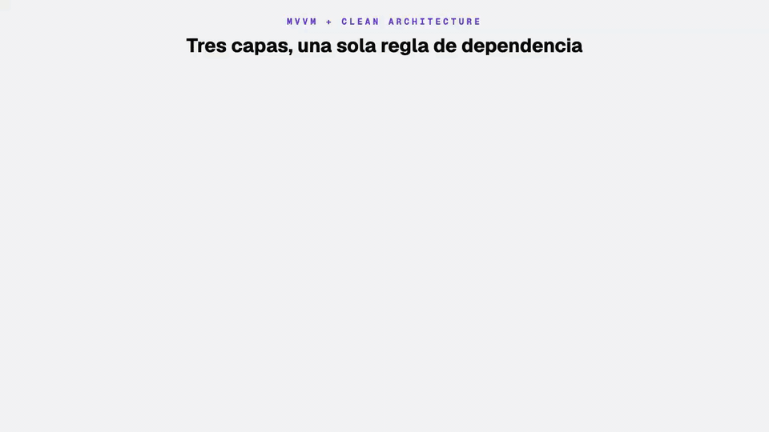

| Capa | Contiene | Depende de | No puede conocer |
| --- | --- | --- | --- |
| **presentation** | Composables, ViewModels, navegación | domain | Retrofit, DTOs, `SharedPreferences` |
| **domain** | Casos de uso, modelos, interfaces de repositorio, `DomainException` | nada (Kotlin puro + Flow) | Android, Retrofit, Gson, Compose |
| **data** | Implementaciones de repositorio, APIs Retrofit, DTOs, entidades y DAOs de Room, mappers, almacenamiento | domain | presentation |

**Regla de dependencia:** las flechas apuntan hacia el dominio. El dominio **define** contratos (`AuthRepository`, `SessionStore`) y la capa de datos los **implementa**. Por eso un caso de uso se prueba en la JVM con un fake, sin red ni emulador, y se puede cambiar Retrofit por Ktor sin tocar la UI.

---

## 2. Organización del código: Core, Commons y Features

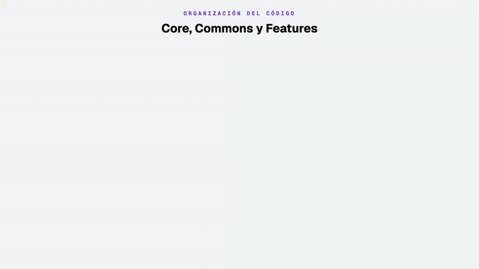

| Paquete | Qué va aquí | Criterio para decidir | Ejemplos |
| --- | --- | --- | --- |
| **`core`** | Infraestructura **transversal** que toda la app necesita una sola vez | Si falta, ninguna feature funciona | Red, sesión cifrada, base de datos Room, `DomainException`, `MainActivity`, navegación, tema |
| **`commons`** | Piezas **reutilizables sin reglas de negocio** | Lo usan dos o más features y no sabe de qué flujo forma parte | Toasts, botones, inputs, `Passenger` |
| **`features`** | Un **flujo vertical** por funcionalidad, con sus propias capas | Tiene sentido de negocio propio | `splash`, `signin`, `signup`, `home`, `menu` |

Reglas de comunicación:

| Dirección | ¿Permitido? | Por qué |
| --- | --- | --- |
| feature → core | Sí | Usa red, sesión y navegación |
| feature → commons | Sí | Reutiliza componentes visuales y modelos compartidos |
| commons → core | Solo el tema (colores) | Los componentes necesitan `ColorPrimary`, `ColorError`… |
| feature → feature | **No** | Acopla flujos. Lo compartido sube a `commons` o `core` |
| core → feature / commons → feature | **No** | La base no puede depender de lo que se construye encima |

```
com/example/android/
├─ AppMain.kt                     // @HiltAndroidApp
├─ core/
│  ├─ data/                       // NetworkModule, HeadersInterceptor, AuthInterceptor, TokenAuthenticator, TokenRefresher,
│  │                              // RefreshApi, ErrorMapper, SafeCall, SecurityModule, SessionExpirationImpl,
│  │                              // SessionStoreEncryptedPrefs, SessionStoreDataStore, AppDatabase, DatabaseModule
│  ├─ domain/                     // SessionStore, SessionExpiration, LocalCache, DomainException
│  └─ presentation/               // activity/MainActivity, theme/
├─ commons/
│  ├─ data/remote/dto/            // PassengerDto + toDomain()
│  ├─ domain/                     // model/Passenger, enum/PassengerStatusEnum
│  └─ presentation/               // AppToast, PrimaryButton, PhoneInputField, TextInputField, OtpCodeInput, SystemBars, PhoneFormat
└─ features/
   ├─ splash/{domain,presentation}/ + SplashModule.kt
   ├─ signin/{data,domain,presentation}/ + SignInModule.kt
   ├─ signup/{data,domain,presentation}/ + SignUpModule.kt
   ├─ home/{domain,presentation}/ + HomeModule.kt
   └─ menu/{data,domain,presentation}/ + MenuModule.kt
```

---

## 3. Core

### 3.1 `core/data` — red


| Archivo | Qué hace |
| --- | --- |
| `NetworkModule.kt` | Módulo Hilt `@Singleton` con **dos clientes**: el público (`@PublicClient`: timeouts de 10 s, `HeadersInterceptor` y logging) y el autenticado, que parte del público con `newBuilder()` y agrega `AuthInterceptor` y `TokenAuthenticator`. Un `Retrofit` por cliente |
| `HeadersInterceptor.kt` | Agrega a toda petición `Accept`, `Accept-Language: es`, `User-Agent: AppTaxi-Android/<versión>` y un `X-Request-Id` único (el backend lo usa como id de traza en sus logs) |
| `AuthInterceptor.kt` | Agrega `Authorization: Bearer <token>` si `SessionStore` tiene un access token. No lo envía a las rutas públicas `/auth/*` |
| `ErrorMapper.kt` | Traduce cualquier `Throwable` técnico a `DomainException` con un mensaje para el usuario |
| `SafeCall.kt` | `safeCall { }` compartido por los repositorios: aplica `ErrorMapper` y relanza la cancelación |

| Librería | Uso |
| --- | --- |
| `com.squareup.retrofit2:retrofit` 3.0.0 | Interfaces `@POST` con funciones `suspend` |
| `com.squareup.retrofit2:converter-gson` 3.0.0 | JSON ⇄ DTO; su `JsonParser` también lee el cuerpo de error |
| `com.squareup.okhttp3:okhttp` 5.5.0 | Transporte, interceptores y `Authenticator` (timeouts de conexión, lectura y escritura: 10 s) |
| `com.squareup.okhttp3:logging-interceptor` 5.5.0 | Log en Logcat: nivel `BODY` solo en `debug`, `NONE` en `release`; el token no aparece (el log va antes de `AuthInterceptor` y `Authorization` está redactado) |
| `com.squareup.okhttp3:mockwebserver3` 5.5.0 | Servidor HTTP falso para las pruebas JVM de la capa de red |
| `com.google.dagger:hilt-android` 2.60.1 | Provee cliente y Retrofit como singletons |

Cómo traduce `ErrorMapper` (el contrato completo, caso por caso, está en [«Contrato de la API con la app»](../backend-app-taxi/README.md#contrato-de-la-api-con-la-app)):

| Excepción | `DomainException` | Mensaje que ve el usuario |
| --- | --- | --- |
| `HttpException` 400 / 422 | `ValidationException` | `errors[0].message` o `message` del backend |
| `HttpException` 401 (después de intentar el refresh) | `UnauthorizedException` | `message` del backend o «Tu sesión expiró. Inicia sesión nuevamente» |
| `HttpException` otros 4xx (p. ej. 429) | `ClientException` | `message` del backend |
| `HttpException` 5xx | `ServerException` | «El servidor no está disponible. Inténtalo más tarde» (ignora el cuerpo) |
| `JsonParseException` / `MalformedJsonException` | `ServerException` | «No pudimos leer la respuesta del servidor» |
| `SocketTimeoutException` | `NetworkException` | «El servidor tardó demasiado en responder» |
| `IOException` | `NetworkException` | «No se pudo conectar con el servidor. Revisa tu conexión» |
| `CancellationException` | — (se relanza) | Nunca llega a la UI |

### 3.2 `core/data` — sesión

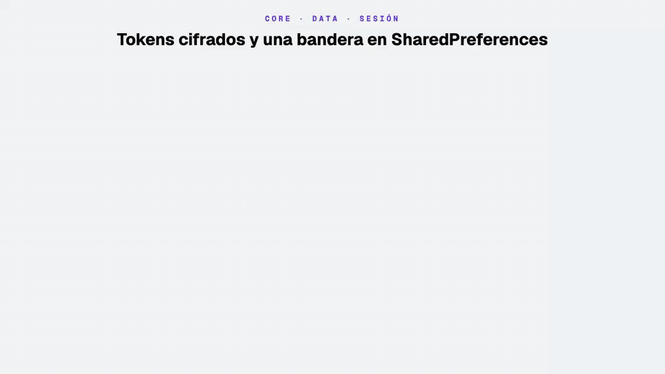

| Archivo | Qué hace |
| --- | --- |
| `SecurityModule.kt` | Provee `SessionStore` (→ `SessionStoreEncryptedPrefs`) y `AuthInterceptor` como `@Singleton` |
| `SessionStoreEncryptedPrefs.kt` | Implementa `SessionStore`: cifra cada token antes de guardarlo en `SharedPreferences` y expone lecturas como `Flow` |
| `SessionStoreDataStore.kt` | La misma sesión con Preferences DataStore y el mismo cifrado. No está conectada en `SecurityModule`: se activa cambiando una línea y migra el XML existente. Comparación en el [README de la clase](../README.md#datastore-en-el-proyecto-sessionstoredatastore) |

| Elemento | Valor |
| --- | --- |
| Algoritmo | `AES/GCM/NoPadding`, clave de 256 bits generada en `AndroidKeyStore` (alias `session_store_aes_key`); la clave nunca sale del Keystore |
| IV / tag | 12 bytes aleatorios por cifrado / 128 bits; AAD = nombre de la clave |
| Formato guardado | `Base64(IV ‖ texto cifrado)` en el archivo `session_store` |
| Lectura inválida | Valor corrupto, manipulado o cifrado con otra clave → `null` (sin sesión) |
| `registration_pending` | Booleano sin cifrar (no es un secreto) en el mismo archivo: `true` mientras el pasajero no termina su registro |

| Librería | Uso |
| --- | --- |
| `javax.crypto` + `java.security.KeyStore` | Cifrado y clave en hardware (sin dependencias extra) |
| `androidx.core:core-ktx` 1.19.0 | `prefs.edit { }` |
| `kotlinx-coroutines` 1.11.0 | `callbackFlow` para observar cambios y `Dispatchers.IO` al escribir |

### 3.3 `core/domain`

| Archivo | Qué define |
| --- | --- |
| `SessionStore.kt` | Contrato de sesión: `saveTokens`, `accessToken(): Flow<String?>`, `refreshToken()`, `setRegistrationPending`, `registrationPending(): Flow<Boolean>`, `clear()` |
| `LocalCache.kt` | Contrato para vaciar los datos locales al cerrar sesión |
| `SessionExpiration.kt` | Contrato de sesión expirada: `expire()` y `events: Flow<Unit>` para que la UI reaccione |
| `DomainException.kt` | Errores tipados (`Validation`, `Unauthorized`, `Client`, `Server`, `Network`, `Unknown`) con mensaje legible, y `Throwable.toDomainException()` |

Librerías: solo `kotlinx-coroutines-core` (para `Flow`). Sin Android, Retrofit ni Gson.

### 3.4 `core/presentation` — Activity, navegación y tema

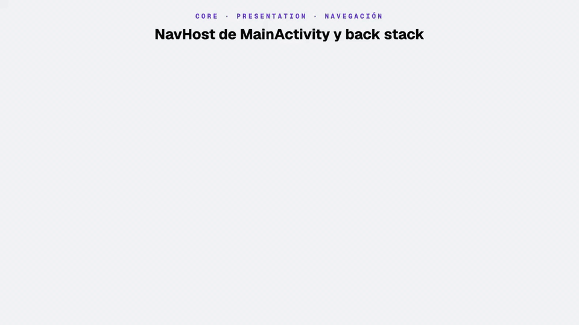

| Archivo | Qué hace |
| --- | --- |
| `activity/MainActivity.kt` | `@AndroidEntryPoint`, *edge-to-edge* con barras transparentes y el `NavHost`. Observa `MainViewModel.sessionExpired`: si la sesión expira, navega a `auth_graph` limpiando el back stack y muestra un toast rojo 3 s |
| `activity/MainViewModel.kt` | Expone los eventos de `SessionExpiration` a la Activity |
| `activity/MainActivity.kt` → `Route` | Rutas tipadas como `sealed class` |
| `theme/Color.kt`, `Theme.kt`, `Type.kt` | Colores (`ColorPrimary #7843E6`, `ColorSuccess`, `ColorError`) y Material 3 |

| Ruta | Grafo | Navega a | Back stack |
| --- | --- | --- | --- |
| `splash` | — | `auth_graph`, `sign_up_graph` o `home` tras 1,5 s, según la sesión | Limpia todo |
| `sign_in/generate` | `auth_graph` | `sign_in/validate/{phone}/{expiresAt}` | Conserva (se puede volver) |
| `sign_in/validate/{phone}/{expiresAt}` | `auth_graph` | `home` (ACTIVE) o `sign_up_graph` (INACTIVE_REGISTER) | Limpia todo |
| `sign_up/step1` → `sign_up/step2` | `sign_up_graph` | `home` cuando `PUT passenger/signup` responde 200 | Limpia todo al terminar |
| `home` | — | `menu` con el botón circular · `auth_graph` al cerrar sesión | Conserva (menú) · Limpia todo (cerrar sesión) |
| `menu` | — | Vuelve a `home` con «Volver» o con la opción «Pedir taxi» | `popBackStack()` |

| Librería | Uso |
| --- | --- |
| `androidx.activity:activity-compose` 1.13.0 | `setContent`, `enableEdgeToEdge` |
| `androidx.navigation:navigation-compose` 2.10.1 | `NavHost`, `navigation(...)`, argumentos tipados |
| `hilt-android` 2.60.1 | `@AndroidEntryPoint` |
| Compose Material 3 | `MaterialTheme` |

### 3.5 `core/data` — base de datos local (Room)

| Archivo | Qué hace |
| --- | --- |
| `AppDatabase.kt` | `@Database` con la lista de entidades y la versión del esquema. Expone los DAOs (`menuDao()`) |
| `DatabaseModule.kt` | Módulo Hilt `@Singleton`: crea la base `app_taxi.db` con `Room.databaseBuilder` y provee `LocalCache` |
| `SafeCall.kt` | `safeCall { }`: traduce cualquier error con `ErrorMapper` y relanza `CancellationException`. Lo usan todos los repositorios |
| `core/domain/LocalCache.kt` | Contrato `fun interface LocalCache { suspend fun clear() }`; su implementación es `db.clearAllTables()` |

| Elemento | Valor |
| --- | --- |
| Librería | Room 3 (`androidx.room3:room3-runtime` y `room3-compiler` con KSP), paquete `androidx.room3` |
| Driver | `AndroidSQLiteDriver` (el SQLite del sistema); es el que usa Room si no se configura otro |
| Esquema exportado | `app/schemas/com.example.android.core.data.AppDatabase/1.json`, generado por el plugin `androidx.room3` (`room3 { schemaDirectory(...) }`). Se versiona en git |
| Hilos | Las funciones `suspend` y los `Flow` de los DAOs corren en `Dispatchers.IO` sin configurar nada |

`AppDatabase` y `MainActivity` (el `NavHost`) son los únicos puntos de `core` que conocen a las features: Room necesita la lista completa de entidades en una sola clase. Cada feature provee su propio DAO desde su módulo Hilt (`MenuModule.provideMenuDao`).

### 3.6 `core/data` — renovación de sesión (refresh token)


El access token dura 15 minutos. Cuando vence, el backend responde 401 y OkHttp llama al `Authenticator`, que pide tokens nuevos y repite la petición. El usuario no lo nota.

| Archivo | Qué hace |
| --- | --- |
| `TokenAuthenticator.kt` | `okhttp3.Authenticator`: ante un 401 pide a `TokenRefresher` un token vigente y reintenta **una vez**. Ignora las rutas `/auth/*` |
| `TokenRefresher.kt` | Renueva con un `Mutex` (*single-flight*): si varias peticiones fallan a la vez, solo la primera llama al backend; las demás reutilizan el token nuevo |
| `RefreshApi.kt`, `dto/RefreshRequest.kt`, `dto/RefreshResponse.kt` | `POST auth/refresh`. Usa el Retrofit **público** (`@PublicClient`), sin `AuthInterceptor` ni `Authenticator` |
| `SessionExpirationImpl.kt` | Implementa `SessionExpiration`: borra tokens y caché local y avisa a la UI |

| Resultado del refresh | Qué hace la app |
| --- | --- |
| 200 | Guarda el par nuevo y repite la petición original con el access token nuevo |
| 4xx (refresh token inválido o vencido) | La sesión expira: se borra todo y `MainActivity` navega a «Generar OTP» con un toast rojo |
| 5xx o sin red | No se toca la sesión: la petición original falla como error de red y se puede reintentar |
| El reintento vuelve a recibir 401 | No se intenta de nuevo (evita bucles) |

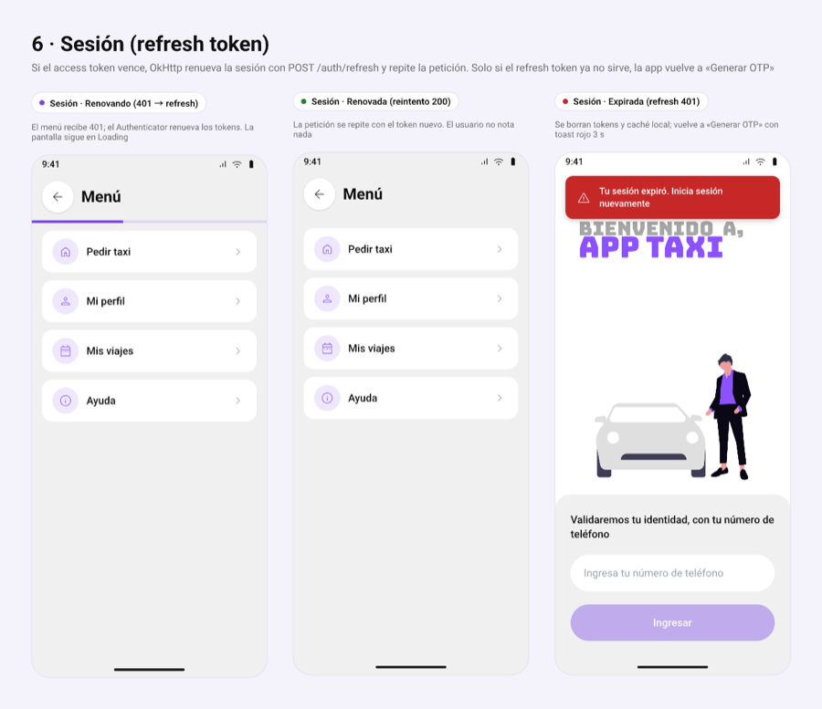

---

## 4. Commons

### 4.1 `commons/presentation` — componentes

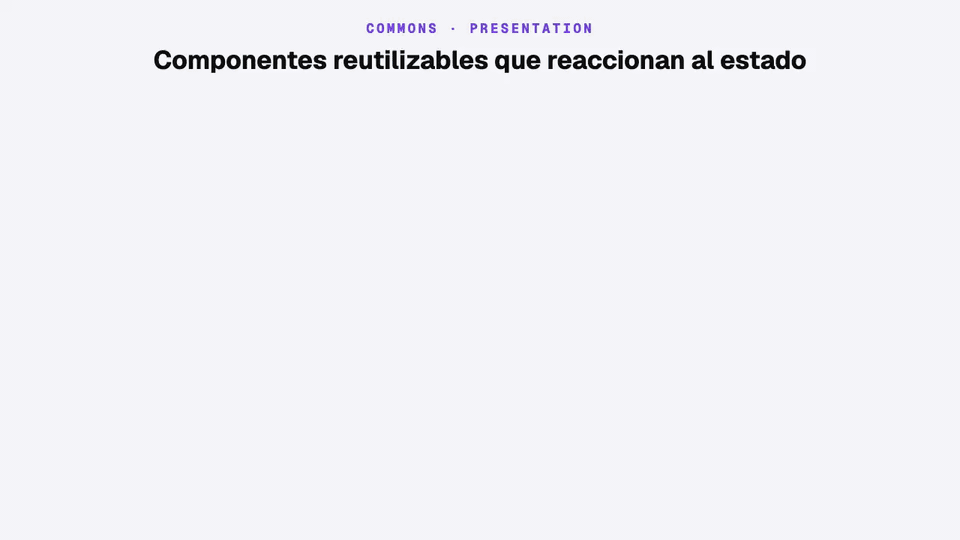

| Componente | Qué hace | Lo usan |
| --- | --- | --- |
| `AppToast` / `ToastHost` | Toast verde (`Success`) o rojo (`Error`) bajo la barra de estado, animado y accesible (*live region*) | signin, home, menu, signup |
| `PrimaryButton` | Botón principal con estados `enabled` y `loading` (spinner). Deshabilitado = morado al 40 % | todas |
| `PhoneInputField` | Solo dígitos, máximo 9, prefijo `+51` visible al escribir | signin |
| `TextInputField` | Campo de texto con el mismo estilo: `maxLength`, tipo de teclado, mayúsculas y acción IME | signup |
| `OtpCodeInput` | 4 casillas con avance y retroceso automático de foco | signin |
| `NavigationBarStyle` | Color de los íconos de la barra de navegación (*edge-to-edge*) | todas |
| `formatPeruPhone` | `987654321` → `+51 987 654 321` | signin |

| Librería | Uso |
| --- | --- |
| Compose UI + Material 3 (BOM 2026.09.00) | Componentes base |
| `androidx.compose.material:material-icons-core` | `CheckCircle` y `Warning` del toast |
| `androidx.compose.ui:ui-tooling-preview` | `@Preview` de cada componente |

Regla: ningún componente de `commons` conoce un ViewModel ni un caso de uso. Reciben valores y callbacks.

### 4.2 `commons/domain` y `commons/data`

| Archivo | Capa | Qué es |
| --- | --- | --- |
| `domain/model/Passenger.kt` | domain | Pasajero: `id`, `phoneNumber`, nombres, `email`, `photoUrl`, `status` |
| `domain/enum/PassengerStatusEnum.kt` | domain | `ACTIVE`, `INACTIVE_REGISTER`, `SUSPENDED` |
| `data/remote/dto/PassengerDto.kt` | data | Forma del JSON `user` del backend + `toDomain()` |

Están en `commons` porque los usarán otros flujos (registro, perfil), no solo signin. Librerías: ninguna propia (el DTO lo deserializa Gson desde `core/data`).

---

## 5. Features

### 5.1 `splash`

Muestra el logo con un spinner durante 1,5 s y `SplashViewModel` decide el destino con `GetStartDestinationUseCase`, que lee dos valores de `SessionStore`:

| Token guardado | `registration_pending` | Destino |
| --- | --- | --- |
| No | — | `auth_graph` (Generar OTP) |
| Sí | `true` | `sign_up_graph` (retoma el registro con el borrador guardado) |
| Sí | `false` | `home` |

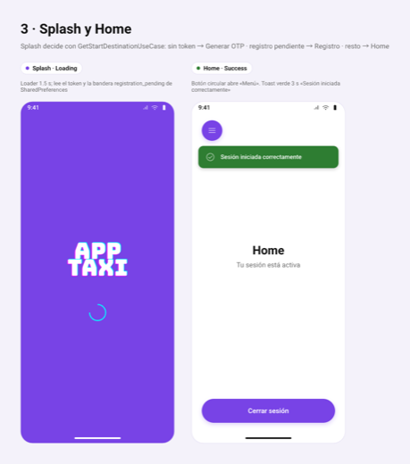

### 5.2 `signin` — inicio de sesión con OTP

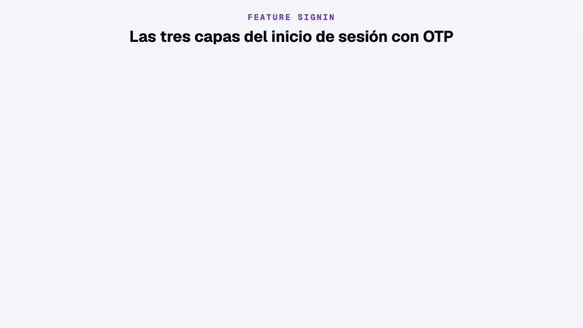

| Capa | Archivos | Responsabilidad |
| --- | --- | --- |
| presentation | `SignInGenerateOtpScreen`, `SignInValidateOtpScreen`, `SignInViewModel` | Formularios, cuenta regresiva, toasts, navegación |
| domain | `OtpGenerateUseCase`, `OtpValidateUseCase`, `AuthRepository`, `model/` | Anteponer `51`, guardar la sesión, decidir si va a registro y marcar `registration_pending` |
| data | `AuthApi`, `dto/`, `AuthRepositoryImpl` | Llamar al backend, mapear DTO → dominio, traducir errores |
| DI | `SignInModule` | Provee `AuthApi`, `AuthRepository` (la **interfaz**) y los casos de uso |

```kotlin
// domain: el contrato no conoce Retrofit ni DTOs
interface AuthRepository {
    suspend fun otpGenerate(phone: String): OtpGenerateResult
    suspend fun otpValidate(phone: String, code: String): OtpValidateResult
}

// domain: el caso de uso emite estados; los errores se capturan con el operador catch
operator fun invoke(phoneReq: String): Flow<OtpGenerateState> = flow {
    emit(OtpGenerateState.Loading)
    val result = repo.otpGenerate(phone = "$COUNTRY_CODE$phoneReq")
    emit(OtpGenerateState.Success(phone = phoneReq, expiresAt = result.expiresAt))
}.catch { emit(OtpGenerateState.Error(it.toDomainException().message)) }

// data: la implementación traduce errores y respeta la cancelación
private inline fun <T> safeCall(block: () -> T): T = try {
    block()
} catch (e: CancellationException) {
    throw e
} catch (t: Throwable) {
    throw ErrorMapper.map(t)
}
```

#### Pantalla «Generar OTP»

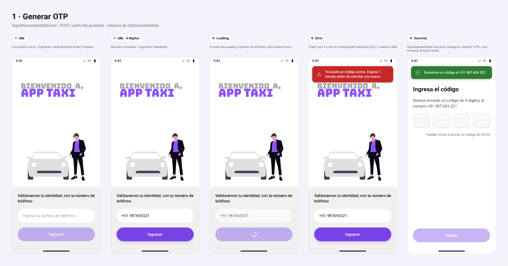

| Estado (`OtpGenerateState`) | Qué ve el usuario | Cómo sale del estado |
| --- | --- | --- |
| `Idle` | Formulario; «Ingresar» habilitado con 9 dígitos | Al pulsar «Ingresar» |
| `Loading` | Campo bloqueado y spinner en el botón (sin doble envío) | Respuesta del backend |
| `Success(phone, expiresAt)` | Navega a «Validar OTP», que muestra el toast verde «Enviamos un código al +51 …» | `clearGenerateState()` antes de navegar |
| `Error(message)` | Toast rojo con el mensaje del backend durante 3 s | Vuelve a `Idle` a los 3 s |

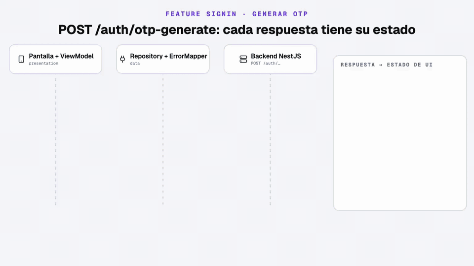

#### Pantalla «Validar OTP»

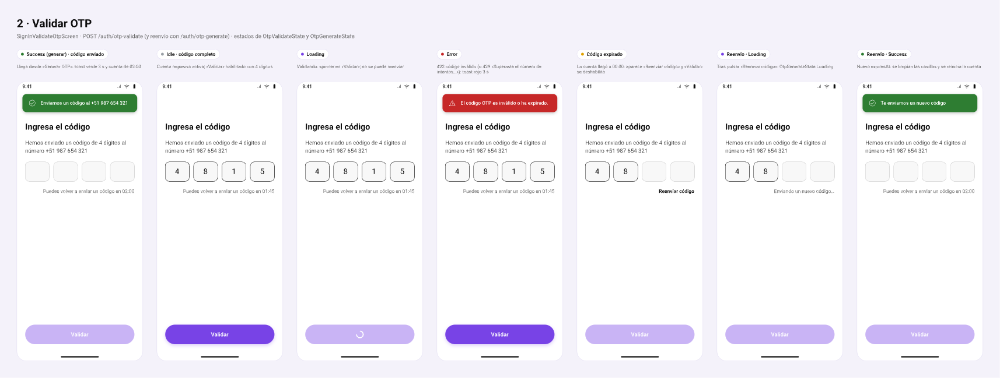

| Estado | Qué ve el usuario |
| --- | --- |
| Código enviado (llegada desde «Generar») | Toast verde «Enviamos un código al +51 987 654 321», cuenta regresiva de 02:00 |
| `Idle` con código vigente | 4 casillas y «Puedes volver a enviar un código en mm:ss» |
| `OtpValidateState.Loading` | Spinner en «Validar»; no se puede reenviar |
| `OtpValidateState.Success(showRegister)` | Navega a Home (`false`) o a Registro (`true`) limpiando el back stack |
| `OtpValidateState.Error(message)` | Toast rojo 3 s (código inválido, 429 por intentos, 500 o sin red) |
| Código expirado | Aparece «Reenviar código» y «Validar» se deshabilita |
| Reenvío `OtpGenerateState.Loading` | «Enviando un nuevo código…» |
| Reenvío `OtpGenerateState.Success` | Toast verde «Te enviamos un nuevo código»; se limpian las casillas y se reinicia la cuenta |

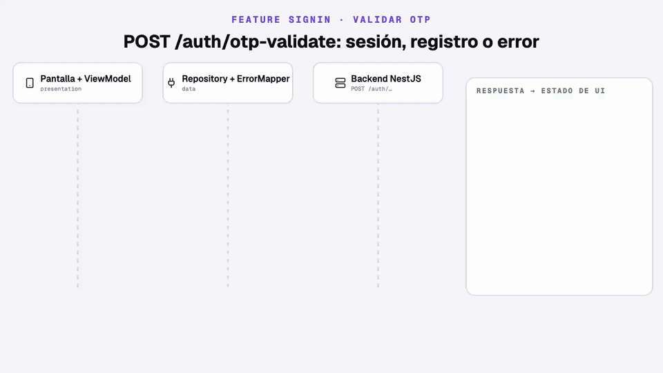

### 5.3 `signup` — registro en 2 pasos con borrador en SharedPreferences


Se llega cuando el backend responde `user.status = INACTIVE_REGISTER` o cuando Splash encuentra un registro pendiente.

| Capa | Archivos | Responsabilidad |
| --- | --- | --- |
| presentation | `SignUpStep1Screen`, `SignUpStep2Screen`, `SignUpStepHeader`, `SignUpViewModel` | Formularios, validación visual, toast de error |
| domain | `SignUpDraft`, `SignUpDraftStore`, `SignUpRepository`, `GetSignUpDraftUseCase`, `SaveSignUpDraftUseCase`, `SignUpUseCase`, `SignUpRules` | Reglas de nombres y correo, enviar el borrador, marcar el registro como completo |
| data | `local/SignUpDraftStorePrefs`, `remote/SignUpApi`, `remote/dto/SignUpRequest`, `SignUpRepositoryImpl` | Archivo `signup_draft` de SharedPreferences y `PUT passenger/signup` |
| DI | `SignUpModule` | Provee el `SharedPreferences` del borrador (calificador `@SignUpDraftPrefs`), el store, la API, el repositorio y los casos de uso |

```kotlin
// domain: el contrato no conoce SharedPreferences
interface SignUpDraftStore {
    suspend fun get(): SignUpDraft
    suspend fun savePersonal(givenName: String, familyName: String)
    suspend fun saveEmail(email: String)
    suspend fun clear()
}

// domain: el registro envía lo que está guardado y limpia al terminar
operator fun invoke(): Flow<SignUpState> = flow {
    emit(SignUpState.Loading)
    val draft = draftStore.get()
    repo.signUp(draft.givenName.trim(), draft.familyName.trim(), draft.email.trim())
    session.setRegistrationPending(false)
    draftStore.clear()
    emit(SignUpState.Success)
}.catch { emit(SignUpState.Error(it.toDomainException().message)) }
```


| Pantalla | Estado | Qué ve el usuario |
| --- | --- | --- |
| Paso 1 | Borrador vacío | Campos vacíos; «Continuar» deshabilitado hasta tener 2 caracteres en cada uno |
| Paso 1 | Borrador restaurado | Los nombres y apellidos escritos antes de cerrar la app |
| Paso 2 | `SignUpState.Idle` | Saludo con el nombre del borrador; «Finalizar registro» exige un correo válido |
| Paso 2 | `SignUpState.Loading` | Spinner en el botón y campo bloqueado |
| Paso 2 | `SignUpState.Success` | Navega a Home limpiando el back stack; el borrador se borra |
| Paso 2 | `SignUpState.Error(message)` | Toast rojo 3 s (correo ya usado, validación, 401, sin red); el borrador se conserva |

El texto de los campos vive en el ViewModel como `mutableStateOf` (estado síncrono): un `StateFlow` recolectado llega un frame tarde y puede perder teclas al escribir rápido.

### 5.4 `home`


| Capa | Archivos | Responsabilidad |
| --- | --- | --- |
| presentation | `HomeScreen` (`HomeRoute` + `HomeScreen`), `HomeViewModel` | Botón circular que abre el menú, toast de bienvenida y «Cerrar sesión» |
| domain | `SignOutUseCase` | Borra la sesión (`SessionStore.clear()`) y la caché local (`LocalCache.clear()` → `clearAllTables()`) |
| DI | `HomeModule` | Provee `SignOutUseCase` |

| Estado | Qué ve el usuario |
| --- | --- |
| Llegada | Toast verde «Sesión iniciada correctamente» durante 3 s |
| Botón de menú | Navega a `menu` conservando Home en el back stack |
| Cerrar sesión | Se borran los tokens y la tabla `menu` y, **después**, se navega a «Generar OTP» sin historial |

### 5.5 `menu` — menú con caché local en Room


| Capa | Archivos | Responsabilidad |
| --- | --- | --- |
| presentation | `MenuScreen` (`MenuRoute` + `MenuScreen`), `MenuViewModel` | Lista, skeleton, barra de actualización, toast de error y «Reintentar» |
| domain | `Menu`, `MenuRepository`, `ObserveMenuUseCase`, `RefreshMenuUseCase` | Observar el menú guardado y pedir su actualización |
| data | `local/MenuEntity`, `local/MenuDao`, `remote/MenuApi`, `remote/dto/MenuDto`, `MenuRepositoryImpl` | Tabla `menu`, consultas, llamada al backend y mapeos DTO → Entity → dominio |
| DI | `MenuModule` | Provee `MenuApi`, `MenuDao` (desde `AppDatabase`), `MenuRepository` y los casos de uso |

```kotlin
// domain: dos operaciones separadas
interface MenuRepository {
    fun observeMenu(): Flow<List<Menu>>   // siempre desde Room
    suspend fun refreshMenu()             // red → Room
}

// data: la red nunca llega directo a la pantalla
override fun observeMenu(): Flow<List<Menu>> =
    dao.observeAll().map { entities -> entities.map { it.toDomain() } }

override suspend fun refreshMenu() = safeCall {
    val updatedAt = now()
    val remote = api.getMenu()
    dao.replaceAll(remote.map { it.toEntity(updatedAt) })
}
```

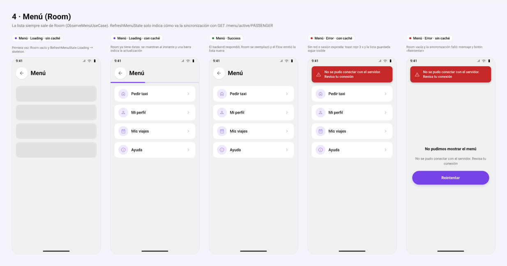

| Room (`menu`) | `RefreshMenuState` | Qué ve el usuario |
| --- | --- | --- |
| Vacío | `Loading` | Skeleton de 4 tarjetas |
| Con datos | `Loading` | La lista guardada al instante y una barra de progreso bajo el título |
| Con datos | `Success` | La lista actualizada (Room emitió después de `replaceAll`) |
| Con datos | `Error(message)` | La lista guardada y un toast rojo 3 s (sin red, 401, 5xx) |
| Vacío | `Error(message)` | «No pudimos mostrar el menú», el mensaje y el botón «Reintentar» |
| Vacío | `Success` | «No hay opciones disponibles» y «Reintentar» |

El backend envía un nombre lógico de ícono (`home`, `profile`, `history`, `support`) y `MenuScreen` lo traduce a un ícono de `material-icons-core`. «Pedir taxi» vuelve a Home; las demás opciones todavía no navegan.

---

## 6. Ejecutar, probar y mantener

### Arranque rápido

1. Levanta infra y backend ([`../infra-app-taxi`](../infra-app-taxi/README.md) y [`../backend-app-taxi`](../backend-app-taxi/README.md)). Sin credenciales del proveedor SMS, el backend escribe el código OTP en su log (`[DEV] OTP para +51…`).
2. Abre el proyecto en Android Studio (Gradle JDK = 17).
3. Ajusta la URL base en `app/build.gradle.kts` (debe terminar en `/`). En el emulador, `10.0.2.2` es el `localhost` del host:
   ```kotlin
   buildConfigField("String", "API_BASE_URL", "\"http://10.0.2.2:3001/\"")
   ```
   En un dispositivo físico usa la IP LAN del host (`http://192.168.x.x:3001/`).
4. Ejecuta `app`. HTTP en claro está permitido por `usesCleartextTraffic` y `network_security_config.xml` (solo desarrollo).

### Comandos y pruebas

| Comando | Qué valida |
| --- | --- |
| `./gradlew assembleDebug` | Compila la app |
| `./gradlew testDebugUnitTest` | 49 pruebas JVM |
| `./gradlew connectedDebugAndroidTest` | Pruebas instrumentadas (Keystore, Room, SharedPreferences y DataStore reales) |
| `./gradlew lintDebug` | Lint (`app/build/reports/lint-results-debug.html`) |

| Prueba | Tipo | Qué verifica |
| --- | --- | --- |
| `OtpGenerateUseCaseTest` | JVM | `Loading → Success`, prefijo `51`, errores de dominio y genéricos |
| `OtpValidateUseCaseTest` | JVM | Guarda tokens, `showRegister` según `status`, no guarda sesión si falla |
| `AuthRepositoryImplTest` | JVM | DTO → dominio; 400, 422, 429, 404 y 500 → `DomainException`; `IOException`; la cancelación se relanza |
| `SessionStoreEncryptedPrefsTest` | Instrumentada | Cifrado real, sobrescritura, datos corruptos, bandera `registration_pending` |
| `TokenAuthenticatorTest` | JVM (MockWebServer) | 401 → refresh → reintento; cuatro 401 simultáneos hacen un solo refresh; refresh rechazado expira la sesión; error 5xx la conserva; no hay segundo reintento |
| `InterceptorsTest` | JVM (MockWebServer) | Bearer en rutas protegidas, nada en `/auth/*`, headers de idioma, versión e id de petición |
| `ErrorMapperTest` | JVM | 401 → `UnauthorizedException`, JSON inválido → `ServerException`, timeout |
| `SessionStoreDataStoreTest`, `SessionStoreDataStoreMigrationTest` | Instrumentada | Lo mismo sobre DataStore, y que una sesión guardada con SharedPreferences se lee tras migrar |
| `MenuRepositoryImplTest` | JVM | Lee de Room en orden, no llama a la red al observar, `refreshMenu` reemplaza la tabla, conserva la caché si falla, 401 y cancelación |
| `RefreshMenuUseCaseTest` | JVM | `Loading → Success`, errores de dominio y genéricos |
| `SignOutUseCaseTest` | JVM | Borra tokens y caché local |
| `GetStartDestinationUseCaseTest` | JVM | Sin token → SignIn, registro pendiente → SignUp, resto → Home |
| `SignUpUseCaseTest`, `SignUpRulesTest`, `SignUpRepositoryImplTest` | JVM | Envía el borrador recortado, limpia al terminar, conserva el borrador si falla; reglas de nombres y correo; 422 → `ValidationException` |
| `MenuDaoTest` | Instrumentada | Room real en memoria: orden por `position`, `@Upsert`, `replaceAll`, `clearAllTables` |
| `SignUpDraftStorePrefsTest` | Instrumentada | SharedPreferences real: guardar por pasos, leer desde otra instancia, limpiar |

Los fakes están junto a cada feature: `features/signin/FakeAuth.kt` (`FakeAuthRepository`, `FakeSessionStore`), `features/menu/FakeMenu.kt` (`FakeMenuApi`, `FakeMenuDao`, `FakeMenuRepository`) , `features/signup/FakeSignUp.kt` (`FakeSignUpDraftStore`, `FakeSignUpRepository`) y `core/data/NetworkTestSupport.kt` (cliente de prueba contra MockWebServer).

### Ícono launcher

La app usa un **adaptive icon** vectorial (`minSdk 29`, siempre `mipmap-anydpi`): `res/mipmap-anydpi/ic_launcher.xml` y `ic_launcher_round.xml` combinan `res/values/ic_launcher_background.xml` (`#FFFFFF`) y `res/drawable/ic_launcher_foreground.xml` (letrero «TAXI», lienzo de 108 dp). En `design-m03-c03.pen`, sección **«Launcher icon»**, hay dos filas (cuadrada y circular) con Background y Foreground exportables y un preview de ambos.

Para actualizarlo: exporta el **Foreground** en PNG con escala 4 (432 × 432 px) y en Android Studio usa *New → Image Asset → Launcher Icons (Adaptive and Legacy)* con ese PNG como **Foreground Layer** y el color del Background como **Background Layer**. Después desinstala la app del emulador (el launcher cachea el ícono).

### Troubleshooting

| Síntoma | Solución |
| --- | --- |
| `CLEARTEXT communication not permitted` | Revisa `usesCleartextTraffic` y `network_security_config.xml` |
| `Failed to connect to /10.0.2.2:3001` | El backend no está arriba o usa otro puerto (`APPLICATION_PORT`) |
| La app vuelve sola a «Generar OTP» con «Tu sesión expiró…» | El backend rechazó el refresh token (venció a los 30 días, cambió `JWT_REFRESH_SECRET` o el pasajero ya no existe). Inicia sesión otra vez |
| En Logcat aparece un `POST /auth/refresh` en medio de otra petición | Es el flujo normal: el access token venció y se renovó |
| `Cannot find implementation for AppDatabase` | Falta `ksp(libs.room.compiler)` o el plugin KSP |
| `Schema export directory was not provided` | Falta el bloque `room3 { schemaDirectory(...) }` o pon `exportSchema = false` |
| `Room cannot verify the data integrity… you've changed schema but forgot to update the version` | Cambiaste una entidad: sube `version` y agrega una migración (o desinstala la app en desarrollo) |
| Toast «Ya existe un código activo…» | Rate limit del backend (60 s): espera y reintenta |
| Toast «Superaste el número de intentos…» | 5 códigos incorrectos: pulsa «Reenviar código» cuando termine la cuenta |
| La cuenta regresiva muestra 00:00 de inmediato | El reloj del emulador y el del servidor no coinciden |
| `Failed to apply plugin 'org.jetbrains.kotlin.android'` | AGP 9 ya integra Kotlin: no declares ese plugin |
| Android Studio: «incompatible version (AGP x)» | Usa Android Studio 2026.1+ o una AGP que soporte tu IDE |
| Preview: `Expected an activity context for creating a HiltViewModelFactory` | Los `@Preview` llaman a `…Screen`, nunca a `…Route` |
| La app desaparece tras `connectedDebugAndroidTest` | La tarea la desinstala al terminar: `./gradlew installDebug` |
