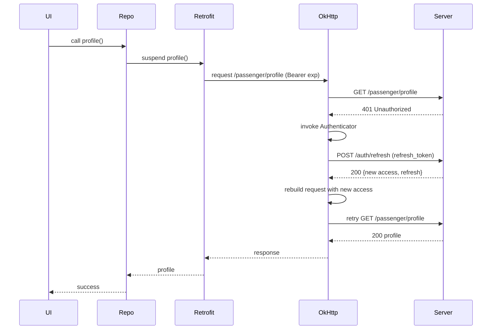

# Módulo 3 · Sesión 3 — Retrofit y Manejo de Errores (con Refresh Token end-to-end)

## Objetivos de aprendizaje

1. Comprender el rol de **Retrofit** en el stack Android (historia, por qué existe, ventajas y límites).
2. Configurar **Retrofit + OkHttp** con serialización tipada y **interceptores** (auth, logging y headers).
3. Diseñar un **mecanismo robusto de refresh token** usando `OkHttp Authenticator` y un `TokenStore` seguro.
4. Modelar errores con **sealed class / Result** y mapearlos a mensajes de UI con un **ErrorMapper**.
5. Implementar patrones anti-fallas: **reintentos controlados**, **de-duplicación de refresh** y **circuit breakers** ligeros.

---

## Contenido de la clase

1. Historia y posición de Retrofit en Android
2. Arquitectura: Retrofit + OkHttp + Converter + CallAdapter
3. Comparativa con otras librerías (Volley, Ktor, Fuel)
4. Configuración base (Gradle, builder, converter, timeouts)
5. Definición de servicios y modelos (DTOs tipados)
6. Interceptores: auth, logging, headers (User-Agent, trace)
7. Refresh token con `OkHttp Authenticator` (patrón end-to-end)
8. Manejo de errores con **sealed class/Result** + `ErrorMapper`
9. Patrones avanzados: de-duplicación, backoff, idempotencia
10. Laboratorio: implementación completa paso a paso
11. Diagrama conceptual del refresh “single-flight”
12. Checklist de buenas prácticas
13. Tarea opcional (refuerzos)

---

## 1) Historia y posición de Retrofit

**Antes de Retrofit**, en Android se usaba `HttpURLConnection` y luego **Volley** (2013) para colas, caché y parsing básico. **Square** crea **OkHttp** (cliente HTTP eficiente: pooling, gzip, cache, HTTP/2) y sobre él **Retrofit** (2009/2013) para **declarar APIs por interfaz**, **converters** (Moshi/Gson/kotlinx.serialization) y **call adapters** (Coroutines/Rx).

**Por qué ganó**

-   API declarativa por interfaz, menos boilerplate.
-   Integración directa con OkHttp (interceptores, caché, TLS, HTTP/2).
-   Extensible: `Converter.Factory` y `CallAdapter.Factory`.
-   Con Coroutines, `suspend` simplificó el manejo asíncrono.

**Límites**

-   Solo transporte: no sustituye arquitectura, repositorios ni reglas de negocio.
-   Requiere modelado coherente de errores y contratos con el backend.

---

## 2) Arquitectura (alto nivel)

Retrofit se apoya en OkHttp. Los **interceptores** y el **Authenticator** viven en OkHttp. Converters y CallAdapters viven en Retrofit.

```mermaid
flowchart LR
    UI[UI / ViewModel] -->|calls| UseCase
    UseCase --> Repository
    Repository --> ApiService[Retrofit Api (interfaces)]
    ApiService --> Retrofit
    Retrofit -->|uses| OkHttp[(OkHttpClient)]
    OkHttp -->|Interceptors| AuthI[Auth Interceptor]
    OkHttp -->|Authenticator| RefreshA[Token Authenticator]
    OkHttp --> Server[(API Server)]
```

---

## 3) Comparativa con otras librerías

| Criterio       | Retrofit (+OkHttp)       | Ktor Client           | Volley          | Fuel       |
| -------------- | ------------------------ | --------------------- | --------------- | ---------- |
| Estilo         | Declarativo por interfaz | KMP multiplataforma   | Encolado + JSON | DSL ligera |
| Coroutines     | Sí (suspend)             | Sí (nativo KMP)       | No nativo       | Soporte    |
| Interceptores  | Muy maduro (OkHttp)      | Plugins/Features      | Limitado        | Simples    |
| Extensibilidad | Converters + Adapters    | Plugins               | Menor           | Menor      |
| Caso ideal     | Android nativo moderno   | Código compartido KMP | Legacy          | Prototipos |

> Para Android nativo, **Retrofit + OkHttp** sigue siendo estándar por estabilidad y ecosistema.

---

## 4) Configuración base

**Gradle (module):**

```gradle
dependencies {
    implementation("com.squareup.okhttp3:okhttp:4.12.0")
    implementation("com.squareup.okhttp3:logging-interceptor:4.12.0")
    implementation("com.squareup.retrofit2:retrofit:2.11.0")
    implementation("com.squareup.retrofit2:converter-moshi:2.11.0")
    implementation("com.squareup.moshi:moshi:1.15.1")
    implementation("com.squareup.moshi:moshi-kotlin:1.15.1")
}
```

**Builder (código en inglés, comentarios en español):**

```kotlin
// Comentarios en español; código en inglés
object NetworkModule {
    fun provideOkHttp(
        authInterceptor: Interceptor,
        logging: HttpLoggingInterceptor,
        authenticator: Authenticator
    ): OkHttpClient {
        return OkHttpClient.Builder()
            .connectTimeout(15, TimeUnit.SECONDS)
            .readTimeout(30, TimeUnit.SECONDS)
            .writeTimeout(30, TimeUnit.SECONDS)
            .addInterceptor(headersInterceptor()) // User-Agent, trace-id, etc.
            .addInterceptor(authInterceptor)      // Bearer access token
            .authenticator(authenticator)         // Refresh token en 401
            .addInterceptor(logging)              // Logging solo en debug
            .build()
    }

    fun provideRetrofit(okHttp: OkHttpClient, baseUrl: String): Retrofit {
        return Retrofit.Builder()
            .baseUrl(baseUrl)
            .client(okHttp)
            .addConverterFactory(MoshiConverterFactory.create().withNullSerialization())
            .build()
    }

    private fun headersInterceptor(): Interceptor = Interceptor { chain ->
        val request = chain.request().newBuilder()
            .header("User-Agent", "PassengerApp/1.0 (Android)")
            .header("X-Trace-Id", java.util.UUID.randomUUID().toString())
            .build()
        chain.proceed(request)
    }
}
```

---

## 5) Definición de servicios y modelos

**DTOs (Moshi):**

```kotlin
// Comentarios en español; código en inglés
data class LoginRequest(
    val phone: String,
    val code: String
)

data class TokenResponse(
    val accessToken: String,
    val refreshToken: String,
    val expiresIn: Long
)

data class ApiError(
    val code: String?,
    val message: String?
)
```

**API:**

```kotlin
// Comentarios en español; código en inglés
interface AuthApi {
    @POST("auth/login")
    suspend fun login(@Body body: LoginRequest): TokenResponse

    @POST("auth/refresh")
    suspend fun refresh(@Body body: Map<String, String>): TokenResponse
}

interface PassengerApi {
    @GET("passenger/profile")
    suspend fun profile(): PassengerProfileDto
}
```

---

## 6) Interceptores: auth, logging, headers

**AuthInterceptor** (inyecta `Authorization: Bearer <access>`):

```kotlin
// Comentarios en español; código en inglés
class AuthInterceptor(
    private val tokenStore: TokenStore
) : Interceptor {
    override fun intercept(chain: Interceptor.Chain): Response {
        val access = tokenStore.getAccessToken() // lectura rápida
        val original = chain.request()
        val newReq = if (!access.isNullOrBlank()) {
            original.newBuilder()
                .header("Authorization", "Bearer $access")
                .build()
        } else original
        return chain.proceed(newReq)
    }
}
```

**LoggingInterceptor** (solo en debug):

```kotlin
// Comentarios en español; código en inglés
fun provideLoggingInterceptor(debug: Boolean): HttpLoggingInterceptor {
    return HttpLoggingInterceptor().apply {
        level = if (debug) HttpLoggingInterceptor.Level.BODY
                else HttpLoggingInterceptor.Level.NONE
    }
}
```

---

## 7) Refresh token con `OkHttp Authenticator` (patrón end-to-end)

**Diagrama de secuencia (expiración + refresh + reintento):**



**Puntos críticos**

-   **De-duplicación**: si varias requests fallan con 401, refrescar **solo una vez** (mutex).
-   **Evitar bucles**: limita reintentos; si refresh falla, **logout**.
-   **Cliente limpio**: refrescar con un **OkHttpClient sin Interceptor ni Authenticator**.
-   **Persistencia atómica**: actualizar tokens de forma segura.

**TokenStore** (thread-safe; respaldo DataStore/EncryptedSharedPreferences):

```kotlin
// Comentarios en español; código en inglés
interface TokenStore {
    fun getAccessToken(): String?
    fun getRefreshToken(): String?
    fun setTokens(access: String, refresh: String, expiryEpochSec: Long)
    fun clear()
}
```

**Authenticator con de-duplicación:**

```kotlin
// Comentarios en español; código en inglés
class TokenAuthenticator(
    private val tokenStore: TokenStore,
    private val refreshApi: AuthApi,                  // cliente "limpio"
    private val lock: kotlinx.coroutines.sync.Mutex = kotlinx.coroutines.sync.Mutex()
) : Authenticator {

    override fun authenticate(route: Route?, response: Response): Request? {
        if (responseCount(response) >= 2) return null // evitar loop

        return kotlinx.coroutines.runBlocking {
            lock.withLock {
                // Si otro hilo refrescó mientras esperábamos, usar ese token
                tokenStore.getAccessToken()?.let { latest ->
                    val stillUnauthorized = response.request.header("Authorization")?.endsWith(latest) == true
                    if (!stillUnauthorized) {
                        return@withLock response.request.newBuilder()
                            .header("Authorization", "Bearer $latest")
                            .build()
                    }
                }

                val currentRefresh = tokenStore.getRefreshToken() ?: return@withLock null
                val result = kotlin.runCatching {
                    refreshApi.refresh(mapOf("refreshToken" to currentRefresh))
                }.getOrElse { return@withLock null }

                tokenStore.setTokens(
                    result.accessToken,
                    result.refreshToken,
                    System.currentTimeMillis() / 1000 + result.expiresIn
                )

                return@withLock response.request.newBuilder()
                    .header("Authorization", "Bearer ${result.accessToken}")
                    .build()
            }
        }
    }

    private fun responseCount(response: Response): Int {
        var count = 1
        var r: Response? = response.priorResponse
        while (r != null) { count++; r = r.priorResponse }
        return count
    }
}
```

**Cliente “limpio” para refresh:**

```kotlin
// Comentarios en español; código en inglés
fun provideRefreshRetrofit(baseUrl: String): Retrofit {
    val cleanClient = OkHttpClient.Builder()
        .connectTimeout(15, TimeUnit.SECONDS)
        .readTimeout(30, TimeUnit.SECONDS)
        .build()
    return Retrofit.Builder()
        .baseUrl(baseUrl)
        .client(cleanClient)
        .addConverterFactory(MoshiConverterFactory.create())
        .build()
}
```

---

## 8) Manejo de errores con sealed class / Result

**Modelo de error tipado:**

```kotlin
// Comentarios en español; código en inglés
sealed class NetworkResult<out T> {
    data class Success<T>(val data: T): NetworkResult<T>()
    sealed class Error : NetworkResult<Nothing>() {
        data class Http(val code: Int, val apiError: ApiError?): Error()
        object Network : Error()
        object Serialization : Error()
        object Unauthorized : Error()
        object Forbidden : Error()
        object NotFound : Error()
        object Unknown : Error()
    }
}
```

**Repositorio con mapeo a `NetworkResult`:**

```kotlin
// Comentarios en español; código en inglés
class PassengerRepository(
    private val api: PassengerApi
) {
    suspend fun getProfile(): NetworkResult<PassengerProfileDto> {
        return try {
            val data = api.profile()
            NetworkResult.Success(data)
        } catch (t: Throwable) {
            mapThrowable(t)
        }
    }

    private fun mapThrowable(t: Throwable): NetworkResult.Error {
        return when (t) {
            is retrofit2.HttpException -> {
                val code = t.code()
                val apiError = parseApiError(t)
                when (code) {
                    401 -> NetworkResult.Error.Unauthorized
                    403 -> NetworkResult.Error.Forbidden
                    404 -> NetworkResult.Error.NotFound
                    else -> NetworkResult.Error.Http(code, apiError)
                }
            }
            is java.io.IOException -> NetworkResult.Error.Network
            is com.squareup.moshi.JsonDataException,
            is com.squareup.moshi.JsonEncodingException -> NetworkResult.Error.Serialization
            else -> NetworkResult.Error.Unknown
        }
    }

    private fun parseApiError(e: retrofit2.HttpException): ApiError? {
        return try {
            e.response()?.errorBody()?.source()?.let { source ->
                val moshi = com.squareup.moshi.Moshi.Builder().build()
                val adapter = moshi.adapter(ApiError::class.java)
                adapter.fromJson(source)
            }
        } catch (_: Throwable) { null }
    }
}
```

**ErrorMapper (a mensajes de UI):**

```kotlin
// Comentarios en español; código en inglés
class ErrorMapper {
    fun toMessage(error: NetworkResult.Error): String {
        return when (error) {
            is NetworkResult.Error.Network -> "No hay conexión a internet."
            is NetworkResult.Error.Serialization -> "Error al procesar la respuesta."
            is NetworkResult.Error.Unauthorized -> "Sesión expirada. Inicia sesión nuevamente."
            is NetworkResult.Error.Forbidden -> "Acceso denegado."
            is NetworkResult.Error.NotFound -> "Recurso no encontrado."
            is NetworkResult.Error.Http -> error.apiError?.message ?: "Error de servidor (${error.code})."
            is NetworkResult.Error.Unknown -> "Error desconocido."
        }
    }
}
```

---

## 9) Patrones avanzados anti-fallas

-   **De-duplicación de refresh**: `Mutex`/single-flight para refrescar una sola vez.
-   **Backoff exponencial** en 429/503 con jitter.
-   **Idempotencia** en endpoints de creación (usa `Idempotency-Key` si aplica).
-   **Circuit breaker**: si el refresh falla varias veces, limpiar tokens y forzar re-login.
-   **Offline-first**: combinar con Room y reintentos cuando vuelva la red.
-   **TLS pinning** (si el backend lo requiere) y **timeouts** realistas.

---

## 10) Laboratorio paso a paso

### 10.1 Estructura y dependencias

1. Agrega dependencias (Retrofit/OkHttp/Moshi).
2. Crea `TokenStore` con respaldo seguro (EncryptedSharedPreferences/DataStore).
3. Implementa `AuthInterceptor`, `TokenAuthenticator` y `LoggingInterceptor`.
4. Construye **dos** Retrofit:
    - **API principal** (con AuthInterceptor + Authenticator).
    - **API de refresh** (cliente limpio).

### 10.2 TokenStore (in-memory + persistencia)

```kotlin
// Comentarios en español; código en inglés
class InMemoryTokenStore(
    private val prefs: android.content.SharedPreferences
) : TokenStore {

    @Volatile private var access: String? = prefs.getString("access", null)
    @Volatile private var refresh: String? = prefs.getString("refresh", null)
    @Volatile private var expiry: Long = prefs.getLong("expiry", 0L)

    override fun getAccessToken(): String? = access
    override fun getRefreshToken(): String? = refresh

    override fun setTokens(access: String, refresh: String, expiryEpochSec: Long) {
        this.access = access
        this.refresh = refresh
        this.expiry = expiryEpochSec
        prefs.edit()
            .putString("access", access)
            .putString("refresh", refresh)
            .putLong("expiry", expiryEpochSec)
            .apply()
    }

    override fun clear() {
        access = null; refresh = null; expiry = 0L
        prefs.edit().clear().apply()
    }
}
```

### 10.3 Wiring de red (módulo de DI)

```kotlin
// Comentarios en español; código en inglés
class NetworkFactory(
    baseUrl: String,
    tokenStore: TokenStore,
    debug: Boolean
) {
    val refreshRetrofit: Retrofit
    val apiRetrofit: Retrofit

    init {
        val refreshRt = provideRefreshRetrofit(baseUrl)
        val refreshApi = refreshRt.create(AuthApi::class.java)

        val logging = provideLoggingInterceptor(debug)
        val authI = AuthInterceptor(tokenStore)
        val authenticator = TokenAuthenticator(tokenStore, refreshApi)

        val okHttp = NetworkModule.provideOkHttp(authI, logging, authenticator)
        val apiRt = NetworkModule.provideRetrofit(okHttp, baseUrl)

        refreshRetrofit = refreshRt
        apiRetrofit = apiRt
    }
}
```

### 10.4 Uso en repositorio / ViewModel

```kotlin
// Comentarios en español; código en inglés
class GetProfileUseCase(
    private val repo: PassengerRepository,
    private val errorMapper: ErrorMapper
) {
    suspend operator fun invoke(): Result<PassengerProfileDto> {
        return when (val res = repo.getProfile()) {
            is NetworkResult.Success -> Result.success(res.data)
            is NetworkResult.Error -> Result.failure(IllegalStateException(errorMapper.toMessage(res)))
        }
    }
}
```

---

## 11) Diagrama conceptual del refresh “single-flight”

```mermaid
flowchart TB
    A[Requests concurrentes 401] --> B[Mutex acquire]
    B -->|Primer hilo| C[POST /auth/refresh]
    C --> D{refresh ok?}
    D -->|Sí| E[setTokens()]
    D -->|No| F[clear() + logout]
    E --> G[Release Mutex]
    F --> G
    G --> H[Reintentar requests con nuevo access / o fallar controlado]
```

---

## 12) Checklist de buenas prácticas

-   Usa **`Authenticator`** para 401; evita refrescar dentro del interceptor.
-   Cliente de refresh **limpio**; sin `AuthInterceptor` ni `Authenticator`.
-   **Mutex** para de-duplicar refresh.
-   Limita **reintentos** para evitar bucles.
-   Modela errores con **sealed class/Result** y centraliza el **ErrorMapper**.
-   Añade **headers** de contexto (User-Agent, `X-Trace-Id`).
-   Logging solo en **debug**; nunca imprimas tokens.
-   Considera **TLS pinning**, **timeouts** y **retry** prudente.
-   Versiona la **API** y define contrato de error claro (`code`, `message`, `errorId`).

---

## 13) Tarea opcional (para reforzar)

1. Implementa backoff exponencial en 429/503 con jitter.
2. Agrega un **circuit breaker** simple para refresh fallido (contador en memoria).
3. Expón métricas simples a logs (contadores de 401, refresh éxito/fallo).

---

### Resultado esperado

Al final de la sesión, tendrás un **stack de red productivo** en Android: Retrofit tipado, OkHttp con interceptores, **refresh token robusto**, errores modelados y listos para presentarse en UI.
