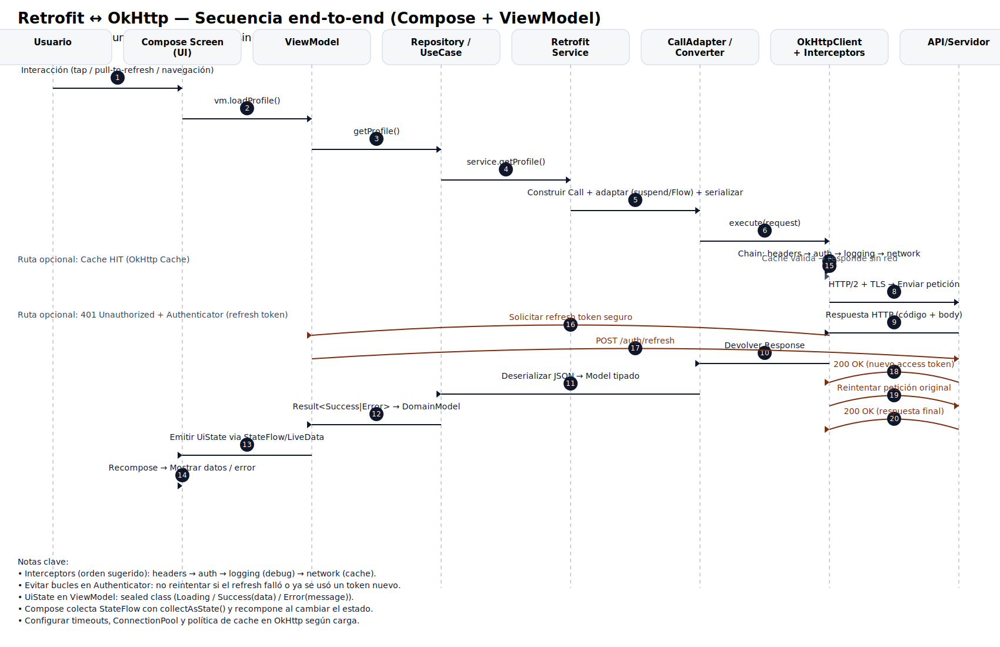
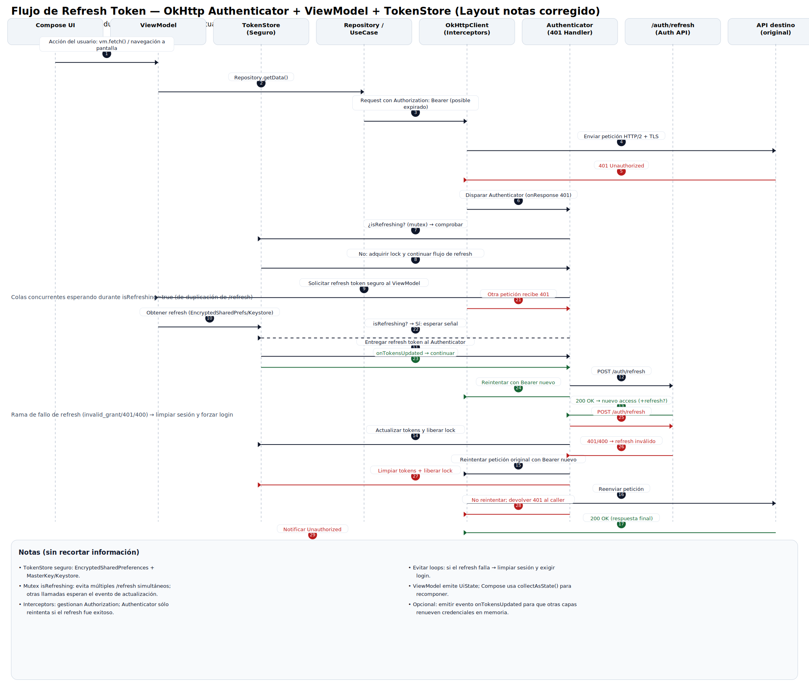

# Retrofit - configuración y dependencias

## Configuración de Dependencias

Primero, agrega estas dependencias en tu build.gradle.kts (Module: app):

```gradle
dependencies {
    // Retrofit
    implementation("com.squareup.retrofit2:retrofit:2.9.0")
    implementation("com.squareup.retrofit2:converter-gson:2.9.0")
    implementation("com.squareup.okhttp3:logging-interceptor:4.12.0")

    // Hilt
    implementation("com.google.dagger:hilt-android:2.48")
    kapt("com.google.dagger:hilt-compiler:2.48")

    // Coroutines
    implementation("org.jetbrains.kotlinx:kotlinx-coroutines-android:1.7.3")
}
```

## Configuración de Hilt

En tu Application class:

```kotlin
@HiltAndroidApp
class MyApplication : Application()
```

## Modelos de Datos

```kotlin
// User.kt
data class User(
    @SerializedName("id") val id: Int,
    @SerializedName("name") val name: String,
    @SerializedName("email") val email: String,
    @SerializedName("phone") val phone: String
)

// Post.kt
data class Post(
    @SerializedName("id") val id: Int,
    @SerializedName("userId") val userId: Int,
    @SerializedName("title") val title: String,
    @SerializedName("body") val body: String
)

// ErrorResponse.kt
data class ErrorResponse(
    @SerializedName("message") val message: String,
    @SerializedName("code") val code: Int,
    @SerializedName("timestamp") val timestamp: String
)
```

## Sealed Classes para Manejo de Estados

```kotlin
// Result.kt
sealed class Result<out T> {
    data class Success<out T>(val data: T) : Result<T>()
    data class Error(
        val message: String,
        val code: Int = -1,
        val throwable: Throwable? = null
    ) : Result<Nothing>()

    object Loading : Result<Nothing>()
}

// ApiResponse.kt
sealed class ApiResponse<out T> {
    data class Success<out T>(val data: T) : ApiResponse<T>()
    data class Error(
        val errorMessage: String,
        val errorCode: Int? = null
    ) : ApiResponse<Nothing>()

    object NetworkError : ApiResponse<Nothing>()
}
```

## Servicios de API

```kotlin
// ApiService.kt
interface ApiService {

    @GET("users")
    suspend fun getUsers(): List<User>

    @GET("users/{id}")
    suspend fun getUserById(@Path("id") id: Int): User

    @GET("posts")
    suspend fun getPostsByUser(@Query("userId") userId: Int): List<Post>

    @POST("users")
    suspend fun createUser(@Body user: User): User

    @PUT("users/{id}")
    suspend fun updateUser(@Path("id") id: Int, @Body user: User): User

    @DELETE("users/{id}")
    suspend fun deleteUser(@Path("id") id: Int): Response<Unit>
}

// Headers personalizados
interface AuthApiService {

    @GET("profile")
    suspend fun getProfile(
        @Header("Authorization") token: String,
        @Header("App-Version") appVersion: String = "1.0.0"
    ): User

    @POST("login")
    suspend fun login(@Body loginRequest: LoginRequest): LoginResponse
}
```

## Interceptores Personalizados

```kotlin
// AuthInterceptor.kt
class AuthInterceptor @Inject constructor(
    private val tokenManager: TokenManager
) : Interceptor {

    override fun intercept(chain: Interceptor.Chain): Response {
        val requestBuilder = chain.request().newBuilder()

        tokenManager.getToken()?.let { token ->
            requestBuilder.addHeader("Authorization", "Bearer $token")
        }

        // Headers comunes
        requestBuilder.addHeader("Content-Type", "application/json")
        requestBuilder.addHeader("Accept", "application/json")
        requestBuilder.addHeader("App-Version", BuildConfig.VERSION_NAME)

        return chain.proceed(requestBuilder.build())
    }
}

// LoggingInterceptor.kt
class LoggingInterceptor : Interceptor {
    override fun intercept(chain: Interceptor.Chain): Response {
        val request = chain.request()
        val startTime = System.nanoTime()

        println("--> ${request.method} ${request.url}")
        request.headers.forEach { (name, value) ->
            println("$name: $value")
        }

        val response = chain.proceed(request)
        val endTime = System.nanoTime()

        println("<-- ${response.code} ${response.message} ${request.url}")
        println("Time: ${(endTime - startTime) / 1e6}ms")

        return response
    }
}
```

## Módulo de Hilt para Dependency Injection

```kotlin
// NetworkModule.kt
@Module
@InstallIn(SingletonComponent::class)
object NetworkModule {

    private const val BASE_URL = "https://jsonplaceholder.typicode.com/"

    @Provides
    @Singleton
    fun provideLoggingInterceptor(): HttpLoggingInterceptor {
        return HttpLoggingInterceptor().apply {
            level = HttpLoggingInterceptor.Level.BODY
        }
    }

    @Provides
    @Singleton
    fun provideAuthInterceptor(): AuthInterceptor {
        return AuthInterceptor()
    }

    @Provides
    @Singleton
    fun provideOkHttpClient(
        loggingInterceptor: HttpLoggingInterceptor,
        authInterceptor: AuthInterceptor
    ): OkHttpClient {
        return OkHttpClient.Builder()
            .addInterceptor(authInterceptor)
            .addInterceptor(loggingInterceptor)
            .connectTimeout(30, TimeUnit.SECONDS)
            .readTimeout(30, TimeUnit.SECONDS)
            .writeTimeout(30, TimeUnit.SECONDS)
            .addInterceptor { chain ->
                val request = chain.request()
                try {
                    chain.proceed(request)
                } catch (e: Exception) {
                    throw when (e) {
                        is SocketTimeoutException -> SocketTimeoutException("Timeout - Please check your connection")
                        is ConnectException -> ConnectException("Cannot connect to server")
                        is UnknownHostException -> UnknownHostException("No internet connection")
                        else -> e
                    }
                }
            }
            .build()
    }

    @Provides
    @Singleton
    fun provideRetrofit(okHttpClient: OkHttpClient): Retrofit {
        return Retrofit.Builder()
            .baseUrl(BASE_URL)
            .client(okHttpClient)
            .addConverterFactory(GsonConverterFactory.create())
            .build()
    }

    @Provides
    @Singleton
    fun provideApiService(retrofit: Retrofit): ApiService {
        return retrofit.create(ApiService::class.java)
    }
}

// RepositoryModule.kt
@Module
@InstallIn(SingletonComponent::class)
object RepositoryModule {

    @Provides
    @Singleton
    fun provideUserRepository(apiService: ApiService): UserRepository {
        return UserRepositoryImpl(apiService)
    }
}
```

## Repository Pattern con Manejo de Errores


```kotlin
// UserRepository.kt
interface UserRepository {
    suspend fun getUsers(): Result<List<User>>
    suspend fun getUserById(id: Int): Result<User>
    suspend fun getPostsByUser(userId: Int): Result<List<Post>>
}

// UserRepositoryImpl.kt
class UserRepositoryImpl @Inject constructor(
    private val apiService: ApiService
) : UserRepository {

    override suspend fun getUsers(): Result<List<User>> {
        return try {
            val users = apiService.getUsers()
            Result.Success(users)
        } catch (e: Exception) {
            Result.Error(
                message = getErrorMessage(e),
                code = getErrorCode(e),
                throwable = e
            )
        }
    }

    override suspend fun getUserById(id: Int): Result<User> {
        return try {
            val user = apiService.getUserById(id)
            Result.Success(user)
        } catch (e: Exception) {
            Result.Error(
                message = getErrorMessage(e),
                code = getErrorCode(e),
                throwable = e
            )
        }
    }

    override suspend fun getPostsByUser(userId: Int): Result<List<Post>> {
        return try {
            val posts = apiService.getPostsByUser(userId)
            Result.Success(posts)
        } catch (e: Exception) {
            Result.Error(
                message = getErrorMessage(e),
                code = getErrorCode(e),
                throwable = e
            )
        }
    }

    private fun getErrorMessage(throwable: Throwable): String {
        return when (throwable) {
            is SocketTimeoutException -> "Timeout - Please check your connection"
            is ConnectException -> "Cannot connect to server"
            is UnknownHostException -> "No internet connection"
            is HttpException -> {
                when (throwable.code()) {
                    400 -> "Bad Request"
                    401 -> "Unauthorized"
                    403 -> "Forbidden"
                    404 -> "Not Found"
                    500 -> "Internal Server Error"
                    else -> "Something went wrong"
                }
            }
            else -> throwable.message ?: "Unknown error occurred"
        }
    }

    private fun getErrorCode(throwable: Throwable): Int {
        return when (throwable) {
            is HttpException -> throwable.code()
            else -> -1
        }
    }
}
```

## ViewModel con Hilt

```kotlin
// UserViewModel.kt
@HiltViewModel
class UserViewModel @Inject constructor(
    private val userRepository: UserRepository
) : ViewModel() {

    private val _usersState = MutableStateFlow<Result<List<User>>>(Result.Loading)
    val usersState: StateFlow<Result<List<User>>> = _usersState

    private val _selectedUserState = MutableStateFlow<Result<User>?>(null)
    val selectedUserState: StateFlow<Result<User>?> = _selectedUserState

    private val _postsState = MutableStateFlow<Result<List<Post>>?>(null)
    val postsState: StateFlow<Result<List<Post>>?> = _postsState

    fun getUsers() {
        viewModelScope.launch {
            _usersState.value = Result.Loading
            _usersState.value = userRepository.getUsers()
        }
    }

    fun getUserById(id: Int) {
        viewModelScope.launch {
            _selectedUserState.value = Result.Loading
            _selectedUserState.value = userRepository.getUserById(id)
        }
    }

    fun getPostsByUser(userId: Int) {
        viewModelScope.launch {
            _postsState.value = Result.Loading
            _postsState.value = userRepository.getPostsByUser(userId)
        }
    }

    fun clearPosts() {
        _postsState.value = null
    }

    fun clearSelectedUser() {
        _selectedUserState.value = null
    }
}
```

## Clase Utilitaria para Manejo de Respuestas

```kotlin
// ApiHandler.kt
object ApiHandler {
    suspend fun <T> safeApiCall(apiCall: suspend () -> T): Result<T> {
        return try {
            Result.Success(apiCall())
        } catch (e: Exception) {
            when (e) {
                is IOException -> Result.Error("Network error: ${e.message}")
                is HttpException -> {
                    val errorBody = e.response()?.errorBody()?.string()
                    Result.Error("HTTP ${e.code()}: $errorBody")
                }
                else -> Result.Error("Unknown error: ${e.message}")
            }
        }
    }
}

// Uso en Repository:
class ImprovedUserRepository @Inject constructor(
    private val apiService: ApiService
) : UserRepository {

    override suspend fun getUsers(): Result<List<User>> {
        return ApiHandler.safeApiCall {
            apiService.getUsers()
        }
    }
}
```

**Esta implementación te proporciona:**

-   Configuración completa de Retrofit con Hilt
-   Manejo robusto de errores con sealed classes
-   Interceptores para logging y autenticación
-   Patrón Repository con inyección de dependencias
-   ViewModels con Hilt
-   Manejo de estados de carga y error
-   Headers personalizados
-   Timeout y manejo de conexión

    
    
