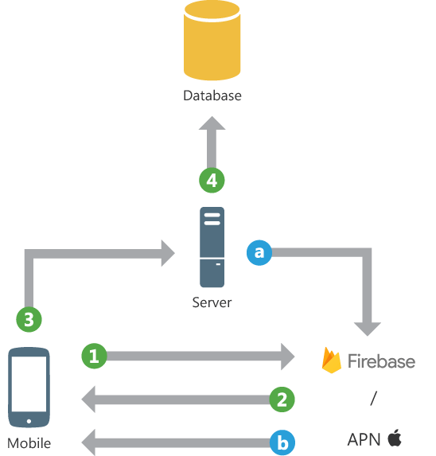

# Módulo 03 · Sesión 03 — Notificaciones Push y Locales (Android/Kotlin)

## Objetivos

1. Comprender la evolución del sistema de notificaciones en Android y diseñar canales/prioridades correctos.
2. Integrar **Firebase Cloud Messaging (FCM)** paso a paso: dependencias, configuración, obtención/rotación de tokens y manejo de mensajes.
3. Programar **notificaciones locales** con **AlarmManager** para recordatorios confiables.
4. Implementar **acciones** desde la notificación (botones, deep links) y navegar a pantallas específicas en Compose.

## Resumen

-   Canales de notificación y prioridades
-   Implementación de Firebase Cloud Messaging (FCM)
-   Notificaciones locales con AlarmManager
-   Acciones desde notificación y navegación a pantalla

---

## Desarrollo de los temas

### 1) Canales de notificación y prioridades

#### 1.1 Evolución histórica (qué cambió y por qué importa)

-   **Android 1.0–7.x**: Notificaciones con `NotificationCompat`. Las apps controlaban “prioridad” (p. ej., `PRIORITY_HIGH`) y “sonido/vibración”. El usuario tenía poco control granular por tipo de alerta.
-   **Android 8.0 (API 26)**: Nacen los **Notification Channels**. Cada canal define **importancia** (importance) y comportamiento (sonido, vibración, luces). El **usuario** decide la visibilidad/sonido por **canal**, no por notificación individual, y tu app **debe** publicar en un canal existente.
-   **Android 13 (API 33)**: Se introduce el permiso en tiempo de ejecución **`POST_NOTIFICATIONS`**. Sin este permiso, las notificaciones pueden no mostrarse (excepto algunas foreground service en escenarios críticos).
-   **Doze/App Standby** (desde Android 6.0): Afectan el envío/recepción en background. Para confiabilidad se recomienda usar FCM (alta prioridad solo cuando justificado) y respetar límites.

#### 1.2 Canales e importancia (cómo decidir)

-   **IMPORTANCE_HIGH**: Alarmas, avisos críticos, llamadas entrantes simuladas.
-   **IMPORTANCE_DEFAULT**: Eventos importantes pero no críticos.
-   **IMPORTANCE_LOW / MIN**: Actualizaciones pasivas.
-   Crea **canales por tipo de evento** (p. ej., “Alertas críticas”, “Recordatorios”, “Promociones”). Evita mezclar “crítico” con “marketing”.
-   **Buenas prácticas**:
    -   Define canales una sola vez al iniciar la app.
    -   No cambies importancia por código si el usuario ya la ajustó en sistema.
    -   Documenta internamente qué canal usa cada caso de uso.

**Ejemplo de registro de canal (Kotlin, API 26+):**

```kotlin
fun registerNotificationChannels(context: Context) {
    if (Build.VERSION.SDK_INT >= Build.VERSION_CODES.O) {
        val critical = NotificationChannel(
            "alerts_critical",
            "Alertas críticas",
            NotificationManager.IMPORTANCE_HIGH
        ).apply {
            description = "Notificaciones que requieren atención inmediata"
        }
        val reminders = NotificationChannel(
            "reminders",
            "Recordatorios",
            NotificationManager.IMPORTANCE_DEFAULT
        )
        val manager = context.getSystemService(NotificationManager::class.java)
        manager.createNotificationChannels(listOf(critical, reminders))
    }
}
```

**Solicitud de permiso en Android 13+:**

```xml
<uses-permission android:name="android.permission.POST_NOTIFICATIONS" />
```

```kotlin
if (Build.VERSION.SDK_INT >= Build.VERSION_CODES.TIRAMISU) {
    requestPermissionLauncher.launch(android.Manifest.permission.POST_NOTIFICATIONS)
}
```

---

### 2) Implementación de Firebase Cloud Messaging (FCM)

#### 2.0 Qué es FCM y su evolución

-   **Qué es**: **Firebase Cloud Messaging (FCM)** es la plataforma de mensajería push de Google que permite enviar notificaciones y datos entre servidores y aplicaciones cliente (Android, iOS y Web). Sustituye al antiguo **Google Cloud Messaging (GCM)**.
-   **Evolución**:
    -   **Antes (GCM)**: Integración manual, autenticación compleja, sin soporte multiplataforma.
    -   **2016 → Firebase Cloud Messaging (FCM)**: Se integra en el ecosistema Firebase, mejora analíticas, panel web, segmentación, APIs más simples y soporte para todos los sistemas.
    -   **Actualidad (FCM HTTP v1 API)**: Usa autenticación con OAuth2, mensajes JSON estructurados y métricas unificadas en Firebase Console.  
        Ofrece envío por _topics_, _tokens individuales_ o _device groups_, con control granular sobre TTL, prioridad y comportamiento.
-   **Arquitectura**:
    1. El **servidor** o **Firebase Console** envía mensajes usando la **FCM API HTTP v1**.
    2. Google gestiona la entrega, adaptándose al estado de energía (Doze, App Standby).
    3. La **app cliente** recibe los mensajes a través de `FirebaseMessagingService` y puede mostrarlos o procesarlos según el estado del dispositivo.

**Tipos de mensajes FCM**

-   `notification`: mostrada automáticamente cuando la app está en background.
-   `data`: solo clave-valor; se maneja manualmente (foreground o background).
-   `mixed`: combinación de ambas (no recomendado por duplicados).

**Ventajas de FCM**

-   Gratuito y confiable (infraestructura global Google).
-   Permite estadísticas de entrega, aperturas y conversiones.
-   Compatible con Android, iOS y Web.
-   Integración directa con Analytics, Remote Config y Crashlytics.

    

#### 2.1 Dependencias (Gradle)

```kotlin
dependencies {
    implementation(platform("com.google.firebase:firebase-bom:33.5.1"))
    implementation("com.google.firebase:firebase-messaging-ktx")
    implementation("com.google.firebase:firebase-analytics-ktx")
}
```

#### 2.2 Configuración del proyecto Firebase

1. Crear proyecto en Firebase Console.
2. Registrar la app Android (con el package name exacto).
3. Descargar y colocar `google-services.json` en `/app`.
4. Configurar Gradle:

```kotlin
plugins { id("com.google.gms.google-services") }
```

```kotlin
plugins { id("com.google.gms.google-services") version "4.4.2" apply false }
```

#### 2.3 Servicio de mensajería y obtención de token

El **token FCM** identifica una instancia única de la app en un dispositivo. Se usa para enviar notificaciones dirigidas o suscribirse a _topics_.  
Debe sincronizarse con el backend cada vez que cambia (p. ej., reinstalación o rotación).

```kotlin
class AppFirebaseMessagingService : FirebaseMessagingService() {

    override fun onNewToken(token: String) {
        super.onNewToken(token)
        sendRegistrationToServer(token)
    }

    override fun onMessageReceived(remoteMessage: RemoteMessage) {
        super.onMessageReceived(remoteMessage)
        val data = remoteMessage.data
        val title = remoteMessage.notification?.title ?: data["title"] ?: "Mensaje"
        val body = remoteMessage.notification?.body ?: data["body"] ?: "Contenido"

        showLocalNotification(
            context = applicationContext,
            channelId = "alerts_critical",
            title = title,
            text = body,
            destination = data["dest"]
        )
    }

    private fun sendRegistrationToServer(token: String) {
        // Enviar token a tu backend asociado al usuario autenticado
    }
}
```

**Declaración en AndroidManifest.xml:**

```xml
<service
    android:name=".AppFirebaseMessagingService"
    android:exported="false">
    <intent-filter>
        <action android:name="com.google.firebase.MESSAGING_EVENT"/>
    </intent-filter>
</service>
```

#### 2.4 Suscripción a topics

```kotlin
Firebase.messaging.subscribeToTopic("promotions")
    .addOnCompleteListener { task ->
        if (task.isSuccessful) Log.d("FCM", "Suscrito correctamente")
    }
```

#### 2.5 Estrategias de envío y entrega

-   Usa **mensajes de datos** (`data`) para control total en cualquier estado.
-   Emplea `priority: high` solo para mensajes críticos.
-   Configura TTL y `collapse_key` para evitar saturación.
-   En backend, usa la API **HTTP v1** con autenticación OAuth 2.0.
-   Reenvía token a tu servidor en cada inicio de sesión y en `onNewToken()`.

---

### 3) Notificaciones locales con AlarmManager

#### 3.1 Caso de uso real

Ejemplo: un **recordatorio de pago** que se repite mensualmente. Si el usuario no paga antes del día 28, se dispara una notificación local a las 9:00 AM.

#### 3.2 Implementación

**Receiver:**

```kotlin
class ReminderReceiver : BroadcastReceiver() {
    override fun onReceive(context: Context, intent: Intent) {
        showLocalNotification(
            context = context,
            channelId = "reminders",
            title = "Recordatorio de pago",
            text = "Tu suscripción vence hoy. Toca para ver opciones.",
            destination = "payments"
        )
    }
}
```

**Manifest:**

```xml
<receiver
    android:name=".ReminderReceiver"
    android:exported="false" />
```

**Programación de la alarma:**

```kotlin
fun scheduleMonthlyReminder(context: Context, triggerAtMillis: Long) {
    val intent = Intent(context, ReminderReceiver::class.java)
    val pending = PendingIntent.getBroadcast(
        context,
        1001,
        intent,
        PendingIntent.FLAG_UPDATE_CURRENT or PendingIntent.FLAG_IMMUTABLE
    )
    val alarm = context.getSystemService(Context.ALARM_SERVICE) as AlarmManager
    alarm.setInexactRepeating(
        AlarmManager.RTC_WAKEUP,
        triggerAtMillis,
        AlarmManager.INTERVAL_DAY * 30,
        pending
    )
}
```

**Notas:**

-   Usa alarmas inexactas para ahorrar batería.
-   En Android 12+, solo apps con permisos especiales pueden usar alarmas exactas.
-   Si el recordatorio debe persistir tras reinicio, implementa un `BOOT_COMPLETED` receiver.

---

### 4) Acciones desde notificación y navegación a pantalla

#### 4.1 Intents y PendingIntent

-   **Intent explícito**: abre una Activity específica de tu app.
-   **Intent implícito**: lanza una acción genérica (`ACTION_VIEW`).
-   **PendingIntent**: otorga al sistema la capacidad de ejecutar un Intent cuando el usuario interactúe con la notificación.

Tipos:

-   `PendingIntent.getActivity()` → abre pantalla.
-   `PendingIntent.getBroadcast()` → ejecuta lógica en segundo plano.
-   `PendingIntent.getService()` → inicia servicio.
-   Usa `FLAG_IMMUTABLE` si no necesitas modificar el Intent.

#### 4.2 Notificación con acción y deep link

```kotlin
fun showLocalNotification(
    context: Context,
    channelId: String,
    title: String,
    text: String,
    destination: String? = null
) {
    val intent = Intent(context, MainActivity::class.java).apply {
        putExtra("dest", destination)
        flags = Intent.FLAG_ACTIVITY_NEW_TASK or Intent.FLAG_ACTIVITY_CLEAR_TASK
    }
    val contentPending = PendingIntent.getActivity(
        context, 2001, intent,
        PendingIntent.FLAG_UPDATE_CURRENT or PendingIntent.FLAG_IMMUTABLE
    )

    val actionIntent = Intent(context, MarkAsReadReceiver::class.java)
    val actionPending = PendingIntent.getBroadcast(
        context, 2002, actionIntent,
        PendingIntent.FLAG_UPDATE_CURRENT or PendingIntent.FLAG_IMMUTABLE
    )

    val builder = NotificationCompat.Builder(context, channelId)
        .setSmallIcon(R.drawable.ic_stat_notify)
        .setContentTitle(title)
        .setContentText(text)
        .setContentIntent(contentPending)
        .addAction(R.drawable.ic_check, "Marcar leído", actionPending)
        .setAutoCancel(true)
        .setPriority(NotificationCompat.PRIORITY_HIGH)

    NotificationManagerCompat.from(context).notify(System.currentTimeMillis().toInt(), builder.build())
}
```

**Receiver para la acción:**

```kotlin
class MarkAsReadReceiver : BroadcastReceiver() {
    override fun onReceive(context: Context, intent: Intent) {
        // Actualizar estado o llamar API
    }
}
```

**Navegación en Compose:**

```kotlin
class MainActivity : ComponentActivity() {
    override fun onCreate(savedInstanceState: Bundle?) {
        super.onCreate(savedInstanceState)
        registerNotificationChannels(this)
        setContent {
            val navController = rememberNavController()
            LaunchedEffect(Unit) {
                val dest = intent?.getStringExtra("dest")
                if (dest == "payments") {
                    navController.navigate("payments")
                }
            }
            AppNavHost(navController)
        }
    }
}
```

---

## Checklist de calidad y pruebas

-   Solicita **`POST_NOTIFICATIONS`** en Android 13+ con flujo UX claro.
-   Registra **canales** al inicio y valida su uso correcto.
-   Verifica **onNewToken** y sincronización con backend.
-   Prueba **mensajes data** foreground/background para evitar duplicados.
-   Testea **AlarmManager** bajo distintos modos de ahorro.
-   Verifica **acciones** y **deep links** correctamente.
-   Revisa accesibilidad: texto conciso, acciones útiles y contenido claro.

---

## Conclusión

Con canales bien diseñados, permisos adecuados y una integración correcta de **FCM**, tus notificaciones serán confiables y coherentes con las políticas modernas de Android. **AlarmManager** ofrece una forma segura de gestionar recordatorios locales, mientras que las **acciones y deep links** convierten cada notificación en una experiencia fluida y contextualizada para el usuario.
