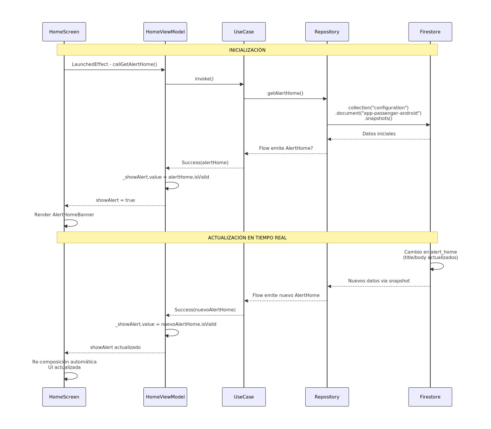

# Módulo 04 · Sesión 04 — Firebase Auth, Firestore y Storage

## Objetivos

1. Comprender el concepto de **SSO (Single Sign-On)** y sus principales proveedores en el mercado.
2. Implementar **autenticación con Firebase Auth** (correo y Google).
3. Dominar la **lectura/escritura de datos** en Firestore y conocer sus ventajas frente a otros servicios.
4. Comprender el uso de **Firebase Storage**, sus diferencias frente a competidores y cómo integrarlo en Android.
5. Aplicar **reglas de seguridad y control de acceso** en Firebase (Auth, Firestore, Storage).

---

## Contenido

1. Introducción al **SSO** y autenticación con correo y Google
2. Lectura y escritura de documentos en **Firestore**
3. Subida y descarga de archivos en **Storage**
4. **Reglas de seguridad y control de acceso** en Firebase

---

## Desarrollo del contenido

### 1. Autenticación con correo y Google

#### 1.1 Introducción al SSO (Single Sign-On)

**SSO (Single Sign-On)** permite que un usuario se autentique una sola vez para acceder a múltiples aplicaciones sin tener que volver a iniciar sesión.  
Ejemplo: Inicias sesión con tu cuenta de Google y accedes automáticamente a Gmail, YouTube y Drive.

**Ventajas del SSO:**

-   Menor fricción en el registro e inicio de sesión.
-   Centralización de credenciales.
-   Reducción de problemas de seguridad (menos contraseñas expuestas).
-   Mejor experiencia de usuario.

**Principales proveedores de SSO del mercado:**

| Proveedor      | Descripción                                               | Precio base                         | SDKs móviles      | Soporte OAuth2/OIDC |
| -------------- | --------------------------------------------------------- | ----------------------------------- | ----------------- | ------------------- |
| Firebase Auth  | Solución de Google integrada con otros productos Firebase | Gratis (hasta 10k usuarios activos) | Android, iOS, Web | ✅                  |
| Auth0          | Plataforma avanzada con control granular y extensibilidad | Pago desde $23/mes                  | Android, iOS, Web | ✅                  |
| Amazon Cognito | Parte de AWS, integración profunda con servicios cloud    | Gratis 50k MAU                      | Android, iOS, Web | ✅                  |
| Keycloak       | Open Source auto hospedado                                | Gratis                              | SDKs externos     | ✅                  |

**¿Por qué elegir Firebase Auth?**

-   Simplicidad de integración en Android (SDK oficial).
-   Soporte nativo para autenticación con correo, Google, Facebook, Apple, etc.
-   Sin servidor propio ni mantenimiento de base de datos de usuarios.
-   Perfecta integración con Firestore y Storage.

#### 1.2 Implementación: autenticación con correo y Google

Dependencias en `build.gradle.kts`:

```kotlin
implementation("com.google.firebase:firebase-auth-ktx")
implementation("com.google.android.gms:play-services-auth:21.0.0")
```

Inicialización (Application.kt):

```kotlin
class MyApp : Application() {
    override fun onCreate() {
        super.onCreate()
        FirebaseApp.initializeApp(this)
    }
}
```

**Autenticación con correo:**

```kotlin
val auth = Firebase.auth
auth.createUserWithEmailAndPassword(email, password)
    .addOnCompleteListener { task ->
        if (task.isSuccessful) {
            val user = auth.currentUser
        }
    }
```

**Autenticación con Google:**

```kotlin
val credential = GoogleAuthProvider.getCredential(idToken, null)
Firebase.auth.signInWithCredential(credential)
```

**Caso de uso real:**  
Una app de comercio electrónico donde el usuario puede registrarse con Google y el backend valida su token para personalizar el catálogo.

---

### 2. Firestore: lectura y escritura de documentos

#### 2.1 Introducción

**Cloud Firestore** es una base de datos **NoSQL** de Google que almacena información en **colecciones y documentos**.  
Cada documento es un JSON que puede contener subcolecciones.

**Ventajas:**

-   Sin esquema fijo.
-   Escala automáticamente.
-   Integración nativa con Firebase Auth y Realtime listeners.
-   Sin servidor ni mantenimiento.

**Principales competidores:**

| Servicio           | Modelo                 | Escalabilidad | Realtime        | Precio (lecturas/escrituras) | Región      |
| ------------------ | ---------------------- | ------------- | --------------- | ---------------------------- | ----------- |
| **Firestore**      | Documentos/Colecciones | Automática    | ✅              | $0.06 /100k lecturas         | Global      |
| **MongoDB Atlas**  | Documentos             | Manual/Auto   | ⚙️ con triggers | $0.08 /100k                  | Multi Cloud |
| **DynamoDB (AWS)** | Clave-valor            | Automática    | ❌              | $0.25 /100k lecturas         | Regional    |
| **Supabase**       | SQL (Postgres)         | Automática    | ✅              | Gratis (limitado)            | Multi Cloud |

#### 2.2 Implementación en Android

Dependencia:

```kotlin
implementation("com.google.firebase:firebase-firestore-ktx")
```

Guardar documento:

```kotlin
val db = Firebase.firestore
val user = hashMapOf("name" to "Jorge", "email" to "jorge@example.com")

db.collection("users").document("user123").set(user)
    .addOnSuccessListener { Log.d("Firestore", "Documento guardado") }
```

Leer documento:

```kotlin
db.collection("users").document("user123")
    .get()
    .addOnSuccessListener { doc -> Log.d("Firestore", "Datos: ${doc.data}") }
```

**Caso de uso:**  
Una app de delivery que guarda el historial de pedidos por usuario (`users/{id}/orders/{orderId}`) y muestra actualizaciones en tiempo real.

---

### 3. Firebase Storage: subida y descarga de archivos

#### 3.1 Introducción

**Firebase Storage** almacena archivos (imágenes, audios, PDFs, etc.) en la nube con URLs seguras y acceso autenticado.

**Comparativa de servicios:**

| Servicio                       | Costo por GB | API REST | Integración móvil  | Reglas de seguridad |
| ------------------------------ | ------------ | -------- | ------------------ | ------------------- |
| **Firebase Storage**           | $0.026/GB    | ✅       | ✅ SDK Android/iOS | Basadas en Auth     |
| **AWS S3**                     | $0.023/GB    | ✅       | SDK nativo AWS     | IAM Policies        |
| **Google Cloud Storage (GCS)** | $0.020/GB    | ✅       | SDK Cloud          | IAM + ACL           |
| **Supabase Storage**           | $0.025/GB    | ✅       | SDK JS/Móvil       | Basadas en JWT      |
| **Backblaze B2**               | $0.005/GB    | ✅       | SDK externo        | Key-based           |

**Ventajas de Firebase Storage:**

-   Integración nativa con Firebase Auth.
-   URLs firmadas automáticas.
-   Sin gestión de claves IAM.
-   Escalabilidad y CDN incluidas.

#### 3.2 Implementación en Android

Dependencia:

```kotlin
implementation("com.google.firebase:firebase-storage-ktx")
```

Subir archivo:

```kotlin
val storage = Firebase.storage
val file = Uri.fromFile(File("/path/to/image.jpg"))
val ref = storage.reference.child("images/${file.lastPathSegment}")
ref.putFile(file)
    .addOnSuccessListener { Log.d("Storage", "Archivo subido") }
```

Descargar archivo:

```kotlin
ref.downloadUrl.addOnSuccessListener { uri ->
    Log.d("Storage", "URL: $uri")
}
```

**Caso de uso:**  
Una app de mensajería que guarda las fotos de perfil de los usuarios en `storage/images/{userId}.jpg`.

---

### 4. Seguridad y control de acceso en Firebase

Firebase permite definir **reglas de seguridad declarativas** en cada servicio:

#### 4.1 Firestore Rules

```js
rules_version = '2';
service cloud.firestore {
  match /databases/{database}/documents {
    match /users/{userId} {
      allow read, write: if request.auth.uid == userId;
    }
  }
}
```

#### 4.2 Storage Rules

```js
service firebase.storage {
  match /b/{bucket}/o {
    match /images/{userId}/{allPaths=**} {
      allow read, write: if request.auth.uid == userId;
    }
  }
}
```

#### 4.3 Recomendaciones generales

-   **No usar reglas públicas.**
-   **Usar Auth siempre.**
-   **Auditar accesos** desde Firebase Console.
-   **Combinar con App Check** para verificar integridad de la app.
-   **Usar Custom Claims** para roles (admin, user, guest).

**Ejemplo:**

```kotlin
Firebase.auth.currentUser?.getIdToken(true)?.addOnSuccessListener {
    val claims = it.claims
}
```

**En conjunto**, Auth + Firestore + Storage con reglas bien definidas forman una arquitectura segura, escalable y sin servidor.




